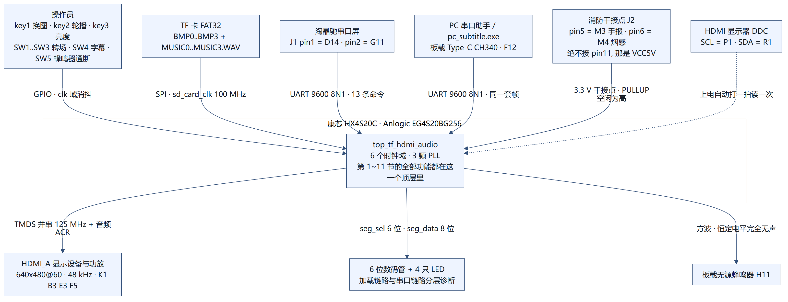
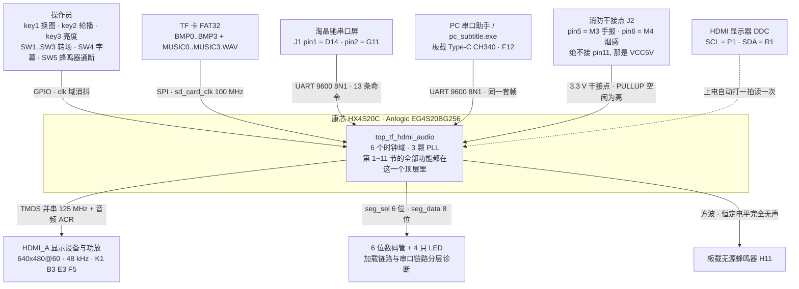
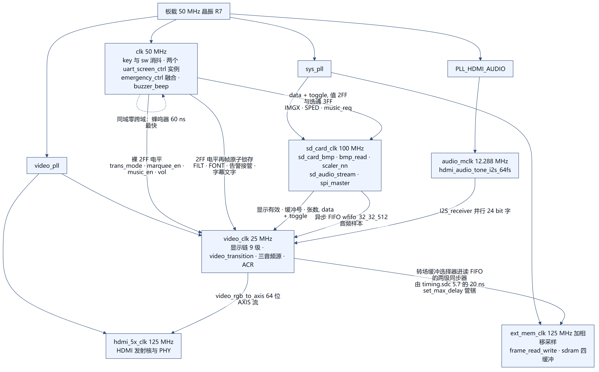
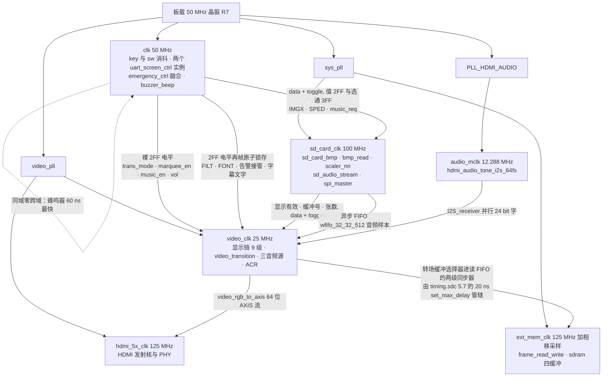
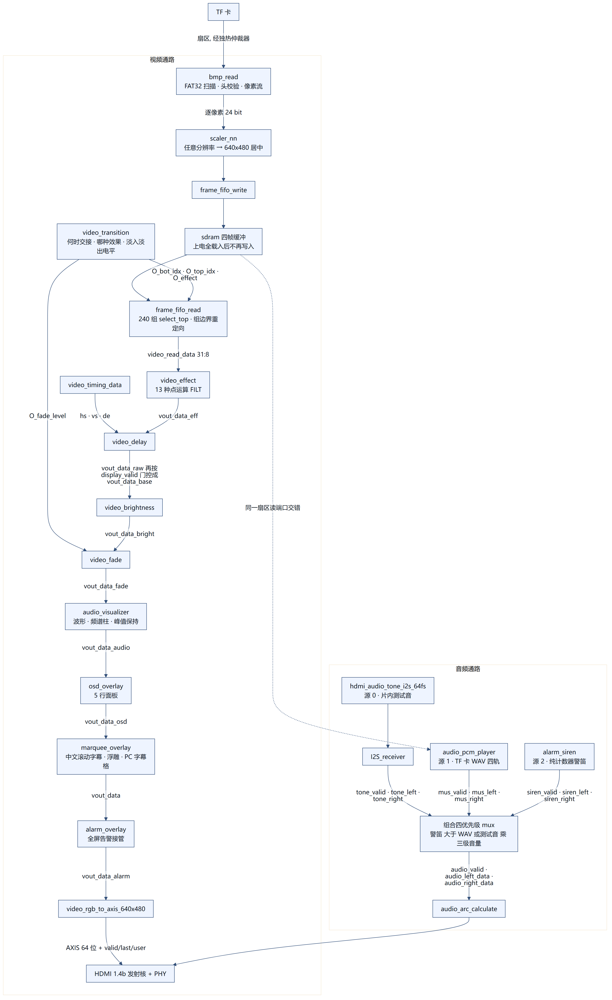
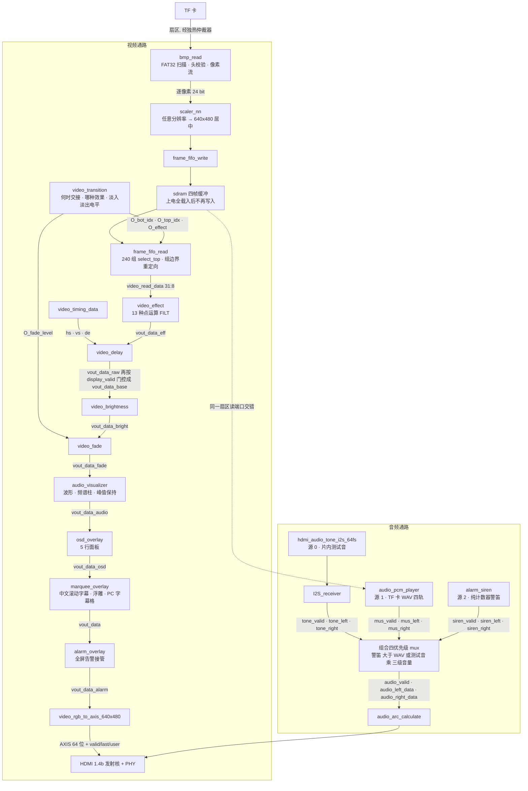
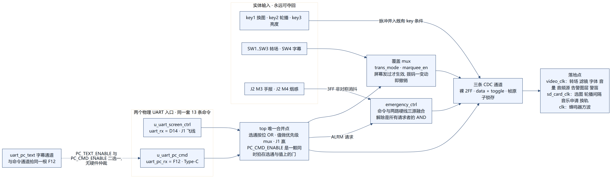
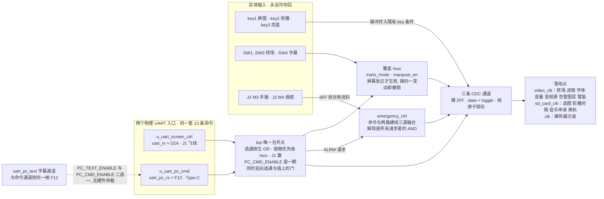

# 2026 FPGA Anlu 赛题一：基于 EG4S20 的 HDMI 多媒体播放系统

本项目面向 2026 安路赛道 FPGA 赛题一，在 HX4S20C 开发板上基于安路 EG4S20 FPGA 实现一个 HDMI 多媒体播放与展示系统。

当前工程已完成 TF 卡 BMP 图片读取、**任意分辨率图片的片内最近邻缩放**、SDRAM 四缓冲帧存、HDMI 1.4b 音视频输出、**TF 卡 WAV 真实音乐流式播放（四轨查找表，手动切图即切曲，自动轮播固定一首）**、按键交互、亮度调节、OSD 状态叠加、**画面正中的中文滚动字幕（竞赛十周年标语，`SW4` 可屏蔽，可切换挤出浮雕立体字）**、**十三种图像点运算（灰度 / 反色 / 二值化 / 复古棕 / 对比度增强 / 饱和度 / 低饱和 / 琥珀 / 冷调 / 曝光反转 / 色调分离 / 灰度负片，全部纯组合、无行缓冲）**、**十种横向带状转场（双向擦除 / 百叶窗 / 中心展开 / 随机条 / 梳状 / 上下夹击 / 隔行两遍 / 粗块乱序 / 四路交错）加四种非带状模式（淡入淡出 / 直切 / 慢速淡入淡出 / 黑场停顿，可自动轮播）**、音频波形与频谱可视化、**串口屏（淘晶驰 TJC/Nextion）经 J1 排针飞线控制（替代全部按键与拨码，实体控制保留为兜底；`FILT`/`FONT`/`MUSC` 为屏幕独有）、同一份命令表另有第二入口——PC 经板载 Type-C / CH340 走 `F12` 直发同一套帧**，以及一整套无头构建脚本和周期精确验证模型。图片加载链路经过三层重试与看门狗加固，四张图片可在上电后一次性全部载入；**音频三源，`music_en` 只管测试音与卡上音乐这一对互斥**（警笛优先级压在它们之上，见第 11 节）——上电先播片内**自建**的 48 kHz 测试音（10 段 / 6.18 s 乐句，不是官方例程那个单音），屏幕发 `MUSC 1` 才切换到 TF 卡上的 WAV（此时音乐与**第一张图同一个事件起播**，SD 扇区读端口按扇区仲裁、音乐与图片交错共享，其余三张图在播放的同时后台载入），发 `MUSC 0` 立刻交回测试音；底部可视化随当前源跳动。**选音乐源之后还有第二层选择：卡上最多四首 `MUSIC0.WAV`~`MUSIC3.WAV` 按目录顺序填进一张四槽查找表，手动 `key1`/`NEXT`/`IMGX` 切到第 i 张图就切到第 i 首（在扇区边界退休再重新武装，实测 0.16 ms），自动轮播则固定在 `AUTO_TRACK_IDX` 那一首不跟着换**——这正是赛题扩展要求(2)「图片切换时音频同步切换」。当前生效的算法、字体与音频源状态由 OSD 第 3 / 5 行实时回显。

## 硬件平台

- 开发板：HX4S20C
- FPGA：Anlogic EG4S20BG256
- 显示输出：HDMI_A，640 x 480 @ 60 Hz
- 存储介质：TF / Micro SD 卡，FAT32
- 推荐显示设备：支持 HDMI 音视频输入的电视或带扬声器显示器；也可使用 HDMI 显示器加外接音箱

## 支持的图片格式

```text
容器：BMP（24-bit RGB，非压缩，BI_RGB）
分辨率：宽 64 ~ 1920，高 64 ~ 1080
数量：TF 卡根目录下最多 4 张，按目录项顺序取前 4 张
文件系统：FAT32（自动识别 MBR 与无 MBR 两种布局）
```

不再要求图片本身就是 640 x 480。片内缩放器把任意受支持分辨率的图映射到 640 x 480 画布并居中，不足处填黑边；放大倍率上限为 4 倍。

缩放**按横纵两轴各自独立**计算，不是严格等比：目标尺寸取 `tw = min(源宽 × 4, 640)`、`th = min(源高 × 4, 480)`（见 `SD/scaler_nn.v`），两轴之间没有共享的缩放系数。是否变形只取决于源图：

- 源是 4:3（320x240、640x480、800x600 等）→ 两轴同比，**不变形**，铺满画面；
- 源很小、两轴都没到 4 倍上限（源宽 < 160 且源高 < 120，如 64x64、100x100、159x119）→ 两轴统一 ×4，**保持宽高比**，四周留黑边；
- 其余（宽高比非 4:3 且至少一轴被钳到上限，如 1920x1080、1920x64）→ **会被拉伸 / 压扁**。

要确保不变形，请用 4:3 源图，或用两轴都小于 160x120 的小图。

注意：

- 不能直接把 PNG 或 JPG 改后缀为 `.bmp`，必须是真正的 BMP 编码。
- 建议使用 `doc/convert/convert_images_to_bmp.py` 统一转换。
- 若卡上残留旧图片的物理扇区导致 FPGA 误读，用 `doc/convert/sync_to_sd.py` 重新同步。
- 8.3 短文件名与长文件名（LFN）目录项都能正确识别，LFN 槽位（attr 0x0F）、已删除项、卷标和子目录会被排除。

## 支持的音频格式

```text
容器：WAV（标准 44 字节 canonical 头，RIFF/WAVE/fmt (PCM)/data）
采样：48000 Hz、立体声、16-bit 小端 PCM，帧交错 L_lo,L_hi,R_lo,R_hi
文件：TF 卡根目录 MUSIC0.WAV ~ MUSIC3.WAV，最多 4 首，严格 8.3 短名
对应：第 i 首配第 i 张图（手动切图时）；自动轮播固定播 AUTO_TRACK_IDX 那一首
```

FPGA 不在片内解码 MP3——与图片管线一致（图片离线转无压缩 BMP、FPGA 只读原始字节），音频也离线用 ffmpeg 解码成无压缩 PCM，FPGA 只负责扇区流读、跨时钟域、48 kHz 采样节拍与每首各自的单曲循环。

注意：

- 用 `doc/convert/convert_audio_to_wav.py INPUT.mp3 [输出路径]` 把任意音频离线转成符合上述契约的 WAV（手工拼 44 字节头，不用 ffmpeg 的容器写出，避免插入 LIST/INFO 块导致 data 偏移错位）。
- **文件名必须是严格 8.3。** `MUSIC0.WAV` 是 6+3、`MUSIC.WAV` 是 5+3，都不产生 LFN 槽；一旦用长名（如 `track01_forest.wav`），FAT32 会为它额外插入 attr=0x0F 的 LFN 目录项。`bmp_read` 的 `dir_entry_is_file` 已经把 0x0F 过滤掉了，所以 LFN 槽不会被误认成文件，但它**照样占目录项**——四首长名音乐会多插 8~12 个槽，把后面的 BMP 往后推，而扫描找满 `SCAN_TARGET_COUNT` 张 BMP 就提前 `scan_done`，推得太远就等于扫不到图。
- 写卡用 `doc/convert/sync_to_sd.py F: -a 曲1 曲2 曲3 曲4`：**列表顺序就是图号**，第 i 首写成 `MUSICi.WAV`；流程为「破坏旧 BMP 头 → 清空盘 → **先按顺序写完全部 WAV** → 再按序号写 4 张 BMP」。WAV 先写有两个作用：① FAT32 根目录项按创建顺序排列，WAV 目录项排在 BMP 之前，`bmp_read` 在找满 4 张 BMP 提前停止前已扫到 WAV；② 空卡先写大文件更容易物理连续。
- **超过 4 首直接拒绝，不截断。** RTL 的入槽 `case` 是 `0/1/2/default`，而 `wav_found_count` 在 4 处饱和，所以第 5 首会**静默覆盖槽 3**——第 4 张图会播第 5 首且没有任何报错。工具在这里停下并说明原因。
- 卡上已有可用 WAV 但手头没有源文件时，用 `doc/convert/sync_to_sd.py F: -w 现成1.wav 现成2.wav ...` 直接复用，同样顺序即图号。`-w` 与 `-a` 互斥且优先。清空盘会删掉卡上原有 WAV，**务必先把旧 WAV 备份到卡外**再用 `-w` 写回。
- **响度归一（`--loudnorm`，多轨专用，可选）。** 四首来源不同的曲子背靠背播放，音量落差在展台上是听得出来的——而这正是「切图切歌」这个功能自己带来的问题，单轨时代不存在。加 `--loudnorm` 走两遍 EBU R128：第一遍只测量并报出整组落差与**真峰值天花板**，第二遍用 `linear=true` 只加一次固定增益（动态范围原样保留，不会「喘气」）。目标响度可用 `--target-i` 指定，默认 -16 LUFS；脚本会算出「整组靠固定增益都能达到、且真峰值不越限」的最响公共目标并告诉你是哪一首卡住的。
  桌面那四首实测（2026-09-13）：I 分别 -7.93 / -9.68 / -10.99 / -7.83 LUFS，**落差 3.16 LU**；真峰值 **+1.33 / +0.54 / +2.18 / +0.96 dBTP，四首全部超 0 dB**——直接转出来的 16-bit WAV 存在采样间过冲（track 0 复测 +1.00 dBTP），这是先于多轨功能就有的失真，归一顺手一起修掉。天花板是 **-14.67 LUFS，被《反方向的钟》(+2.18 dBTP) 卡住**；按它归一后四首落在 -14.65~-14.67 LUFS（彼此差 0.02 LU）、真峰值全部 ≤ -1.50 dBTP。推荐命令：`sync_to_sd.py F: -a 曲1 曲2 曲3 曲4 --loudnorm --target-i -14.67`。
- **强烈建议先把卡 FAT32 格式化再同步**：读卡逻辑不跟随 FAT32 簇链、假设文件物理连续（地址线性 +1），几十 MB 的 WAV 一旦碎片化就会读到错乱数据。清空后的空卡先写 WAV 通常连续，但格式化能彻底保证。四首都连续才算数，写完用 `tools/sim_dir_scan.py F:` 逐个核。
- **音乐不是上电默认源。** 上电播放的是片内 48 kHz 测试音，WAV 只在屏幕发出 `MUSC 1` 之后才被读取；卡上找不到有效 WAV（或 RIFF/WAVE 校验失败）时输出静音，图片照常轮播，**不自动退回测试音**——退回要再发一条 `MUSC 0`。`music_en` 管的正是这一对互斥源（警笛是压在它们之上的第三源，见第 11 节），详见第 5 节「音频源」。
- **「第 i 首配第 i 张」的准确含义：`img_idx` 是缓冲号，不是目录序号。** 缓冲区按 `load_buf_idx <= img_loaded_count` 分配，也就是**第 i 个成功载入的图**进缓冲 i，而 WAV 槽 i 是**目录里第 i 首**。四张图全部载入时两者重合，映射就是「第 i 张图 ↔ 第 i 首」；但**若中间某张载入失败**（例如已知的 `src_h < 120` 缩放器缺陷），后面的图会整体前移一个缓冲槽，配对也随之错位——第 3 张图会播第 2 首。这不是多轨新引入的，是它复用了既有的缓冲分配；演示卡必须确认四张全载入（数码管最左一位 = `4`）再讲联动。
- **图多于曲时自动钳位。** `track_req_lim` 把超出 `wav_found_count` 的选择夹回槽 0，所以「4 张图 + 2 首曲」时图 2、图 3 都播第 0 首，而不是读到空槽（扇区 0、长度 0）触发一次无声的 `S_FAULT`。
- 音乐被点播后与图片共用同一个 SD 扇区读端口，由 `sd_card_bmp.v` 里的独热仲裁器按扇区交错、音频优先。上面那条物理连续性要求不变，但**播放不再等图片全部载入**：第一张图上屏那一拍音乐就开始，带宽与延迟数字见第 5 节。测试音模式下流播放器完全不申请扇区，图片独占端口。

## 当前已实现内容

### 1. TF 卡 BMP 扫描与加载

- SPI 方式读取 TF 卡，高速阶段 SCK = 25 MHz（`SPI_HIGH_SPEED_DIV = 0`，即 sys_clk / 4）。
- 解析 FAT32 BPB 定位数据区与根目录，扫描根目录前 128 个扇区寻找 BMP。
- 命中后记录起始簇并换算为绝对 LBA，四张图的起始扇区存入查找表。
- 上电后一次性把四张图全部载入四个 SDRAM 帧缓冲，此后不再写入 SDRAM，因此切换图片只是索引变化、没有加载延迟。
- 四张图约 7 秒完成加载（每张 1801 个扇区）。

### 2. 片内最近邻缩放（`SD/scaler_nn.v`）

- 位于 SD 卡**写入侧**，在 `bmp_read` 像素流与帧写 FIFO 之间，SDRAM 帧缓冲保持固定 640 x 480。
- 因此下游全部不变：显示视频链路、`frame_fifo_read` 对加密 SDRAM PHY 的 `rd_delay` 假设、以及转场效果都基于固定几何尺寸工作。
- 几何映射是**非等比**的：`tw = min(源宽 × 4, 640)`、`th = min(源高 × 4, 480)`、`off = ((640 − tw)/2, (480 − th)/2)`，横纵两轴各自独立钳位、不共享系数。只有「源为 4:3」或「源宽 < 160 且源高 < 120（两轴统一 ×4）」时不变形，其余宽高比会被拉伸/压扁——这是当前实现的已知取舍，规则详见「支持的图片格式」一节。
- Bresenham 累加器做行列映射，1024 条目行缓冲，4096 条目弹性缓冲（skid）用于停靠源像素。
- 源流不可暂停（每 96 个 sd_card_clk 推一个像素），而目标游标是主设备；垂直重复行和黑边行都不取源像素，弹性缓冲就是为这些窗口准备的。4096 的深度覆盖了所有源几何尺寸的最坏边界。
- 升级为双线性插值只需复现同一端口列表：行缓冲变成两个源行缓冲，Bresenham 累加器变成插值权重。

### 3. 转场特效：四种非带状模式 + 十种横向带状效果（`video_transition.v` / `SD/frame_fifo_read.v`）

转场分两类。`video_transition.v`（video_clk 域）决定面板**何时、以哪种效果**看到缓冲区切换，输出两个缓冲选择器、淡入淡出电平和 4 位带状特效码 `O_effect`；`frame_fifo_read.v`（ext_mem_clk 域）把特效码变成逐组的缓冲选择。`use_band` 是分界：它为真（码 1~6 / 8~B）时由带状引擎逐组选缓冲，为假（码 0 / 7 / C / D / E / F）时两个选择器始终相等、带状引擎完全失活，切换全靠 `video_transition.v` 自己的 FSM。

- **非带状四式**：

  | 码 | 特效 | 行为 |
  |---|---|---|
  | 7 | 淡入淡出（上电默认） | 按视频帧递减到全黑（8 帧），在黑屏那一帧交接缓冲区索引，再递增 8 帧。只有一帧全黑，看不到硬切 |
  | C | 直切 | 一个 `I_frame_start` 上把 `cur_idx`/`tgt_idx`/`O_bot_idx`/`O_top_idx`/`O_img_idx` 全部置成 `I_disp_idx`，`O_effect <= 0`，直接进 `ST_WIPE_END`。`O_fade_level` **刻意不碰**——在 `ST_IDLE` 它必然已经是 `FADE_MAX` |
  | D | 慢速淡入淡出 | 置 `fade_slow`，仍走 `ST_FADE_OUT`/`ST_FADE_IN`，但用 `hold_cnt[0]` 当 1 bit 预分频器，只有它为 1 的那一帧才动 `O_fade_level`；16 帧暗 + 16 帧亮，电平仍是 0..8 |
  | E | 黑场停顿 | 置 `fade_hold`，正常淡出到 0，然后进 `ST_BLACK` 用 `hold_cnt` 数 `BLACK_HOLD = 12` 帧（≈0.2 s）全黑，再换索引、进 `ST_FADE_IN`。`fade_hold` 为 0 时淡出到 0 直接换索引，即码 7 的行为，一位不变 |

  C 的索引在帧起点改变，与淡入淡出路径的时序关系完全一致，跨 ext_mem_clk 仍是准静态 2FF。**D 不要改成把 `FADE_MAX` 调到 16**：`video_fade` 的 `scale_channel` 是 4 位、8 就是单位增益，9..16 全落进 `default` 臂变成不衰减，暗场只走 8 帧然后卡在满亮度 8 帧——`hold_cnt` 预分频是唯一正确的写法，它在 `ST_IDLE/pending` 已经清零，不需要新寄存器。

- **横向带状家族**：上半屏选择器指向目标图、下半屏保持原图，`O_effect` 携带 1~6 / 8~B 的特效应码。`frame_fifo_read` 见两个选择器分离即冻结特效码，并每帧把 ramp 推进 8 个「两行组」；其 `select_top(g, progress, effect)` 函数把 ramp 位置 + 特效码翻译成**每个组**读哪个缓冲，于是新图以擦除 / 百叶窗 / 中心展开 / 随机条 / 梳状 / 夹击 / 隔行的形态沿垂直方向扫入。十种效果共用同一套 30 帧 ramp 和同一个「组边界重定向」机制——它们就是把旧的单次擦除从「一帧只跨一次」推广到「每个组边界按几何决定是否跨」。选择器分离保持 36 帧（ramp 30 帧走完再留 6 帧满屏新图）后合并，合并这一相等条件同时复位引擎，为下一次转场做准备。

  | 码 | 特效 | `select_top(g, progress)` 几何 |
  |---|---|---|
  | 1 | 擦除（向下） | `g < progress`，新图自顶向下扫入（即旧的单次擦除） |
  | 2 | 擦除（向上） | `g >= 240 - progress`，新图自底向上扫入 |
  | 3 | 百叶窗 | 15 条叶片（每 16 组一条）同时填充 |
  | 4 | 中心展开 | 自中线（组 120）向上下两边对称展开 |
  | 5 | 随机条 | 组索引位反转后乱序填充 |
  | 6 | 梳状 | 偶数组向下擦、奇数组向上擦，交错进行 |
  | 8 | 上下夹击 | `g < (progress>>1)` 或 `g >= 240 - (progress>>1)`，两道擦除自上下边缘向中线合拢 |
  | 9 | 隔行两遍 | 键 `{g[0], g[7:1]}`（先全部偶数组、再全部奇数组）与 `progress + (progress>>3)` 比较 |
  | A | 粗块乱序 | 键 `{g[4],g[5],g[6],g[7]}`（`g[7:4]` 位反转，15 块 × 16 组）与 `progress>>4` 比较 |
  | B | 四路交错 | 键 `{g[1:0], g[7:2]}`（四趟相位 `g[1:0]` = 0,1,2,3）与 `progress + (progress>>3)` 比较 |

  效果 3 与 4 各带一条 `|| (progress >= 240)` 饱和兜底：3 在 `progress = 240` 时 `g[3:0] < 15` 会整条漏掉第 16 条叶片，4 会漏掉最外的组 0。5 也带着，但它的键上界 254 已经小于 `S(240) = 270`，那条其实是纯保险。**8/9/A/B 四条刻意不加**，逐项上界就是证明：8 在 `progress = 240` 时是 `g < 120 || g >= 120`，恒真；9 的键最大 247 < 270；A 的键最大 14 < `240>>4 = 15`；B 的键最大 251 < 270。`tools/sim_transition.py` 的新负向对照两头夹住这件事——在 `progress = 240` 断言全揭示，又在 `progress = 232` 断言仍有未揭示组，防止阈值写松。

  四条新分支的 `g` 侧只走**线序置换**（bitrev / rotate，综合成纯布线、零逻辑）加一次 9 位比较，**没有任何 key 变换把减法器串在 `g` 上**。这是明写禁令：`next_sel_comb = select_top(g_plus1, progress, effect_d1)` 就是 ext_mem_clk 域的最紧路径（见「时序与资源」），把 `g` 重新接回减法器 / 绝对值串行链会让它立刻违例。

- **关键不变量**：一个组 = 1280 字 = 5 个 256 字突发 = 2 行；一帧 240 组。重定向**只在组边界**触发，因此绝不会把一个突发劈到两个缓冲区，帧内字偏移始终连续（组 g 第 w 字地址 = `base_sel(g) + g*1280 + w`）。每次缓冲翻转地址跳变 `±wipe_delta`，`neg_wipe_delta` 预算好，使重定向是 2:1 mux 而非减法器；`select_top` 的组合结果先寄存成 `next_sel_r` 再喂地址 mux，保证它不进入 ext_mem_clk 地址寄存器的关键路径。所有几何只用比较 / 加减 / 常数移位 / 位掩码 / 位反转，**无除法器、无 DSP**。
- **4 位模式 `I_mode`**：`0` 自动轮播；`1`~`6` 与 `8`~`B` 各固定一种带状特效；`7` 淡入淡出；`C`/`D`/`E` 三种非带状；`F` 保留，行为等同 `7`。`I_mode == 0` 时 `chosen_effect` 读 `effect_cnt`，自动轮播链是 **7→1→2→3→4→5→6→8→9→A→B→7**（复位值仍是 `7`，所以第一次转场仍是淡入淡出）。**C/D/E 刻意排除在轮播之外**——评委看默认轮播时不该看到一次硬切；要把它们纳入就是 `effect_cnt` 那个三目链上的一行改动。特效在每次转场**开始时采样一次**，飞行中拨动拨码或发命令都不会撕裂当前转场。
  拨码路径是 `{1'b0, ~sw_v1[2:0]}`，永远只产出 0..7，**8..E 只能从串口到达**：新功能不给物理开关，已上板验证过的老路径一位不变。详见第 6 / 7 节。
- 带状特效期间同一帧要读两个缓冲区，这之所以安全，是因为四张图早已全部载入、此后没有任何写入者。

### 4. SDRAM 帧缓存与多缓冲

- 使用 SDRAM 硬核 `EG_PHY_SDRAM_2M_32`（2M x 32-bit = 8 MB）作为帧缓存。
- 四个帧缓冲各 307200 字，基址 0 / 307200 / 614400 / 921600，合计 1228800 字。
- 写入缓冲与显示缓冲分离；`frame_fifo_write` 做行翻转（`WRITE_V_FLIP`）以匹配 BMP 自底向上的行序。
- 首图提交前输出黑屏。

### 5. HDMI 1.4b 音视频输出

- 基于 APUG092 HDMI 1.4b Transmitter IP，输出 640 x 480 @ 60 Hz（VIC 1）。
- RGB 经 `video_rgb_to_axis_640x480` 转为 AXI-Stream 后送入发射核，`hdmi_phy_warpper` 串行化输出到 HDMI_A 差分接口。
- **音频源：`music_en` 在两个互斥的源之间二选一，上电是片内测试音；警笛是压在它们之上的第三源。** 本节的「源 0 / 源 1」就是 `music_en` 的取值（`0` = 测试音、`1` = 卡上音乐），与功能总表 G 段列举三个源时的编号不是同一套东西，读的时候按本节这套。源 0 是**本工程自建**的 48 kHz 测试音（`hdmi_audio_tone_i2s_64fs` 在 audio_mclk 域做 DDS + ADSR，I2S 回环进 `I2S_receiver`，乐句结构见下面那条），源 1 是 TF 卡上的 `MUSIC0.WAV`~`MUSIC3.WAV`（四轨查找表，**当前放哪一首由当前图片决定**，见下面「换轨握手」）。`music_en`（clk 域）是唯一真相，复位到 top 参数 **`AUDIO_SRC_DEFAULT = 1'b0`**，屏幕发 `MUSC n` 时锁存 `cmd_audio`：

  ```verilog
  assign audio_valid      = music_en_v1 ? mus_valid : tone_valid;
  assign audio_left_data  = music_en_v1 ? mus_left  : tone_left;
  assign audio_right_data = music_en_v1 ? mus_right : tone_right;
  ```

  `music_en_v0/v1` 是**裸 2FF**，刻意**不套** `filt_frame` 那套 `if (video_frame_start)` 帧原子锁存。理由是这里没有「帧中途换映射会撕横缝」的问题：两个源都产出**连续不断**的 ~48 kHz `audio_valid` 流（测试音是 mclk 域 128 BCLK/帧 @ 6.144 MHz；播放器是 25 MHz 上的小数累加器，FIFO 空时也发静音），而 `audio_arc_calculate` 只数 48 个 valid 来配 CTS 节拍，所以切换最坏情况是**一个采样点的相位不连续**，ACR 参考永不断流。这条安全性由 `tools/sim_tone_gen.py`（85 项）与 `tools/sim_audio_pacer.py`（11 项）各自已有的「valid 连续」结论支撑，没有为 mux 另建模型。
  **一行退路**：`AUDIO_SRC_DEFAULT` 改成 `1'b1` 即恢复上一版「上电即放音乐」的已上板行为。`music_en` **不参与** `mode_ovr_en` 那套「物理拨码变动即撤销覆盖」的握手——没有对应的物理开关，屏幕是唯一入口。

  **测试音是一段自己写的乐句，不是官方例程那个单音。** 模块里保留的 `PHASE_INC = 32'd39370534` 注释写着「兼容旧顶层，实际本版内部不用它」，而它的值恰好等于新音阶 LUT 里 `la` = A4 440 Hz 那一项——例程原本就是一个由 `PHASE_INC` 定的单音。本版换成了 **10 段 / 6.18 s（296448 样本 @ 48 kHz）循环**：

  - **段 0~7**：do re mi fa so la si do（C4 ~ C5，`note_inc_lut` 八个相位增量全部按 48 kHz 手算写死），每段 `NOTE_HOLD_FRAMES = 24000` 样本 = **0.5 s**，走完整 ADSR：attack 从 `ENV_FLOOR = 8` 档（−48 dB）起、每 256 样本一档、**8 档共 2048 样本**爬到峰值（`ENV_ATTACK_END`）；接着**不是保持，而是 `ENV_DECAY_END = 4096` 之前的 2048 样本、每 1024 样本降一档的 decay**，两档后落在 `ENV_SUSTAIN = 2` 档（−12 dB）并一直停到 `ENV_RELEASE_BEG = 20480`；release 每 512 样本降一档、6 档 3072 样本后回到 −48 dB 底档，而 `ENV_TAIL_BEG = 23552` 就是**段尾前 448 样本**——音在下一个音开始之前已经完全静音。
  - **段 8 上扫（几何，不是线性）**：`S_sweep_inc` 从 `SWEEP_INC_LO = 8947848`（100.0 Hz）起，**每一个样本**给它自己加一次 `>> SWEEP_SHIFT_UP`（14），于是相位增量按 `(1+2⁻¹⁴)` 逐样本复利；`SWEEP_UP_LEN = 69632` 样本 = **1.451 s** 正好等于乘 `e^4.25 ≈ 70.1`。起点和终点都不是随手取的数：**100.0000 Hz 与 7000.0000 Hz 就是 `audio_visualizer` 那 16 根谱柱的最低与最高带中心**（相邻两带比 `1.327414`，15 步铺满），整数递推实际落在 **7002.87 Hz**，即带中心 **+0.04%**。所以一整趟上扫是从低到高把 16 个频段逐个点亮，每跨一带花 `ln(1.327414)/ln(1+2⁻¹⁴)` ≈ 4641 样本 = **96.7 ms**。这三脚由 `tools/sim_tone_gen.py` 拿 `sim_biquad_bank.band_frequencies()` 现场算出的带中心断言（起点 1e-3、终点 2e-3、回落点 5e-3），不是照抄注释。上扫每次进段 8 都重装 `SWEEP_INC_LO`，所以下扫末次的舍入误差不会累积过来。
  - **段 9 下扫**：同一条指数曲线倒着走，每样本**减**自己 `>> SWEEP_SHIFT_DOWN`（**13**，每样本的比率是上扫的两倍），`SWEEP_DOWN_LEN = 34816` 样本 = **0.725 s**，即乘 `e^−4.25 ≈ 1/70.1`，落回 **99.93 Hz**（带中心 −0.07%），每跨一带 **48.3 ms**。8→9 的掉头处 RTL 一动不动（`S_sweep_inc` 跨段那一拍不被写），所以下扫是从上扫的最后一个精确值起步、只有斜率符号翻转，那一瞬间频率连续。
  - **两个段边界为什么都落在底噪档上是两件不同的事**：音与音之间靠的是上面那条 release 提前 448 样本收尾；两条扫频各带一份 `ENV_FADE_LEN = 1792` 样本（37.3 ms、七档 × 256，正好从 −48 dB 走到 −12 dB）的淡入淡出，且**只加在外侧两端**（上扫淡入、下扫淡出，淡出是同一个表达式读 `W_cnt_rem`，所以它落在段尾最后一样上）。九个边界全部静音之后，**两个相位累加器从头到尾只累加、从不重装**（`S_phase_acc` / `S_phase_acc2` 只在复位块里清零），所以任何频率变化——音对音、音对扫频、扫频掉头——都是相位连续的。这一条有实测：扫频分支原本是一句平移位 `shift = 1`、不带淡入淡出，`tools/sim_tone_gen.py` 量出边界相邻样本最大 **1000000**，而 −48 dB 底档只有 **15624** —— 一个 64× 的台阶就是一个咔哒，咔哒是宽带事件，会一次点亮全部 16 根谱柱，正是这条可视化链路建起来要避免的那种不精确。
  - **第二声部** `W_inc2 = W_inc + (W_inc >> 7)`（+1/128 ≈ +0.78% ≈ **+13.3 音分**的一路并行方波），失谐量是刻意选的：在整个音域上拍出 **2~4 Hz 的 beating**，这样即使音符自己在稳态持续，谱柱也还有起伏可看。两路各 ±`AMP` 后**先各自折半再相加**（`(W_sq1 >>> 1) + (W_sq2 >>> 1)`），所以峰值仍是 `AMP` 而不是 `2*AMP`。`AMP = 8000000` 是刻意超过分析器标定线的：分析器按**稳态** 2000000（−12.5 dBFS）标定，而 sustain 就在峰值下方 `ENV_SUSTAIN = 2` 档（4×），峰值必须给到 4×；于是爬到 shift-0 的那一下**故意让 `sat16` 混音器削顶**，为的就是音符起始能把谱柱打满。`8000000 < 8388607`，仍是合法 24-bit。

- **音乐源（`MUSC 1` 之后才活跃）**：`sd_card_bmp` 用一个**按扇区仲裁的独热仲裁器**把唯一的 SD 扇区读端口在 `bmp_read`（图片）与 `sd_audio_stream`（音乐）之间交错共享，流式读取**当前选中的那首** WAV（跳过 44 字节头、按 4 字节组帧 {R,L}、放完回卷单曲循环），经异步 FIFO（`wfifo_32_32_512`）跨到 video_clk，`audio_pcm_player` 用小数分频产生 48 kHz 节拍把 16-bit PCM 左对齐成 24-bit 送入 `audio_arc_calculate`（ACR）、`audio_visualizer` 与发射核。欠载或无 WAV 时仍持续打 `audio_valid`（数据填 0）以保证 ACR 不断、HDMI 音频锁定。**仲裁器一行未动**，新加的只是它上游的武装门控：`music_req`（= `music_en` 同步进 sd_card_clk）为 0 时 `audio_start_now` 恒假、`audio_phase` 被 de-arm，流播放器根本不进仲裁。
  流播放器看到的永远是**一对活的寄存器** `wav_sector`/`wav_size`，它们由一张**四槽查找表**（`wav_sector0..3` / `wav_size0..3`）喂出来；表由 `bmp_read` 逐个上报的 `scan_found_wav_valid` 按**物理目录顺序**填充，与上面 `img_sector0..3` 的填法完全同构。表只在流播放器报告 `stream_idle` 时改写——那是唯一一个既不持有已授予扇区、又不会再去读 `wav_start_sector` 的状态。

- **`MUSC 0` 的撤回在扇区边界退休，不在扇区中途**。`sd_audio_stream` 只在 `if (sd_sec_read_end)` 里看到 `!start` 时才回 `S_IDLE`。这样它对**任意短**的 de-arm 脉冲都免疫；若改成中途退休，一次快速再武装会把上一个陈旧扇区的 end 脉冲当成自己的、跳过扇区 0（也就是 44 字节头），把每一帧都错位。已授予的扇区总会跑到自己的 end 脉冲（仲裁器性质 2，见 `sd_card_bmp.v`），撤回方忽略那些字节：在飞的尾巴最多 128 个字（≈2.7 ms）仍会落进 FIFO，被 `audio_pcm_player` 抽走但此刻 mux 选的是测试音，听不见。再次 `MUSC 1` 是**从头重播**这首歌（`S_IDLE` 重新初始化 `pcm_cnt`/`hdr_skip`/`byte_phase`）。
  `tools/sim_audio_stream.py` 的对照 Pass 用 3 拍脉冲把两种写法跑在同一激励上：边界退休 **400 帧逐帧精确、0 个被抛弃的授权周期**，中途退休的变异体留下 **287 个「端口已授予音频但音频不再申请」的周期**，400 帧里只有 **162 帧**出来。
  **这条对照的结论这一轮变了，要按新的读**：以前 `magic_done` 是 sticky 的，错位后的 RIFF/WAVE 永不重校验，所以损坏表现为「无声无息的垃圾音频」；多轨要求**每次武装都清 `magic_done`**（每首曲子校验自己的头，见下条），于是变异体当成头去读的那 44 字节其实是歌中段的 PCM，校验直接拒掉、进 `S_FAULT`——**损失从无声变成了有声**，数码管 `chain` 会读到 `D`。但边界退休**仍然是必须的**：`S_FAULT` 就是静音，而且换轨时中途退休还会让新曲子的头扇区被整个跳过（`sim_sd_arbiter.py` 的 N5 实测：444 个周期在飞地址与被授权方不一致，且**新曲子的第一个扇区根本没被读过**）。

- **每图一轨：换轨是「退休再重新武装」，不是原地改表（赛题扩展要求(2)）**。选轨法则一行写完：

  ```verilog
  wire [1:0] track_req_raw = AUDIO_MULTI_TRACK
                           ? ((AUDIO_FOLLOW_IN_AUTO || !auto_play_en)
                              ? img_idx : AUTO_TRACK_IDX)
                           : 2'd0;
  wire [1:0] track_req_lim = ({1'b0, track_req_raw} < wav_found_count)
                           ? track_req_raw : 2'd0;
  wire       aud_start     = audio_phase && !track_pending;
  ```

  **手动切图跟图走，自动轮播固定一首**——`auto_play_en` 复位为 0，所以手动就是上电默认，开箱按 `key1`/`NEXT`/`IMGX` 就是「切图即切曲」。轮播刻意**不**跟图：一条每隔几秒就从头重启的曲子永远放不过开头几秒，而「一张不变的配乐 + 轮换的幻灯片」正是要求的做法。想让两种模式都每图一轨，`AUDIO_FOLLOW_IN_AUTO = 1'b1`。
  **一条必须知道的优先级坑**：`NEXT` **不清 `auto_play_en`**（它只清 `auto_cnt`/`sec_cnt`）。所以自动轮播开着的时候手动按 `NEXT`，画面换了、**曲子不换**——`track_req_raw` 仍取 `AUTO_TRACK_IDX`。要演示逐图配乐，先确认轮播是关的。`img_idx` 本身是后写覆盖，顺序为自动 < `NEXT` < `IMGX`。

  握手三步：`track_req_r != track_cur` 时置 `track_pending` → 它把 `aud_start` 拉低，流播放器在**下一个扇区边界**退休到 `S_IDLE` → `aud_stream_idle` 回来后改写 `wav_sector`/`wav_size` 这对活寄存器、更新 `track_cur`、清 `track_pending` → 重新武装。第三条分支取的是**当时的** `track_req_r` 而不是置 pending 那一刻的快照，所以退休途中又来一次切换会落在**最新**的选择上，不会落在过期值上。`!audio_phase` 那条分支也清 `track_pending`，这是刻意的：留着它会活到下一次武装并把 `start` 永久压低——一个**没有任何指示的死锁**。

- **换轨逼出来的两处 RTL 改动**，都不是风格问题：
  ① **`magic_done` 每次武装都清。** 以前一次上电只校验一次头就够了；现在每次武装都可能指向**另一首**曲子，所以每首都要校验自己的 RIFF/WAVE。曲终回卷那条分支留在 `S_READ` 里、永远不经过 `S_IDLE`，所以**单曲循环仍然只校验一次**，不会每圈重判。
  ② **`S_FAULT` 不再是终态**，`!start` 就退休回 `S_IDLE`。少了这一行，一首被拒的曲子会让 `stream_idle` 永远不回来，握手就一直等，`track_pending` 一直置着、`start` 一直低——**剩下每一张图都静音，而且没有任何读数说明为什么**（`sim_audio_stream.py` 的对照实测：变异体在 `start` 压低 100 拍后仍卡在 `S_FAULT`）。有了它，一首坏曲子只赔掉它自己那张图，下一张照常有声。

- **换轨代价（实测，两个模型各测一段）**。`tools/sim_sd_arbiter.py` Pass H 在一个**已授予扇区的中途**发起切换（正是原地改表会出错的那个点）：从请求到重新武装的请求共 **451 个模型周期**，落在 **1074 周期**的诚实上界内——上界是「退休一个扇区 **+ 一个图片扇区**」，因为退休之后 `aud_start` 有三拍是低的，而那三拍里仲裁器完全可以把端口判给图片（音频优先只在音频**正在申请**时成立）。真实时间 **0.162 ms**；最坏音频授权延迟 **0.193 ms，与不换轨时逐位相同**，远在 FIFO 的 10.67 ms 余量之内，所以**换轨不可能让播放器欠载**。拼接只丢掉旧曲最多 **111 帧 = 2.3 ms**，这些字节被播放器无声抽走；图片加载比不换轨的参照**还早 1 个周期**完成。`tools/sim_audio_stream.py` 的 [9] 单独测流播放器：退休 **331 周期**（< 一个 512 B 扇区），被抛弃的尾巴 **83 个字 ≤ 128**（≤1.7 ms），新曲子**从它自己的第 0 字节、帧对齐**出来，而且它的头是在**自己那次武装**上校验的。
  对照 [10] 直接改表而不退休：**627 个未校验的 PCM 字**照样送进播放器——那就是这条握手要消灭的「无声垃圾」。对照 N5 在 `aud_start` 落下的当拍就退休：**444 个周期在飞地址与被授权方不一致**，3 个周期端口被授予一个已不再申请的消费者，且**新曲子的第一个扇区根本没被读过**（变异体把旧扇区的 end 脉冲当成自己的边界，直接跳到 950001、越过了头）。

- **三个一行退路参数**（都在 `sd_card_bmp.v`）：`AUDIO_MULTI_TRACK = 1'b0` 只捕获也只选择槽 0，整个设计塌回今天的单曲循环，存放槽 1..3 的 **192 个寄存器被常数折叠掉**；`AUTO_TRACK_IDX`（2 bit，默认 `2'd0`）选轮播固定播哪一首；`AUDIO_FOLLOW_IN_AUTO = 1'b1` 让轮播也跟图走。三者都是纯退路，下游没有任何逻辑依赖它们取哪个值。

- **音画同步**：音乐由 `first_image_committed` 武装——也就是 `display_valid` 置起、第一张图上屏的同一拍，其余三张图在音乐播放的同时后台载入。改动前音乐的交棒条件是「四张图全部提交」，于是画面上屏后还要静音约 5 秒。参数 `AUDIO_START_ON_FIRST_IMAGE`（`sd_card_bmp.v`）是一行退路开关，置 0 即回到旧时机，此时两个消费者恢复时序互斥、仲裁器行为与旧电平 mux 等价。

- **带宽与延迟**：48 kHz 立体声 16-bit 每 2.67 ms 要一个 512 B 扇区（192 kB/s），端口在 SCK 25 MHz 下约 184 µs 读完一个扇区（约 2.78 MB/s）。`tools/sim_sd_arbiter.py` 实测：音频拿走了 806 个端口扇区中的 44 个 = 服务字节的 5.5%；**`MUSC 1` 让图片加载慢 5.8%**（真实卡上 1.24 s vs 1.18 s），最坏音频授权延迟 0.19 ms（= 一个在飞的图片扇区），对 512 帧 FIFO 的 10.67 ms 硬截止有 50 倍以上余量；仲裁器本身每扇区只多 1 个空闲拍。**反过来，默认的测试音模式让图片加载比「永远武装音乐」快 5.9%**（204795 vs 217602 模型周期），因为流播放器一个扇区都不申请。

- **`MUSC 0` 的交棒延迟**：实测从 de-arm 到端口交回是 448 个模型周期 = **0.16 ms**，正好是在飞扇区的剩余部分；上界是「恰好在扇区开头拉低」即一整扇区 = **0.19 ms**。这期间仲裁器给音频的后续扇区数为 **0**。

- **共用一个读端口的诚实代价，在默认模式下消失了**：图片扇区若触发重试（`S_RETRY_GAP`，最坏 `RD_RETRY_MAX+1` = 3 次 × 100 ms 超时），端口被独占，音乐会有一次最长约 300 ms 的可闻中断；`audio_valid` 仍连续，HDMI 与 ACR 不掉锁，重试结束后约 0.4 ms 内补满。**只有 `MUSC 1` 之后才存在这条代价**——测试音根本不碰 SD 卡。它比它替换掉的「上电后约 5 秒有声画不同步」要好，但在音乐模式下确实是一次真实退化。

- `PLL_HDMI_AUDIO` 与 12.288 MHz 音频主时钟一直在（复位树依赖其 lock）；`hdmi_audio_tone_i2s_64fs.v` / `I2S_receiver.v` **已重新例化**为源 0。这两个文件曾被 TD 标上 `AutoExcluded="true"`（当时它们是无人例化的死代码），而 `read_design` 会照旧尊重这个陈旧标记，重新挂上时直接报 `HDL-7144 instantiate unknown module` → `HDL-8007 black box`；`tools/sync_prj_from_al.ps1` 只补**缺失**的文件、不清这个属性。已从 `.al` 与两个 run 目录的 `.prj` 快照里删掉那两行属性——正常参与综合的文件根本不带这个属性。
- 上电后自动触发 EDID 读取。

### 6. 按键、拨码交互、OSD 与滚动字幕

- `key1`：手动切换到下一张已载入的图片。
- `key2`：开启 / 关闭自动轮播（间隔默认 1 秒，需已载入 2 张以上）。**间隔可由串口屏 `SPED n` 拉长到 1~8 秒**（第 7 节），实体按键与拨码都改不了它，所以不接屏幕时间隔恒为上电默认的 1 秒。
- `key3`：循环调节亮度档位 `B0` ~ `B4`，默认 `B2`。
- 拨码开关 `sw[3:0]`（`SW1`~`SW4` = `C8`/`C7`/`C6`/`C5`，`PULLUP` 输入）：`SW1`/`SW2`/`SW3` 选择转场特效，`SW4` 屏蔽滚动字幕。拨码为低有效（ON 接地 = 0），RTL 同步后取反成 ON=1 的直观逻辑，即物理项 `{1'b0, ~sw_v1[2:0]}`；模式在每次转场**开始时**采样，拨动后从**下一张图**生效，不会打断进行中的转场。全 OFF（上电默认）即 `0` 自动轮播 + 字幕显示，开箱就能依次演示整族特效。**自第 7 节起，`trans_mode` / `marquee_en` 是「屏幕覆盖 mux」的物理兜底分支**——`trans_mode = mode_ovr_en_v1 ? mode_ovr_val_v1 : {1'b0, ~sw_v1}`、`marquee_en = marq_ovr_en_v1 ? marq_ovr_val_v1 : sw4_v1`；屏幕发过 `MODE`/`MARQ` 命令时由覆盖值驱动、拨码一变动即夺回，从未发命令时 `ovr_en=0`，下表逐位不变。

  | SW3 | SW2 | SW1 | `trans_mode` | 转场特效 |
  |---|---|---|---|---|
  | OFF | OFF | OFF | `0` | 自动轮播（默认）：淡入淡出 → 擦除↓ → 擦除↑ → 百叶窗 → 中心展开 → 随机条 → 梳状 → 上下夹击 → 隔行两遍 → 粗块乱序 → 四路交错，每次换图轮换一种 |
  | OFF | OFF | ON  | `1` | 擦除（向下，新图自顶向下） |
  | OFF | ON  | OFF | `2` | 擦除（向上，新图自底向上） |
  | OFF | ON  | ON  | `3` | 百叶窗（15 条叶片同时填充） |
  | ON  | OFF | OFF | `4` | 中心展开（自中线向上下两边） |
  | ON  | OFF | ON  | `5` | 随机条（乱序填充） |
  | ON  | ON  | OFF | `6` | 梳状（奇偶组反向交错） |
  | ON  | ON  | ON  | `7` | 淡入淡出过黑 |

  物理项被零扩展到 4 位，所以拨码**只可能**产出 0..7：第 3 节新增的 `8`~`E` 七个模式在硬件上无法从拨码到达，只能由串口 `MODE n` 选中。这是刻意的——新功能不占用也不改动已经上板验证过的物理路径。

- `SW4`（`sw[3]`）是**滚动字幕屏蔽开关**，极性与 `SW1`~`SW3` **刻意相反**：`OFF`（上电默认，`PULLUP` 读 1）= 字幕显示，`ON` = 字幕隐藏。反着来的理由是它是屏蔽键（类似静音）而不是模式选择位——这样「全 OFF 开箱即演示」不被破坏，评委面前不需要先记得拨一下；拨 `ON` 也是一条一行就能退回无字幕已验证画面的开关。RTL 上它走**独立**的 `sw4_v0`/`sw4_v1` 两级同步器，物理项 `sw_v0 <= sw[2:0]` 与 `~sw_v1` / `sw4_v1` 一位未动；第 7 节的屏幕覆盖只是叠加在它们之后的并联 mux，`ovr_en=0` 时转场特效与字幕路径与改前完全等价。
- `marquee_overlay.v` 在画面正中（y 224..255，共 32 行）叠加一条横向滚动字幕，内容是「FPGA创新设计竞赛国赛十周年」。15 个 24x24 字模单元排在 32 px 节距上（左右各 4 px 字间距），文字总宽 480 px，行程 `TRAVEL = 640 + 480 = 1120` px：自右侧屏外进入、左侧屏外退出后从头循环；`SCROLL_FRAME_DIV = 2` 帧走 1 px，在实测 59.52 Hz 帧率下即 29.76 px/s、单圈 37.6 s，24 px 高的字读起来舒适。横带上下各 1 px 青色描边（`24'h60D8FF`，与 OSD 边框同色），带内把底图压暗 `>>2` 再写亮字（`24'hFFE878`），最亮与最暗背景下都读得清。
- **挤出浮雕立体字（`I_3d`，屏幕 `FONT 1`）**：在字面之外向右下再长两层**逐级变暗的厚度**——近层 `24'hC0A050`、远层 `24'h705820`，与字面 `24'hFFE878` 同为金色调（三色的 `r > g > b` 都成立），通道和 607 → 432 → 232 单调变暗，这就是肉眼读出纵深的全部依据；远层 232 仍亮于压暗后的最亮背景（白 `>>2` = 189），所以厚度不会沉进横带。实现上是**两套与字面并行的偏移查表**：`u_e1 = u - 1`、`u_e2 = u - 2` 配上 `row_e1 = row - 1`、`row_e2 = row - 2`，各自取 `cell_idx_eN = u_eN[9:5]`、`col_eN = u_eN[4:0]` 再查同一张 `marquee_glyph`。两个便宜之处：① 11 bit 借位回绕对偏移坐标同样成立，`u_eN < 480` 恰好在「偏移后的采样点已移出字条」处为假，不需要任何额外边界逻辑；② `row_eN` 是 5 bit 回绕，回绕值（如 31）落进 `marquee_glyph` 的 `default` 臂 = 零墨迹，也不需要行边界判断。输出 mux 是六路优先级：字面 > `I_3d && ext1_on` > `I_3d && ext2_on` > 描边 > 压暗底图，`I_3d = 0` 时两条浮雕臂被门控掉，输出与加这条功能之前**逐位相同**。
- **行门为什么要比字面宽**：`in_text_rows` 是 y 228..251，而浮雕要往下长，所以 `in_e1_rows` 放宽到 252、`in_e2_rows` 放宽到 253，两个上界都写成 `BAND_TEXT_Y_LAST_W + 10'dN` 从字面行**推导**而非二次手写（`check_marquee_transcription.py` 的 C12 会抓手写常数）。放宽量是**从字模实测**的，不是假设：当前标语的墨迹最深只到盒内第 22 行，于是浮雕实际底边落在 y = 228 + 22 + 2 = **252**，比字面最后一行低一行——`in_e2_rows` 的那一行放宽是**承重的**（实测 39 px），`in_e1_rows` 的放宽与 `in_e2_rows` 多给的 y 253 今天都是纯保险，留给「未来字模在第 23 行出现下伸部」的情况；两层都放宽是为了字体一改也不会出现两层在不同高度被切平。`sim_marquee.py` Pass F3 每次运行都重新测一遍这个数：字体长出下伸部而门没跟着放宽，检查会直接失败并提示加宽 `in_e2_rows`。253 仍在青色描边行 y 255 之下两行，浮雕不会啃到边框。
- 字幕的全部逻辑都落在 `video_clk` 域，不碰 `sd_card_clk` / `ext_mem_clk` 那两条紧路径。两个刻意的设计选择：① 字模表是 360 项 `case` 的**纯组合 LUT 逻辑**而非同步 BRAM，后者会逼整个叠加层多打 1 像素流水；② 寻址不用除法器——`u = x_pos + marq_pos - 640` 在 11 bit 线上借位回绕，一条 `u < 480` 无符号比较就同时覆盖「尚未进场」与「已完全离场」两端，`cell_idx = u[9:5]`、`col = u[4:0]` 直接是 32 px 节距的商与余数。中文字模由 `tools/gen_marquee_font.py`（PIL + 黑体 `FONT_SIZE = 24` px，24×24 字模盒内自然墨迹即满格、因此不触发 LANCZOS 重采样）生成 `marquee_font.vh`，经 `` `include `` 进入模块体，**不注册进 `.al`**（裸 `function` 无法独立编译，注册会直接语法报错）。
- `osd_overlay.v` 在画面左上角叠加展示型面板：`ANLOGIC MEDIA 26` 标题、`IMG:n` 图片编号、自动 / 手动模式、亮度进度条、SD 状态码、**HDMI AUDIO 与当前音频源**，以及**第 5 行的算法与字体回显**，并带边框、顶栏和闪烁运行点。内置 8x8 点阵字模，不占用外部 ROM。一行最多 16 字符（`char_idx = text_rel_x[7:4]`），两行都正好占满：**第 3 行**是 `"HDMI AUDIO "` 加 `I_asrc` 选出的 `"TONE "`（源 0，上电默认）或 `"MUSIC"`（源 1）——`I_asrc` 接的就是 `music_en_v1`，与音频 mux 的选择位是同一个寄存器；原来尾巴上的 `"FPGA"` 让位了，板子在第 0 行 `ANLOGIC MEDIA 26` 里仍然有署名，而「两个互斥音频源里现在到底是哪一个在播」是一块没有别的手段能读出来的信息，占这四个字符更值。**第 5 行**读作 `FX:OFF  FONT:2D`，`FX` 依次是 `OFF`/`GRAY`/`INVT`/`THRS`/`SEPIA`/`CNTR`/`SATU`/`MUTE`/`AMBER`/`COOL`/`SOLAR`/`POSTE`/`GINV`（`FILT 0..C`），`D`/`E`/`F` 是保留位、落进 `default` 臂显示 `OFF  `——那正是它们的真实行为，`video_effect` 对不认识的码一律直通。`FONT` 是 `2D`/`3D`（`FONT 0/1`）；两个输入 `I_filt`/`I_font` 接的就是真正驱动效果的 `filt_frame`/`font_frame` 两个寄存器本身，**不是另算一份**，所以屏上读到的一定是屏上看到的。`OFF` 而不是 `RAW`、`MUTE` 而不是 `WASH`，都是因为 8x8 字模表的可用集是 `: 0-9 A B C D E F G H I L M N O P R S T U V X Y`——**没有 J K Q W Z**；`V`/`X`/`Y` 三个字模是上一轮补的，这一轮十三个名字全部落在已有字形内，没有再动字模表。为容纳第 5 行，面板从 4 行长到 5 行：`PANEL_Y = 14`、`PANEL_H = 122`（y 14..135，原 y ≤ 117），文字块 `TEXT_Y = 30` 起 5 × 16 px 到 y 109，亮度条从 y 98 挪到 `BAR_Y = 114`（y 114..121）。面板底边 135 与字幕横带顶边 224 之间仍隔着 88 行，第 8 节的「三个叠加区互不重叠」不变。
- 数码管 6 位全部启用，从左到右依次是：**已载入图片张数** `img_loaded_count`、**加载失败原因** `fail`、**扫描找到的 BMP 张数** `img_found_count`、**下一个加载序号** `next_load_idx`、**音频链路位 `chain`**、**SD 状态码**（最右一位就是原先单独显示状态码的那一位）。

  后五位是为定位「音乐不出声」而加的诊断口：卡布局、目录扫描、流读数据通路、异步 FIFO IP、时钟频率、综合网表全部离线验证通过后，断点只能靠上板读数定位。`chain` = `{wav_found, audio_phase, ever_we, fault}`：

  | `chain` | 含义 | 下一步查哪里 |
  |---|---|---|
  | `0` | 目录扫描根本没找到 WAV | 卡上 4 首 `MUSIC*.WAV` 的目录项是否**全部**排在第 4 张 BMP 之前，`tools/sim_dir_scan.py F:` 复现（`CARD OK` 段落直接打印它建立的图→曲映射） |
  | `8` | 找到 WAV，但 `audio_phase` 始终没置起 | **三个成因，第一个是预期的**：① 屏幕没发过 `MUSC 1`——上电默认就是测试音，`music_req = 0` 把整个武装门关死，此时 `8` 是**正确读数、不是故障**；② 武装条件 `first_image_committed`（= `display_valid` 置起那一拍）没到，所以**最左张数为 `0`** 就说明一张图都没提交，按下面一行分流去查图片加载；③ 张数 ≥ `1` 且已发过 `MUSC 1` 而 `chain` 仍是 `8`，才是武装通路本身的问题。只有把 `AUDIO_START_ON_FIRST_IMAGE` 置 0 退回旧行为时，`8` 才重新意味着「在等四张图全部提交」 |
  | `C` | 已武装，流读器却一次都没写 FIFO | 仲裁器始终没把扇区判给音频：查 `aud_sd_sec_read` 是否拉起、`arb_aud_own` 是否置起、`sd_sec_read_end` 是否回来 |
  | `D` | 流读器进入 `S_FAULT` | RIFF/WAVE 魔数校验失败或文件太小，`tools/check_wav_on_card.py F:` 复现 |
  | `E` | 流读器正常写 FIFO | 断点在下游：`audio_pcm_player` / ACR / 发射核。**发过 `MUSC 1` 且首图上屏后很快就该读到 `E`**，不必等最左张数走到 `4`；若一定要等张数到 `4` 才变 `E`，说明综合进去的是 `AUDIO_START_ON_FIRST_IMAGE = 0` |

  `ever_we` 是 **sticky** 的：音乐放过一次之后再发 `MUSC 0` 切回测试音，`audio_phase` 会被 de-arm（bit2 落回 0）但 bit1 保持 1，于是 `chain` 停在 `A` 而不是回到 `8`。这是刻意的——它记录「这次上电音乐通路确实写通过 FIFO」，是事后诊断用的，不要把它当成「音乐还在播」。当前到底哪个源在播，看 OSD 第 3 行的 `TONE` / `MUSIC`。

  张数不足 4 时用第 2~4 位分流：`found < 4` → 扫描漏了目录项（查 LFN / 属性 / 簇号判定）；`found == 4` 且 `next == 4` → 第四张加载尝试 4 次后被放弃，`fail` 的 bit3 = 1 秒无进度看门狗、bit2 = 头扇区被 `header_match_r` 拒绝、bit1:0 是读到的重试计数；`next < 4` 且 `fail == 0` → 加载根本没被再次武装，查武装条件。
- OSD、滚动字幕两个叠加层与图像点运算级都位于视频转 AXI-Stream 之前，不影响 TF 卡读取、帧缓存和发射核结构。

### 7. 串口屏控制（淘晶驰 TJC/Nextion，替代按键与拨码并超出其能力，保留兜底）

串口屏经 UART（**J1 40-pin 排针 TTL 飞线**，见下面「接线」）成为主控制面，替代 `key1`/`key2`/`key3` 与 `SW1`~`SW4` 的全部功能，并扩展出直接选图 / 直接设亮度 / 直接选特效，以及**实体控制根本没有的六项——图像点运算 `FILT`、字幕立体字 `FONT`、音频源 `MUSC`、轮播间隔 `SPED`、应急接管 `ALRM` 与三级音量 `VOLM`**（后两条属于第 11 节。`ALRM` 另有 `M3`/`M4` 两个硬线请求者，但那是输入设备、不是这条命令的按钮等价物）。`MODE` 也是「超出」而不只是「替代」：转场码空间这一轮从 3 位扩到 4 位，`8`~`E` 七个模式在硬件上无法从拨码到达（物理项是 `{1'b0, ~sw_v1[2:0]}`），只能由屏幕选中。**这套命令现在有两个互不相干的入口**：J1 上那一路串口屏，加上 PC 经板载 Type-C（`F12`）的同一协议第二路（见下面「第二命令源」），两路只在 top 的一处合并。**实体按键与拨码完整保留为兜底**：屏幕没接、没上电或故障时，板上交互与改动前逐位一致。合并策略是 last-writer-wins，两端互为退路；`FILT`/`FONT`/`MUSC`/`SPED` 没有物理对端，它们的退路是复位值（直通 / 平面 / 测试音 / 间隔 1 秒），详见下面「兜底语义」。

RTL 全部在 `uart_screen_ctrl.v`（clk 域，UART RX + TJC 命令解析；**被例化两次**，J1 一路、Type-C 一路）与 `top_tf_hdmi_audio.v`（两路 `cmd_*` 的唯一合并点 + 跨时钟域注入 + 与物理控制合并）里；`sd_card_bmp.v` 仍是单时钟模块，命令脉冲在 top 里 CDC 之后才接进去。

#### 接线

**当前接法：J1 40-pin 排针 TTL 飞线**（`pin.adc:60-61`），**已上板验证通过（2026-09-11）**——挪到这条路之后，串口屏发出的命令能控制 FPGA。`uart_rx = D14`（J1 pin1，FPGA 输入，`PULLUP`）、`uart_tx = G11`（J1 pin2，FPGA 输出），LVCMOS33。屏幕用背面 4P TTL 座的杜邦线直连：

| 屏幕 4P | 方向 | J1 | 说明 |
|---|---|---|---|
| `TX` | → | pin1（`D14` = `uart_rx`）| **必须交叉**。接反的现象和完全没接一模一样，很容易白折腾一轮 |
| `RX` | ← | pin2（`G11` = `uart_tx`）| Stage 1 恒为空闲高，屏幕上永远收不到东西，属正常 |
| `GND` | ↔ | pin12 或 pin30 | **不能省**。缺共地会收到随机垃圾字节，表现为**间歇性**失灵，比彻底不通更难查 |
| `VCC` | — | 悬空 | 屏幕自行供电。背光电流大，别从板子 `VCC5V` 取电，也避免反向灌电 |

- **电平**：J1 在 LVCMOS33 bank，**不耐 5 V**。淘晶驰屏的 TTL 输出多数是 3.3 V，但接线前先用万用表量屏幕 `TX` 的空闲高电平；若量到 5 V，串 1 kΩ 再对地并 2 kΩ 分压，或用一片 74LVC 做电平转换。这是唯一可能烧管脚的地方。
- **为什么**屏幕**不走板载 Type-C / CH340**：`F12`/`D12` 经板载 CH340 USB-UART 接到 Type-C 口，**屏幕 ↔ FPGA 这条路实测不通，且原因已确认**。CH340 是 USB **从设备**，淘晶驰屏的 USB 口同样是从设备，C-to-C 线两端都没有 Host，永不枚举，线上零字节。三项对照实验把故障锁死在物理链路而不是协议：① PC ↔ FPGA 可正常控制 ⇒ FPGA 侧 bitstream / 约束 / RTL / 波特率全对；② 屏幕 ↔ PC 在串口助手里可见正确 hex ⇒ 屏幕侧字节 / 大小写 / 终止符全对；③ 屏幕 ↔ FPGA 不通。两端分别被证明是好的，故障只可能在两者之间——这也顺带排除了帧格式、大小写、尾随空格一类的协议猜测。把 `uart_rx`/`uart_tx` 挪到 J1 飞线之后 ③ 由「不通」变为「可控制」，这条诊断链闭环。**注意 ① 那条对照实验本身就是下一节那路命令源的由来**：不通的只是「屏幕经 CH340」，「PC 经 CH340」从来是通的。
- **原来的「一行退路」已失效**：以前把 `pin.adc` 两行 `LOCATION` 改回 `F12` / `D12` 就能让屏幕退回 Type-C 通路、RTL 一行不动。现在 `F12` 已经被下面新增的 `u_uart_pc_cmd` 占用，改回去等于两个解析器听同一根线。真要退回去，正解是先把 `PC_CMD_ENABLE` 置 `1'b0`（见下一节）再改那两行。

#### 第二命令源：PC 经板载 Type-C（`F12`）

屏幕那一路线索已经闭环，但同一个 top 里现在多了**第二个命令入口**：PC 用串口助手 / `tools/pc_send_image.py` 那类上位机经 Type-C 发的字节，走的是一条**完整的第二个 `uart_screen_ctrl` 实例**（`u_uart_pc_cmd`，`top:628`），脚是 `uart_pc_rx = F12`（`pin.adc:75`，LVCMOS33 + PULLUP，与屏幕那一路独立、无任何共享信号）。

- **协议逐字节相同**：同一套 9600 8N1、同一个「4 字符大写关键字 + 可选 ` 单字符` + 三个 `0xFF`」、同一份十三条命令表。上面那张命令表**对两个口同时生效**，同一帧 hex 发 `D14` 还是 `F12` 效果一样，所以屏幕没接的时候上位机就是全部控制面，接上之后两边都能用，不需要任何一侧「切换模式」。
- **只有 RX 没有 TX**：`u_uart_pc_cmd` 的 `uart_tx` 悬空，`D12` 依旧不约束。这一路同样是只进不出，唯一物理观测是 `led[3]`。
- **唯一合并点**：两路各出一份 `cmd_*`，只在 `top_tf_hdmi_audio.v:672-728` 一处汇合。规则是**选通可以 OR、值必须 mux**——`cmd_mode`/`cmd_filt`/`cmd_speed`/`cmd_img_sel`/`cmd_bright_set` 是「数据 + 单拍选通」，两路同拍各发一条时按位 OR 会拼出一个谁都没发过的值（`MODE 1` 撞 `MODE E` 就成了 `0xF`，静默换成另一个转场）。所以值做优先级选择：**J1 串口屏优先，Type-C 让路**。同拍撞车是极小概率事件（要两边在同一个 20 ns clk 沿同时派发），但错一个值就是「画面变了而没人发过那条命令」，查起来最费时间。
- **一行退路**：top 参数 `PC_CMD_ENABLE = 1'b1`（`top_tf_hdmi_audio.v:81`）。置 `1'b0` 后 F12 那一路**整体消失**——门控**同时加在选通和值上**，不只加在选通上。这一点是踩过坑之后刻意做的：只掐选通的话 `cmd_mode` 仍会无条件读 `pc_cmd_mode`，那个实例就还剩一个数据负载，综合不会删它，「一行退路」就成了一句空话（本工程在 `led[3]` 上真的栽过一次，见第 10 节）。J1 串口屏、实体按键与拨码在这一路关掉后逐位不变。
- **与第 10 节字幕通道互斥**：`u_uart_pc_cmd` 和 `u_uart_pc_text` 监听的是**同一根 `F12`**，现在能共存只因为 `PC_TEXT_ENABLE` 出厂是 `1'b0`、字幕那个实例被 prune 掉了，**不是**因为有硬件仲裁。两个一起开会两头都坏（字幕把 `MODE`/`SPED` 帧当文字铺上屏，解析器把整句字幕当成被前缀污染的帧而静默丢弃），所以这两颗开关是「二选一」。
- **离线验证**：`tools/sim_uart_ctrl.py` Pass G 二十项——十一条命令（`ALRM`/`VOLM` 不在这份模型里，它们的成帧与守卫由 `tools/sim_emergency.py` 的 dispatch 替身覆盖）在两个口上跑出的**全部下游效果逐项相等**（含 sd 侧脉冲与 video 侧输出，不只是命令解析层），同拍撞车时 J1 的值胜出且两口都确实派发过（用 `clen` 归零证明，不是靠猜），`NEXT` 撞车只推进一张图而不是两张，`PC_CMD_ENABLE=0` 时 F12 上任何流量零效果而 J1 照常可用，以及一条**负对照**：把值 mux 换回按位 OR，`trans_mode` 必须变成 `0xF`。三个方向的内存内变异都咬得住（值 mux → 8 项失败、选通 OR → 3 项失败、`led[3]` 与门 → 1 项失败）。

#### 链路诊断 LED（顶替缺失的 TX 回读）

`uart_tx` 恒为空闲高、FPGA 一个字节都不回发，所以「屏幕到底有没有把字节送进来」原本完全不可观测。`uart_screen_ctrl.v` 因此导出两个**纯观测**寄存器（`dbg_rx_toggle` / `dbg_rx_ff`，只喂 LED，不参与任何判定、不影响 `ffc`/`clen`/任何 `cmd_*`），top 再叠一只，驱动此前**完全未被使用**的四个 LED（`led[0]`..`led[3]` = `A4`/`A3`/`C10`/`B12`，升序，高电平点亮，见 `pin.adc:103-106`）：

| LED | 引脚 | 驱动 | 亮 / 闪 说明 |
|---|---|---|---|
| LED0 | `A4` | **J1 实例**的 `dbg_rx_toggle`，每收到一个字节翻转 | 屏幕那条飞线上有字节到达：接线、共地、电平、波特率都对 |
| LED1 | `A3` | **J1 实例**的 `dbg_rx_ff`，最近一个字节是 `0xFF` | 屏幕那一路的帧终止符收到了，成帧没问题 |
| LED2 | `C10` | top 里 `cmd_any_set`（两个实例各 13 个 set/pulse、共 26 项的 OR，`top:825-832`）触发翻转 | 有一帧被接受并派发：关键字、大小写、`clen`、参数全对。**两口合并后的信号，分不清是哪个口** |
| LED3 | `B12` | `PC_TEXT_ENABLE ? dbg_pc_rx_toggle : (PC_CMD_ENABLE & dbg_pc_cmd_toggle)` | **Type-C 那一路**有字节到达。`PC_TEXT_ENABLE=1` 时这只灯让回第 10 节的字幕通道，两口本就互斥 |

现在四个观测点分三层，逐层收窄：`led[0]`/`led[1]` 只属于 J1，`led[3]` 只属于 Type-C，`led[2]` 是合并后的派发。所以**「哪一口收到了字节」看首尾两只、「哪一口被接受」只能看 `led[2]`**——要区分两口谁生效，只能一次只动一个口（同拍撞车时恒为 J1 赢，见上一节）。

四种签名一眼可分，逐层收窄故障范围：

- **三只全灭** ⇒ 问题在物理链路（交叉接反、没共地、电平不对、波特率不对、屏幕根本没发），**不必再查协议**。
- **LED0 闪、LED1 恒灭** ⇒ 字节进来了但从来没有终止符，屏幕工程漏了 `printh ff ff ff`。
- **LED0 闪、LED1 亮、LED2 恒灭** ⇒ 终止符到了但帧被判非法，去查大小写、尾随空格、`MODE 10` 这类两位参数。注意**只发 2 个 `0xFF`** 也是这个签名。
- **LED2 每按一次翻一下** ⇒ 链路完全正常。

LED0 的**电平**只是收到字节数的奇偶（9 字节帧结束后是亮、8 字节后是灭），要看的是它在发送期间**闪动**，不是静止时的亮灭。

模型侧由 `tools/sim_uart_ctrl.py` Pass F 覆盖（6 项）：纯观测性（零流量时两只都停在复位值且不误派发）、干净帧三层全响应、上面前三种签名各自可区分，另外锁定两条屏幕工程依赖的成帧性质——**背靠背零间隔的两帧都能派发**、**帧间夹一个 `0x20` 恰好牺牲下一帧然后自愈**。`led[3]` 这一轮换了驱动，它的门控语义由 Pass G 那二十项负责（其中一条专门断言「字节确实进了 Type-C 实例、但 `PC_CMD_ENABLE=0` 时合并后的这只灯仍恒灭」）。

#### 协议

- **波特率 9600**（= 淘晶驰出厂默认，开箱即通、无需改屏幕工程），8N1，LSB first。FPGA 侧 `BAUD` 是参数；如需提速，改 FPGA 参数 + 改屏幕工程波特率两端对齐即可（50 MHz / 9600 = 5208，误差 0.006%，远小于 UART 容限）。
- **帧格式**：4 字符大写关键字 +（可选）`空格（0x20）+ 1 个 ASCII 字符参数`，以淘晶驰惯例的**连续 3 个 `0xFF`** 结尾。带参帧固定 **9 字节**、无参帧固定 **7 字节**。负载字节永远是 ASCII（不会是 `0xFF`），所以 `0xFF` 唯一地表示终止符；FPGA 收到第 3 个 `0xFF` 即解析缓冲区。**参数是十六进制单字符**：`0`-`9` = 0..9、`A`-`F` = 10..15，`MODE` 与 `FILT` 用满 0..F，其余命令仍只收自己那几个十进制数字。**小写 `a`-`f` 一律拒收**，屏幕侧必须发大写。
- **方向：目前只有「屏 → FPGA」一个方向。** `uart_tx`（`G11`）在 Stage 1 里被硬接成空闲高（`assign uart_tx = 1'b1;`），FPGA **一个字节都不回发**——没有 ACK、没有错误码、没有状态回传。**没有回读就意味着链路故障原本完全不可观测**，所以这一轮加了三只诊断 LED 顶替它，见下面「链路诊断 LED」。这直接决定屏幕 UI 的写法：所有状态只能由屏幕自己记账，唯一的权威回显是 HDMI 画面上的 OSD 面板（第 6 节，第 3 行 `HDMI AUDIO TONE/MUSIC`、第 5 行 `FX:` / `FONT:` 都是实时状态行）。发错命令的表现就是「什么都没发生」，屏幕上不会有任何提示。状态回传属于 Stage 2，见本节末。

| 命令 | 参数 | 作用 | 等价实体控制 |
|---|---|---|---|
| `NEXT` | 无 | 下一张已载入图片 | `key1` |
| `AUTO` | 无 | 开 / 关自动轮播 | `key2` |
| `BRUP` | 无 | 亮度循环 +1（到顶回 0） | `key3` |
| `BRGT` | n = `0`..`4` | 直接设亮度档 | 增强 |
| `MODE` | n = `0`..`F` | 直接设转场模式（`0` 自动轮播 / `1`-`6`、`8`-`B` 带状特效 / `7` 淡入淡出 / `C` 直切 / `D` 慢速淡入淡出 / `E` 黑场停顿 / `F` 保留 = 淡入淡出） | `SW1`~`SW3`，增强为直接选且多出 `8`~`E` |
| `MARQ` | n = `0`..`1` | 字幕 1 = 显示 / 0 = 隐藏 | `SW4` |
| `IMGX` | n = `1`..`4` | 直接选第 n 张（仅在已载入范围内生效） | 增强 |
| `FILT` | n = `0`..`F` | 图像点运算，13 种，见第 8 节；`D`/`E`/`F` 保留 = 直通 | **无实体兜底，屏幕独有** |
| `FONT` | n = `0`..`1` | 字幕字体：1 挤出浮雕立体字 / 0 平面（默认） | **无实体兜底，屏幕独有** |
| `MUSC` | n = `0`..`1` | 音频源：`0` 片内测试音（上电默认）/ `1` TF 卡音乐（`MUSIC0.WAV`~`MUSIC3.WAV`，**当前哪一首跟着当前图片走**） | **无实体兜底，屏幕独有** |
| `SPED` | n = `1`..`8` | 自动轮播间隔秒数，`1` = 上电默认（与改动前逐位相同）。**只能拉长**：`0` 与 `9` 及以上一律拒收 | **无实体兜底，屏幕独有** |
| `ALRM` | n = `0`..`3` | 应急接管：`1` 火警 / `2` 疏散 / `3` 通用 / `0` 解除。数值序就是优先级序，详见第 11 节 | **无实体兜底，屏幕独有**（`M3`/`M4` 是另两个请求者，不是兜底） |
| `VOLM` | n = `0`..`2` | 三级数字音量：`2` 满档（上电默认）/ `1` −12 dB / `0` 静音。**管不到警笛** | **无实体兜底，屏幕独有** |

参数越界（如 `BRGT 5`、`IMGX 0`、`FONT 2`、`MUSC 2`、`SPED 0`、`SPED 9`、`ALRM 4`、`VOLM 3`）、非十六进制字符（`MODE G`）、小写（`MODE a`）或多位参数（`MODE 10` ⇒ `clen = 7`）会被长度 / 字符范围守卫静默丢弃，不会误触发。`MODE` 与 `FILT` 则**接受完整 0..F**，保留位有确定行为（`MODE F` = 淡入淡出、`FILT D/E/F` = 直通），所以它们没有越界一说。

`FILT` / `FONT` / `MUSC` / `SPED` 是**没有拨码 / 按键等价物的四条**（`ALRM` / `VOLM` 是同类的第五、第六条，只是那两条归第 11 节管：`ALRM` 的实体对端是 `M3`/`M4` 两个干接点请求者、总退路是 `EMERGENCY_ENABLE`，`VOLM` 没有实体对端、退路是 `emergency_ctrl` 里那颗复位到 `VOL_FULL` 的 `O_vol_level`），因此这四条的退路形式与其余七条不同：不是「拨一下拨码夺回」，而是**根本不发**——`filt_val` 复位为 `4'd0`（直通）、`font_val` 复位为 `1'b0`（平面）、`music_en` 复位为 `AUDIO_SRC_DEFAULT`（测试音）、`speed_lat` 复位为 `AUTO_SEC_DEFAULT`（间隔 1 秒，`sd_card_bmp` 那侧的 `sec_target_m1` 同样复位为 `AUTO_SEC_DEFAULT - 1`），所以只要屏幕没接或没发过这四条命令，画面与声音就是改动前那份已上板验证过的样子（音频那一半还额外由 `AUDIO_SRC_DEFAULT` 一行参数兜底，置 `1'b1` 即恢复上一版「上电即放音乐」；轮播间隔那一半同样由 `AUTO_SEC_DEFAULT` 一行参数兜底，改成 `3'd3` 即把**上电默认**间隔改成 3 秒，不必有屏幕）。这也让「不接屏幕 = 逐位退回旧设计」这条总退路继续成立。

#### 屏幕开发速查：字节、判定与生效时机

下面三张表是写屏幕工程时唯一需要对照的东西，全部逐字取自 `uart_screen_ctrl.v` / `sd_card_bmp.v` / `top_tf_hdmi_audio.v`，不含推测。

**① 字节级帧**。8N1、LSB first，每字节 10 bit ⇒ 9600 波特下 **1.0417 ms/字节**。终止符固定 3 个 `0xFF`。带参帧一律 9 字节 / 9.38 ms，无参帧一律 7 字节 / 7.29 ms。

| 命令 | 完整字节序列（hex） | ASCII | 字节数 | 空中时间 |
|---|---|---|---|---|
| `NEXT` | `4E 45 58 54` + `FF FF FF` | `NEXT` | 7 | 7.29 ms |
| `AUTO` | `41 55 54 4F` + `FF FF FF` | `AUTO` | 7 | 7.29 ms |
| `BRUP` | `42 52 55 50` + `FF FF FF` | `BRUP` | 7 | 7.29 ms |
| `BRGT 3` | `42 52 47 54 20 33` + `FF FF FF` | `BRGT 3` | 9 | 9.38 ms |
| `MODE 3` | `4D 4F 44 45 20 33` + `FF FF FF` | `MODE 3` | 9 | 9.38 ms |
| `MODE A` | `4D 4F 44 45 20 41` + `FF FF FF` | `MODE A` | 9 | 9.38 ms |
| `MODE E` | `4D 4F 44 45 20 45` + `FF FF FF` | `MODE E` | 9 | 9.38 ms |
| `MARQ 1` | `4D 41 52 51 20 31` + `FF FF FF` | `MARQ 1` | 9 | 9.38 ms |
| `IMGX 2` | `49 4D 47 58 20 32` + `FF FF FF` | `IMGX 2` | 9 | 9.38 ms |
| `FILT 4` | `46 49 4C 54 20 34` + `FF FF FF` | `FILT 4` | 9 | 9.38 ms |
| `FILT C` | `46 49 4C 54 20 43` + `FF FF FF` | `FILT C` | 9 | 9.38 ms |
| `FONT 1` | `46 4F 4E 54 20 31` + `FF FF FF` | `FONT 1` | 9 | 9.38 ms |
| `MUSC 1` | `4D 55 53 43 20 31` + `FF FF FF` | `MUSC 1` | 9 | 9.38 ms |
| `MUSC 0` | `4D 55 53 43 20 30` + `FF FF FF` | `MUSC 0` | 9 | 9.38 ms |
| `SPED 1` | `53 50 45 44 20 31` + `FF FF FF` | `SPED 1` | 9 | 9.38 ms |
| `SPED 8` | `53 50 45 44 20 38` + `FF FF FF` | `SPED 8` | 9 | 9.38 ms |
| `ALRM 2` | `41 4C 52 4D 20 32` + `FF FF FF` | `ALRM 2` | 9 | 9.38 ms |
| `ALRM 0` | `41 4C 52 4D 20 30` + `FF FF FF` | `ALRM 0` | 9 | 9.38 ms |
| `VOLM 2` | `56 4F 4C 4D 20 32` + `FF FF FF` | `VOLM 2` | 9 | 9.38 ms |
| `VOLM 0` | `56 4F 4C 4D 20 30` + `FF FF FF` | `VOLM 0` | 9 | 9.38 ms |

十六进制参数的 ASCII 是 `0`-`9` = `0x30`-`0x39`、`A`-`F` = `0x41`-`0x46`（小写 `a`-`f` = `0x61`-`0x66`，**不收**）。淘晶驰侧 `print "NEXT"` 发前 4 字节、`printh ff ff ff` 发终止符，两段拼起来就是上表；`print "FILT C"` 里的空格是 ASCII `0x20`，由 `print` 原样发出，不要写成全角空格或制表符；`print` 也不会替你转大小写，字符串里写什么就发什么。

**② 接收判定规则**（不满足即**静默丢弃**，无任何反馈）。关键字比较的是 32-bit `{c0,c1,c2,c3}`，**大小写敏感、必须全大写**；负载只捕获前 6 字节，`clen` 计到 15 饱和，所以过长的帧永远凑不出下表要求的长度。

| 命令 | `clen` | `c4` | `c5` 合法 ASCII | FPGA 内部得到的值 |
|---|---|---|---|---|
| `NEXT` / `AUTO` / `BRUP` | 必须 **= 4** | — | — | 一个 clk 周期的脉冲 |
| `BRGT` | 必须 **= 6** | 必须 `0x20` | `0x30`~`0x34`（`'0'`~`'4'`） | `cmd_bright_set` = 0..4 |
| `MODE` | 必须 **= 6** | 必须 `0x20` | `0x30`~`0x39` ∪ `0x41`~`0x46`（`'0'`~`'9'`、`'A'`~`'F'`） | `cmd_mode` = 0..15 |
| `MARQ` | 必须 **= 6** | 必须 `0x20` | `0x30` 或 `0x31` | `cmd_marquee` = 0 / 1 |
| `IMGX` | 必须 **= 6** | 必须 `0x20` | `0x31`~`0x34`（`'1'`~`'4'`，**1 基**） | `cmd_img_sel` = 0..3（FPGA 内部 −1） |
| `FILT` | 必须 **= 6** | 必须 `0x20` | `0x30`~`0x39` ∪ `0x41`~`0x46`（`'0'`~`'9'`、`'A'`~`'F'`） | `cmd_filt` = 0..15 |
| `FONT` | 必须 **= 6** | 必须 `0x20` | `0x30` 或 `0x31` | `cmd_font` = 0 / 1 |
| `MUSC` | 必须 **= 6** | 必须 `0x20` | `0x30` 或 `0x31` | `cmd_audio` = 0（测试音）/ 1（卡上音乐） |
| `SPED` | 必须 **= 6** | 必须 `0x20` | `0x31`~`0x38`（`'1'`~`'8'`） | `cmd_speed` = 1..8，`sd_card_bmp` 内存成 3 位 `sec_target_m1 = cmd_speed[2:0] - 1` |
| `ALRM` | 必须 **= 6** | 必须 `0x20` | `0x30`~`0x33`（`'0'`~`'3'`） | `cmd_emg` = 0..3 + `cmd_emg_set` |
| `VOLM` | 必须 **= 6** | 必须 `0x20` | `0x30`~`0x32`（`'0'`~`'2'`） | `cmd_vol` = 0..2 + `cmd_vol_set` |

`MODE` / `FILT` 的取值空间是**十六进制单字符**，不是十进制数：`MODE A` = 10、`MODE F` = 15，`FILT C` = 12。判定只做两件事——`c5` 落不落在上面两个 ASCII 区间内，以及 `c5 <= "9"` 决定减 `0x30` 还是减 `0x41` 再加 10。**小写 `a`-`f` 落在 `0x61`~`0x66`，两个区间都不含，一律拒收。** `BRGT` / `MARQ` / `IMGX` / `FONT` / `MUSC` / `SPED` / `ALRM` / `VOLM` 是**十进制单字符**，没有十六进制扩展，`BRGT A` 与 `SPED A` 都会被丢掉。`ALRM` 与 `VOLM` 是全套命令里唯二**下界为 `0` 且 `0` 有真实含义**的：`ALRM 0` = 解除告警、`VOLM 0` = 静音，而 `VOLM` 的复位值反而是 `2`（满档）——这两条一旦把 `0` 当成「空值 / 未设置」就会在语义上正好反过来。`MODE` / `FILT` 接受完整 0..F 是刻意的：`C`/`D`/`E` 是三个非带状转场，`F` 与 `D`/`E`/`F` 滤镜是保留位但有确定行为（淡入淡出 / 直通），协议里没有「无效值」。

`SPED` 的下界是 `1` 而不是 `0`，两条理由都是硬的：① 1 秒已经是**地板**——最长的带状转场实测 **38 帧 ≈ 0.63 s**（`tools/sim_transition.py` 从 top 读回 `WIPE_HOLD = 36` 量的，不是 `40 + 8 + 2` 手加的），出厂的 1 秒间隔只剩约 **0.37 s** 是静止画面，再短就是把没放完的转场串成一次连续扫描；② 间隔按 3 位存成 `秒数 − 1`，所以 `0` 会**回绕成 7**、悄悄等于最慢的 8 秒，与按下「0」的人的预期正好相反，而没有 TX 回读就没人能发现这件事。上界 `8` 同样来自那 3 位（`8 - 1 = 7` 正好是 3 位的顶）。

常见「发了没反应」的六个原因，按实际踩到的概率排序：① 参数不是十六进制单字符（小写 `MODE a`、字母越界 `MODE G`、十进制越界 `BRGT 5`、1 基下界 `IMGX 0`、`MUSC 2`、`SPED 0` 与 `SPED 9`）；② 多位参数（`MODE 10` ⇒ `clen=7`，想发 16 是不存在的，上界就是 `F`；`SPED 10` 同理被挡）；③ 无参命令多带了东西（`NEXT 1` ⇒ `clen=6`，`NEXTX` ⇒ `clen=5`，两者都不等于 4）；④ 分隔符不是 `0x20`；⑤ 关键字小写；⑥ 终止符不足 3 个 `0xFF`，或中间夹了别的字节（`ffc` 遇到非 `0xFF` 就清零）。第 3 个 `0xFF` 一到就立即 dispatch 并清空 `clen`/`ffc`，因此**帧与帧可以背靠背发送**，不需要帧间空闲字节。

**③ 生效前提与延迟**。前提不满足时命令同样被丢弃且**不排队**，这是上电阶段最容易误判的一点。

| 命令 | 前提条件 | 从末字节算起的生效延迟 |
|---|---|---|
| `NEXT` / `IMGX` | `first_image_committed`（第一张图已上屏）**且** 已载入张数 > 1 | 脉冲过 toggle-CDC 约 30 ns；画面变化取决于**当前**转场码，帧数含触发帧（`tools/sim_transition.py` Pass H 逐帧实测）——带状（`1`-`6`、`8`-`B`）端到端 38 帧 ≈ **0.63 s**；淡入淡出 `7`/`F` 18 帧 ≈ 0.30 s；慢速淡入淡出 `D` 33 帧 ≈ 0.55 s；黑场停顿 `E` 30 帧（其中 12 帧全黑）≈ 0.50 s；直切 `C` 3 帧、**触发帧当帧即换** ≈ 0.05 s |
| `AUTO` | `first_image_committed` **且** 卡上找到 > 1 张图 | 同上（toggle 语义，见下） |
| `BRGT` / `BRUP` | 无（与 `key3`、`brightness_level` 同在 clk 域） | 立即改档，经 2FF 进 video_clk，≈ 100 ns 后下一个像素起生效 |
| `MODE` | 无 | 裸 2FF 进 video_clk ≈ 80 ns，但特效码在**每次转场开始时采样一次**，飞行中改不会撕裂当前转场 ⇒ 实际是**下一次转场**才生效 |
| `MARQ` | 无 | 裸 2FF ≈ 80 ns，不做帧原子（字幕只是画面中部一条带，中途切换肉眼可忽略） |
| `FILT` / `FONT` | 无 | clk 锁存 → 2FF → **帧原子放行**，最坏等一个帧起点 ⇒ **≤ 16.7 ms**（640×480@60 Hz），生效位置永远在帧顶，所以绝不会撕出横缝 |
| `MUSC` | 无（`music_en` 在 clk 域，与 `filt_val` 同一个纯锁存惯用法） | 裸 2FF ≈ 80 ns 后**下一个音频采样点**起换源，最坏一个采样点（≈ 21 µs）的相位不连续，无爆音、无断流；`1`→`0` 另外要让出 SD 端口，上界**一个扇区 ≈ 0.19 ms**（模型实测 448 拍 = 0.16 ms）。**不排队、不记忆**：切回测试音后下次发 `MUSC 1` 是**从头重播**整首曲子 |
| `SPED` | 无——间隔是**配置**而不是图片动作，所以**刻意不受** `first_image_committed` 门控，扫描 / 加载期间发出去也不会被丢掉；但要**看得见**效果得先用 `AUTO` 把轮播开起来 | clk 锁存 → **data + toggle** 过到 sd_card_clk ≈ 30 ns，落点是 `sec_target_m1`。**当前这段间隔立即作废**（`sec_cnt` 清零重新计数，而 1 秒节拍发生器 `auto_cnt` 一位没动），所以从改的那一刻算起，下一次换图最坏要等一整个新间隔 ≈ n 秒——这不是延迟，是新间隔本身 |
| `ALRM` | 无——而且它是**告警期间唯一活着的两条命令之一**（`emg_hold` 拉高时其余 11 条的选通全被丢掉） | 三条臂各自跨域，**延迟次序就是设计意图**：蜂鸣器同域 ≈ 60 ns → 警笛裸 2FF ≈ 140 ns → 画面 data+toggle + 帧原子 ≤ **17.14 ms**（第 11 节 Pass A 实测上界） |
| `VOLM` | 无，同样不受 `emg_hold` 冻结 | clk 判决 → 裸 2FF 进 video_clk ≈ 100 ns，下一个音频样本起生效；**只作用于 WAV / 测试音那一臂，警笛绕开它** |

五条必须写进屏幕逻辑的语义：

- **`IMGX` 的上界是「实际已载入张数」，不是常数 4。** 卡上只有 2 张图时 `IMGX 3` / `IMGX 4` 被丢弃（无害）。因为无 TX 回传，屏幕无法预先知道载入了几张、也就无法禁用超出的按钮——接受「按了没反应」即可。
- **`IMGX` / `NEXT` 不会关掉自动轮播**，只把 `auto_cnt` 与 `sec_cnt` 一起清零（两者是同一件事——「轮播计时从这里重新开始」，只清一个会让下一段间隔白拿半秒）。轮播开着时（间隔 = `SPED` 设的秒数，默认 1 s）手动选的图最多停留一个间隔就被推走 ⇒ 屏幕上的「直接选图」按钮应当先发一条 `AUTO` 关轮播。
- **`AUTO` 是 toggle，不是 set。** 屏幕必须自己维护开 / 关的奇偶；屏幕重新上电或换页后，它显示的状态可能与 FPGA 实际状态相反，此时按一下只会把 FPGA 翻到另一边，屏上文字要按「翻转」而不是「设为」来更新。`NEXT` / `BRUP` 同理是脉冲 / 循环语义，**不要用屏幕定时器高频重发**，否则会连跳。
- **`MUSC` 是 set，但屏幕无法验证它是否真的出声。** 与 `AUTO` 相反，`MUSC 0` / `MUSC 1` 是绝对值，屏上单选态与 FPGA 一定一致。但**卡上没有 `MUSIC*.WAV` 时 `MUSC 1` 得到的是静音，不会自动退回测试音**——`audio_pcm_player` 在 FIFO 空时持续输出零样本（这是 ACR 参考不断流的前提，不能改）。所以「选了音乐却没声」有两种成因：卡里没放 `MUSIC0.WAV`（或它没排在第 4 张 BMP 之前，扫描根本报不到它），或文件的 RIFF/WAVE 魔数不对（`S_FAULT`，`chain` 读 `D`）。判据是 HDMI OSD 第 3 行：它显示 `HDMI AUDIO MUSIC` 就说明命令已生效、问题在卡上文件；仍显示 `TONE` 才是命令被丢了（多半是参数不是 `0`/`1`）。屏幕侧不要做「静音自动回退」的定时器。**还有一种既不静音也不报错的成因要单独说**：流读器只校验 `RIFF`/`WAVE` 两个魔数，**从不读头里的采样率字段**，所以一首 44.1 kHz 的文件会被当成 48 kHz 播放——音高与速度都快 8.8%（约 +1.5 个半音），而不是被拒掉。听感是「调子不对」而不是「没声」，别按静音那条路查；`doc/convert/convert_audio_to_wav.py` 转出来的都是 48 kHz，只有手工拷进去的 WAV 才会踩到。
- **`SPED` 也是 set，但它只管间隔、不开轮播。** 发 `SPED 4` 而轮播是关的，画面上什么都不会发生（间隔已经记下了，等 `AUTO` 一开就按 4 秒走），所以屏上把它放在轮播开关旁边、并注一句「需先开自动轮播」。它**不受**「第一张图已上屏」这个前提约束，上电阶段发也不会丢。同样因为没有回读，屏幕换页或重新上电后无法知道 FPGA 现在用的是几秒——单选组的选中态只是本地记账；要确定就再发一次（例如进页面时由人按一次 `SPED 1`），**不要**让页面初始化代码自动发，理由见下面那条通用规则。

RTL 侧没有任何速率限制，但建议帧间留 ≥ 10 ms（一个带参帧占空 9.38 ms），并且**不要在屏幕页面初始化代码里自动发命令**：那时 FPGA 多半还在扫描 / 加载，SD 侧受门控的三条命令（`NEXT` / `AUTO` / `IMGX`）会被丢掉，而屏幕无从得知何时就绪（`SPED` 是刻意不受门控的那一条，早发不丢，但也没有理由自动发）。所有命令都由人手按下触发，天然满足「第一张图已上屏」这个前提。

#### 屏幕端按钮事件代码（淘晶驰 USART HMI，全 62 个取值逐条枚举）

每个按钮在 **Touch Release Event** 里写两行——`print` 发 ASCII 命令、`printh ff ff ff` 发终止符（下表 `⏎` 表示两行分开写，照抄即可）。**62 行就是全部**，`MODE`/`FILT` 的保留位（`MODE F`、`FILT D`/`E`/`F`）有确定行为但不必做按钮，已在备注列标出。

| # | 按钮标签建议 | Touch Release Event | 发出字节（hex） | 前提 / 生效 / 备注 |
|---|---|---|---|---|
| 1 | 下一张 | `print "NEXT"` ⏎ `printh ff ff ff` | `4E 45 58 54 FF FF FF` | 第一张图已上屏且已载入 >1 张；脉冲，**不要长按连发**；不关轮播 |
| 2 | 自动轮播 开/关 | `print "AUTO"` ⏎ `printh ff ff ff` | `41 55 54 4F FF FF FF` | 卡上 >1 张；**toggle 不是 set**，屏幕自己维护奇偶 |
| 3 | 亮度 +1 | `print "BRUP"` ⏎ `printh ff ff ff` | `42 52 55 50 FF FF FF` | 无前提；立即；到 `4` 后回绕到 `0` |
| 4 | 暗 −2 | `print "BRGT 0"` ⏎ `printh ff ff ff` | `42 52 47 54 20 30 FF FF FF` | 无前提；≈100 ns 后下一个像素起生效 |
| 5 | 暗 −1 | `print "BRGT 1"` ⏎ `printh ff ff ff` | `42 52 47 54 20 31 FF FF FF` | 同上 |
| 6 | 正常 | `print "BRGT 2"` ⏎ `printh ff ff ff` | `42 52 47 54 20 32 FF FF FF` | 同上；**上电默认档** |
| 7 | 亮 +1 | `print "BRGT 3"` ⏎ `printh ff ff ff` | `42 52 47 54 20 33 FF FF FF` | 同上 |
| 8 | 亮 +2 | `print "BRGT 4"` ⏎ `printh ff ff ff` | `42 52 47 54 20 34 FF FF FF` | 同上；`BRGT 5` 及以上被丢弃 |
| 9 | 转场·自动轮播 | `print "MODE 0"` ⏎ `printh ff ff ff` | `4D 4F 44 45 20 30 FF FF FF` | 无前提；**下一次转场**才生效（起点采样一次）；链 7→1→…→6→8→…→B→7 |
| 10 | 转场·擦除↓ | `print "MODE 1"` ⏎ `printh ff ff ff` | `4D 4F 44 45 20 31 FF FF FF` | 带状，端到端 38 帧 ≈0.63 s；与 `SW1-3` 拨码等价 |
| 11 | 转场·擦除↑ | `print "MODE 2"` ⏎ `printh ff ff ff` | `4D 4F 44 45 20 32 FF FF FF` | 同上 |
| 12 | 转场·百叶窗 | `print "MODE 3"` ⏎ `printh ff ff ff` | `4D 4F 44 45 20 33 FF FF FF` | 同上，15 帘 × 16 组 |
| 13 | 转场·中心展开 | `print "MODE 4"` ⏎ `printh ff ff ff` | `4D 4F 44 45 20 34 FF FF FF` | 同上 |
| 14 | 转场·随机条 | `print "MODE 5"` ⏎ `printh ff ff ff` | `4D 4F 44 45 20 35 FF FF FF` | 同上，逐组 bitrev |
| 15 | 转场·梳状 | `print "MODE 6"` ⏎ `printh ff ff ff` | `4D 4F 44 45 20 36 FF FF FF` | 同上，偶下奇上 |
| 16 | 转场·淡入淡出 | `print "MODE 7"` ⏎ `printh ff ff ff` | `4D 4F 44 45 20 37 FF FF FF` | 非带状，18 帧 ≈0.30 s |
| 17 | 转场·上下夹击 | `print "MODE 8"` ⏎ `printh ff ff ff` | `4D 4F 44 45 20 38 FF FF FF` | **屏幕专属**（拨码发不出）；带状 ≈0.63 s |
| 18 | 转场·隔行两遍 | `print "MODE 9"` ⏎ `printh ff ff ff` | `4D 4F 44 45 20 39 FF FF FF` | **屏幕专属**；带状，先偶后奇 ≈0.63 s |
| 19 | 转场·粗块乱序 | `print "MODE A"` ⏎ `printh ff ff ff` | `4D 4F 44 45 20 41 FF FF FF` | **屏幕专属**；带状，15 块 × 16 组 ≈0.63 s |
| 20 | 转场·四路交错 | `print "MODE B"` ⏎ `printh ff ff ff` | `4D 4F 44 45 20 42 FF FF FF` | **屏幕专属**；带状 ≈0.63 s |
| 21 | 转场·直切 | `print "MODE C"` ⏎ `printh ff ff ff` | `4D 4F 44 45 20 43 FF FF FF` | **屏幕专属·仅手动**（不在轮播里）；3 帧、触发帧当帧即换 ≈0.05 s |
| 22 | 转场·慢速淡入淡出 | `print "MODE D"` ⏎ `printh ff ff ff` | `4D 4F 44 45 20 44 FF FF FF` | **屏幕专属·仅手动**；33 帧 ≈0.55 s（`7` 的两倍慢）|
| 23 | 转场·黑场停顿 | `print "MODE E"` ⏎ `printh ff ff ff` | `4D 4F 44 45 20 45 FF FF FF` | **屏幕专属·仅手动**；30 帧含 12 帧全黑 ≈0.50 s |
| 24 | *（不做按钮）* | `print "MODE F"` ⏎ `printh ff ff ff` | `4D 4F 44 45 20 46 FF FF FF` | 保留位，行为等同 `MODE 7` |
| 25 | 字幕 隐藏 | `print "MARQ 0"` ⏎ `printh ff ff ff` | `4D 41 52 51 20 30 FF FF FF` | 无前提；≈80 ns；物理 `SW4` 一动即撤销屏幕覆盖 |
| 26 | 字幕 显示 | `print "MARQ 1"` ⏎ `printh ff ff ff` | `4D 41 52 51 20 31 FF FF FF` | 同上 |
| 27 | 选第 1 张 | `print "IMGX 1"` ⏎ `printh ff ff ff` | `49 4D 47 58 20 31 FF FF FF` | 需已载入 ≥1 张；**按下前先发 `AUTO` 关轮播**；`IMGX 0` 被丢弃（1 基）|
| 28 | 选第 2 张 | `print "IMGX 2"` ⏎ `printh ff ff ff` | `49 4D 47 58 20 32 FF FF FF` | 需已载入 ≥2 张，否则静默丢弃；同上 |
| 29 | 选第 3 张 | `print "IMGX 3"` ⏎ `printh ff ff ff` | `49 4D 47 58 20 33 FF FF FF` | 需已载入 ≥3 张；同上 |
| 30 | 选第 4 张 | `print "IMGX 4"` ⏎ `printh ff ff ff` | `49 4D 47 58 20 34 FF FF FF` | 需已载入 ≥4 张；同上 |
| 31 | FX·OFF 直通 | `print "FILT 0"` ⏎ `printh ff ff ff` | `46 49 4C 54 20 30 FF FF FF` | 无前提；**帧原子**，最坏 ≤16.7 ms，生效位置永远在帧顶；**上电默认** |
| 32 | FX·GRAY 灰度 | `print "FILT 1"` ⏎ `printh ff ff ff` | `46 49 4C 54 20 31 FF FF FF` | 同上 |
| 33 | FX·INVT 反色 | `print "FILT 2"` ⏎ `printh ff ff ff` | `46 49 4C 54 20 32 FF FF FF` | 同上 |
| 34 | FX·THRS 二值化 | `print "FILT 3"` ⏎ `printh ff ff ff` | `46 49 4C 54 20 33 FF FF FF` | 同上 |
| 35 | FX·SEPIA 复古棕 | `print "FILT 4"` ⏎ `printh ff ff ff` | `46 49 4C 54 20 34 FF FF FF` | 同上 |
| 36 | FX·CNTR 对比度增强 | `print "FILT 5"` ⏎ `printh ff ff ff` | `46 49 4C 54 20 35 FF FF FF` | 同上 |
| 37 | FX·SATU 饱和度增强 | `print "FILT 6"` ⏎ `printh ff ff ff` | `46 49 4C 54 20 36 FF FF FF` | 同上；屏幕专属（拨码只到 `5`）|
| 38 | FX·MUTE 低饱和 | `print "FILT 7"` ⏎ `printh ff ff ff` | `46 49 4C 54 20 37 FF FF FF` | 同上；屏幕专属 |
| 39 | FX·AMBER 琥珀暖调 | `print "FILT 8"` ⏎ `printh ff ff ff` | `46 49 4C 54 20 38 FF FF FF` | 同上；屏幕专属 |
| 40 | FX·COOL 冷调 | `print "FILT 9"` ⏎ `printh ff ff ff` | `46 49 4C 54 20 39 FF FF FF` | 同上；屏幕专属 |
| 41 | FX·SOLAR 曝光反转 | `print "FILT A"` ⏎ `printh ff ff ff` | `46 49 4C 54 20 41 FF FF FF` | 同上；屏幕专属 |
| 42 | FX·POSTE 色调分离 | `print "FILT B"` ⏎ `printh ff ff ff` | `46 49 4C 54 20 42 FF FF FF` | 同上；屏幕专属，4 级 |
| 43 | FX·GINV 灰度负片 | `print "FILT C"` ⏎ `printh ff ff ff` | `46 49 4C 54 20 43 FF FF FF` | 同上；屏幕专属 |
| — | *（不做按钮）* | `print "FILT D"` / `"FILT E"` / `"FILT F"` ⏎ `printh ff ff ff` | `46 49 4C 54 20 44`\|`45`\|`46` `FF FF FF` | 三个保留位，行为等同 `FILT 0` 直通 |
| 44 | 字幕 2D 平面 | `print "FONT 0"` ⏎ `printh ff ff ff` | `46 4F 4E 54 20 30 FF FF FF` | 无前提；帧原子 ≤16.7 ms；**上电默认**；OSD 第 5 行 `FONT:2D` |
| 45 | 字幕 3D 浮雕 | `print "FONT 1"` ⏎ `printh ff ff ff` | `46 4F 4E 54 20 31 FF FF FF` | 同上；OSD 第 5 行 `FONT:3D` |
| 46 | 音频·内置测试音 | `print "MUSC 0"` ⏎ `printh ff ff ff` | `4D 55 53 43 20 30 FF FF FF` | 无前提；**上电默认**；`1`→`0` 让出 SD 端口 ≤0.19 ms（实测 0.16 ms）|
| 47 | 音频·TF 卡音乐 | `print "MUSC 1"` ⏎ `printh ff ff ff` | `4D 55 53 43 20 31 FF FF FF` | ≈80 ns 后下一个采样点起换源；**需卡内有 `MUSIC0.WAV`**（48 kHz、16-bit 立体声裸 PCM，规范 44 字节头），否则静音且不自动回退；再切回来是**从头重播**。此后**切图即切曲**，第 n 张图放 `MUSICn.WAV` |
| 48 | 轮播·1 秒 | `print "SPED 1"` ⏎ `printh ff ff ff` | `53 50 45 44 20 31 FF FF FF` | **上电默认间隔**；需先用 `AUTO` 开轮播才看得到效果；**set 不是 toggle**；改完当前这段间隔作废、从头重新计时 |
| 49 | 轮播·2 秒 | `print "SPED 2"` ⏎ `printh ff ff ff` | `53 50 45 44 20 32 FF FF FF` | 同上 |
| 50 | 轮播·3 秒 | `print "SPED 3"` ⏎ `printh ff ff ff` | `53 50 45 44 20 33 FF FF FF` | 同上 |
| 51 | 轮播·4 秒 | `print "SPED 4"` ⏎ `printh ff ff ff` | `53 50 45 44 20 34 FF FF FF` | 同上 |
| 52 | 轮播·5 秒 | `print "SPED 5"` ⏎ `printh ff ff ff` | `53 50 45 44 20 35 FF FF FF` | 同上 |
| 53 | 轮播·6 秒 | `print "SPED 6"` ⏎ `printh ff ff ff` | `53 50 45 44 20 36 FF FF FF` | 同上 |
| 54 | 轮播·7 秒 | `print "SPED 7"` ⏎ `printh ff ff ff` | `53 50 45 44 20 37 FF FF FF` | 同上 |
| 55 | 轮播·8 秒 | `print "SPED 8"` ⏎ `printh ff ff ff` | `53 50 45 44 20 38 FF FF FF` | 同上；**上界**——`SPED 9` 与 `SPED 0` 都被守卫丢弃（`0` 在 3 位 `秒数−1` 编码下会回绕成最慢的 8 秒，所以宁可不收）|
| 56 | 告警·火警 | `print "ALRM 1"` ⏎ `printh ff ff ff` | `41 4C 52 4D 20 31 FF FF FF` | 无前提；主色红、连续鸣响；**优先级最高**（数值最小），已有告警时是**替换**不是套娃 |
| 57 | 告警·疏散 | `print "ALRM 2"` ⏎ `printh ff ff ff` | `41 4C 52 4D 20 32 FF FF FF` | 无前提；主色与警笛节奏都不同于火警；蜂鸣器 150 ms 窗 |
| 58 | 告警·通用 | `print "ALRM 3"` ⏎ `printh ff ff ff` | `41 4C 52 4D 20 33 FF FF FF` | 无前提；蜂鸣器 400 ms 窗 |
| 59 | 告警·解除 | `print "ALRM 0"` ⏎ `printh ff ff ff` | `41 4C 52 4D 20 30 FF FF FF` | **解不开仍然闭合的硬线**（解除是三个请求者的 AND，不是 last-writer-wins）；画面逐位还原成触发前那一帧 |
| 60 | 音量·静音 | `print "VOLM 0"` ⏎ `printh ff ff ff` | `56 4F 4C 4D 20 30 FF FF FF` | 关的是标牌背景音与蜂鸣器，**警笛按设计旁路它**、该照常响 |
| 61 | 音量·−12 dB | `print "VOLM 1"` ⏎ `printh ff ff ff` | `56 4F 4C 4D 20 31 FF FF FF` | 无前提；算术右移一档 |
| 62 | 音量·满档 | `print "VOLM 2"` ⏎ `printh ff ff ff` | `56 4F 4C 4D 20 32 FF FF FF` | **上电默认**；无回读，屏上选中态只是本地记账 |

标签里的 `OFF`/`GRAY`/…/`GINV` 这十三个缩写**就是 OSD 第 5 行 `FX:` 后面显示的字串，逐字一致**（二者读同一个 `filt_frame` 寄存器）。屏幕工程波特率保持 9600 与 FPGA 对齐。

> **交付件**：本节可整节渲染成 Word 交给屏幕工程的人——`python tools/gen_uart_protocol_docx.py` 生成 `doc/串口屏控制协议_淘晶驰.docx`（A4 横向，8 张表）。那份 docx 是**纯生成物**：表格与文字逐字解析自本 README，脚本里没有任何硬编码的协议副本，所以它不可能与本节漂移；协议改了只改 README，然后重跑脚本，**不要直接编辑 docx**。

**四条照抄时的坑**：`print` 里的空格必须是 ASCII `0x20`，不能是全角空格或 Tab；`print` **不会替你转大小写**，关键字与 `A`-`F` 都必须写成大写（小写 `a`-`f` 落在 `0x61`~`0x66`，两个合法区间都不含，一律拒收）；`MODE`/`FILT` 是**十六进制单字符**，想表达 10 就写 `A`，**不存在两位数**——`MODE 10` 会让 `clen=7` 而整帧被丢弃；**帧内空格必需，帧间空格有害**——两条命令之间夹任何一个非 `0xFF` 字节（空格、CR、LF 都一样）会**静默吃掉后面那一条**：它不是 `0xFF`，所以走负载分支，而上一帧派发时 `clen` 已被无条件清零，于是它被当成新帧的 `c0` 收下，紧随的关键字四字节落到 `c1`~`c4`，`{c0,c1,c2,c3}` 变成 `" NEX"` 而非 `"NEXT"`，掉进 `default` 被丢弃（即便侥幸对上，`clen` 也已是 5 而非 4，第二道守卫照样拦下）。因为派发点上 `ffc`/`clen` 的清零与匹配成功与否无关，被污染的那一帧在失败的同时也把缓冲区擦干净了，**再下一条正常生效**——净损失恒定为一条，现象是「按一次没反应、再按一次才有反应」的**交替失灵**，看到这个节律基本可以锁定是帧间填充字节而不是波特率或接线。反过来，**两帧之间不需要留任何间隔**：第 3 个 `0xFF` 到达的当拍就派发并清零，终止符本身就是分隔符，一个事件里连写多条命令是安全的。

**按钮标签建议**（与 HDMI OSD 用同一套词，评委两边对照时不会出现两个名字）：

- 亮度 `BRGT n`：`0` = −64、`1` = −32、`2` = 原样（上电默认）、`3` = +32、`4` = +64（`video_brightness.v` 的饱和加减档位）。标签直接写「暗 −2 / 暗 −1 / 正常 / 亮 +1 / 亮 +2」比写数字直观。
- 转场 `MODE n`（十六进制单字符）：`0` = 自动轮播（上电默认，`SW1-3` 全 OFF）、`1` = 擦除↓、`2` = 擦除↑、`3` = 百叶窗、`4` = 中心展开、`5` = 随机条、`6` = 梳状、`7` = 淡入淡出、`8` = 上下夹击、`9` = 隔行两遍、`A` = 粗块乱序、`B` = 四路交错、`C` = 直切、`D` = 慢速淡入淡出、`E` = 黑场停顿、`F` = 保留（行为等同 `7`）。几何定义见第 3 节两张表；`0` 是每换一张图轮换 **7→1→2→3→4→5→6→8→9→A→B→7**，**C/D/E 不在轮播里**，屏上最好把它们单独放一排并注明「仅手动」。`8`-`E` 这七个码**物理拨码发不出来**（拨码路径是 `{1'b0, ~sw[2:0]}`，只产出 0..7），屏幕是它们的唯一入口。
- 算法 `FILT n`（十六进制单字符）：`0` = OFF（直通）、`1` = GRAY（灰度）、`2` = INVT（反色）、`3` = THRS（二值化）、`4` = SEPIA（复古棕）、`5` = CNTR（对比度增强）、`6` = SATU（饱和度增强）、`7` = MUTE（低饱和）、`8` = AMBER（琥珀暖调）、`9` = COOL（冷调）、`A` = SOLAR（曝光反转）、`B` = POSTE（色调分离 4 级）、`C` = GINV（灰度负片）、`D`/`E`/`F` = 保留（直通，屏上不必做按钮）。这十三个缩写就是 OSD 第 5 行 `FX:` 后面显示的字串，逐字一致——它们全部落在 `font8x8` 已有字形内，字模里没有 `J K Q W Z` 五个字母，改名字前先查字形表。
- 音频源 `MUSC n`：`0` = 测试音（上电默认）、`1` = 卡上音乐。标签建议直接写「内置测试音 / TF 卡音乐」，并在音乐那一档旁边注一句「需要卡内有 MUSIC0.WAV，切图会切曲」，理由见上面第 ④ 条语义。
- 字体 `FONT n`：`0` = 2D 平面（上电默认）、`1` = 3D 挤出浮雕。OSD 第 5 行显示 `FONT:2D` / `FONT:3D`。
- 应急接管 `ALRM n`：`1` = 火警、`2` = 疏散、`3` = 通用、`0` = **解除**。做成 4 个单选（不是 4 个瞬动按钮），标签建议「火警 / 疏散 / 通用告警 / 解除」，并在「解除」旁边注明「若 `M3`/`M4` 仍闭合则解不开」——这是操作员最容易误判成失灵的一条。
- 音量 `VOLM n`：`2` = 满档（上电默认）、`1` = −12 dB、`0` = 静音。注明一句「**只关标牌背景音，关不掉警笛**」，否则评委按 `VOLM 0` 之后听到警笛会以为音量没生效。
- 轮播间隔 `SPED n`（十进制单字符）：`1`~`8` = 每 n 秒换一张，`1` 是上电默认（也就是改动前那个固定 1 秒）。标签建议直接写「轮播间隔 1 秒」…「轮播间隔 8 秒」做成 8 个单选，放在 `AUTO` 开关旁边并注明「需先开自动轮播」。**只能拉长不能缩短**：最长的带状转场实测 38 帧 ≈ 0.63 s，1 秒已经是地板，所以协议里没有 `SPED 0`。

**页面规划**（无 TX 回读 ⇒ 屏幕必须自己记账，下列每条都围绕这一点）：

| 页 | 控件 | 命令 | 说明 |
|---|---|---|---|
| 主控制 | 按钮（瞬动） | `NEXT` | 脉冲语义，**不要**做成长按连发 |
| 主控制 | 双态按钮 | `AUTO` | toggle 语义，屏幕自己维护 on/off 文字；换页 / 重新上电后显示可能与实际相反，见上面第 ③ 条 |
| 主控制 | 8 个单选（radio group） | `SPED 1`..`SPED 8` | 轮播间隔秒数，紧挨 `AUTO` 放；set 语义但**无回读**，换页后选中态只是本地记账；要轮播开着才看得到效果 |
| 主控制 | 5 个单选（radio group） | `BRGT 0..4` | 触屏上单选比 `BRUP` 循环好用；`BRUP` 留一个瞬动按钮兜底 |
| 主控制 | 双态按钮 | `MARQ 1` / `MARQ 0` | 电平类，屏幕记状态 |
| 主控制 | 双态按钮 | `FONT 1` / `FONT 0` | 屏幕独有，无物理对端 |
| 音频页 | 2 个单选 | `MUSC 0` / `MUSC 1` | 屏幕独有；上电是测试音，屏上默认选中「测试音」那一档才对。音乐档旁边注明「需要卡内有 MUSIC0.WAV」，选错时以 OSD 第 3 行为准 |
| 算法页 | 13 个单选 | `FILT 0`..`FILT C` | 屏幕独有；单选组的选中态与 OSD 第 5 行 `FX:` 必然一致，因为二者读的是同一个 `filt_frame` 寄存器。`D`/`E`/`F` 是保留位，不必做按钮 |
| 转场页 | 16 个单选 | `MODE 0`..`MODE F` | 选完要等下一次换图才看得到效果，屏上最好有一句提示。建议分两排：`0`-`7` 与拨码一一对应，`8`-`E` 是屏幕专属（拨码发不出来），`F` 保留 |
| 选图页 | 4 个按钮 | `IMGX 1..4` | **按下前先发 `AUTO` 关轮播**；越界按钮无法预先禁用，按了没反应属正常 |
| 应急页 | 4 个单选 | `ALRM 0`..`ALRM 3` | 屏幕独有；**告警期间只有这一页和音量还活着**（其余 11 条被 `emg_hold` 丢掉），所以这一页必须能随时够到。解除解不开硬线时屏上仍显示「已解除」，以 HDMI 画面为准 |
| 应急页 | 3 个单选 | `VOLM 0` / `1` / `2` | 屏幕独有；上电是 `2`，屏上默认选中满档那一档才对。`0` 时蜂鸣器停、警笛照响 |

两条通用规则：其一，**OSD 才是权威回显**，屏幕上的选中态只是本地记账，演示时若屏幕显示与画面不符，以 HDMI 上的 OSD 面板为准；其二，**任何页面初始化代码都不要自动发命令**，理由见上面「生效前提」。

#### 兜底语义（last-writer-wins，两端互为退路）

- **脉冲类**（`NEXT` / `AUTO` / `BRUP`）：实体按键与屏幕命令 **OR 合并**，任一都能触发。亮度直接设值 `BRGT` 覆盖当前档，实体 `key3` 仍可继续循环。
- **电平类**（`MODE` / `MARQ`）：屏幕命令置覆盖使能 `ovr_en` 并锁存值；**实体拨码一旦变动**（clk 域同步后检测到 `sw` 电平变化）就清 `ovr_en`，物理路径立即重新接管。于是「动一下拨码 = 夺回控制权，发一条屏幕命令 = 屏幕夺回」，谁都不会被永久锁死。
- **屏幕独有类**（`FILT` / `FONT` / `MUSC` / `SPED`）：没有 `ovr_en` 握手，也没有物理路径要合并——clk 域里就是 `if (cmd_filt_set) filt_val <= cmd_filt;` 一个纯锁存，谁发谁生效、后发覆盖先发。退路是**复位值**而不是「拨一下拨码」：`filt_val` 复位 `4'd0`、`font_val` 复位 `1'b0`、`music_en` 复位到 top 参数 `AUDIO_SRC_DEFAULT`（默认 `1'b0` = 测试音）、`speed_lat` 复位到 top 参数 `AUTO_SEC_DEFAULT`（默认 `3'd1` = 间隔 1 秒，`sd_card_bmp` 那侧的 `sec_target_m1` 同步复位为 `AUTO_SEC_DEFAULT - 1`），屏幕不发命令时它们一路保持直通、平面、测试音与 1 秒间隔。`music_en` 连 `mode_ovr_en` 那套「物理拨码变动即撤销覆盖」的逻辑都不参与——没有对应的物理开关，屏幕是它唯一入口，所以覆盖永不被撤销；`speed_lat` 同理。要把上电默认改回「一上电就放音乐」，只改 `AUDIO_SRC_DEFAULT = 1'b1` 这一行重综合即可，这是改动前已上板验证过的行为；**要改上电默认的轮播间隔也是同一招**——`AUTO_SEC_DEFAULT = 3'd3` 一行，不需要屏幕参与。

#### 跨时钟域与覆盖 mux（核心正确性点）

- **亮度**：UART 与 `key3` / `brightness_level` 同在 clk 域，直接合并，无 CDC。
- **`NEXT` / `AUTO` / `IMGX` / `SPED`（→ sd_card_clk 域）**：命令脉冲用 **toggle-CDC** 过域——clk 域每来一条命令翻转一个 reg，sd_card_clk 域 2FF 同步 + `s1^s2` 边沿检测还原成单周期脉冲，再 OR 进 `sd_card_bmp` 现有的 key 条件。`IMGX` 的 2-bit 目标值与 **`SPED` 的 4-bit 间隔值**用同一个 **data + toggle** 惯用法（`img_sel_lat`/`img_tgl`、`speed_lat`/`spd_tgl`）：值与 toggle **在同一拍**锁进 clk 域，所以边沿被同步出来时数据已稳定 ≥2 拍，还原出的 `cmd_speed_pulse_sd` 当拍读到的 `speed_s1` 必然是那条命令带来的新值。`sd_card_bmp` 拿它锁 `sec_target_m1`。所有 CDC 都在 top 里做，`sd_card_bmp` 保持单时钟。`SPED` **刻意不过 video_clk、也不需要帧原子锁存**——它影响的是「哪一拍换 `img_idx`」，而这个决定完全在 sd_card_clk 域内做出，像素侧看到的仍然只是缓冲选择器换了一次，与 `FILT`/`FONT` 那种「一帧内映射必须恒定」的问题不同类。
- **`MODE` / `MARQ`（→ video_clk 域）**：保留已验证的物理路径**一位不动**——`sw_v0 <= sw[2:0]`、`trans_mode` 的物理项 `~sw_v1`、`sw4_v0 <= sw[3]`、`marquee` 的物理项 `sw4_v1` 全部原样。屏幕覆盖作为**并联 mux 叠加在其后**：clk 域维护 `mode_ovr_en/val`、`marq_ovr_en/val`，2FF 同步进 video_clk，

  ```verilog
  assign trans_mode = mode_ovr_en_v1 ? mode_ovr_val_v1 : {1'b0, ~sw_v1};
  assign marquee_en = marq_ovr_en_v1 ? marq_ovr_val_v1 : sw4_v1;
  ```

  **退路天然成立**：屏幕从未发命令时 `ovr_en = 0`，`trans_mode` / `marquee_en` 与改前逐位相同。`trans_mode` 两侧现在都是 4 位，拨码侧高位由 `{1'b0, ...}` 显式补零，所以**物理路径精确产出 0..7**，`8`-`E` 只能经 `mode_ovr_val_v1` 到达——这是刻意的：新功能不给物理开关，已验证的老路径一位不变。

- **`FILT` / `FONT`（→ video_clk 域，帧原子生效）**：三段链。① clk 域 `filt_val` / `font_val` 纯锁存命令值；② 裸 2FF 电平同步器进 video_clk（`filt_val_v0/v1`、`font_val_v0/v1`），准静态多 bit 值不做 toggle、靠「人类速率下数据早已稳定」成立；③ **帧原子锁存**——只在帧起点放行：

  ```verilog
  if (video_frame_start) begin      // video_frame_start = vs_d & ~vs
      filt_frame <= filt_val_v1;
      font_frame <= font_val_v1;
  end
  ```

  第 ③ 步是这条链的正确性核心：算法或字体若在帧中途切换，上半帧与下半帧会用不同的映射，撕出一道**横缝**；锁在帧起点后，一帧内 `filt_frame` / `font_frame` 恒定。`filt_frame` 同时驱动 `video_effect.I_sel` 与 `osd_overlay.I_filt`，`font_frame` 同时驱动 `marquee_overlay.I_3d` 与 `osd_overlay.I_font`——**效果与回显读的是同一个寄存器**，所以屏上文字不可能和画面不一致。两个寄存器复位为 `4'd0` / `1'b0`，即 `FONT 0` 与「直通」也恰好是上电状态。

#### 退路开关与验证

- **一行退路**：不接屏幕 → 所有 `ovr_en = 0`、无命令脉冲注入，板上行为与改动前完全一致，无需改代码。
- **接线退路（屏幕那一路）**：J1 飞线（`uart_rx = D14`、`uart_tx = G11`）是当前接法，**已上板验证**。以前「把 `pin.adc` 两行 `LOCATION` 改回 `F12` / `D12`、RTL 不动」就能退回板载 CH340 / Type-C，**这一轮之后不再成立**：`F12` 已被 `u_uart_pc_cmd` 占用，改回去是两个解析器听同一根线。而且那条路对**屏幕**本来就实测不通（两端都是 USB 从设备，无 Host 枚举），只在换成 PC 中转之类真有 Host 的场景下才有意义——那个场景现在不需要靠挪引脚来实现，直接用下面那一路。
- **Type-C 命令那一路的一行退路**：top 参数 `PC_CMD_ENABLE = 1'b1`；置 `1'b0` 后 F12 上的任何字节对板子零影响，J1 串口屏、按键、拨码逐位不变。门控同时加在选通与值上，为的是让综合能真正删掉那个实例（详见上面「第二命令源」与第 10 节 `led[3]` 那个坑）。**这条退路已经跑过真实探针了，不是假设**：出货构建（`PC_CMD_ENABLE = 1'b1`）综合阶段 `#reg 7688` / `#lut 13441` / `#Total_luts 8991` / useful insts 6967 / nets 46468 / `#ireg 9`；把参数改成 `1'b0` 再综合一次，得到 `#reg **7562**` / `#lut 12993` / `#Total_luts 8601` / insts **6709** / nets **45707** / `#ireg **8**`。**四个可对上的账**：`#reg` 少 **126** 个，与新实例那一行的 `126 seq` **逐位相等**；`#ireg` 少 1 颗，正是 F12 那颗输入寄存器；instance −258、net −761 与那一行的 216 lut / 35 ripple 同量级（`#lut` 的 −448 不要拿来记账，口径见「时序与资源」）。**还有一次反向复跑做对照**：参数改回 `1'b1` 重新综合，六个数与出货构建**逐位相同**（7688 / 13441 / 8991 / 6967 / 46468 / 9），所以上面那 −126 / −1 / −258 / −761 全部可归因给这颗参数，不是两次构建之间的抖动。**唯一没能留下的证据是 `gate.area` 里那一行整行消失的截图**——探针的 `.area` 已被反向复跑覆盖，原始数字只在 `_build_logs/syn_20260913_154329.log`（探针）与 `_build_logs/syn_20260913_154717.log`（复跑）的 `Utilization Statistics` 段里。
- **`SPED` 的两条退路**：① **零流量退路**——一条 `SPED` 都不发时 `sec_target_m1` 停在 `AUTO_SEC_DEFAULT - 1 = 0`，于是 `sec_last = (sec_cnt == 0)` 恒真，换图条件退化成**字面意义上的**改前那句 `auto_tick`，轮播与出厂那个固定 1 秒**逐位相同**；② **一行参数退路**——`AUTO_SEC_DEFAULT` 改成 `3'dN` 就把上电默认间隔改成 N 秒，不需要屏幕、也不需要改逻辑。第 ① 条是**算出来并且被测出来**的，不是假设：`sim_uart_ctrl.py` Pass E 对 `AUTO_SEC_DEFAULT = 1` 与 `= 4` **两个**取值各断言一次「零流量下 sd 侧读到的就是参数值、且一个 speed 脉冲都没冒出来」（查两个值才证明这是关于**参数**的断言，而不是复位值恰好是 1 的巧合），`sim_load_retry.py` Pass G1 再断言默认间隔下的轮播序列仍是 `[2,3,4,1]` 循环。
- **离线验证**：`tools/sim_uart_ctrl.py` 是这条链路的周期精确模型（三时钟域按真实相位偏移跑在同一时间轴上）。Pass A 真实分频 5208 逐字节解码，B **十一条**命令效果 + 越界守卫（`MODE`/`FILT` 走十六进制 `c5_is_hex`/`c5_hex`，全 0..F 逐个断言解码值；`SPED` 全 1..8 逐个断言解码值；`BRGT 5`/`FONT 2`/`MUSC 2`/`SPED 0`/`SPED 9` 十进制越界与 `MODE 10`/`FILT 33`/`SPED 11` 两位参数被 `clen==7` 拒掉），C toggle-CDC 每条命令恰好一个 sd 脉冲且 `IMGX` / `SPED` 值正确（`SPED 2`/`5`/`8` 三条连发 ⇒ sd 侧收到 `[2,5,8]`，且 `SPED` **不会**漏出 next/auto/img 脉冲），D 覆盖 mux + 拨码夺回 + 亮度合并 + **`FILT`/`FONT` 的 clk 锁存 → 2FF → 帧原子输出三段链**（其中专门有一条：帧中途发 `FILT 5` 必须被**扣住**到下一个帧起点才放行，扣不住的模型就是撕横缝的那个 bug）+ **`MUSC` 的 clk 锁存 → 裸 2FF 两段链**（刻意断言它**不进**帧原子锁存），E 负对照（只给 2 个 `0xFF`、未知关键字、`NEXTX` 超长、半帧后接有效帧、小写 `MODE a` 与 `mode 3`、小写 `sped 1`、五字符 `SPEDX 1`、无参 `SPED`、非十六进制 `MODE G`、无参 `MUSC`、`MUSCX 1`、**完全不发命令时输出与基线逐位一致**——这条退路证明现在也覆盖 `filt_frame` / `font_frame` / `music_en` / `speed_lat` 四个寄存器，不只是组合 mux）。还有一条专门的退路断言：拨码扫遍 0..7 时 4 位 `trans_mode` 的取值**永不超过 7**，证明 `8`-`E` 真的只能从串口到达。F 链路诊断 LED（`dbg_rx_toggle`/`dbg_rx_ff` 的**纯观测性**：零流量时两只都停在复位值且不误派发；干净帧三层全响应；「有字节无终止符」「只给 2 个 `0xFF`」「帧被接受」三种签名各自可区分；另外锁定**背靠背零间隔两帧都能派发**与**帧间夹一个 `0x20` 恰好牺牲下一帧然后自愈**这两条屏幕工程依赖的成帧性质）。**G 双命令源与合并点（本轮新增二十项）**：十一条命令各跑两遍（一遍 `D14`、一遍 `F12`）并断言**快照逐元素相等**——快照里装的是全部 clk 侧效果、sd 侧脉冲与值、`trans_mode`/`marquee_en`/`filt_out`/`font_out`/`audio_sel_v`/`music_req_sd`/`speed_sd` 与亮度，另一口还必须全程静默，所以「两路都坏成同一个样子」骗得过；同拍撞车两条（值：J1 的 `MODE 1` 压掉 PC 的 `MODE E` 且 `0xE` 仍留在 PC 自己的寄存器里、用两口 `clen` 双双归零证明两口都真的派发了；脉冲：两口同时 `NEXT` 只推进一张图而不是两张，toggle 翻两次会回到 0，这一条同时也就是「两口确实同拍」的证据）；退路两条（`PC_CMD_ENABLE=0` 时 11 帧 F12 流量的快照与一块什么都没听过的板子**逐项相等**，而 J1 照常能设音频源和转场）；**负对照一条**：把值 mux 换回按位 OR，`trans_mode` 必须变成 `0xF`。全部 **139** 项通过。**拆成两路实例这一步是先做重构、后加新断言的**：`_do_clk` 里那 120 多行 RX + 解析被原样搬进 `_step_rx_parser(pfx)` 跑两遍，改动前后**原有 119 项逐项不变**，这就是拆分本身的回归门（合并点在模型里同样是 top 的那个函数，消费端读的是 merge(Q) 而不是实例寄存器）。三个内存内变异分别咬住合并的三半：值 mux 硬接 J1 → 恰好 8 条值命令失败而 3 条脉冲命令全绿，选通丢掉 PC 项 → 恰好那 3 条脉冲命令失败，`led[3]` 去掉与门 → 退路那条失败。**还有一条已知的模型盲区要写明白**：`PC_CMD_ENABLE` 对**值总线**的那层门控在本模型里测不出任何行为差异（消费端全部按选通取值，选通已经被门控），它存在的唯一理由是「让综合真的能删掉这个实例」，那一半的证据在下面的构建与 `Report Hierarchy Area`，不在这里。
- **离线验证（间隔语义那一半）**：`tools/sim_load_retry.py` 是 `sd_card_bmp` 加载调度器的周期精确模型，这一轮在它里面加了 `sec_cnt`/`sec_target_m1` 与 `sec_last` 门，新增 **Pass G 八组共二十一项**：G1 零流量退路——一条 `SPED` 都不发时 8 拍的轮播序列仍是 `[2,3,4,1]` 两遍；G2 间隔真的被拉长——`SPED 4` 跑 12 拍只在第 4/8/12 拍换图、`SPED 8` 跑 16 拍只在第 8/16 拍换图；G3 拉长间隔**不许打乱底下的轮播顺序**——`SPED 4` 跑 12 拍的序列逐拍是 `[1,1,1,2,2,2,2,3,3,3,3,4]`；G4/G5/G6 是三个「计时重新开始」的点，各自必须清 `sec_cnt`——已经数到 8 秒里的第 3 拍时再发 `SPED 2`，换图落在第 2/4 拍（继承了半截间隔就会偏早）；手动 `NEXT` 之后 4 拍里只在第 4 拍换图；关掉再打开自动轮播同样只在第 4 拍换图；G7 周期级算术——间隔 1..8 逐档实测「头两次换图之间相隔 `20×n` 与 `40×n` 拍」（20 是模型里替 `CLK_FREQ_HZ` 的缩放常数，只缩放常数、比较与复位逐字照抄）；G8 六个负对照必须全部咬住（去掉 `sec_last` 门 ⇒ 12 拍每拍都换、`目标−1` 写成 off-by-one ⇒ 第 5/10 拍才换、收到 `SPED` 不清 `sec_cnt` ⇒ 一次都不换、`NEXT` 不清 `sec_cnt` ⇒ 下一段短一截而在第 2 拍就换，另加 `IntervalCounter` 那个周期级计数器的同样两式）。原有 A~F 六个加载重试场景**一项未动**、仍 6/6 通过，全文件共 **27** 项。
- **RTL ↔ 模型不许漂移**：`tools/check_uart_speed_transcription.py`（**54** 项）把上面两个模型锁回 RTL 文本——`SPED` 那条 `case` 臂的完整形状、`AUTO_SEC_DEFAULT` 参数、top 里 data+toggle 的四条形状、**两个解析器实例与唯一合并点的三条形状**（选通 OR、值是 J1 优先的 mux、`pc_speed_v` 被 `PC_CMD_ENABLE` 门在值上——形状清单见「验证工具」表那一行）、`sd_card_bmp` 的 `auto_tick` 与 `sec_last` 两句 `assign`、复位值、以及整个自动轮播块。**三条最要紧的是「不许顺手合并常数」**：`auto_tick` 必须仍是 `CLK_FREQ_HZ - 1` 的**常数**比较（改成变量比较会在最紧的 sd_card_clk 域里多加几级逻辑）、1 秒停顿看门狗必须**保留它自己那一份** `CLK_FREQ_HZ - 1`、全文件 `CLK_FREQ_HZ - 1` 必须**恰好出现两次**——轮播间隔与加载看门狗是**两个独立的 1 秒**，把它们抽象成一个「间隔变量」会静默破坏第 9 节那条 300 ms < 671 ms < 1000 ms 的递增不变量。另有两条结构性断言顶替「把九个复位点全建进模型」：每一处 `auto_cnt <= 32'd0` 的同一个 begin/end 作用域里必须也有 `sec_cnt <= 3'd0`，且 `sec_cnt` 的清零点总数恰好比 `auto_cnt` 多一个（9 + 1 = 10，多的那个是 `SPED` 自己）。**十九个**内存内变异必须全部被前面某项抓到，其中 C17/C18/C19 专打那个唯一合并点的三半。

#### 竞赛规则说明

串口屏自带 MCU，但它是**人类输入外设**（等同遥控器 / 键盘）：只发命令，不参与任何媒体算法、控制逻辑或数据预处理。显示 / 转场 / 缩放 / 音频仍 100% 在 FPGA 内自主实现，符合赛题「算法、控制逻辑和数据处理流程均在 FPGA 内自主实现，未引入额外处理器参与控制或算法预处理」的要求。

#### 尚未做（Stage 2）

`uart_tx` 目前恒为空闲高（Stage 1 只做 RX 控制）。Stage 1 已于 **2026-09-11 上板验证通过**，状态回传（把 `IMG:n` / 亮度 / 自动开关 / 模式实时发回屏幕文本控件）的前置条件因此已满足，但**仍未实现**、也仍是可选增益；接的时候**建议**用 `ENABLE_READBACK` 参数一键开关、关掉即退回 Stage 1 行为——但**这个参数现在还不存在于 RTL 里**（`src/` 全文 0 处命中），它是接线那一步要新写的东西，不是已经留好的退路。

**屏幕工程现在就该为它留位置**：计划中的回传帧与命令帧同构（ASCII 负载 + 3 个 `0xFF` 终止符），内容直接就是淘晶驰的赋值语句（形如 `t_img.txt="2"`）。淘晶驰屏收到以 3 个 `0xFF` 结尾的数据本来就当指令执行，**不需要写任何接收事件代码**，所以屏幕侧唯一要预留的是**控件命名**——把要接收状态的文本控件按 `t_img` / `t_brgt` / `t_auto` / `t_mode` / `t_filt` / `t_font` 命名即可。回传是可选的，屏幕逻辑必须容忍它永不到来（即上面说的本地记账），这样 Stage 2 接上时是纯增益、不接也不影响现有功能。

### 8. 图像点运算、亮度、音频可视化与视频链路顺序

- `video_brightness.v` 对 RGB 三通道做饱和加减，移位加法实现，不引入乘法器。
- **`video_effect.v`：十三种图像点运算（`FILT 0`..`FILT C`，`D`/`E`/`F` 保留 = 直通）**。全部是**纯组合**模块——没有时钟、没有复位、没有状态，因此**不需要行缓冲**，也就刻意**不做 3×3 卷积**（锐化 / 边缘检测那类要存两行像素，会把 `video_clk` 域再推一把，是明确划出范围之外的）。`I_sel` 是 4 位，十三种映射：

  | `FILT` | 算法 | 算术 |
  |---|---|---|
  | 0 | 直通 | `O_rgb = I_rgb`，逐位相同 |
  | 1 | 灰度 | BT.601 的精确二进制定点 `77R + 150G + 29B` 后 `>>8`；77/150/29 之和恰为 256，所以**不需要钳位**，峰值 65280 落在 16 bit 内 |
  | 2 | 反色 | `~I_rgb` |
  | 3 | 二值化 | `luma >= 128 ? 白 : 黑`，复用灰度那一份 luma |
  | 4 | 复古棕 | 经典 sepia 矩阵三行成比例，可提取公因子 12：`T = 2R + 4G + B`、`S = 12T + R + G = 25R + 49G + 12B`，峰值 21930（15 bit）；两个通道增益 `0.890625` / `0.6953125` 由移位加减合成 |
  | 5 | 对比度增强 | 以 128 为支点的 1.5 倍增益，两侧都是无符号运算，所以 128 是**精确不动点** |
  | 6 | 饱和度增强 | `y + 2*(ch - y)`（恒等于 `2*ch - y`），按 `ch >= y` 分两支。**十三个里唯一一个结果可能跑出 0..255 的**，所以两侧都钳位：上溢 `up > 255 → 255`；下溢用 10 位 `dn = y - 2*(y - ch)`，`dn[9] ? 0 : dn[7:0]`——`2*ch - y ∈ [-255, 255]`，10 位补码里恰好「bit 9 置位 ⇔ 负数」，而非负的那些必然落在 8 bit 内，所以只判一位就够，不用走有符号路径 |
  | 7 | 低饱和 | `y + (ch - y)/2` 向下取整，与 `(ch + y) >> 1` **恒等**；写成后者只要一次 9 位加、且 `ch + y ≤ 510` ⇒ **不需要钳位** |
  | 8 | 琥珀暖调 | `{r, (5g)>>3, b>>2}`，即红全通、绿 5/8、蓝 1/4 |
  | 9 | 冷调 | `{r>>2, (3g)>>3, b}`，即红 1/4、绿 3/8、蓝全通。与琥珀是**相反的色偏**且绿增益不同（5/8 对 3/8），所以两者看起来是两种风格而不是同一个效果镜像 |
  | A | 曝光反转 | `ch < 128 ? ch : ~ch`，传递曲线是峰值 127 的三角（128 自身折回 127），**任何通道都超不过 127** ⇒ 不需要钳位 |
  | B | 色调分离 | `{ch[7:6], 6'b0}`，4 级量化，纯位截断，**零加法器** |
  | C | 灰度负片 | `{~y, ~y, ~y}`，先求亮度再整体取反——与 `1`（灰度）和 `2`（反色）都不同，复用灰度那一份 luma，也是零加法器 |

  全程**移位加法**，无乘法器、无 DSP（`gate.area` 的层级表里 `u_video_effect` 的 `bram` / `dsp` 两列都是 0，即没有推断出 BRAM，也没有吃掉乘法器）。三处容易写错、已在源码专门注释的点：① 复古棕的通道增益必须从**未钳位**的 `sw` 推，教科书写法是每行各自钳位，若从钳过的 `s8` 推，亮像素上会偏差最多 66 级；② **`5/8` 不能写成 `(g>>1)+(g>>3)`**——两次向下取整会叠加，`g = 5` 时得 2 而 `floor(25/8)` 是 3；正确写法是先合成 `5g`（`{g,2'b00} + g`，峰值 1275 落 11 bit）再取 `[10:3]`，仍然只有一个加法器、`>>3` 是免费布线，`3g` 同理；③ 七种新滤镜里只有 `6` 需要钳位，其余六个的增益或值域天然封闭，多写钳位只会白吃 LUT。
- **算法级刻意插在 `video_delay` 的输入端，不在显示链里**。显示链 `video_brightness → video_fade → audio_visualizer → osd_overlay → marquee_overlay → rgb_to_axis` 那条组合链**仍是 `video_clk` 域内最紧的一条**（本次构建实测 **29.396 ns / 23 级逻辑 / 域内余量 +10.324 ns**，两端是 `u_audio_visualizer/x_pos_reg[4]` → `u_video_rgb_to_axis_640x480/O_video_data_reg[20]`，**66% 是线延迟**、最大扇出 50；上一版是 28.145 ns / 21 级 / +11.575 ns，两端 `acc_reg[14]` → `env_reg[34]`），再往里塞一级点运算没有余量可花。另一侧，`read_buf` BRAM 输出 → `video_effect` → `vout_data_r` 这条路**在本次报告里出现 0 次**（`video_effect`、`vout_data_r` 全文检索均为 0，即没有任何被报告的 top 路径以它们为端点），所以"余量接近满周期"这句话现在**只能作为「它没进任何榜单」的推论，不能再从报告里直接读出数字**——`video_delay` 里**现成的捕获寄存器**（`de_d[19]` 门控的那一级）免费吸收了算法的全部组合延迟。附带两个好处：① **不新增流水级**，`hs`/`vs`/`de` 与像素的相对对齐一位不动；② 消隐期寄存器直接载 0，所以**反色模式在消隐期不会刷白**。滤镜从 6 种加到 13 种以后这个判断依然成立：`u_video_effect` 没有出现在 `video_clk` 域十条最紧路径中的任何一条，末端多路选择器从 6 路涨到 13 路的代价被那级现成寄存器完全吸收。
- `audio_visualizer.v` 采样 HDMI 音频链路的左右声道 PCM，在画面底部绘制滚动波形、网格背景、频谱柱、峰值线和高能量闪烁点；按符号翻转间隔估算音阶频率区间。
- 视频链路顺序：帧缓存读出（带状转场在 `frame_fifo_read` 里逐组选缓冲）→ **图像点运算** → `video_delay` → 亮度 → 淡入淡出（电平由转场控制器给出）→ 音频可视化 → OSD → **滚动字幕** → RGB 转 AXI-Stream → HDMI 发射核。因此图片渐入时 OSD 状态与字幕始终清晰可读；字幕排在最末端，压暗的是它下面的成品画面；算法排在最前端，**OSD 与字幕不被算法染色**（否则灰度模式会把状态面板也抽成灰的）。
- 三个叠加区在垂直方向互不重叠：OSD 面板 y ≤ 135（加了第 5 行回显后从 117 长到 135）、字幕横带 y 224..255（画面正中）、音频可视化 y ≥ 352。`tools/sim_marquee.py` 的 Pass C 对这条不重叠性和横带的 1+3+24+3+1 行构成都有断言。

### 9. 加载链路鲁棒性

三层独立的重试与看门狗，覆盖从单个扇区到整张图的不同粒度：

| 层级 | 位置 | 机制 |
|---|---|---|
| 扇区级 | `sd_card_sec_read_write.v` | 起始令牌丢失时重试，`RD_RETRY_MAX = 2`（共 3 次），最坏静默约 300 ms |
| 缩放器 | `scaler_nn.v` | `fill_wait` 饱和看门狗，`FILL_WAIT_AW = 27`，约 671 ms |
| 图片级 | `sd_card_bmp.v` | `LOAD_MAX_RETRY = 3`（共 4 次尝试），外加 1 秒无进度看门狗 |

图片级重试是关键：`next_load_idx` 在加载**开始**时自增，而 `img_loaded_count` 只在**成功**时自增。若一次加载失败而不回退，该索引就被永久消耗、那张图再也不会出现。现在 `load_failed` 与停顿看门狗统一为 `load_gave_up`，把 `next_load_idx` 回退一格，用同一缓冲重读同一文件；四张图各自最多尝试 4 次，仍失败才放弃。

三个时间常数必须保持递增关系：扇区级 300 ms < 缩放器 671 ms < 图片级 1000 ms。缩放器看门狗若短于扇区级最坏静默窗口，会在重试仍在进行时截断目标行，表现为画面花屏。

**`sd_card_bmp.v` 里现在有两个互不相干的「1 秒」，写法一模一样（都是 `CLK_FREQ_HZ - 1`），改动其中一个之前必须先分清是哪个：**

| 谁 | 计数器 | 含义 | `SPED` 会不会动它 |
|---|---|---|---|
| 轮播节拍发生器 | `auto_cnt` | 每 1 秒产出一拍，是**轮播的时间基准** | **不动**。`SPED` 改的是另一个计数器 `sec_cnt`（3 位，数 `auto_cnt` 的拍数），换图条件是 `auto_tick && sec_last` 的**与** |
| 图片级停顿看门狗 | `load_stall_cnt` | 1 秒无进度就放弃这次加载，是上表递增关系的**顶端** | **绝不动**。它一旦跟着变长，「缩放器 671 ms < 图片级」这条不变量就被静默破坏了 |

这正是**刻意没有**把轮播间隔做成「变量比较」的原因：把 `auto_cnt` 的比较目标改成一个可调变量，或者把两处合并成一个共用的「间隔」参数，都会让评委在屏幕上选一档慢速轮播的同时把加载看门狗一起拉长——而看门狗变长的后果是加载失败被更晚发现，不是画面变慢，属于**无声**退化。实际做法是 `auto_tick` 保持 `CLK_FREQ_HZ - 1` 的**常数**比较不变，旁边并联一个 3 位 `sec_cnt` 与一句 `sec_last = (sec_cnt == sec_target_m1)` 的**寄存器相等**（`sec_target_m1` 在收到 `SPED` 那一拍就预先算好，所以减法不在节拍路径上）：代价是两个 3 位寄存器（6 个触发器）、节拍路径上一个 3 位自增器和一个 3 位相等比较汇进那个 AND，都是几位宽的小逻辑，看门狗一个位都没碰；确切 slice 数从构建报告里读，见「时序与资源」。`tools/check_uart_speed_transcription.py` 把这件事锁死：`auto_tick` 必须仍是常数比较、看门狗必须保留它自己那一份 `CLK_FREQ_HZ - 1`、并且这个字面量在文件里**恰好出现两次**——多一次说明有人合并了，少一次说明有人删了。

### 10. PC 文字字幕通道（Type-C / F12）

> **当前状态：这条通道在出厂配置里是关掉的（`PC_TEXT_ENABLE = 1'b0`），不是因为坏了。**
> 扩展要求(2) 的四轨音频查找表净增 262 个寄存器，把器件从 88.09% 推到 **92.10% slices**，
> 布线随即死锁：两个自动复制的高扇出寄存器被塞进同一 tile，同时抢 `x35y55_e2beg4`
> 这一段线（`PHY-8023`，rip-up 迭代 125 次逃不出 `over = 1`，最后 `RUN-8102`）。
> **时序从来不是问题**——place 阶段 setup WNS +1395 ps、违例端点 0。
> 音视频联动是赛题点名的扩展要求，PC 字幕不是，而且它 2026-09-12 交付后从未上板验证，
> 所以由它让位：整条链路约值 2000 le（含 1 个 DSP），而死锁只需要约 376 slices。
> 下面所有内容仍然是**按已实现的样子**记录的，把参数改回 `1'b1` 就原样回来。

PC 通过 Type-C / CH340 走**第二条独立 UART RX**（与第 7 节的串口屏链路**物理隔离、协议独立**），把一段 ASCII 文本送进 FPGA，在 HDMI 画面正中的滚动字幕横带里**替换**掉上电默认标语；按一个「还原」按钮回到标语。PC 端软件是 `tools/pc_subtitle.py`（tkinter + pyserial，单文件，上电即开），FPGA 端新增 `uart_pc_text.v` + `marquee_ascii_font.vh`（ASCII 字模表）+ `marquee_overlay.v` 的 PC 字幕分支。

#### 接线

| 信号 | 引脚 | 电平 | 说明 |
|---|---|---|---|
| `uart_pc_rx` | **F12** | LVCMOS33 + PULLUP | PC → FPGA，Type-C / CH340 Host 路由 |
| `led[3]` | **B12** | — | 两位选择：`PC_TEXT_ENABLE ? dbg_pc_rx_toggle : (PC_CMD_ENABLE & dbg_pc_cmd_toggle)`（`top_tf_hdmi_audio.v:845-847`）。字幕通道开着时它是字幕那一路的字节灯，关掉后同一位改由第 7 节的 Type-C 命令通道占用。**两种形态都是「有效字节到达引脚才翻转」的纯观测抽头，且各自被自己的使能位与门包住**——这一位与门是退路开关能真正扫掉整个模块的前提，见下 |

**与第 7 节串口屏链路的关系：物理隔离只到 J1 为止，F12 是共享的。** 串口屏走 J1 排针飞线（`uart_rx = D14`、`uart_tx = G11`，已上板验证），与 F12 那一路确实完全无关、可以同时接。**但本节这条字幕 RX 与第 7 节新增的 Type-C 命令 RX 听的是同一根 `F12`**——两颗实例（`u_uart_pc_text` / `u_uart_pc_cmd`）共用同一个引脚，能共存只是因为出厂 `PC_TEXT_ENABLE = 1'b0` 把字幕那颗 prune 掉了，**没有任何硬件仲裁**。两颗使能同时置 `1'b1` 会两头都坏：字幕模块把 `MODE` / `SPED` 帧当文字铺上屏，解析器又把整句字幕当成被前缀污染的帧静默丢弃。所以这两颗开关是「二选一」，不是「两条 RX 互不干扰」。F12 这条路的「Type-C / CH340 → PC Host」命令通道**尚未上板验证**（只做 RTL + 周期精确模型），但 CH340 的 9600 8N1 与第 7 节同源，电气上无风险。

#### 协议（PC → FPGA，单向 RX）

复用第 7 节的「关键字 + 可选 ` <arg>` + 3 个 `0xFF` 终止符」成帧约定，但**关键字空间独立**，只认识两条：

| 命令 | 负载 | 效果 |
|---|---|---|
| `PCTX 1` | 无 | 进入 PC 字幕模式（`pc_en_frame` 置 1） |
| `PCTX 0` | 无 | 退出 PC 字幕模式，回到上电标语（`pc_en_frame` 清 0） |
| `TEXT <payload>` | ASCII `0x20..0x7E`，长度 1..24 | 替换当前 PC 字幕内容；帧原子生效 |

**守卫**：① 负载字符必须全在 `0x20..0x7E`，**任何 `0xFF` 直接作废本帧**（不会与终止符混淆——`0xFF` 是终止符本身，不是合法负载）；② `TEXT` 后必须紧跟一个空格分隔符，否则作废；③ 长度超过 24 字符的 `TEXT` 被截断到 24（`char_count < PC_CAP` 守卫）；④ `PCTX` 后参数不是 `0` 或 `1`（或带多余字符）时作废本帧，但**不会污染已锁存的 `pc_en`**——`pctx_bad` 标志位把整帧 void 掉。

**终止符**：3 个连续 `0xFF`，与第 7 节一致；`commit_ffc` 计数器到 2 时锁存。少一个 `0xFF` 不提交、多一个 `0xFF` 也不重复提交（`commit_ffc` 在 2 时停计数）。

#### 字模与几何（与计划的两处偏差）

- **字模**：`marquee_ascii_font.vh` 由 `tools/gen_marquee_ascii_font.py` 从 `C:/Windows/Fonts/verdanab.ttf @ 11 px` 渲染出 **12×12 原生** glyph，再**整体 ×2 缩放**到 **24×24 cell**。计划原写 8×8×3（8 px 高、3 行），实际实现偏离为 12×12×2——原因是 8×8 对全 ASCII（95 个可打印字符）区分度不够（`I == l == 1 == !`、`, == .` 等冲突），12×12 在 24×24 cell 内保留足够墨迹细节。`gcol[4:1]` / `row[4:1]` 直接做 24 内寻址（24 = 3 × 8，但 24 是 2 的幂次 × 3，用 `[4:1]` 取高 4 位恰好是 `// 2` 的整数商域），**不需要除法 LUT**。
- **字符上限**：**24 字符**（计划原写 32）。这是 11 位借位回绕寻址的硬几何上限：`s = x_pos + marq_pos` 必须 ≤ 2047；`marq_pos` 峰值 = `H_ACTIVE + n_cells*PITCH - 1` = `640 + n*32 - 1`；`n=24` 时峰值 2046（合法），`n=25` 时峰值 2078（超出 11 位，回绕错位）。`PC_CAP = 6'd24`、`char_buf` 宽 24×7 = 168 bit（实际声明 224 bit 对齐到 7 的整数倍，高 56 bit 未用）。
- **颜色**：PC 字幕用 **`FFE878`**（暖黄，与标语的 `60D8FF` 青色区分），浮雕厚度色同标语的两级金色（`C0A050` / `705820`），`I_pc_en = 0` 时整条 PC 分支坍缩为 no-op，标语通路一位不动。

#### 跨时钟域（三段链，与 `FILT`/`FONT` 同构）

① `clk` 域：`uart_pc_text.v` 内 RX FSM + 解析器，把 `TEXT` 负载逐字符压进 `char_buf`（每字符 7 bit，`char_base_w = char_count * 8'd7`），同时维护 `n_cells` 与 `pc_text_en`；
② **裸 2FF 电平同步**进 `video_clk`：`pc_en_v0 <= pc_text_en; pc_en_v1 <= pc_en_v0;`（准静态电平，人类速率下数据早已稳定）；
③ **data + toggle** 同步 `char_buf` / `n_cells`：`clk` 域每提交一帧翻转 `text_toggle`，`video_clk` 域 3FF 同步（`pc_tgl_s0/s1/s2`）+ `pc_tgl_edge = s1 ^ s2` 边沿检测，**边沿到达时**把 `char_buf` / `n_cells` 锁进 `pc_buf_stg` / `pc_cells_stg`；
④ **帧原子锁存**：`if (video_frame_start) begin pc_en_frame <= pc_en_v1; pc_buf_frame <= pc_buf_stg; pc_cells_frame <= pc_cells_stg; end`。

**正确性核心**：第 ④ 步保证一帧内 `pc_en_frame` / `pc_buf_frame` / `pc_cells_frame` 恒定，字幕横带不会在帧中途被换掉一半；第 ③ 步的 toggle-edge staging 保证多字符 `TEXT` 在传输期间不会被半截锁存（边沿没到、staging 不更新、frame 不更新）。

#### 退路开关与验证

- **一行退路（当前就是这个状态）**：top 参数 `PC_TEXT_ENABLE = 1'b0` 把 `pc_en_gated` 永久拉低，整条 PC 字幕通路坍缩为 no-op，标语、滤镜、转场、音频**一位不动**，与改动前逐位相同。`sim_uart_pc_text.py` Pass D 专门断言这条退路。
- **退路曾经是漏的，这里记下那个坑**：`led[3]` 原先**直连** `dbg_pc_rx_toggle`，那只观测灯就成了 `u_uart_pc_text` 的一个真实负载——参数无论写 0 还是 1，模块都会被综合保留下来，承诺的面积一点也省不到。现在 `assign led = {PC_TEXT_ENABLE & dbg_pc_rx_toggle, ...}`，置 1 时这个与门逐位等于原来的直连（已使能的行为不变），置 0 时整条链路连同模块一起被扫掉，实测 `#DSPs` 从 3 掉到 2 就是模块真的没了的证据（PC 字幕的 ASCII 渲染吃了一个 DSP）。`check_marquee_ascii_transcription.py` Section 3 断言参数出厂值是 `1'b0` **并且** `led[3]` 带这个与门，负对照 N13 把与门改回直连必须被抓住。
- **零流量退路**：PC 不发任何字节时，`uart_pc_text` 的 RX FSM 停在 `RX_IDLE`，`pc_text_en` 保持复位值 0，`text_toggle` 不翻转，`pc_en_frame` 保持 0，`marquee_overlay` 走标语分支——`sim_marquee.py` Pass G G1 在 `pc_en=0` 下跑 204800 px 与标语黄金模型**逐位相同**。
- **接线退路**：不接 Type-C → F12 悬空（PULLUP 拉到高 = 空闲态），RX FSM 不启动，行为等同零流量退路。
- **离线验证**：`tools/sim_uart_pc_text.py` 是这条链路的周期精确模型（clk 50 MHz + video_clk 25 MHz 按真实 7 ns 相位偏移跑在同一时间轴上）。Pass A 真实分频 5208 逐字节解码 `PCTX 1`、B `PCTX 1/0` 切换 + `TEXT` 打包（内部空格保留、24 字符饱和、恰好 24 字符）+ 八种作废帧（小写、`ZZZZ`、无分隔符、`PCTX 2`、`PCTX` 无参、空 `TEXT`、`PCTX 1X` 被 `pctx_bad` void、`TEXT` 后接 `0xFF` 提前终止）全部恢复、C CDC（`pc_en` 帧原子、帧中途 `TEXT` 扣在 staging、背靠背 3 条 `TEXT` 各锁各的）、D 退路（零流量、`PC_TEXT_ENABLE=0` 拉低、2 个 `0xFF` 不提交、半帧后恢复）+ 2 个模型负对照（commit-on-first-FF、no-cap → n_cells>24 必须被抓）、E `dbg_*` 纯观测性。共 **35** 项。
- **`check_marquee_ascii_transcription.py`**：RTL ↔ 生成器 ↔ top ↔ `.al` ↔ `pin.adc` 一致性。Section 1 字模逐字节对比（42522 bytes 与重新渲染相同、1140 items 全等）、Section 2 PC 臂几何（`pc_char_stride=7`、`pc_cells_max=24`、`travel_last=1119`、色值 `FFE878`/`60D8FF`、端口位宽 1/6/224）、Section 3 接线（marquee PC 端口 → frame regs 不是 staging、uart_pc_text 9 端口全连、`PC_TEXT_ENABLE` 出厂值必须是 `1'b0`、`led[3]` 必须带同一个 `PC_TEXT_ENABLE` 与门）、Section 4 构建文件（`uart_pc_text.v` 在 `.al` CompileOrder、`marquee_ascii_font.vh` **不**在 `.al` 但两处 `` `include `` 都在、`pin.adc` F12/LVCMOS33/PULLUP）、Section 5 十四个内存内变异（N1~N14）必须全部咬住。共 **80** 项。
- **`sim_marquee.py` Pass G**：G1 `pc_en=0` 退路逐位相同（204800 px）、G2 `pc_en=1` 与 `gena.band_pixel_ascii` 独立黄金模型逐像素相等（4 字符串、1474560 px）、G3 live 渲染（2256 px 差异、1236 px 点亮 `FFE878`）、G4 `text_w` 随 `n_cells` 线性增长（1→32、5→160、16→512、24→768）且饱和 30→24、G5 4 个负对照（`_BrokenPcScale` [4:0] 切片、`_BrokenPcStride` stride 6、`_BrokenPcMsb` msb 10、`_BrokenPcBand` 忽略 `I_pc_en`）。

#### 打包成 exe（PC 软件分发）

`tools/pc_subtitle.py` 可打包成**单文件免安装 exe**，演示笔记本上不需要装 Python：

```powershell
powershell -NoProfile -ExecutionPolicy Bypass -File tools/build_pc_subtitle_exe.ps1
```

脚本用 PyInstaller 产出 `tools/dist/pc_subtitle.exe`（约 11 MB，`--onefile --windowed`），中间产物与 `.spec` 落在 `tools/build/`，二者都已 `.gitignore`——exe 由 `pc_subtitle.py` + 本脚本重新生成，不入库（与 `syn_1`/`phy_1` 同理）。三个关键旗标：① `--onefile` 单个自包含 exe，拷到任意机器双击即开；② `--windowed` 无控制台黑窗（纯 tkinter GUI），代价是 **exe 只跑 GUI**，`--selftest` 协议单测仍从源码跑（`python tools/pc_subtitle.py --selftest`）；③ `--collect-all serial` 把 pyserial 整包（含 Windows 后端 `serial.win32` / `serial.serialwin32` 与端口枚举 `list_ports`）打进去，保证只装了 CH340 驱动的机器上端口下拉框也能列出 COM 口。脚本在打包前**先跑一遍源码 selftest 作为门禁**，selftest 不过就拒绝打包。`-Run` 参数会在构建后直接启动 exe 做冒烟。

已验证：exe 的 `--selftest` 退出码 0（解释器自举 + 协议逻辑正确）、PE 头为 x64（`0x8664`）GUI 子系统（`2`，无控制台）、Analysis TOC 确认 `_tkinter`/`tkinter`/`serial.tools.list_ports`/`serial.win32`/`serial.serialwin32` 均已打入，17 条 missing-module 警告全是 POSIX（`grp`/`pwd`/`fcntl`/`termios`）、Jython/IronPython（`java`/`System`）与 Py2 旧名（`urlparse`/`Queue`）等无害项，不触及 Windows GUI + 串口路径。

#### 竞赛规则说明

PC 端软件 `tools/pc_subtitle.py` 只负责**发送字符编码**（ASCII 码 + 成帧终止符），不参与任何字体渲染、缩放、扫描转换或媒体预处理；字模表 `marquee_ascii_font.vh`、×2 缩放、借位回绕寻址、浮雕厚度、颜色混合**全部在 FPGA 内自主实现**。PC 软件的角色等同第 7 节的串口屏——**人类输入外设**（键盘），符合赛题「算法、控制逻辑和数据处理流程均在 FPGA 内自主实现，未引入额外处理器参与控制或算法预处理」的要求。

#### 尚未做（Stage 2）

Stage 1 只做 **RX 单向**，FPGA 不发任何回传字节；PC 软件没有「FPGA 已收到」的回显，靠 `led[3]` 的字节翻转做物理层确认。Stage 2 的可选增益是给 `uart_pc_text.v` 加一条 TX（复用 `uart_screen_ctrl.v` 的 TX 结构），把「`OK <n_cells>`」或「`ERR <code>`」回传给 PC 软件做文本回显——但这条路的优先级低于第 7 节 `ENABLE_READBACK` 的屏幕状态回传，因为 PC 字幕的输入频率远低于屏幕控制，没有回显也能用。

### 11. 应急信息播发终端（三源融合 → 一帧内全屏接管 → 纯硬件警笛）

> **状态（2026-09-14）：RTL 已进构建、离线 110 项全绿、时序已收敛，但本轮无硬件访问所以「未上板」。三者是三个不同的结论，不要合并成「做完了」。**
> 已成立的结论只有两条：TD 完整接受这份 RTL（syn + phy 全通过），
> 以及 `tools/sim_emergency.py` 的周期精确模型与结构门。硬线电平、蜂鸣器响度、
> 字模在真机上的可读性全部按「待验收」对待，见「最简复现步骤」第 14 项。
> **构建身份要说清**：要烧的是 **2026-09-14 11:08:15→11:10 的 GUI 构建**（`phy_1/run.log` 的 `Run Date` = 11:08:15、`.bit` 头 `# Date` = 11:10、CRC `00010101110101000101010101010010`），它是第一份
> 同时含警笛节拍修复与 `timing.sdc` §5.7 例外的构建，Setup / Hold 违例端点均为 **0**
> （全局 WNS +0.409 / +0.004 ns），且 GUI 已自动把 `phy_1` 提升进 `best_result/`
> （`cmp_bit.py` 核对逐字节相同，见第 10 节）。此前 23:57→00:01 那次无头重跑在
> `video_clk -> ext_mem_clk` 这组多出 **1** 个 setup 违例（-0.191 ns，单条走线，cell
> 延迟与修复前三版逐位相同、只有 net 从 5.182 ns 涨到 8.106 ns），应急四模块一条都不在
> 该组里——那一档已由 §5.7 那条 20 ns 的 `set_max_delay -datapath_only` 关掉，例外被
> 接受的判据是例外报告里 `Ignored = 0`。**违例归零靠的是约束例外，不是重新布局中奖**，
> 这句话在被追问时必须说得出来源与代价（见 `timing.sdc` §5.7 的注释与第 10 节那两条新读数规则）。

平时它是一块多媒体数字标牌（轮播图片、背景音乐、滚动通知、OSD 状态面板）；收到应急指令后
**强制**切到全屏告警——几何 + 专用字库构成的告警画面、纯硬件合成的警笛、板载蜂鸣器——
解除后逐位还原成触发前的那一帧。可答辩的三条量化优势是**确定性**（触发到换屏 ≤ 1 帧）、
**可靠性**（告警画面与警笛都不碰 TF 卡、不碰 SDRAM、不跑任何软件）和**多源融合**
（两条硬线 + 两路命令源，谁活着谁说了算，解除是所有请求者的 AND）。
一句话卖点：**平时是电子相册，一帧内变成纯硬件、不依赖存储介质的应急终端。**

#### 触发源：三源融合成一个答案

| 请求者 | 到达方式 | 类型码 | 说明 |
|---|---|---|---|
| **T1 手报按钮** | J2 pin5 = `M3`，干接点对 GND | `MANUAL_TYPE = 2`（疏散） | 低有效，靠 FPGA 内部 `PULLTYPE = PULLUP` 保持空闲为高 |
| **T2 烟感 / 温感** | J2 pin6 = `M4`，干接点对 GND | `AUTO_TYPE = 1`（火警） | 同上；继电器型输出的抖动由消抖吸收 |
| **`ALRM n` 命令** | J1 串口屏（`D14`）**或** Type-C（`F12`），已在 top 合并点二选一 | `n` = 1 火警 / 2 疏散 / 3 通用 / 0 解除 | 关键字必须**恰好四个 ASCII 字节**（TJC 成帧规定），所以选了 `ALRM` 而不是更自然的 `EMG` |

类型码是刻意选成**让优先级变成算术**的：`1 火警 < 2 疏散 < 3 通用`，`0` 表示「这一源没在请求」，
于是「取最低的非零码」就是整张优先级表，没有一处 `case` 需要跟着新增传感器同步。解除是
**所有请求者的 AND**，不是 last-writer-wins——否则一条 `ALRM 0` 就能把一个仍然短路的火警接触点
抹掉（模型 Pass D 专门打这一枪：`ALRM 0` 清不掉仍然闭合的 T2）。

#### 三条延迟，和一个刻意的次序

同一次触发，三个执行机构在不同时刻响应，这个次序是设计出来的而不是巧合：

| 执行机构 | 跨域 | 延迟 | 为什么这样 |
|---|---|---|---|
| **板载蜂鸣器** | **完全不跨域**（`clk` 域 `emg_state[2]` → `H11`） | 3 级同步 ≈ **60 ns** | 全板最快的指示。留在 `clk` 域省掉一整条 CDC 链，退路也仍然只由一个参数管 |
| **HDMI 警笛** | 裸 2FF 电平 → `video_clk` | ≈ 60 ns + **80 ns** | 声音不能等帧边界——告警开头那半个静音帧才是真要命的地方 |
| **告警图层** | data + toggle → staging → `video_frame_start` 帧原子锁存 | ≤ **1 帧 + 4 拍 CDC = 17.14 ms** | 像素不能帧中途变，否则屏幕会在帧里撕出一条红／正常画面的横缝 |

「≤ 1 帧」这句话要按字面核对。模型 Pass A 把触发点扫过一帧的**每一个相位**（40 个相位），
结论是**从不超过一个帧边界**，最坏那一拍（相位 195）用了 203 个 `video_clk`，界是
`FRAME_VCLKS + CDC = 205`。换算到真实几何 `800 × 525 @ 25.000 MHz = 16.80 ms/帧`，
**最坏 17.14 ms**——多出的 0.34 ms 是同步器深度，不是第二帧。答辩时报 17.14 ms，不要报 16.7 ms。

#### 硬线怎么接（J2，全部避开 J1）

```
T1 手报按钮         -> J2 pin5 (M3)    另一端 -> J2 pin12 或 pin30 (GND)
T2 烟感/温感干接点   -> J2 pin6 (M4)    另一端 -> J2 pin12 或 pin30 (GND)
```

J1 已经给了串口屏的 4P TTL 飞线，硬线全落到 J2，是为了让串口屏链路的排障和应急链路的排障
互不干扰（串口屏那一路是刚验证过的，不该跟一条新试验线共用插座）。**回路线绝对不能用
`pin11`**——那是 `VCC5V`，而这个 Bank 的 IO 是 3.3 V，手册明确警告 5 V 直驱 FPGA IO 会损坏芯片。

消抖是**非对称**的：按下这一侧不等待，跟着 3FF 同步电平立即生效；断开这一侧要连续 20 ms
采样都为高才解除，且任何一个有效采样都会重置计时。对称消抖在这条链路上是**具体可测的错误**：
20 ms 的按下等待压在 16.80 ms 的帧上必然多花一帧，把「≤ 1 帧」打成「2 帧」，
模型 Pass E 的负对照正是这么写的（对称版实测 598 拍、跨 3 个帧边界）。
「任何一个有效采样重置计时」那一句是为手碰杜邦线、烟感继电器抖动准备的——抖动不该抹掉已建立的告警。

#### 告警画面：全部由坐标生成，不依赖卡

`alarm_overlay.v` 是显示链上**最后一颗 mux**（排在 `marquee_overlay` 之后），所以标语、OSD 面板、
频谱、TF 卡图片全部消失，而这四个模块**一个都不需要知道告警存在**。之所以必须程序化生成：
这块板子唯一的图像来源是 TF 卡，一张 640×480 24-bit 图要读约 1.8 s，比应急路径承诺的
≤ 1 帧差三个数量级。**告警期间把 TF 卡拔掉，画面一位都不变**——整条设计存在的意义就是这句话成立。

| 元素 | 几何 | 生成方式 |
|---|---|---|
| 内嵌边框 | 距面板 12 px、粗 6 px | 四条区间比较；**两个闪烁相位都常亮**——闪的是它后面那片底色，边框一直亮才能保证框架始终可读 |
| 标题 | 4 字 × 48 px，居中（`HEAD_X = 192`，节距 64 是 2 的幂） | 专用 24×24 字库 ×2 放大 |
| 箭头行 | y 196..227，向右行进 | 32×16 逻辑单元 ×2，用**回绕加法**画，代价是位片而非乘法器 |
| 危险斜纹带 | y 388..447，沿 `x+y` 周期 64 px | 一个加法 + 比较，标准警示胶带斜纹 |

**专用字库而不是复用标语字库**是刻意的：`alarm_font.vh` 只有 8 个字模
（`紧 急 疏 散 火 警 出 口`，`simhei.ttf @ 24 px`、阈值 110），4608 bit 综合成 `case` 查找表
而**不是** memory（`#bram` 全程 36，一位没涨）；标语那颗字库有 15 个字模、宽 15 倍，
而应急恰恰要覆盖标语，不能反过来依赖它。类型只驱动**内容**：`1 火警` / `2 疏散` 是红
（`E01818` / `880000`）、`3 通用` 是琥珀（`D08800` / `784A00`），标题分别是
`火警疏散` / `紧急疏散` / `紧急出口`，闪烁取自由运行帧计数器的 `fc[3]` / `fc[4]` / `fc[5]`
（≈ 0.134 / 0.269 / 0.538 s 周期）——选哪根线只是类型码上的一个两层 mux，没有分频器也没有比较链，
而且相对 vsync 永不漂移（计数器只在 `frame_wrap` 前进）。四个字的索引打包成一个 12-bit 常数
`12'h953` / `12'h053` / `12'h077`（**每字段 3 位，不是十六进制数字直写**，写成 `0x4523`
会静默渲染成「疏火火散」，生成器对此有门禁）。**类型不改变延迟、优先级或解除规则。**

#### 声音：两路独立发声 + 三级音量

警笛走 HDMI 音频（`alarm_siren.v`），蜂鸣器走 `H11`（`buzzer_beep.v`），**互为退路**：
音响静音、输入源选错、HDMI 音频线被拔，任何一种都不会让告警没有声音。

- **`alarm_siren.v`（纯硬件合成）**：32 位相位累加器 + 方波，700 / 800 / 1000 Hz，
  步进 = `round(f × 2³² ÷ 48000)`（700 Hz → `62634940` → 实测 700.000003 Hz）。
  节奏全部取自由运行采样计数的**现成位**：`bit14` = 341.3 ms、`bit13` = 170.7 ms，
  所以没有比较器、没有重装值。三种节奏：火警 = 800↔1000 Hz 每 341 ms 交替的长鸣，
  疏散 = 1000 Hz 按 170 ms 通断，通用 = 700 Hz 连续。**没有波形 ROM、没有乘法器、没有 DSP**，
  因此卡被拔掉、卡忙、卡转不动都照样出声。`O_audio_valid` 每个采样节拍恒为 `1'b1`——
  静音是把 SAMPLE 写 0，而不是扣住 valid，因为 `audio_arc_calculate` 要数满每 CTS 的 48 个
  valid（第 5 节那条「valid 永不断流」契约在警笛这一侧的延续，也是 top 敢把三选一 mux 直接
  写进 `audio_valid` 表达式的全部依据）。方波而不是三角波：三角波要 ~50 个 slice 的插值逻辑，
  在 83.76% 的布局上是坏交易，而警笛的**身份**在调频图案里不在波形里。
  ⚠ **那 341.3 / 170.7 ms 全靠自增挂在 48 kHz 的 tick 分支里面**。本轮审计时发现它写在了
  always 块的时钟使能层级上，也就是按 25 MHz 计数——快 520 倍：`bit13` 变成 0.328 ms 的通断，
  疏散警笛听起来是一台坏掉的合成器（1.5 kHz 振幅调制），不是「停顿式疏散口令」，火警的
  800↔1000 交替同理退化成一阵嗡嗡。注释、README、答辩词三处写的都是毫秒，只有代码在数时钟，
  而**没有任何一条门看得到「自增在哪一层」**——算术、位宽、常量全对，节奏仍然是错的。
  现在 `sim_emergency.py` 的 Pass J 用 `begin/end` 配对解析出 tick 分支的跨度，要求自增落在其中，
  并把「把这两行提出来」做成负对照：提出去后测得的疏散窗口必须塌到 0.328 ms，门才会咬。
- **`buzzer_beep.v`（板载无源蜂鸣器）**：无源压电片**要方波不要直流**，所以输出 1 kHz 50% 方波
  （`TONE_HZ` 是参数，板上谐振未知，上板只调这一个）。三种节奏按占空比区分：火警 600/0（长鸣）、
  疏散 150/450、通用 400/200——同一速率不同占空比，正是真实蜂鸣器报警码区分等级的做法。
  **它只认 `vol_level == 0` 这一档**：无源蜂鸣器没有幅度可调，三级音量阶梯在数字增益那侧表达。
  ⚠ **SW5 必须拨到 ON**——它是蜂鸣器的串联硬件开关，拨在 OFF 时的现象与「这个功能坏了」
  完全一样，这是上板验收的第一件事。
- **三级音量（补扩展要求(3) 点名的缺口）**：`VOLM 2` 满 / `1` −12 dB / `0` 静音，
  实现为一层**组合**增益 `vol_gain()`，`$signed(s) >>> 2`。三个细节都是必须的：
  ① 必须 `$signed`——工程里所有样本常数都是正数，无符号 `>>` 会把负半周的 `-1` 变成
  `0x7FFFFF`，那是满幅爆裂，模型抓不到、只有真 PCM 才暴露（Pass G 有一条专门对着函数体文本查
  「算术右移且操作数有符号」）；② 刻意**不打拍**：省约 50 个触发器（布线余量只剩 5 个百分点），
  同时让 `audio_valid` 与它的样本在结构上不可能错位；③ −12 dB 而不是 −6 dB，因为这一档要给的
  是「整个房间明显轻下来」，扩音设备上 6 dB 只会被听成「稍微轻了一点」，操作员发了 `VOLM 1`
  却听不出来就是没做到。**警笛这一臂刻意绕开增益**：`VOLM 0` 关掉的是标牌背景音，不是火灾时的告警。

#### 冻结与还原

告警期间除 `ALRM` / `VOLM` 之外的**全部 11 条命令选通**都被 `emg_hold` 丢掉，
`key1` / `key2` 也经 2FF 进 `sd_card_clk` 后门掉。目的是「**暂停**」而不是「遮挡」：
图层盖在最上面，普通画面本来就看不见，但如果这期间 `MODE` / `IMGX` / `NEXT` 仍然生效，
操作员按下解除后看到的就不是他触发前的那一帧。模型 Pass C 逐条命令验证
「冻结期间连发三次什么都没动、解除后同一条命令立刻照常生效」。`ALRM` / `VOLM` 是必须活的例外——
「解除」本身就要在告警期间送达，把它们一起冻掉，接管就成了锁死。

#### 退路开关与验证

- **一行退路**：top 参数 `EMERGENCY_ENABLE = 1'b0`。三个输出的**每一次加载**都过一道
  `emg_gate`（不只掐选通——只掐选通的话值总线还剩一个读者，综合不删实例，
  「一行退路」就是假话，本工程在 `led[3]` 上已经栽过一次）。
- **但纯组合图层光靠门控输入删不掉**，这是本轮实测到的新坑：置 0 后
  `u_emergency_ctrl` / `u_alarm_siren` / `u_buzzer_beep` 三行都从面积报告里消失了，
  `u_alarm_overlay` **仍然留着 202 lut / 12 seq**——它的光栅跟踪 `x_pos`/`y_pos` 和帧计数 `fc`
  是跟着 `I_de` 自由跑的，不受 `I_en` 门控，常数传播动不了它们。而上面那个「只查门控」的检查
  对这一版构建**是完全通过的**——门控检查会放行一个假退路。现在告警层与警笛都放进
  `generate if (EMERGENCY_ENABLE)` 的分支里（`else` 分支给出直通像素与常数音频），
  删除是结构性的，不赌工具会不会折叠。警笛那颗也一并放进 `generate`，因为门控版本会新增一条
  `HDL-5314`（模块体整个在 `else if (EMERGENCY_ENABLE)` 里，置 0 时 `S_phase_acc[31]` 无驱动）——
  **退路构建必须与出厂构建同警告数**（实测两边都是 56 条；把 `(行号)` 去掉后两份逐条同序相同，原始 `diff` 不为空只是那 9 条 `HDL-5007` 的行号因为退路版这个文件更短而位移），否则下一次没人分得清
  哪条警告是新问题。
- **退路的证据是面积层级报告那一行，不是参数值**：置 0 重跑综合后，
  `syn_1/*_gate.area` 里四个实例行**全部不存在**（`grep` 命中 0 次），
  `#reg` 从 7869 掉到 7692。
- **接线退路**：两根硬线不接 → `PULLUP` 把脚保持在高 = 无告警；串口屏与 Type-C 都不发
  `ALRM` → 三个请求者恒 0。这与「参数退路」是不同的失效路径，模型 Pass H 分别断言。
- **离线验证**：`tools/sim_emergency.py` 共 **110** 项——A 接管延迟（40 个帧相位全扫 +
  按真实几何换算 17.14 ms）、B 单级强制接管与显式解除（50 空帧不自愈、不套娃）、
  C 命令冻结（11 条逐条 + 两条存活 + `key1` 被吞）、D 多源融合 / 解除是 AND / 优先级 6 组、
  E 非对称消抖（含对称版负对照）、F 用**出厂常数** `CLK_FREQ_HZ = 50 MHz` / `RELEASE_MS = 20`
  实测 20.000 ms、G 三级音量 + 警笛旁路 + ACR 连续性 + 三档延迟次序 + **8 项结构检查**
  （对着 top 的端口映射文本查：蜂鸣器不许出现 `video_clk`、警笛的 `I_type` 不许接帧锁存寄存器、
  增益必须是 `$signed` + 算术右移、警笛臂必须在 `vol_gain()` 之外）、H 退路（含
  `generate` 门 + 一个「把守卫拆掉」的变异负对照）、I 警笛算术
  （**2 个变异负对照**：把 valid 改成被 `I_en` 门控、塞进一个 256 项波形 ROM，两条都必须被抓）、
  **J 两种声音通道的逐类型节奏**（全部常量从 `alarm_siren.v` / `buzzer_beep.v` 与 top 的
  **参数表**里解析，一处不复述：警笛三种节奏的赫兹与毫秒、`bit13/bit14` 的窗口、三类型两两不同、
  交替必须慢到耳朵能判成两个音；蜂鸣器用等比缩小的常数做周期精确走查，实测占空比 1/0.25/0.667、
  从 `O_beep` 的边沿反测 1 kHz、`VOLM 0` 静音且静音是驱动 0；**含 2 个负对照**——把节奏自增
  提出 tick 分支、把窗口阶梯改成被包络门控，后者正是这个文件曾经真犯过的错）、
  **K 烤机序列**（50% 占空自走且 1→2→3→1 遍历三型、出厂 `BURN_SEC=0` 下计时器一动不动也
  不自触发、同一拍里操作员压过测试器、被短接的硬线**不受**序列器的解除摆布、以及对着
  `emergency_ctrl.v` 查「发布 / 装载两个 always 块」的模型镜像仍然成立；**1 个负对照**：
  不发布的序列器会被 50% 占空那条抓住）。
- **字库门**：`tools/check_alarm_font_transcription.py` 把 `alarm_font.vh` 与一次全新渲染
  逐字节对比（8 字模 × 24 行全等），并**重跑生成器自己的自检**——`.vh` 是新的，它的负对照
  还从没对着已提交的文件咬过一次，只在写它的那台机器上通过过的检查不算证据。
  `tools/gen_alarm_font.py` 反过来从 RTL 读回 12-bit 字索引常量，证明它们解码成 `WORDS`
  里那几个词，几何常量也与 `alarm_overlay.v` 的 localparam 互查。
- **烤机**：`emergency_ctrl` 的参数 `BURN_SEC`（出厂 0 = 该序列综合消失）是非接触式的
  触发-解除循环，7×24 老化时改这一个数。它走的是**和 `ALRM n` 完全同一条入口**（发布一个
  值 + 一拍 valid，由同一个 mux 装载），所以烤机不需要任何专用代码路径；模型 Pass K 并且
  断言它**压不过操作员、也解不开短接的硬线**——老化期间真的着火时，测试器不许把告警关掉。

#### 竞赛规则说明

告警画面、警笛、蜂鸣器节奏、音量增益、优先级与消抖**全部在 FPGA 内以组合逻辑与计数器实现**，
没有处理器、没有片外存储器参与任何一步。串口屏与 PC 在这条链路里的角色仍只是**人类输入外设**
（等同一个按钮）：送进来的只是一个 2-bit 类型码和一个 2-bit 音量档。与第 7、10 节的区别只在于
——这些命令里包含一条能让屏幕**在一帧内无条件改变**的命令。

#### 尚未做

- **上板**：硬线电平（M3/M4 实际接法）、SW5、字模可读性、警笛与蜂鸣器响度、
  17.14 ms 换屏的人眼观感，全部未验。
- **片上 ADC**：扩展要求(3) 点名的模数采样仍未实现。EG4S20 有内置 12-bit SAR ADC，
  但 BG256 封装上的模拟输入是否被这块板子引到排针尚未确认，触发源因此改成干接点 + 蜂鸣器。
  这是**赛题字面上仍未闭合的一条**。
- **回路自检与分区**：断线检测在真实产品上是硬需求，本设计里「线断了」与「没接」是同一个状态；
  也没有分区、分级放行，类型码只有 3 档。

## 系统架构图

四张图由外到内：**图 1** 板级接口与外部世界，**图 2** 时钟域与跨时钟域同步，**图 3** RTL 数据通路（视频 / 音频），**图 4** 控制与命令平面。节点全部取自当前工作树的 RTL，行号是 `top_tf_hdmi_audio.v` 里的例化位置；每张图回答的问题不同，不要合成一张看。功能与状态标记的完整清单见后面的[功能分类总表](#功能分类总表)。

每张图都是「PNG + 折叠的 Mermaid 源码」两份：`doc/architecture/arch_figN.png` 是**生成物**，源码才是可编辑的那一份，改完跑 `python tools/render_arch_png.py` 重出 PNG（用本机 Chrome/Edge 无头渲染，不需要装 mermaid-cli）；`python tools/render_arch_png.py --check` 是确定性的漂移门，PNG 与 README 里的源码不再对应就退出码 1，因此 PNG 不可能悄悄落后于图源码。

### 图 1 · 系统上下文与板级接口

回答「这块板子对外接了什么、谁在驱动谁」。约束真相在 `pin.adc`。



<details>
<summary>Mermaid 源码（可编辑）· 上面那张 PNG 是生成物，由 <code>python tools/render_arch_png.py</code> 从这份源码再生，不要手改 PNG</summary>



</details>

### 图 2 · 时钟域与跨时钟域同步

回答「一个命令从按下到变成像素，跨了几次域、用的哪种原语」。六个时钟域，三颗 PLL；`timing.sdc` 按域分组打约束。



<details>
<summary>Mermaid 源码（可编辑）· 上面那张 PNG 是生成物，由 <code>python tools/render_arch_png.py</code> 从这份源码再生，不要手改 PNG</summary>



</details>

`clk -.-> clk` 那条自环是刻意画的：蜂鸣器整条通路不跨域，这是全板最快的一层指示。

### 图 3 · RTL 数据通路

回答「一个像素 / 一个音频采样各自经过哪些模块」。竖排即链路顺序，边上标的是模块间那条 `wire` 的真名。



<details>
<summary>Mermaid 源码（可编辑）· 上面那张 PNG 是生成物，由 <code>python tools/render_arch_png.py</code> 从这份源码再生，不要手改 PNG</summary>



</details>

三条设计事实只有这张图能一眼看出来：**告警层是显示链的最后一个 mux**（盖在标语、OSD、频谱、图片之上，它们谁都不用知道告警存在）；**点运算在 `video_delay` 之前而不是显示链里**（避开那条已经 27 ns 的关键路径）；**警笛不进增益**（`VOLM 0` 关掉的是标牌背景音，不是火灾时的告警）。

### 图 4 · 控制与命令平面

回答「同一件事有几个入口、冲突时谁赢」。这是本工程最容易看错的一层：命令有 13 条、物理输入口有 2 个（J1 与 F12）、实体兜底有 3 组，合并只发生在 top 的**一处**。



<details>
<summary>Mermaid 源码（可编辑）· 上面那张 PNG 是生成物，由 <code>python tools/render_arch_png.py</code> 从这份源码再生，不要手改 PNG</summary>



</details>

这张图要记住的三件事：**两路 UART 实例零共享状态**（各自一份成帧计数器），只在 top 汇一处，所以「加了第二路会不会悄悄改坏第一路」这个问题在结构上就不存在；**合并用的是值优先级 mux 而不是按位 OR**（把 mux 换成 OR，`MODE F` 之后再来一条 `MODE 0` 会静默变成 `MODE F`，转写门里有一条专属对照）；**`led[0]`/`led[1]`/`led[2]` 只接 J1 实例**，它们跟着 F12 动就说明两路在电气或网表上串了。

## 功能分类总表

覆盖判据：以 `.al` 里登记的 RTL 源为第一手证据（顶层 39 个实例、`tools/` 21 个周期精确模型、`doc/convert/` 卡片工具链），README 第 1~11 节的叙述为第二手。**只要 RTL 里有实例就算已实现**，哪怕出厂参数把它关掉；哪怕整条链路只在模型里跑通过，也不写成已验证。

状态图例：

| 标记 | 含义 |
|---|---|
| ● | 已上板验证，真机走过 |
| ◐ | 已进比特流，只有离线证据（周期精确模型 / 转写门 / 综合报告），**未上板** |
| ○ | 代码在工程内，出厂参数关闭，综合时被 prune |
| ✗ | 未实现，赛题或设计意图上的明确缺口 |

### A. 存储卡与文件系统

| 编号 | 功能 | 实现位置 | 状态 |
|---|---|---|---|
| A1 | SPI 模式 SD 初始化 / 单块读 / CRC 与超时重试 | `SD/spi_master.v`, `SD/sd_card_cmd.v`, `SD/sd_card_sec_read_write.v`, `SD/sd_card_top.v` | ● |
| A2 | FAT32 解析，自动识别 MBR 与无 MBR 两种布局 | `SD/bmp_read.v` | ● |
| A3 | 根目录扫描：8.3 短名与 LFN 槽都能识别，排除 attr 0x0F、已删除项、卷标、子目录 | `SD/bmp_read.v` `dir_entry_is_file` | ● |
| A4 | 扫满 `SCAN_TARGET_COUNT` 张即提前 `scan_done`；起始扇区 / 最大扇区 / 目标张数三个参数可配 | `sd_card_bmp.v` 参数 → top 例化覆盖 | ● |
| A5 | BMP 头校验：仅收 24-bit、BI_RGB、非压缩 | `SD/bmp_read.v` | ● |
| A6 | BMP 自底向上行序 → 屏幕行序的像素流输出 | `SD/bmp_read.v` | ● |
| A7 | WAV 头校验：44 字节 canonical（RIFF / WAVE / fmt PCM / data） | `SD/sd_audio_stream.v` `S_FAULT` | ● |
| A8 | 卡上 WAV 目录序 → 四槽查找表 `wav_sector0..3` / `wav_size0..3`，超出 4 首钳位回槽 0 | `SD/sd_card_bmp.v:235-242` | ◐ |
| A9 | SD 扇区读端口独热仲裁：`arb_bmp_own` / `arb_aud_own` 一次只授权一个消费者一个扇区，音频优先，图片与音乐交错共享 | `sd_card_bmp.v` | ● |
| A10 | 四张图 + 四首曲一次性上电全载入，加载完成后不再写入帧存 | `sd_card_bmp.v` 状态机 | ● |

### B. 图片解码与几何缩放

| 编号 | 功能 | 实现位置 | 状态 |
|---|---|---|---|
| B1 | 任意分辨率支持：宽 64~1920、高 64~1080，映射到 640×480 并居中补黑边 | `SD/scaler_nn.v` | ● |
| B2 | 横纵两轴独立缩放（`tw = min(w×4, 640)`、`th = min(h×4, 480)`），4 倍上限，非等比 | `SD/scaler_nn.v` | ● |
| B3 | Bresenham 累加器实现最近邻采样，零除法器、零 DSP | `SD/scaler_nn.v` | ● |
| B4 | 1024 深行缓冲 + 4096 深 skid 缓冲吸收源/目标速率差 | `SD/scaler_nn.v` | ● |
| B5 | 已知缺陷：`src_h < 120` 的图片加载失败（症状是最左张数卡在某个值） | 见第 9 节与 roadmap | ✗ 未修 |

### C. 帧缓存与显示时序

| 编号 | 功能 | 实现位置 | 状态 |
|---|---|---|---|
| C1 | 片外 SDRAM 8 MB 四帧缓冲（`EG_PHY_SDRAM_2M_32`，基址 0 / 307200 / 614400 / 921600） | `SD/sdram.v`, `top:1354`, 参数 `BUF0..3_ADDR` | ● |
| C2 | 125 MHz 主时钟 + 相移采样时钟（`ext_mem_clk` / `ext_mem_clk_sft`） | `IP/sys_pll.v`, `timing.sdc` §3 | ● |
| C3 | 读写彻底分离：写侧一次写满一帧，读侧按显示扫描取数，互不阻塞 | `SD/frame_read_write.v` → `frame_fifo_write` / `frame_fifo_read` + 双异步 FIFO | ● |
| C4 | 640×480@60 Hz（VIC 1）时序发生器与消隐期数据清零——**光栅本身由一颗 vendor `color_bar` 实例产生**：`video_timing_data.v:74` 的 `color_bar_m0` 输出 `hs`/`vs`/`de`（本模块的三个输出口就是这三路再打两拍），分辨率由 `SD/video_define.v:1` 的 `` `define VIDEO_640_480 `` 选定；那颗模块的 8 条彩条 `rgb_r/g/b` 在例化点上**三路全悬空**，像素另走 SDRAM 回读。所以彩条**不是一个功能**，但这个文件一删整条显示链就没有时序 | `SD/video_timing_data.v`, `SD/color_bar.v`, `SD/video_define.v`, `SD/video_delay.v` | ● |
| C5 | 首图提交前黑屏（`display_valid_v1` 门控），提交后恒显示当前缓冲 | `top:1182` | ● |
| C6 | 转场期间同帧读两个缓冲区——因为四张图已全载入、此后无写入者，这一前提成立 | `SD/frame_fifo_read.v` | ● |

### D. 转场特效（14 个模式码）

`video_transition.v`（video_clk，决定何时、以哪种效果交接缓冲区）+ `SD/frame_fifo_read.v`（ext_mem_clk，把 4 位特效码变成逐组选择）。一帧 240 组，重定向只在组边界发生。

| 编号 | 模式码 | 效果 | 类别 | 状态 |
|---|---|---|---|---|
| D1 | `0` | 自动轮播：7→1→2→3→4→5→6→8→9→A→B→7 | 调度 | ●（`8..B` 段 ◐） |
| D2 | `1` | 擦除（向下） | 带状 | ● |
| D3 | `2` | 擦除（向上） | 带状 | ● |
| D4 | `3` | 百叶窗（15 条叶片同时填充，带饱和兜底） | 带状 | ● |
| D5 | `4` | 中心展开（自组 120 向两边，带饱和兜底） | 带状 | ● |
| D6 | `5` | 随机条（组索引位反转乱序） | 带状 | ● |
| D7 | `6` | 梳状（偶数组向下、奇数组向上交错） | 带状 | ● |
| D8 | `7` | 淡入淡出过黑（8 帧暗 + 8 帧亮，上电默认） | 非带状 | ● |
| D9 | `8` | 上下夹击（两道擦除向中线合拢） | 带状 | ◐ |
| D10 | `9` | 隔行两遍（先全偶数组再全奇数组） | 带状 | ◐ |
| D11 | `A` | 粗块乱序（15 块 × 16 位反转） | 带状 | ◐ |
| D12 | `B` | 四路交错（四趟相位） | 带状 | ◐ |
| D13 | `C` | 直切，当帧即换、全程不暗 | 非带状 | ◐ |
| D14 | `D` | 慢速淡入淡出（`hold_cnt[0]` 预分频，16+16 帧） | 非带状 | ◐ |
| D15 | `E` | 黑场停顿（淡出 → 12 帧全黑 ≈0.2 s → 淡入） | 非带状 | ◐ |
| D16 | `F` | 保留位，行为等同 `7` | 保留 | ● |

两条适用于整族的规则：**特效在每次转场开始时采样一次**，飞行中拨动拨码或发命令都不打断当前转场；**自动轮播刻意排除 `C`/`D`/`E`**（评委看默认轮播时不该看到一次硬切），要把它们纳入就是 `effect_cnt` 那条三目链上的一行改动。

### E. 图像点运算、亮度与链路顺序

| 编号 | 功能 | 实现位置 | 状态 |
|---|---|---|---|
| E1 | 13 种点运算，纯组合、零状态、零行缓冲：`0 OFF` / `1 GRAY` 灰度 / `2 INVT` 反色 / `3 THRS` 二值化 / `4 SEPIA` 复古棕 / `5 CNTR` 对比度 1.5× / `6 SATU` 饱和 / `7 MUTE` 低饱和 / `8 AMBER` 琥珀 / `9 COOL` 冷调 / `A SOLAR` 曝光反转 / `B POSTE` 色调分离 / `C GINV` 灰度负片；`D`/`E`/`F` 保留 = 直通 | `video_effect.v`, top `u_video_effect:1161` | ◐（第 8 节 ② 与第 9 节 ④ 均未上板） |
| E2 | 算法级插在 `video_delay` **输入端**而非显示链里，白拿现成捕获寄存器、不动 `hs`/`vs`/`de` 对齐、消隐期自动载 0 | `top:1154-1165` 注释 | ● |
| E3 | 帧原子锁存：`FILT`/`FONT` 值在 `video_frame_start` 才写入 `filt_frame`/`font_frame`，一帧内映射恒定不撕横缝 | top CDC 段 | ◐ |
| E4 | 五级亮度 `B0..B4`，默认 `B2`，算术移位实现 | `video_brightness.v` | ● |
| E5 | 淡入淡出电平 `video_fade`（4 位 `scale_channel`，8 为单位增益） | `top:1218` | ● |
| E6 | 显示链固定顺序：点运算 → 延时 → 亮度 → 淡入淡出 → 音频可视化 → OSD → 字幕 → 告警 → AXIS，算法染不到状态面板 | `top:1161-1534` | ● |

### F. 叠加层、回显与诊断

| 编号 | 功能 | 实现位置 | 状态 |
|---|---|---|---|
| F1 | 左上 OSD 面板 5 行：`ANLOGIC MEDIA 26` / `IMG:n` / 自动-手动 + **音频源 `TONE`/`MUSIC`** / 亮度进度条 + SD 状态码 / **第 5 行 `FX:` + `FONT:` 回显**；内置 8×8 点阵字模，不占外部 ROM | `top:1240` | ●（第 5 行 ◐） |
| F2 | 回显与效果**同源**：`I_filt`/`I_font` 接的就是真正驱动画面的那两个寄存器，屏上读到的一定是屏上看到 | top 位映射 | ◐ |
| F3 | 画面正中 32 行横带中文滚动字幕「FPGA创新设计竞赛国赛十周年」，15 个 24×24 字模、29.76 px/s、单圈 37.6 s，青色描边 + 带内压暗 | `top:1259`, `marquee_font.vh` | ● |
| F4 | 挤出浮雕立体字：两级逐级变暗的金色厚度（`FONT 1`），两套并行偏移查表，零额外边界逻辑 | `marquee_overlay.v` `I_3d` | ◐ |
| F5 | `SW4` 屏蔽字幕（极性与 `SW1..SW3` 刻意相反，独立 `sw4_v0/v1` 同步器） | top | ● |
| F6 | 底部音频波形 / 频谱柱 / 峰值保持，随当前音频源跳动 | `top:1225` | ● |
| F7 | 6 位数码管全启用：已载入张数 / 失败原因 `fail` / 扫描找到张数 / 下一加载序号 / 音频链路 `chain` / SD 状态码 | 6× `seg_decoder` + `seg_scan`, top `:1094-1130` | ● |
| F8 | `chain` 四 bit 语义 `{wav_found, audio_phase, ever_we, fault}`，含 `ever_we` sticky 这一条刻意设计 | 同上 + 第 6 节判读表 | ● |
| F9 | 全屏告警接管层：主色随类型变、三行中文点阵字模、冻结轮播进度、解除后逐位还原 | `top:1286`, `alarm_font.vh` | ◐ |
| F10 | 四只 LED 三层链路诊断：`led[0]` 每收到一个字节翻转、`led[1]` 最近一个字节是 `0xFF`、`led[2]` 每接受并派发一帧翻转，`led[3]` 是两位选择（字幕 toggle 或 PC 命令 toggle）。`led[0]`~`led[2]` 全部只接 **J1 实例**的观测寄存器 | top `:845-847`, `pin.adc` | ◐（J1 侧 ●） |
| F11 | PC 文字字幕通道：Type-C 送 ASCII 文字，8×8 字模铺进横带格缓冲，帧原子提交后由字幕层画出 | `top:793`, `marquee_ascii_font.vh`, `marquee_overlay` 的 `I_pc_en`/`I_pc_cells`/`I_pc_char_buf` | ○ 出厂 `PC_TEXT_ENABLE = 1'b0` |
| F12 | 该通道的字模生成与转写门、上位机 GUI exe | `tools/gen_marquee_ascii_font.py`, `check_marquee_ascii_transcription.py`, `tools/pc_subtitle.py` | ○ |
| F13 | **四颗导出 / 声明了但本版没有任何观测口的调试信号**——它们是留给下一轮接读数器的钩子，**现在读不到，不代表链路有问题**：`dbg_aud_wr_peak`（`aud_fifo_wrusedw[8:5]` 的 sticky 高水位）、`dbg_gate`（`{bmp_ready, ~load_busy, scan_done, display_valid}` 四颗武装门电平）两颗都由 `sd_card_bmp` 驱动、在 top 落到一根空网络（`top:194`/`:195`，例化点 `:1082`/`:1083`）；`dbg_pc_commit_toggle`（字幕通道提交帧翻转位，`top:435`，例化点 `:805`）与 `seg_data_gate`（本该是 `dbg_gate` 的数码管译码输出，`top:201`，**既没驱动也没消费**）同样悬空。要接进 6 位数码管或 LED，缺的只是一次位映射 | `sd_card_bmp.v:102`/`:121`/`:375`/`:969-971`, top 同名网络 | ○ 已导出、未接观测 |

### G. 音频链路

| 编号 | 功能 | 实现位置 | 状态 |
|---|---|---|---|
| G1 | **源 0**（`music_en = 0`）：**自建**片内 48 kHz 测试音，10 段 / 6.18 s 乐句（do~do 八音 + 上扫 100→7002.87 Hz + 下扫 + 失谐第二声部），I2S-64fs 回环，`audio_mclk` 域 | `top:1415` + `top:1423` | ● |
| G2 | **源 1**（`music_en = 1`）：TF 卡 WAV 流式播放，扇区流读 + 异步 FIFO + 48 kHz 采样节拍 + 单曲循环 | `SD/sd_audio_stream.v`, `top:1434`, `top:1398` | ●（单轨时代）/ ◐（四轨） |
| G3 | **第三源＝警笛合成器**（不由 `music_en` 选择，优先级压过 G1/G2），纯计数器、无卡、无 FIFO、无波形 ROM，卡丢了也响 | `top:1463` | ◐ |
| G4 | 三源四优先级组合 mux：警笛 > （WAV 或测试音）× 音量；**不打拍**，否则 ACR 数到的 48 个 valid 会错位 | top `:1500-1510` | ◐ |
| G5 | 选源：`MUSC 1` 切 WAV、`MUSC 0` 立刻交回测试音，交棒上界一个扇区 ≈0.19 ms；**刻意不套帧原子锁存** | top `music_en_v1` | ◐（单轨 ●） |
| G6 | 换轨：切到第 i 张图即切第 i 首，扇区边界退休再重新武装，实测 0.16 ms；自动轮播固定在 `AUTO_TRACK_IDX` | `sd_card_bmp.v` + 第 5 节 | ◐ |
| G7 | 一首坏曲子只赔它自己那张图：`S_FAULT` 不再是终态 | `sd_audio_stream.v` | ◐ |
| G8 | 三级数字音量 `VOLM 0/1/2` = 静音 / −12 dB / 满档，算术右移实现，`$signed` 是承重的一半 | top `vol_gain():1488` | ◐ |
| G9 | **警笛旁路用户增益**：`VOLM 0` 关掉的是标牌背景音，不是火灾时的告警 | top `:1506-1510` | ◐ |
| G10 | ACR / 采样节拍计算单元喂给 HDMI 发射核 | `top:1512` | ● |
| G11 | HDMI 1.4b 发射：TMDS 时钟 + 3 对数据 + DDC 读 EDID，上电自动打一拍触发一次读取 | `hdmi_1_4b_transmitter_core_wrapper:1546`, `hdmi_phy_wrapper:1593`, `startup_pulse:1537` | ● |

### H. 实体交互与覆盖合并

| 编号 | 功能 | 实现位置 | 状态 |
|---|---|---|---|
| H1 | `key1` 手动换图、`key2` 开关自动轮播、`key3` 循环亮度，全部消抖 | `key_press_debounce` top `:568` + `sd_card_bmp.v:416,426` | ● |
| H2 | `SW1..SW3` 选六种带状 + 淡入淡出（`{1'b0, ~sw_v1[2:0]}` 精确产出 0..7） | top | ● |
| H3 | 屏幕覆盖与实体是**并联 mux + 变动即撤销**：`trans_mode = mode_ovr_en_v1 ? val : 物理项`，拨码一动就夺回；复位值匹配 `PULLUP` 空闲态，上电不会误判成拨码变动 | top `:449`, `:458`（寄存器 `:358-369`，置位/撤销 `:850-875`） | ● |
| H4 | 新功能不占用也不改动已上板验证的物理路径：`8..E` 与 `SPED`/`MUSC`/`FILT`/`FONT`/`ALRM`/`VOLM` 只能从串口到达 | 设计约束 | ● |
| H5 | last-writer-wins 合并：两路 UART 的 `cmd_*_set` 按位 OR、`cmd_*` 值做优先级 mux（J1 赢），与实体输入在 top **一处**汇合 | top `:668-728` | ◐ |
| H6 | 告警期间冻结普通命令：`emg_hold` 拉高时除 `ALRM`/`VOLM` 之外每一条选通都被丢掉，是「暂停」而不是「丢弃设置」 | top `:251`, `:293`, `:697` | ◐ |

### I. 串口命令平面（13 条命令 × 2 个物理入口）

协议：淘晶驰 TJC / Nextion，9600 8N1，4 个大写字符关键字 + 可选 ` 单字符参数` + 连续 3 个 `0xFF` 结尾。参数守卫逐条写死，非法值整帧丢弃。

| 编号 | 命令 | 参数域 | 落地 | 状态 |
|---|---|---|---|---|
| I1 | `NEXT` | 无 | 脉冲并入 `key1` 条件 | ● |
| I2 | `AUTO` | 无 | 脉冲并入 `key2` 条件 | ● |
| I3 | `BRUP` | 无 | 脉冲并入 `key3` 条件 | ● |
| I4 | `BRGT n` | 只收 `0..4` | 亮度档直设 | ● |
| I5 | `MODE n` | **十六进制单字符** `0..F`，小写拒收 | 覆盖 mux | ●（`8..E` ◐） |
| I6 | `MARQ n` | `0/1` | 字幕开关覆盖 mux | ● |
| I7 | `IMGX n` | `1..4` | data+toggle 进 sd 域直选图，受 `img_loaded_count` 门控 | ● |
| I8 | `FILT n` | 十六进制 `0..C`（`D..F` 保留） | 帧原子锁存 | ◐ |
| I9 | `FONT n` | `0/1` | 帧原子锁存 | ◐ |
| I10 | `MUSC n` | `0/1` | 裸 2FF 做 mux 选择位 + 反向驱动 `music_req` | ◐（单轨 ●） |
| I11 | `SPED n` | 十进制单字符 `1..8`，`0` 刻意拒收 | data+toggle 进 sd 域 `sec_target_m1` | ◐ |
| I12 | `ALRM n` | `0..3`，0 = 解除 | 三源融合器 | ◐ |
| I13 | `VOLM n` | `0/1/2` | 三级增益 | ◐ |
| I14 | 入口 1：J1 排针飞线 `uart_rx = D14` / `uart_tx = G11` | — | `u_uart_screen_ctrl:589` | ●（2026-09-11） |
| I15 | 入口 2：板载 Type-C / CH340 `uart_pc_rx = F12`，**同模块再原样例化一次**，两路零共享状态 | — | `u_uart_pc_cmd:628` | ◐ |
| I16 | 两口同拍撞车：J1 值胜出、`led[2]` 只翻一次 | — | top 合并点 | ◐ 仅离线 |
| I17 | 62 个按钮取值逐值覆盖记录（含 `ALRM 0..3` / `VOLM 0..2`） | — | 第 7 节按钮表 | ✗ 只验过链路通 |
| I18 | Stage 2 状态回传（把 `IMG:n` / 亮度 / 模式发回屏幕） | 无参数（`ENABLE_READBACK` 只是拟议名，RTL 里 0 处）| — | ✗ |
| I19 | `uart_tx` 恒为空闲高（Stage 1 只做 RX） | `uart_screen_ctrl.v` | — | ● |

### J. 应急信息播发终端

| 编号 | 功能 | 实现位置 | 状态 |
|---|---|---|---|
| J1 | 三请求者融合：`ALRM n` 命令 + J2 `M3` 手报 + J2 `M4` 烟感 | `top:734` | ◐ |
| J2 | 优先级即算术：类型码 `1 火警 < 2 疏散 < 3 通用`，0 = 不请求，取最小非零码就是整张优先级表 | 同上 | ◐ |
| J3 | 解除是**所有请求者的 AND**，绝不做 last-writer-wins（清命令不许让还在闭合的火警触点静音） | 同上 | ◐ |
| J4 | 非对称消抖：立即置起、20 ms 才放开，避免放开瞬间的二次触发 | 同上 | ◐ |
| J5 | 三条通路三种延迟，刻意不同：蜂鸣器 ~60 ns（同域零跨域）→ 警笛 ~140 ns（裸 2FF）→ 画面 ≤1 帧即 17.14 ms（data+toggle + 帧原子） | top + `emergency_ctrl.v` 头注释 | ◐ |
| J6 | 三种警笛节奏：T1 800↔1000 Hz 双音各 341 ms / T2 1000 Hz 脉冲 170 on 170 off / T3 700 Hz 长音；方波取相位累加器 bit31 | `alarm_siren.v` | ◐ |
| J7 | 无源蜂鸣器方波驱动（恒定电平完全无声），受 `SW5` 通断 | `top:770` | ◐ |
| J8 | 告警期间**同时掐掉两路命令选通与 sd 域实体键**（`emg_hold`，裸 2FF 进 `sd_card_clk`），画面因此停在触发前那一帧而不是从头开始；解除后逐位还原 | top `:251,268,697` + `emergency_ctrl` | ◐ |
| J9 | 不依赖存储介质：拔卡、拔 HDMI 音频线、加载中途触发，三件事下告警必须照常 | 设计属性 | ◐ |
| J10 | **烤机自测序列** `BURN_SEC`：非 0 时自动依次走完全部告警类型做 7×24 老化，出厂为 `0` 故整段序列综合消失 | `emergency_ctrl.v:44,67,144-155` | ○ 出厂 `BURN_SEC = 0` |
| J11 | 硬线电平、`SW5` 响度、字模可读性 | — | ✗ 只能真机 |
| J12 | 片上 ADC 采样（扩展要求 3 点名）、断线回路自检、分区与分级放行 | — | ✗ |

### K. 加载健壮性

| 编号 | 功能 | 实现位置 | 状态 |
|---|---|---|---|
| K1 | 三层重试：头扇区被拒 / 单块读超时 / 无进度看门狗，逐层计数 | `sd_card_bmp.v` | ● |
| K2 | 图片级死加载看门狗 `load_stall_cnt`，1 秒无进度即放弃这一张、`fail` 置位 | `sd_card_bmp.v` | ● |
| K3 | **两个「一秒」各自独立、刻意不合并**：轮播节拍 `CLK_FREQ_HZ-1` 与看门狗常量是两条互不相干的固定比较，否则 `SPED 8` 会把看门狗一起拉长到 8 秒 | 第 9 节 | ◐ |
| K4 | 轮播计时两级化：`auto_cnt` 数固定一秒节拍（常量比较），新增 `sec_cnt` 数节拍数，只有 `auto_tick && sec_last` 才换图 | `sd_card_bmp.v` | ◐ |
| K5 | 「清 `auto_cnt` 的每一处必须同时清 `sec_cnt`」共 10 处，多的那处是 `SPED` 自己 | 同上 | ◐ |
| K6 | 武装链：首图提交即起播音乐，不必等四张全好（`AUDIO_START_ON_FIRST_IMAGE`） | `sd_card_bmp.v` 参数 | ◐ |
| K7 | 单首曲子坏掉不锁死 SD 仲裁器，握手不等一个永不回来的 `stream_idle` | `sd_audio_stream.v` | ◐ |
| K8 | 卡片误读时用 `doc/convert/sync_to_sd.py` 重写物理扇区恢复 | 工具 | ● |

### L. PC 侧工程与验证工具链

| 编号 | 类别 | 内容 | 状态 |
|---|---|---|---|
| L1 | 无头构建 | `tools/td_build.ps1` 分 `-Stage`（`opt_syn` / `phy` / `all`）、`archive_stage.py` 归档、`rpt_summary.py` 抽时序与面积报告 | ● |
| L2 | 烧录路径判定 | `tools/cmp_bit.py` 逐字节比 `best_result/` 与 `phy_1/`（**不用 md5**） | ● |
| L3 | 周期精确模型 | `tools/sim_*.py` **21 个**：`sd_retry` `dir_scan` `bmp_decode` `scaler_nn` `transition` `video_effect` `marquee` `uart_ctrl` `audio_stream` `sd_arbiter` `audio_pacer` `biquad_bank` `tone_gen` `spi_master` `sdram_to_spi` `rx_byte_cdc` `rx_frame_to_bmp` `load_retry` `emergency` `uart_pc_text` `board_b_integration` | ● 工具本身 |
| L4 | 负对照 / 变异体 | 每个模型都带「把不变量故意改坏必须报出来」的对照（如警笛 `O_audio_valid` 被 `I_en` 门控、塞 256 项波形 ROM、消抖改对称） | ● |
| L5 | 转写门 | `check_*_transcription.py`：RTL 与 README/模型之间的逐条对照。2026-09-14 全部重跑，退出码均为 0：`marquee` **105** 项、`marquee_ascii` **80** 项、`uart_speed` **57** 项、`alarm_font` 七组检查；另有 `check_rtl_transcription.py` / `check_transcription_controls.py` | ● |
| L6 | 字模生成 | `gen_marquee_font.py`（PIL + 黑体 @24 px）、`gen_marquee_ascii_font.py`、`gen_alarm_font.py`、`gen_biquad_coeffs.py`、`gen_test_bmp.py` | ● |
| L7 | 卡片制作 | `doc/convert/convert_images_to_bmp.py`、`convert_audio_to_wav.py`（手工拼 44 字节头 + EBU R128 两遍归一）、`sync_to_sd.py`（`-a` / `-w`、顺序即图号、超 4 首直接拒）、`check_sd_card.py`、`check_wav_on_card.py`、`dump_root_dir.py` | ● |
| L8 | 交付物生成 | `tools/gen_uart_protocol_docx.py` 运行时解析 README 第 7 节生成 `doc/串口屏控制协议_淘晶驰.docx`——**生成物，勿手改**，结构上不可能与 README 漂移 | ● |
| L9 | 预览渲染 | `render_defect_preview.py`、`render_spectrum_preview.py`、`tools/preview/*.png` | ● |
| L10 | PC 字幕上位机 | `tools/pc_subtitle.py` + `build_pc_subtitle_exe.ps1`（PyInstaller 打包 GUI exe，`--selftest` 退出码 0） | ○ |
| L11 | 工程与源清单同步 | `sync_prj_from_al.ps1`、`check_encoding.py`（防中文注释被 GBK 写坏）、`lint_md_tables.py`（只数未转义的 `\|`， GitHub 会在代码跨度内也按 `\|` 拆格、整行静默错位） | ● |

### M. 旁支：双板以太网图传（当前搁置）

| 编号 | 功能 | 实现位置 | 状态 |
|---|---|---|---|
| M1 | Board B 千兆以太网前端（vendor UDP/IP + TEMAC/RGMII）与 `board_b_top` 收包链 RTL | `boardB_eth_frontend/prj/UDP_EXAMPLE`, `source_code/rtl/board_b_top.v` | ◐ **无 RX 侧硬件证据**：只有 Stage 0 上板通过（`led[0]` = A4 = `Sdr_init_done` 亮，SDRAM 初始化与复位树经验上没问题）；PC 侧 1 Gbps 链路下发出 641 个数据报 / 921,662 字节已用 `Get-NetAdapterStatistics` 的 SentBytes 增量证明**出去了**，但板侧 `led[1]`(A3) / `led[2]`(C10) 的读数从未取到，所以 Ethernet→CDC→组帧→BMP→SDRAM 这一段**一条都没验过**。构建**不收敛**：`phy_1/final_timing.rpt` 报 SWNS **−1.418 ns** / STNS −82.202 ns、PLL 4/4 用满 |
| M1b | 官方例程自带的 `sim/udp_demo_tb.v`（发送侧回环演示） | `boardB_eth_frontend/sim` | ○ 非本工程 RX 路径 |
| M2 | **Board B** 侧收字节 CDC / UDP 组帧→BMP / SDRAM→SPI / SPI 主端的周期精确模型（共 70 项，全部通过；`bmp_decode` / `spi_master_tx` 两个 RTL 已建，Board A 的 SPI 从端**一行都还没写**） | `tools/sim_rx_byte_cdc.py` 5, `sim_rx_frame_to_bmp.py` 10, `sim_bmp_decode.py` 28, `sim_spi_master.py` 10, `sim_sdram_to_spi.py` 7, `sim_board_b_integration.py` 10 | ◐ |
| M2b | 整条 `boardB_eth_frontend/` 目录**尚未纳入 git**（`git status` 里是 `??`） | — | ○ 未提交 |
| M3 | PC→FPGA 单帧发送 | `tools/pc_send_image.py`（1 Gbps 段已完成） | ◐ |
| M4 | 与主工程 `top_tf_hdmi_audio` 的集成 | — | ✗ 未合入，独立目录 |

### N. 可退性与构建纪律

这一节不是产品功能，是「改得动、退得回、量得准」这套工程能力本身——它是上面所有条目能被逐条验收的前提。

| 编号 | 功能 | 实现位置 | 状态 |
|---|---|---|---|
| N1 | **十个一行退路参数**，每个都能单独退回某一次改动之前的行为：`AUDIO_SRC_DEFAULT` · `PC_TEXT_ENABLE` · `PC_CMD_ENABLE` · `EMERGENCY_ENABLE` · `AUTO_SEC_DEFAULT`（top）与 `LOAD_MAX_RETRY` · `AUDIO_START_ON_FIRST_IMAGE` · `AUDIO_MULTI_TRACK` · `AUTO_TRACK_IDX` · `AUDIO_FOLLOW_IN_AUTO`（`sd_card_bmp`） | top `:51,68,81,120,130`; `sd_card_bmp.v:15,24,30,35,39,44` | ● 参数在位；逐条真机退路验证 ◐ |
| N2 | 退路的**证明判据**是 `Report Hierarchy Area` 里那一行消失，不是参数值。纯组合图层（如 `alarm_overlay`）门控 `I_en` 完全不删它，必须用 `generate` 做结构性删除 | 第 11 节 ⑥ | ◐ |
| N3 | 时序按域分组约束，外加**一条有边界的豁免**：`video_clk → ext_mem_clk` 的 9 个端点由 20 ns `set_max_delay -datapath_only` 管辖，被豁免的正好是转场进 FIFO 的两级同步器，功能面上有专属验收项 | `timing.sdc` §5.7 | ● 构建收敛（Setup WNS +0.409 ns / Hold +0.004 ns / 违例端点 0） |
| N4 | 资源归因规则：`#slices` 会被 `optimize_gate` 的 LUT 重映射摆动几百，**永不**归因到单个功能；要归因用 `#reg`、实例行或某条网的扇出 | 「时序与资源」节 | ● |
| N5 | 构建产物提升规则：GUI 构建烧 `best_result/`，无头构建通常不自动提升，此时必须指到 `phy_1/HDMI1.4b_Transmitter_v1.0.bit`，烧错路径的症状是「改完没有任何变化」 | 「构建与烧录」节 + `tools/cmp_bit.py` | ● |
| N6 | 中文注释防写坏：`check_encoding.py` 守住源文件不被 GBK 覆盖；`.vh` 字模经 `` `include `` 进模块体、**不注册进 `.al`** | `tools/check_encoding.py` | ● |
| N7 | **`.al` 注册表与综合真实规模的差**：六个源文件注册在工程里却在本构建中一颗门都不剩。`SD/ax_debounce.v`、`hdmi_audio_tone_pcm_scale.v`、`rom/i2s_rom_player_single_pll_fix64_rom_ip.v` 除自身声明外**全树零例化**（`tone_pcm_scale` 只在 `audio_pcm_player.v:6` 的注释里被提了一次）；`key_remove_shakes.v`、`video_source_test.v`、`test/i2s_test_tone_gen_pll.v` 只被 `test/design_top_i2s_test_pll.v` 例化，而**那个测试顶层自己不在 `.al` 里**。它们是官方 HDMI 音频例程留下的骨架文件，留着不影响结果，但**按 `.al` 的文件数估算板上规模会偏高**。反过来有两个真在跑的叶子没进模块清单：`lane_lvds_10_1`（`hdmi_phy_warpper.v` 内例化 4 次 = ch0/ch1/ch2 三条数据 lane + 时钟 lane）与 `sdr_as_ram`（`SD/sdram.v:56`，SDRAM 例化）。还有一类更危险的：**名字与功能对不上**——`SD/color_bar.v` 真在跑，跑的是 640×480 光栅时序（见 C4），彩条输出反而悬空，只看文件名清一次「未使用模块」就会把显示链一起清掉 | `HDMI1.4b_Transmitter_v1.0.al` | ● 构建事实（读 `.al` + 全树引用核对） |

### 一句话总览

视频：**TF 卡 → SPI 扇区读 → FAT32/BMP 解码 → 最近邻缩放 → SDRAM 四缓冲 → 组边界重定向转场 → 13 种点运算 → 亮度 → 淡入淡出 → 波形频谱 → OSD → 中文滚动字幕（可浮雕）→ 全屏告警接管 → AXIS → HDMI 1.4b 发射核**。
音频：**片内测试音 / TF 卡四轨 WAV / 纯计数器警笛**三源，四优先级组合 mux + 三级数字音量，与视频同源时钟汇进 ACR 后进发射核。
控制：**3 组实体键/拨码 + 2 个 UART 物理入口 × 13 条命令 + 2 路消防干接点**，在 top 的一处合并，last-writer-wins，实体永远可夺回。
工程：**参数化一行退路 + 21 个周期精确模型 + 转写门 + 无头构建**，替代不存在的 Verilog 仿真器。

## 目录结构

```text
.
├── README.md
├── .gitignore
├── doc
│   ├── APUG092_HDMI1.4b_Transmitter_V1.0.docx
│   ├── 串口屏控制协议_淘晶驰.docx   第 7 节渲染出的屏幕交付件（生成物，勿手改）
│   ├── architecture              系统架构图 PNG + render-manifest.json（生成物，勿手改）
│   ├── TF卡图片
│   └── convert                 图片转换脚本、测试图组与期望上屏效果
├── tools                       构建脚本、周期精确验证模型与诊断工具
│                               含 gen_uart_protocol_docx.py（渲染上面那份 docx）
│                               与 render_arch_png.py（渲染 doc/architecture 那四张图）
├── boardB_eth_frontend         旁支：Board B 千兆以太网前端独立 TD 工程（见功能总表 M1~M4，未入库）
└── src
    ├── td_project
    │   ├── HDMI1.4b_Transmitter_v1.0.al      TD 工程文件
    │   └── HDMI1.4b_Transmitter_v1.0_Runs
    │       └── best_result                   烧录用比特流
    └── user_source
        ├── constraints_source  timing.sdc / pin.adc
        ├── hdl_source          全部 RTL
        └── ip_source
```

TD 的 `syn_1` / `phy_1` 运行目录和会话日志不入库，它们可由 `.al` 工程经 `tools/td_build.ps1` 完整重新生成；只保留 `best_result/`，因为那才是真正烧进板子的比特流。

## 构建与烧录

### 无头构建

```powershell
powershell -NoProfile -ExecutionPolicy Bypass -File tools/td_build.ps1 -Stage all
```

`-Stage` 可取 `all` / `syn` / `phy`。脚本驱动 `td_commands_prompt.exe` 与 TD 自带的 `DefaultFlow.tcl`，经 `tools/td_flow_exit.tcl` 退出，并做三件容易被忽略的事：判定真实的成败（PowerShell 成功流会被捕获成 `Object[]`，`if ($ok)` 恒真）、检查产物是否本次新产出、失败时抑制上一轮的 QoR 摘要。

### 烧录路径取决于构建方式

- **TD GUI 构建**：GUI 会把物理层比特流提升到 `best_result/`，两处都可以烧。
- **无头 `td_build.ps1` 构建**：**不会**提升，`best_result/` 保持陈旧。此时必须烧 `phy_1/HDMI1.4b_Transmitter_v1.0.bit`。
- **也可以手工提升**，就是把 `phy_1/` 的 `*.bit`、`*_inst.bid`、`*_phy.ts`、`*_place.ts` 四个文件复制到 `best_result/`（2026-09-13 那一版就是这么做的，提升前后都用 `tools/cmp_bit.py` 核过）。提升会覆盖 `best_result/` 里原有那份，而它通常是**未提交**的，覆盖即消失——先把旧的复制到 gitignore 掉的 `_build_logs/` 下再动手。

烧错路径的症状是"改完没有任何变化"，很容易把排查引向错误方向。

### 时序与资源（最近一次构建实测）

**本版 = 2026-09-14 11:08:15→11:10，TD GUI 完整流程（syn + place + route + bitgen；`phy_1/run.log` 的 `Run Date` 与两份 `.bit` 头里的 `# Date` 就是这一档的时刻），是第一份同时含警笛节拍修复与 `timing.sdc` §5.7 例外的构建，也是现在 `best_result/` 里的那一份。** 全局 **Setup WNS +0.409 ns、TNS 0.000、违例 S-EP 0**；**Hold WNS +0.004 ns、TNS 0.000、违例 H-EP 0**；**8145 slices（83.11%）**、Wire length 1504608、36 RAM、2 DSP、PLL 3。布线后 `report_area`：`#lut` 14626（74.62%）、`#reg` 7953（40.58%）、`#le` 15614、`#pad` 47、`#IO` 43、`#ireg` 9、`#oreg` 26。**GUI 跑完自动把 `phy_1` 提升进 `best_result/`**，`cmp_bit.py` 核对两份逐字节相同（whole-file diff 0 字节、config body 629433 字节、`# Bitstream CRC` 两侧都是 `00010101110101000101010101010010`、`# Date` 都是 2026/9/14 11:10）——**所以下载按钮烧的这份含警笛修复**，与下面那段 22:03 / 8222 的记录不是同一份。

**这一轮净变化是变小的**：与 22:03 那份同为布线后 `report_area` 相比 `#lut` 14672 → 14626（−46）、`#reg` 7960 → **7953（−7）**、`#le` 15773 → 15614（−159）、slice 8222 → **8145（−77）**、Wire 1511240 → 1504608，`#pad` / `#IO` / `#ireg` / `#oreg` 四项一个没动。方向与直觉相反但合理：节拍修复只是把 `S_mod_cnt` 的自增从模块级时钟使能挪进 48 kHz 采样分支，**它从此与同一分支里已有的 `I_en` 门共享逻辑**，综合拿到的是一道更小的门而不是多出来的一级。

各时钟实测（口径与下面那张老表相同，`SWNS` 含跨域）：`video_clk` **+4.373 ns**（R-Freq 35.153 MHz、扇出 2368、22 级）、`sd_card_clk` **+0.409 ns ← 全局 WNS，仍是域内**（R-Freq 104.264 MHz、扇出 1620、8 级）、`ext_mem_clk` +0.872 ns（R-Freq 142.470 MHz、扇出 509、7 级）、`clk` +3.291 ns（R-Freq 74.527 MHz、扇出 308、7 级）、`audio_mclk` +64.159 ns、`hdmi_5x_clk` +5.532 ns。**全局 Hold 从 +0.003（`video_clk` 域内、HDMI 硬核 `.sr` removal）搬到了 +0.004（`ext_mem_clk`）**，两档数量级相同、都仍为正，`video_clk` 的 min 侧这版是 +0.011。**余量最紧的一档仍是 `sd_card_clk` 域内**，且比 22:03 那版松了一档多（+0.092 → +0.409 ns）——那是布局抽签的结果，不能记成功能改动换来的。

**两条新的读表口径，本轮实测出来的：** ① **`set_max_delay` 这类 SMD 例外的数字不进 Clock Summary**（报告原文：*SWNS/STNS/HWNS/HTNS of timing exception (SMCP/SMD) only counted in global Timing Status, not counted in Clock Summary*）。所以加了 §5.7 之后，`video_clk -> ext_mem_clk` 那一组**从 `final_timing.rpt` 的时钟对分组里整组消失**，改由 `*_exception.timing` 里以约束文本命名的 SMD 分组呈现：本版 **SWNS +16.278 ns、9 端点 / 9 条、违例 0**（最松一条 +19.205）。**推论是可执行的：这一档将来再紧，只会在"全局 WNS / 违例端点数 / 例外报告"三处显形，时钟汇总表里看不到它。** ② **计数相同不代表网表相同**。本轮只改 `timing.sdc` 一个文件，综合阶段 `#reg` 7869 / `#lut` 14111 / `#Total_luts` 9357 / `#lev` 23 **与改前逐位相同**，但 `SYN-2581` 那行的 **`#crit_level` 从 23 变成 6** —— 约束确实进了综合的时序视图。第 10 节反复在用「同一份网表两次构建数字逐位相同」做可复现性论证，这一轮给出它的**逆命题不成立**：数字逐位相同不能反推网表相同，也不能反推"只改了约束所以什么都没变"。

**§5.7 生效性的直接证据**（`HDMI1.4b_Transmitter_v1.0_exception.timing` 的 `Max Check` 表）：新写的那行是 `Total 18 | Dominated 9 | Shadowed 9 | Ignored 0`。`Ignored = 0` 说明约束被接受；那 9 条 `Shadowed` 报告直接写明是被 IP 自带的 `primary_addr_gray_reg[*] → sync_r1[*]` 盖住的——**即这个时钟对方向上确实还承载 FIFO 灰码指针，而它们仍按 IP 的 7.700 / 9.700 ns 检查，本节的 20 ns 碰不到**；三行灰码约束各 18 条仍全 `Dominated`，与放松前的基线逐位相同。本节管的那 9 条终点是 5 颗 `frame_fifo_read` 两级同步器第一拍 + 4 条 `bmp_read_m0/sel19/sel20_syn_*` 的 mux 选择脚（后者按报告由 `ext_mem_clk` 触发，而 `bmp_read` 整个在 `sd_card_clk` 域 ⇒ 上面那条「物理单元名 ≠ 逻辑归属」规则的又一个实例，TF 卡模块名下没有跨域逻辑）。

Slow / Fast 两个 corner 全部分析、全部收敛（`Check Corner: Both`、四格全 `yes`，`Confidence: Routed`，STA coverage **94.99%**），Setup / Hold 违例端点均为 0，全局 Setup WNS **+0.092 ns**、TNS 0.000，Hold WNS **+0.003 ns**、TNS 0.000，Period Check WNS 0.000（应急四模块合入之后的无头构建，2026-09-13 21:57→22:03，`-Stage all`）。**WNS 与上一版同域不同链**：+0.204 那一版榜首是 `bmp_read_m0/sel20` 的 7 级逻辑锥，这一版换成 `scaler_nn_m0/sx_target_reg[12] → ramread1_syn_46.ceb`（**4 级、cell 只占 21%、net 占 79%**），`sel20` 整条掉出十条——本节那条老结论又演了一遍：**`sd_card_clk` 里「谁当榜首」由布局决定，两版都坐在榜首的只有这个域本身。** 余量 +0.204 → **+0.092 ns**（对 100 MHz 约束剩 **0.9%**）是全工程目前唯一需要盯的数，仍为正、违例端点 0。**这一轮仍是纯增加，没有拿已交付的功能换功能**：应急四个模块全部使能，退路参数 `EMERGENCY_ENABLE` 保持 `1'b1`。代价 **+397 个 slice（7825 → 8222，79.85% → 83.90%）**，距第 10 节那道约 89% 的布线悬崖只剩约 **500 个 slice**——**本项目迄今最小的一次余量**。**这一版 TD 可复现，所以这一档 margin 收紧能归因**：21:44 与 21:57 是同一份 RTL 的两次独立构建（两轮之间只改过注释），`#slices`（8222 / 83.90%）、SWNS（0.092）、HWNS（0.003）、综合阶段 `#Total_luts`（9357）、`#reg`（7869）、`#lut`（14111）**逐位相同**。这与本节反复出现的那句「`sd_card_clk` 榜首每版换人」不矛盾：那说的是**网表变了**之后同一域里哪条路径被排到前面，而**同一份网表两次构建之间工具给的是同一组数**——因此 +0.204 → +0.092 记在「网表里多了 397 个 slice」这笔账上，不是测量噪声。**烧录：`phy_1/HDMI1.4b_Transmitter_v1.0.bit`（2026-09-13 22:03，629624 字节，CRC `00001100100101111101100010001000`）已手工提升到 `best_result/`**，连同 `_inst.bid` / `_phy.ts` / `_place.ts` 四个文件与 `phy_1/` 逐字节相同（`cmp_bit.py`：whole-file diff 0 字节、config body 629433 字节、两侧 CRC 相同；另外三个文件 `cmp` 亦零差异），GUI 的下载按钮烧的就是带应急功能的这份。**被顶掉的那份是 15:08 构建（Type-C 第二命令源、无应急功能），提升前已按本节规则备份到 `_build_logs/pre_build/best_result_1508promoted_1722/`**——那份 bit 头里的 `# Date` 是 17:22，正是 15:08 构建被手工提升的时刻，CRC `00010100001000001001111000111110` 与本文件上一版记录逐位相同（**这就是「只看 mtime 会读错构建身份」的实例：17:22 是复制的时刻，不是综合的时刻**）。`phy_1/` 里 15:08 那份已被覆盖、盘上无副本，它的面积与时序数字仍完整记在本节上一版文字里；更早的 09-12 18:14 GUI 构建仍在 gitignore 掉的 `_build_logs/pre_build/best_result_gui_20260912_1814/`。

**先把「四轨表自己花掉多少」与「这一版出货净变化多少」分开记，两者不是一回事。** 四轨表自己的代价要用**同一份 RTL 减去这一个功能**来量：2026-09-12 19:38 的基线与 2026-09-13 13:09 那次（四轨已加、PC 字幕仍在、布线死锁）**都使能着 PC 字幕**，两份可直接相减——综合阶段 `#reg` 8087 → **8349（+262）**、`#lut` 15033 → 15412（+379）、`#Total_luts` 10591 → 10970（其中 lut5 1232 → 1600），flatten 阶段 instance 10741 → 10795（+54）、net 52718 → 53971（**+1253**），最终网表 useful instance 8670 → 8723（+53）、net 49958 → 51212（+1254），布局后 `#le` 16647 → 17356（+709）、slice 88.09% → **92.10%**。RTL 里声明的表是 `wav_sector0..3` + `wav_size0..3`，8×32 = **256 个寄存器**（`sd_card_bmp.v:235-242`），实测净增 262 个，差的 6 个是 `track_pending` 与选轨钳位那点胶合。**这就是 92.10% 那堵墙的全部来源，也是死锁需要腾出约 376 个 slice 的原因。**

**上一版（13:46）出货的是「加四轨、减 PC 字幕」的净值**，与 2026-09-12 19:44 基线**同为布线后 `report_area`**（同一阶段相比，别拿布线后比布局后）：`#lut` 15574 → **13462（−2112）**、`#reg` 8153 → **7613（−540）**、`#le` 16705 → **14738（−1967）**、slice 8633（88.09%）→ **7701（78.58%）**（−932）、Wire length 1559120 → **1363744**、**DSP 3 → 2**、RAM 36 / PLL 3 / `#pad` 44 一项未动（`#ireg` 9 → 8、`#oreg` 25 → 24，少的正是 PC 通道那两个寄存级；`uart_pc_rx` 的 pad 本身还在 F12，`pin.adc:75` 那条约束没有失效）。综合最终网表 useful instance 8723 → **6701（−2022）**、net 51212 → 45687（−5525）。`Report Hierarchy Area` 里 `u_uart_pc_text` **整行消失**——基线那一行是 1303 le / 1275 lut / 457 seq / **1 dsp**，DSP 3 → 2 就是它带走的。**这 −932 个 slice 不是那一轮的成果，是拿一个已交付的功能换一个赛题点名的功能；记账时两边都得写。**

**这一版（15:08）与 13:46 那份同为布线后 `report_area` 相比，是「只加不减」：`#lut` 13462 → 13913（+451）、`#reg` 7613 → 7748（+135）、`#le` 14738 → 14929（+191）、slice 7701 → 7825、Wire length 1363744 → 1407592，RAM 36 / DSP 2 / PLL 3 / `#pad` 44 四项一个没动。** 变化的两笔都精确对得上 RTL：`#ireg` 8 → **9** 是 F12 那颗输入寄存器（`phy.area` 的 IO 表里 `uart_pc_rx INPUT F12 PULLUP IREG`），`#oreg` 24 → **25** 是重新被驱动的 `led[3]`（`B12 OUTPUT OREG`）。综合侧同样能逐位对上——gate 阶段 `#reg` 7562 → **7688（+126）**，而 `Report Hierarchy Area` 里新增的 `u_uart_pc_cmd` 那一行**本身就是 126 seq**（216 lut / 35 ripple / 126 seq / 0 bram / 0 dsp），与 J1 那一份的 217 lut / 35 ripple / 126 seq 差 1 个 LUT；最终网表 useful instance 6701 → **6967（+266）**、net 45687 → **46468（+781）**。**「第二个解析器跟第一个一样大」这句话在 gate 阶段是可数的，不用估。**

**仍然要区分「模块被真删」与「`optimize_gate` 重映射」。** 上面那 −2022 个 instance 是真删（hierarchy 表整行没了）；而活着的模块之间那些小幅涨跌——`sd_card_bmp_m0` le 4145 → 4359（其中 **seq 2300 → 2604**，这 +304 就是四轨表）、`u_marquee_overlay` 134 → 104（PC 字幕分支被门掉）、`bmp_read_m0` 1972 → 1900（−72，文件只改了逐 WAV 上报那几行）、`u_audio_visualizer` 2664 → 2726（+62，**一个字没改**）、`u_video_transition` 143 → 122（−21，没改）——除了括号里点名的头两处，其余都是同一批布尔函数被重新映射进不同 4 / 5 输入 LUT 配比的结果。**能归因给功能的只有寄存器、instance、net 这三项，`#slices` 永远不要用来给某个功能记账。**

**这一轮把同一条规则再演了一遍，而且更干净：本轮只改了 `top_tf_hdmi_audio.v` 一个文件（注释与新增那一段），五个子模块一个字没动，布线后的行却全都还在抖**——`sd_card_bmp_m0` le 4359 → **4378（+19）**、seq 2604 → **2616（+12）**、`u_audio_visualizer` 2726 → **2641（−85）**、`u_video_transition` 122 → **133（+11）**、`bmp_read_m0` 1900 → **1916（+16）**、`u_marquee_overlay` 104 → **101（−3）**（上一版那一列取自本文件上一轮的记录，那份 `phy.area` 已被本次构建覆盖）。**最说明问题的是合计：新实例自己那行是 245 le，可整片 `#le` 只涨了 191**——差额就是这些没被碰过的模块交回去的。**所以「第二个解析器花多少」只能引用它自己那一行与 `#reg` 的 +126，不能引用 slice 的 +124。**

**这一版（22:03 / 83.90%）加的是应急四模块，代价要分三个口径记，只有前两个能归因。** ① **gate 阶段自报的行**（`syn_1/*_gate.area` 的 `Report Hierarchy Area`，列表头是 `lut | ripple | seq | bram | dsp`）：`u_emergency_ctrl` **77 / 12 / 54 / 0 / 0**、`u_buzzer_beep` **93 / 42 / 42 / 0 / 0**、`g_alarm_overlay$u_alarm_overlay` **116 / 92 / 27 / 0 / 0**、`g_siren$u_alarm_siren` **77 / 34 / 70 / 0 / 0**，合计 **363 lut + 180 ripple + 193 seq**，**`bram` 与 `dsp` 四行全 0**。② **`#reg` 差**：7869 − 7692 = **177 个寄存器**，比 ① 的 193 少 16，少的是 generate 的 `else` 分支与退路门控（`emg_gate` / `emg_hold` / 音量那条）被并进别的行的胶合逻辑。③ **slice 差**：7825 → 8222 = **+397**——比 ① 的 363+180=543 少、比 ② 的 177 多，**又是本节那条铁律：`#slices` 不给功能记账，能记账的是 ① 与 ②。** 结构侧能逐位对上的：`#pad` 44 → **47**（`emg_in_auto` **M4**、`emg_in_manual` **M3**、`spk` **H11** 三颗，`phy.area` 的 IO 表里三行全在）、`#IO` 40 → **43**、`#oreg` 25 → **26**（`spk OUTPUT H11 OREG`）。**`#ireg` 仍是 9，而 IO 表里 M3 / M4 两颗新输入都记 `IREG` ⇒ 综合把别处两颗旧的输入寄存器挪走了**，「汇总数不变」不等于「这一项没花钱」，口径与 `#slices` 那条相同。RAM 36 / DSP 2 / PLL 3 三项一个没动——**告警图层用的是 4608 位 `case` LUT 而不是 BRAM，警笛用的是纯算术而不是 DSP**。

**退路那一侧的全部证据都在盘上，两份面积报告各自存档：**`_build_logs/area_emg1_20260913_214421.txt`（使能侧 123 行，① 那四行齐全、`#reg 7869`、`#lut 14111`、`#Total_luts 9357`）与 `_build_logs/area_emg0_retreat_20260913_215258.txt`（`EMERGENCY_ENABLE = 1'b0` 侧 119 行，**那四行全部消失**——两个 generate 作用域整行不见，不只是实例没了；`#reg 7692`、`#lut 13283`、`#Total_luts 8805`）。**存档是必需的，不是形式主义**：`syn_1/*_gate.area` 每次构建都被覆盖，而 `_build_logs/*.log` 里根本不回显这张表——一次没人能重读的读数不算证据。两份构建的 **WARNING 行数都是 56**（`grep -c WARNING`），把消息里的数字抹掉之后 `diff` 为空；不抹数字时唯一差的是九条 `HDL-5007` 里 `(top_tf_hdmi_audio.v:NNNN)` 的行号，因为两轮之间只改过注释。**退路构建必须和出货构建一样吵**：多一条告警就等于下一轮任何测量都没法读，这一条与第 11 节那条「退路开关要门住每一处加载」配成一对。

| 时钟 | 约束 | 实测 fmax（R-Freq） | SWNS（含跨域） | 域内 SWNS | HWNS | 最大逻辑级数 |
|---|---|---|---|---|---|---|
| `video_clk` | 25 MHz | 36.688 MHz（R-Period 27.257 ns） | **+4.217 ns** ← 跨域 | +12.743 ns | **+0.003 ns** ← 全局 hold | 22 |
| `sd_card_clk` | 100 MHz | 100.929 MHz（R-Period 9.908 ns） | **+0.092 ns** ← 域内，同时也是全局 WNS | +0.092 ns | +0.037 ns | 8 |
| `ext_mem_clk` | 125 MHz | 146.263 MHz（R-Period 6.837 ns） | **+1.001 ns** ← 跨域 | +1.163 ns | +0.012 ns | 7 |
| `clk` | 50 MHz | 71.592 MHz（R-Period 13.968 ns） | **+3.016 ns** ← 跨域 | **+11.622 ns** ← 榜首是应急逻辑 | +0.214 ns | 7 |
| `audio_mclk` | 12.295 MHz | 64.247 MHz（R-Period 15.565 ns） | +65.769 ns | +65.769 ns | +0.204 ns | 15（域内榜首 13 级） |
| `hdmi_5x_clk` | 125 MHz | 260.349 MHz（R-Period 3.841 ns） | +4.159 ns | +4.159 ns | +0.363 ns | 1 |
| `ext_mem_clk_sft` | 125 MHz | 125.000 MHz | 0.000 ns | 0.000 ns | 0.000 ns | 1 |
| `u_audio_pll/pll_inst.clkc[0]` | 75.002 MHz | 75.002 MHz | 0.000 ns | 0.000 ns | 0.000 ns | **0** |

扇出分别是 `video_clk` **2373**、`sd_card_clk` **1629**、`ext_mem_clk` **503**、`clk` **306**、`audio_mclk` **117**、`hdmi_5x_clk` **34**、`ext_mem_clk_sft` 1、clk7 **0**（上一版 2353 / 1581 / 509 / 241 / 110 / 30 / 1 / 0）。**这一轮能归因给 RTL 的只有一处：`clk` 241 → 306（+65）**——应急融合、蜂鸣器、警笛三个模块整个挂在 `clk` 域，`spk` 那根输出也在这个域（`#oreg` 同步 25 → **26**）。其余都在该域 RTL 未变的情况下上下抖（`video_clk` +20、`sd_card_clk` +48、`ext_mem_clk` −6、`audio_mclk` +7、`hdmi_5x_clk` +4），那是时钟缓冲器负载与寄存器复制随布局走的结果，**不要拿扇出给功能记账**，口径与上面 `#slices` 那一条相同。

**表里标「← 跨域」的三个时钟，决定它 SWNS 的不是自己域内的路径，而是它当捕获时钟的那一组跨域路径**（报告原话：*Clock R-Period data only takes intra-clock timing. SWNS/STNS/HWNS/HTNS take both intra-clock and inter-clock timing*）。`video_clk` 的 +4.217 来自 `ext_mem_clk -> video_clk`（2 端点 / 2 条），`ext_mem_clk` 的 +1.001 来自 `sd_card_clk -> ext_mem_clk`（3 / 3），`clk` 的 +3.016 来自 `sd_card_clk -> clk`（7 端点 / **266** 条）。**这一版「哪个域最紧」仍是单一答案，只是更紧了：`sd_card_clk` 域内 +0.092 ns 同时也是全局 WNS。** hold 侧同理，全局 **+0.003 ns** 由 `video_clk` 域内一条 removal 决定，与上一版落在同一个域、同一类引脚（硬核 iic 控制器的 `.sr`），只是起点从 `u_audio_visualizer/sub12_syn_54` 换成了 `u0_reset_sync/O_sync_reset_reg_syn_53`。**setup 前三档 0.092 / 1.001 / 1.163 与上一版的 0.204 / 0.862 / 1.041 同形状、整体上又紧了约 0.1 ns；第 4 名换成 `video_clk -> ext_mem_clk` +2.733（上一版它 +1.637、排第 4，方向反而松了 1.1 ns）。**

**表里最后两行的 0.000 都不是违例，是「没有路径可分析」。** clk7（`u_audio_pll/pll_inst.clkc[0]`，75.002 MHz）从 `SPED` 那轮起一直在时钟表里、扇出仍是 **0**、`final_timing.rpt` 里仍没有它的 Path Group——那是 `PLL_HDMI_AUDIO` 里 `CLKC2_DIV=61` 抽出来的第三路，综合后没有负载挂上去。`ext_mem_clk_sft` 只有 1 个扇出、SWNS 恰好 0.000，那是 SDRAM 硬核相移时钟的自反约束。**真正的 `audio_mclk`（117 扇出、307 端点、115481 条路径、+65.769 ns）仍是全工程最松的域**，域内榜首 `u_video_rgb_to_axis_640x480/I_rgb[20]_syn_4700` → `u_tone/S_sample_next_reg[14]_syn_4.a[1]`（**13 级逻辑** LUT5=3 / LUT3=3 / LUT2=3 / ADDER=3 / LUT1=1、DPD 15.285 ns（cell 5.993 ns = **39%** / net 9.292 ns = 61%）、最大扇出 30），对 81.334 ns 的周期毫无压力。**上一版写着「十条最紧 setup 的起点全是同一颗 `u_tone/S_seg_idx_reg[1]`」，这一版十条起点全是同一颗 `u_video_rgb_to_axis_640x480/I_rgb[20]_syn_4700`——名字换了、东西没换**：那颗单元由 `net: u_tone/I_mclk` 触发，clk2q 之后第一根网络是 `net: u_tone/S_seg_idx[2]`（`hdmi_audio_tone_i2s_64fs.v:104`），终点在 `S_sample_next_reg[*]` 与 `right_shift0_syn_*` 之间轮换（级数 12~14、扇出一律 30）——**同一个 `S_seg_idx` 增量锥，这一版综合把被复制的那一份挂到了显示链的前缀下**。本节「物理单元名 ≠ 逻辑归属」那条陷阱在这条路径上第三次复现，判据也仍是同一个：**看路径里的 net 名，不看表头的层级前缀。** min 侧最紧 +0.204（`u_tone/right_shift0_syn_405` → `S_shift_reg_reg[41].ce`，扇出 21），与上一版同一条形状。

各时钟 SWNS 已同时统计 intra- 与 inter-clock 路径（见 `final_timing.rpt` 注），**13 个具名 Path Group 全部为非负、违例端点 0**。报告里共 **16** 个 `Path Group` 标题：另外三个是**无名组**，各 18 端点 / 18 条路径、MAX +6.601 / +6.506 / +7.685、MIN 0.000，就是本节末尾那三条格雷码 `set_max_delay -datapath_only` 例外各自成组（限值 7.700 / 7.700 / 9.700，`Ignored` 仍为 0）。这一版最紧的组仍是 `sd_card_clk` 域内——184975 条路径里挑出 +0.092 ns：

| Path Group | 端点 | 路径数 | SWNS | 上一版 SWNS |
|---|---|---|---|---|
| `sd_card_clk -> sd_card_clk` | **4041** | **184975** | **+0.092 ns** ← 全局 WNS | +0.204 ns |
| `sd_card_clk -> ext_mem_clk` | 3 | 3 | +1.001 ns | +0.862 ns |
| `ext_mem_clk -> ext_mem_clk` | 926 | 11964 | +1.163 ns | +1.041 ns |
| `video_clk -> ext_mem_clk` | 9 | 9 | +2.733 ns | +1.637 ns |
| `sd_card_clk -> clk` | 7 | **266** | +3.016 ns | +3.606 ns |
| `hdmi_5x_clk -> hdmi_5x_clk` | 49 | 80 | +4.159 ns | +4.419 ns |
| `ext_mem_clk -> video_clk` | **2** | **2** | **+4.217 ns** | +4.103 ns |
| `sd_card_clk -> video_clk` | 7 | 21 | +5.357 ns | +5.397 ns |
| `clk -> sd_card_clk` | **11** | 11 | +5.765 ns | +8.456 ns |
| `clk -> clk` | **583** | **14056** | +11.622 ns ← 榜首是应急逻辑 | +11.053 ns |
| `video_clk -> video_clk` | 5801 | 1e9（报告封顶） | +12.743 ns | +10.324 ns |
| `clk -> video_clk` | **25** | **25** | +13.563 ns ← 应急接管那条 | +16.431 ns |
| `audio_mclk -> audio_mclk` | 307 | 115481 | +65.769 ns | +65.879 ns |

**排行榜前三档仍全在 `sd_card_clk` 相关的路径上（域内 +0.092、打向 `ext_mem_clk` +1.001，第三才是 `ext_mem_clk` 域内 +1.163），但与上一版「0.204 / 0.862 / 1.041 挤成一条窄带」不同，这一版第 1 名与第 2 名之间拉开了近 1 ns**——全局 WNS 成了一条孤零零的走线密集型路径。**表里 `clk -> video_clk` 那一行值得单看：它是七个跨域组里最松的一个，而它正是「触发到换屏」那条接管路径要穿的一组**（25 端点 / 25 条、组内十条最紧全在 0~1 级逻辑、榜首 cell 只占 6%、net 占 94%）⇒ **应急接管没有给时序添任何风险，17.14 ms 那个延迟里没有一纳秒花在 STA 收敛上**，逐路径证据见下面「应急四模块的时序足迹」。

资源占用：布局布线后 **8222 slices（83.90%）**、36 RAM、2 DSP、Wire length **1511240**（布局阶段 8196 / 83.63%、`#le` 15721，布线后 `#le` 15773、Wire 从 759730 涨到 1511240）；布线后 `report_area`：**LUT 14672/19600 = 74.86%、寄存器 7960/19600 = 40.61%、`#le` 15773（其中纯 LUT 7813 / 纯寄存器 1101 / 两者都用 6859）、BRAM 36/64 = 56.25%、DSP 2/29 = 6.90%、PLL 3/4 = 75.00%、GCLK 3/16 = 18.75%、IO 43/188 = 22.87%（`#pad` 47/188 = 25.00%、`#ireg` 9、`#oreg` 26）**；综合阶段 `#lut` 14111（71.99%）、`#reg` 7869（40.15%）、`#Total_luts` 9357（lut4 8204 / lut5 1153）。**余量：8222 / 83.90% 反推总量仍是 9800，剩 1578 个 slice（上一版约 1975、2026-09-12 基线约 1167），距第 10 节那道约 89% 的布线悬崖约 500 个——这是本项目迄今最小的一次余量。** 另外 **PLL 只剩 1 颗、BRAM 剩 28 颗（且都是 9k 粒度）**：告警图层用的是 4608 位 `case` LUT、警笛用的是纯算术，本轮 RAM / DSP / PLL 三项一个没动，**所以下一个功能要先撞上的是 slice，但真正一句话否掉它的是那两颗 PLL 与 28 颗 BRAM 的账**。

**全局 WNS +0.092 ns 落在 `sd_card_clk` 域内的 scaler 一侧，而本轮 `sd_card_bmp.v` 一个字没改。** 榜首是 `sd_card_bmp_m0/scaler_nn_m0/sx_target_reg[12]_syn_4` → `scaler_nn_m0/ramread1_syn_46.ceb`，**4 级逻辑**（LUT5=3、LUT4=1）、最大扇出 **18**、DPD **9.494 ns（cell 2.075 ns = 21% / net 7.419 ns = 79%）**、对 100 MHz 那 10 ns 预算只剩 **0.9%**。同一颗起点还产出该组第 2、5、7、8、10 条（`ramread1_syn_66.ceb` +0.255、`head_px_idx_reg[7].ce` +1.008、`fill_wait_reg[5].d[0]` 与 `.d[1]` 各 +1.099、`ramread1_syn_6.ceb` +1.176），**十条里六条从它出发，终点全是 RAM 的使能脚 / 时钟使生成分支**；剩下四条起点是 `bmp_read_m0` 的目录簇算术（`bpb_root_cluster_reg[2]` 三条 +0.402 / +1.097 / +1.166、`dir_cluster_lo_reg[9]` 一条 +0.669，都是 7 级）。**上一版那条 7 级、cell 占 43% 的 `sel20` 逻辑深度锥这一版整条掉出十条**，于是这一档紧的主角从「逻辑深度」换成了「走线」——口径见下一段。

**这一档收紧（+0.204 → +0.092）与前面几轮性质不同：它是有依据的——整片密度从 79.85% 涨到 83.90%，多出 397 个 slice。** 前面几轮写「没有任何 RTL 依据」针对的是同一份网表在两轮之间的抖动；这一轮网表确实变了：多例化四个模块、显示链尾端多一级 mux、三颗新 pad。而 `sd_card_clk` 是全场最大的一个域（4041 端点、扇出 1629），密度一涨它的走线先变长，榜首那条 **cell 只占 21% / net 占 79%** 正是这个形状。**所以这一段读作：不是 `sd_card_bmp` 变复杂了（它逐字未改），是它被挤进了更密的版图。** 但也别读成「下一轮还能这么涨」：**0.092 ns 就是 0.9% 的余量**，它与第 10 节那道「约 89% 布线悬崖」是同一件事的两个测量面，再涨一轮就要开始还债。

**全局 Hold WNS +0.011 → +0.003 ns，决定它的路径还在那颗 HDMI 硬核里，但换了引脚。** 这一版是 `u_hdmi_1_4b_transmitter_core_wrapper/u0_reset_sync/O_sync_reset_reg_syn_53.clk` → `u_iic_master_wrapper/u_iic_transmitter_controller/S_wr_data_length_reg[4]_syn_3.sr` 的 **removal** 检查（**0 级逻辑**、DPD 0.401 ns（cell 0.161 ns = 40% / net 0.240 ns = 60%）、最大扇出 25）。同组并列 +0.003 一共 **4** 条：同一颗 `O_sync_reset` 打向 island 包的 `S_island_packet_cnt_reg[4].sr`，以及 `video_clk_syn_1060` 自己打向 `u_iic_w11_d1024_fifo/u_logic_ramfifo[2]_syn_4.sr` 与 `[5]_syn_4.sr`；再往下是 +0.009 / +0.011×5 同形状的 removal（起点分别是 `u_w96_d1024_fifo` 里一颗复制单元、`u_iic_bit_transmitter/add1_syn_50`、`O_sync_reset` → `S_wr_cnt_reg[13].sr`、`u_audio_visualizer/peak_vel_reg[33]` → 硬核 `O_BCH_block_1_reg[20].sr`、以及 `video_clk_syn_1060` → `video_clk[1]_syn_4.sr` / `[3]_syn_4.sr`）。**两版连着看，数值卡在同一档不是巧合，是硬核结构决定的异步复位扇出树——这些都不在用户 RTL 能摸到的范围里，而且全部为正。** 其余各域 min 侧最紧：`sd_card_clk` +0.037（`scaler_nn_m0/dx_reg[2]` → `ramread0_syn_16.addra[5]`，`EMB=1` 即 BRAM 地址脚）、`ext_mem_clk` +0.012（`read_buf/wr_addr_reg[1]` → `ram_inst/ramread0_syn_26.addra[4]`，同样是 BRAM 地址脚）、`audio_mclk` +0.204、`clk` +0.214、`hdmi_5x_clk` +0.363、`clk -> video_clk` +1.850。**min 侧这一版没有任何一条应急路径需要记账。**

**`ext_mem_clk` 域内几乎原地不动：+1.041 → +1.163 ns（`ext_mem_clk -> ext_mem_clk` 组，925 端点 / 10878 条 → **926 / 11964**），R-Freq 143.699 → 146.263 MHz——** 这两个数仍是一件事：R-Freq 就是 `1/(8 ns − 域内 SWNS)`，146.263 MHz 反算周期 6.837 ns，与 8 − 1.163 逐位吻合；这个字段随 SWNS 单值映射、自己不带信息，读域内松紧只看 SWNS（口径见本节前面那段，不再重复）。**域内榜首换回带状转场那个 ramp `progress`**：`frame_read_write_m0/frame_fifo_read_m0/progress_reg[5]_syn_4` → 同一模块的 `next_sel_r_reg_syn_5.a[1]`，**7 级逻辑**（LUT5=4、ADDER=2、LUT3=1）、DPD 6.585 ns（cell 3.270 ns = 49% / net 3.315 ns = 51%）、最大扇出 **25**、Clock Skew 0.036 ns。**上一版榜首那颗读地址增量器没有消失，只是从榜首退成背景，而且换了一位物理编号：这一版十条最紧里 8 条起点是 `write_buf/rd_addr_reg[1]_syn_3`**（全 **6 级**、扇出 9 或 15），终点仍散布在两颗 `ram_inst` 的 `addrb[6]` / `addrb[12]`（`EMB=1`，BRAM 地址脚）、`read_req_d1` / `read_req_d2`、`App_wr_en_r` / `App_rd_en_r`、`state_reg[2]` 与 `read_len_latch_reg[12]`；第 4 条另起 `read_len_latch_reg[12]_syn_7` → `App_rd_addr_r_reg[5].ce`（+1.875、4 级、扇出 25）。**五版连看：起点在 `progress` 与 `rd_addr` 之间轮换、终点在 `burst_in_grp` / `next_sel_r` / `cur_sel_n` / `App_rd_en_r` / `addrb` 之间轮换，级数始终 6–7 级——变的还是综合把哪一条排到前面，不是逻辑深度。** 能在 RTL 里对上的关系没变：`progress` 喂 `progress_next = progress + WIPE_GRP_STEP`（`SD/frame_fifo_read.v:227-228`）与 `next_sel_comb = select_top(g_plus1, progress, effect_d1)`（`:237`），`next_sel_r` 每拍锁存 `next_sel_comb`（`:397`）——**这一版榜首恰好就是这条关系本身**。**余量为正、违例端点 0，第 8 节记录的后备方案（把 `select_top` 重构成「key 置换 + 区间阈值」）依旧不需要启用。** 该域十条最紧全在 `frame_fifo_read_m0` / `write_buf` / `read_buf` 里：`arb_*` / `music_req` / `track_*` 出现 **0** 次，应急四模块（`u_emergency_ctrl` / `u_buzzer_beep` / `g_alarm_overlay` / `u_alarm_siren` / `emg_in`）在 `ext_mem_clk` 的两个组里也各 **0** 次。**上一版记在该组那条 `→ u_uart_pc_cmd/lt1_syn_32.mi[0]`（+0.223）这一版也不在组内**，min 侧最紧换成 +0.012 ns：`read_buf/wr_addr_reg[1]_syn_3` → `read_buf/ram_inst/ramread0_syn_26.addra[4]`（**1 级** `EMB=1`、DPD 0.357 ns（cell 0.109 = 30% / net 0.248 = 70%）、扇出 6），第二条 +0.024 同形状打到 `addra[8]`——**与该域上一版一样，min 侧最紧仍是 BRAM 地址脚的 hold，不是用户逻辑。**

**`video_clk` 的 summary SWNS 是 +4.103 → +4.217 ns，决定它的那一组从 3 端点缩到 2 端点，而上一版那条「在榜首、消失、再回榜首」的 `fifo_aclr` 三连这一版又以另一种形态在场。** 跨域组 `ext_mem_clk -> video_clk` 只有 **2 端点 / 2 条路径**，两条**同一个起点、同一个中间 net**：榜首 setup **+4.217 ns** → `video_timing_data_m0/read_req_reg_syn_8.a[0]`（**1 级** LUT4=1、扇出 5、DPD 1.693 ns（cell 0.688 ns = 40% / net 1.005 ns = 60%）、Clock Skew 1.874 ns），第二条 recovery +4.567 ns → `frame_read_write_m0/read_buf/asy_r_rst1_reg_syn_4.sr`（**0 级**、DPD 1.159 ns、cell 只占 20%）。min 侧是同一对端点反向：removal +2.029（skew 1.591）、hold +2.656。**一个必须记下来的读法陷阱**：这两条的 `Begin Point` 报告成 `frame_write_toggle_mem_reg_syn_8`（top 的乒乓翻转，`top_tf_hdmi_audio.v:220` 声明、`:565` 每帧取反、`:1069` 只打进 `sd_card_bmp` 的 `.write_finish_toggle`，而那边只接 `sd_card_bmp.v:544` 的三级同步），可 clk2q 之后那根 net 报告成 `frame_read_write_m0/frame_fifo_read_m0/fifo_aclr`（fo=5），而 `fifo_aclr` 在 `SD/frame_fifo_read.v:51` 是一颗 `output reg`、在 `frame_read_write.v:161` 只接读侧 FIFO 的异步 `.rst`——**两颗寄存器在 RTL 里没有任何公共路径，工具为什么把这条锥报成这个起点与这个 net 名，本轮没有查证。** 能记账的只有该组的身份：`ext_mem_clk -> video_clk`、1 bit、2 端点、上一版同样两条路径挂在 `fifo_aclr_reg_syn_8` 名下。**所以这个组跨版本只能按「时钟对 + 端点」比，起点名字不参与比较**——它是本节末尾「物理单元名 ≠ 逻辑归属」那条的第二种形态（上次是复制件挂错前缀，这次是起点与 net 名来自两颗不同寄存器）。**应急链一条都不在这个组里**：`O_emg_state` / `emg_` / `u_emergency_ctrl` / `g_alarm_overlay` 在该组出现各 **0** 次，接管那条穿的是 `clk -> video_clk`（见本节「应急四模块的时序足迹」）。

**`video_clk -> ext_mem_clk` 这一版从 +1.637 松到 +2.733 ns（9 端点 / 9 条不变，上一版它是「全工程最紧的跨域组」），继续不是候选，形状也没变。** 榜首是 `u_video_transition/O_effect_reg[0]_syn_7` → `frame_read_write_m0/frame_fifo_read_m0/effect_d0_reg[0]_syn_4.mi[0]`，**3 级逻辑（全是 `LUT1`）**、最大扇出 **2**、DPD **6.695 ns（cell 1.513 ns = 22% / net 5.182 ns = 78%）**、Clock Skew 1.644 ns。**cell 延迟 1.513 ns 连续第三版逐位相同，而且这一版该组前五条路径的 cell 全是 1.513**，变的只有 net：7.657 → 6.278 → 5.182 ⇒ 这三版之间该组的余量变化全在布线上，与这个锥的逻辑无关，与第 10 节「`#slices` 不给功能记账」是同一条规律的两侧。**九条 setup 的起点构成：`u_video_transition` 4 条（`O_effect_reg[0]` 两颗、`[1]` 一颗、`O_top_idx_reg[1]` 一颗）、`video_timing_data_m0/read_req_reg` 1 条、`u_video_rgb_to_axis_640x480/I_rgb[20]_syn_4588` 1 条、另有 3 条起点写着 HDMI 硬核前缀（`u2_hdmi_tmds_encode/S_cnt_t_1_b[3]` / `u0_hdmi_tmds_encode/add10_syn_251` / `u0_hdmi_tmds_encode/S_video_data_code_b_n`）；终点 7 条落在 `frame_fifo_read_m0` 两级同步器的第一拍（`effect_d0_reg[0..2]` / `read_req_d0` / `read_addr_index_top_d0_reg[0]` 两颗 / `[1]`）、1 条在 iic、1 条在 `I_rgb[20]_syn_4688`。** **同一个扇出树的复制件被并进硬核前缀，口径与前面「物理单元名 ≠ 逻辑归属」那条完全相同，别读成"转场逻辑进了加密 IP"**；起点那颗 `I_rgb[20]_syn_4588` 由 `video_clk` 触发、而真正的 `I_rgb` 是显示链信号，同属一类。**上一版列表里那条 `spi_wr_req` 这一版仍不在组内。** min 侧该组最紧 +0.682 ns（0 级、cell 7% / net 93%），与该组榜首是同一对端点。**应急四模块在这个组里出现 0 次**——九个端点全是 `frame_fifo_read` 侧的同步器与硬核复制件，与告警链无关。

**`video_clk` 域内这一版是本轮唯一「起点能直接归因给新代码」的显示链路径，而它是变松的。** 十条最紧 setup 里 **6 条**起点是同一颗 `g_alarm_overlay$u_alarm_overlay/x_pos_reg[4]_syn_4`——**告警图层自己那套光栅跟踪寄存器**——终点全落在 `u_video_rgb_to_axis_640x480/O_video_data_reg[*]` / `I_rgb[*]`：+12.743 / +13.179 / +13.460 / +13.473 / +13.508 / +13.535 ns；另外四条起点是 `frame_read_write_m0/read_buf/ram_inst`（+13.038 / +13.070 / +13.504）与 `u_audio_visualizer/prod_reg[10]` → `env_reg[76]`（+13.323、22 级）。榜首 **21 级逻辑**（LUT4=9、ADDER=6、LUT5=4、LUT2=2）、最大扇出 **50**、DPD **26.977 ns（cell 9.188 ns = 34% / net 17.789 ns = 66%，仍是全工程最长的一条）**。**上一版同一个位置是 `u_audio_visualizer/x_pos_reg[4]` → 同一个终点 `O_video_data_reg[20]_syn_4.a[1]`（+10.324 ns、23 级、扇出 50）**——两颗起点寄存器同名同位下标、终点逐字相同，这不是巧合，是**叠层 mux 链的尾端换了一层**：`alarm_overlay` 在 `top_tf_hdmi_audio.v:1284-1301` 是显示链最后一个多路器，盖在标语 / OSD 面板 / 频谱 / TF 图之上，而它把八个窗口比较（`in_head_x`、`head_xrel`、`arrow_q`、`tape_s`、`in_rect`、`near_side`，`alarm_overlay.v:148-206`）全挂在 `x_pos` / `y_pos` 这两只计数器上，于是「图层自己的解码锥」第一次成了这条链的起点。**路径里的 net 名支持这个读法、也提醒口径**：clk2q 之后第一根是 `net: g_alarm_overlay$u_alarm_overlay/x_pos[4]`，中段依次穿过 `u_audio_visualizer/sub0_syn_53`、`u_audio_visualizer/peak_pixel_b[4]`、自动命名网络 `al_264`（**RTL 里没有这个名字**），再进 `u_osd_overlay/panel_rgb[22]` / `mux6_syn_53`，最后到 `I_rgb[20]_syn_3059` ⇒ **这是一条贯穿整条叠层链的组合尾巴，不是「告警层单独长了 21 级」**；归因给功能时只能说到「多盖一层 = 尾巴上多一级 mux 加它自己的窗口比较」。**余量方向是变好的：+10.324 → +12.743 ns、fmax 33.697 → 36.688 MHz（对 25 MHz 约束 1.47 倍）、级数 23 → 21、端点 5730 → 5801**，所以这一档不动它；`u_video_effect` 依旧一条都没进（全报告 0 次提及）、四轨音频表也仍不在该域（它整个在 `sd_card_clk`）。

`sd_card_clk` 这一版仍是**域内最紧、同时也是全局最紧**的域，也仍是四轨表与 `SPED` 的新逻辑唯一要**跨进**的域（解析器和 `speed_lat` 在 `clk`，同步链与间隔计数器在这个域）：域内 SWNS +0.204 → **+0.092 ns**，fmax 102.082 → **100.929 MHz**（对 100 MHz 约束 **0.9%** 余量，上一版 2.1%），HWNS +0.030 → **+0.037 ns**，组规模 4008 端点 / 195505 条 → **4041 端点 / 184975 条**——端点多 33 个、路径反而少 10530 条，**再一次说明路径数是「端点 × 组合锥规模」的乘积，跨版本没有可比性**。域扇出 1581 → **1629**（+48，而本轮该域 RTL 一个字没改，应急逻辑全在 `clk` 与 `video_clk`）。**十条最紧的主角这一版从 `bmp_read` 换到了 `scaler_nn`**：上一版七条起点在 `bmp_read_m0/sel20` 锥、只剩一条在 `scaler_nn`，这一版**六条起点是 `sx_target_reg[12]`、三条在 `bpb_root_cluster_reg[2]`、一条在 `dir_cluster_lo_reg[9]`，`sel20` 一条不剩**（榜首详情与「为什么这一档紧的是走线不是逻辑」见本节前面那两段）。**这条轮换本身就是那条结论的第六次复现：`sd_card_clk` 的十条最紧每版都在 `bmp_read` 与 `scaler_nn` 之间换主角，谁都不是结构性瓶颈，除非它连续两版坐在榜首。**

**先声明本节的计数口径**：下面所有「出现 N 次」都是把信号名当作**子串**在 `final_timing.rpt` 全文里数的，因此 `spd_tgl` 的次数含 `spd_tgl_s0`、`wav_sector` 的次数含 `wav_sector0_b2_n` 这类派生名，而 `speed_s1` 之类只统计字面量。上一版个别数字是用带词边界的写法数的，跨版本只在"0 次 / 非 0 次"这个层面可比，具体条数不要拿来相减。

**应急四模块在 `final_timing.rpt` 里的足迹**，用上一段那套子串计数口径数：`u_buzzer_beep` **92** 次、`u_emergency_ctrl` **52** 次、`O_emg_state` **43** 次、`g_alarm_overlay` **27** 次、`spk` **6** 次，而 `u_alarm_siren` 与 `siren` 各 **0** 次、`emg_in` **0** 次。三件事分开读。

① **`clk` 域内最紧的路径这一版是应急逻辑的**：`u_emergency_ctrl/O_emg_state_reg[1]_syn_4` → `spk_syn_4.ce` **+11.622 ns**（4 级：ADDER=2 / LUT3=1 / LUT2=1、扇出 **17**、DPD 8.071 ns、cell 22%），同一颗起点还产出该组第 3、4、9、10 条（`spk_syn_4.do[0]` +11.768、`u_buzzer_beep/S_tone_cnt_reg[11]` +11.867、`S_tone_cnt_reg[7].d[0]` 与 `.d[1]` 各 +12.050）——**十条里五条从应急状态位的 bit1 出发**，另五条起点全是 Type-C 那份解析器的 `clen_reg[3]`（+11.708 / +11.899 / +11.914 / +12.041 / +12.041），J1 那份与数码管这一版一条都没进。**这是本轮唯一一处「新代码当了某个域的榜首」，而它只吃掉 20 ns 周期预算里的 8.071 ns（slack +11.622）**，不动它。该组规模 447 端点 / 11965 条 → **583 端点 / 14056 条**、域扇出 241 → 306，两处都对得上「多了三个 `clk` 域实例」。

② **接管那条跨域组是七个跨域组里最松的**：`clk -> video_clk` +13.563 ns、25 端点 / 25 条路径，组内十条最紧里 **7** 条起点是 `u_emergency_ctrl` 的输出寄存器（`O_emg_state_reg[2]` 一颗就占三条、`[0]` 与 `[1]` 各一条、`O_vol_level_reg[0]` 与 `[1]` 各一条），终点构成：`emg_type_s0` 两颗 / `emg_state_stg` 一颗 / `emg_tgl_s0` 一颗（video 域那三级同步器）、`u_video_rgb_to_axis` 的复制件三颗、`filt_val_v0` 一颗、告警层 `arrow_set[0]` 一颗、以及榜首那颗写着 `bmp_read_m0` 前缀的复制件。三条非应急起点的形状也各说一件事：`u_uart_screen_ctrl/cmd_vol_reg[0]` → `g_alarm_overlay$u_alarm_overlay/arrow_set[0]`（**J1 串口屏的音量命令跨进告警层**）、`led2_toggle_reg_syn_34` 与 `filt_val_reg[1]` → 显示侧面板寄存器的复制件；**而榜首那 4.347 ns 打的终点写着 `sd_card_bmp_m0/bmp_read_m0/mux65_syn_88.mi[0]`**——`emg` 这个词在 `bmp_read.v` 与 `sd_card_bmp.v` 里出现 **0** 次（全文 grep），那又是一颗挂在 TF 卡模块名下、替应急状态位干活的复制单元，口径见本节末尾「物理单元名 ≠ 逻辑归属」那条。**九条 0 级逻辑、榜首 cell 只占 6%（net 94%）**，十条里唯一带逻辑级的是 `O_emg_state_reg[2]` → `emg_state_stg_reg[1]` 那 1 级 LUT4（+16.591、cell 34%）。**答辩里「一帧内强制换屏」这句话的时序证据就是这一条：跨域那一拍在全工程 7 个跨域组里排最后一名，17.14 ms 那个延迟没有一纳秒花在 STA 收敛上，全部花在帧原子对齐上。**

③ **警笛与两条硬线触发在报告里一个字节的足迹都没有**：`u_alarm_siren` / `siren` / `emg_in` 各 0 次——`emg_in_manual`(M3) / `emg_in_auto`(M4) 进了 pad 的 `IREG` 之后，20 ms 消抖与 `min_live` 那套两位比较在 50 MHz 域里太浅；警笛的 `S_phase_acc[31]` 斜坡加两个常数波形也没挤进任何一张十条表。**反过来要留一句：下一轮如果再往 `clk` 域塞东西，榜首大概率还是这颗 `O_emg_state_reg[1]`**（判据是本节「连续两版坐在榜首才算结构性瓶颈」那条）。

**下面三段（换轨握手与四轨表的报告足迹、`SPED` 的时序足迹、`clk` 域逐路径记录）是 15:08 / 79.85% 那一版的原文，保留作跨版本对比。** 本版（22:03 / 83.90%）里 `sd_card_clk -> clk` 那组的榜首、`clk -> sd_card_clk` 的端点数、以及 `clk` 域内十条的构成都已经变了：**本版 `clk` 域那份逐路径记录就在上面「应急四模块的时序足迹」里，跨版本数字不要混着引用。**

**换轨握手在整份 `final_timing.rpt` 里仍然一条路径都没进，这是本轮最想看到的结论。** `track_pending` / `track_req_raw` / `track_req_lim` / `aud_start` / `img_idx` / `music_req` / `arb_aud_own` / `arb_bmp_own` / `sd_sec_read_data_valid` 各出现 **0** 次；`sec_cnt` / `auto_cnt` / `sec_last` / `speed_s1` / `sec_target_m1` 也各 **0** 次（`sec_cnt` 连续两版为 0，更早那版是 6 次）。那张 256 位表在报告里只剩一种形态：`wav_sector` **5** 次，五次全是同一颗中间网络 `sd_card_bmp_m0/wav_sector0_b2_n`（扇出 11），位于跨域组 `sd_card_clk -> clk` 那五条最紧 setup 的组合锥里；`wav_size` 这一版 **0** 次（上一版是 2 次，落在两条 hold 的 LUT 上）。同一颗起点 `sd_card_bmp_m0/wav_found_count_reg[1]_syn_7` 出现 **30** 次——该组 **7** 条 setup 里 **5** 条从它出发，打向数码管 `seg_data[5]/[2]/[6]/[4]/[3].do[0]`，slack **+3.606 / +3.699 / +3.917 / +4.111 / +4.509 ns**，全部 **4 级逻辑**、扇出 11 / 11 / 11 / 11 / 11。**其中 +3.606 就是该组的 SWNS，也就是这一版 `clk` 域 summary SWNS 的来源**（上一版该组榜首是 `scan_done_reg_syn_29` → `seg_data[6]` +3.085 ns）。`audio_phase` 出现 **3** 次，三条全是**同一条 hold 路径**的三个位置（`Begin Point` 表头、路径里的 `pin` 行与它的 `clk2q` 行）：`audio_phase_reg_syn_8` → `seg_data[1].do[0]`，**+2.410 ns**、3 级逻辑、扇出 11，比该组 min 侧最紧的 +2.050 ns 松。**也就是说：换轨那条 retire/re-arm 握手（`track_pending` 压低 `aud_start`、在扇区边界退休）依然没有被 STA 当成任何一条紧路径；表本身只以「被数码管读出来」的形态进了报告——只是这一版那一级恰好成了它所在组的榜首。** 这与 `tools/sim_sd_arbiter.py` Pass H 的结论一致——换轨的代价是两个扇区的等待，不是组合深度。

**`SPED` 自己的时序足迹，仍然一个字节都不出跨域组 `clk -> sd_card_clk`——这一版这是可数的：`speed_lat` 出现 **18** 次、`spd_tgl` **22** 次、`speed_s0` **12** 次、`spd_tgl_s0` **8** 次，四组网络**全部**落在 `clk -> sd_card_clk` 这一个组里，其余十五个组（报告共 16 个 `Path Group` 表头 = 13 个命名组 + 3 个 `set_max_delay` 例外组）一次都没有。** 第二、三级同步 `speed_s1` / `spd_tgl_s1` / `spd_tgl_s2` 与 `sec_target_m1` 各 **0** 次（上一版 `sec_target_m1` 记的是 4 次，但那个数用的是另一套计数口径，见本节开头那句声明，不要相减）。该组 **10 个端点 / 10 条路径**、组 SWNS +8.231 → **+8.456 ns**、min 侧 +0.445 → **+0.329 ns**。**这一版该组榜首本身就是 `SPED` 的同步链**：`speed_lat_reg[0]_syn_7.clk` → `u_uart_pc_cmd/lt6_syn_30.mi[1]` **+8.456 ns**；第二条与 `SPED` 无关（`auto_tgl_reg_syn_8` → `auto_tgl_s0_reg_syn_5.mi[1]` +8.587 ns），第三条又是它（`spd_tgl_reg_syn_8` → 同一颗 `lt6_syn_30.mi[0]` +8.591 ns）。`SPED` 共占 **4** 条 setup，**全部 0 级逻辑、最大扇出 2、cell 延迟逐条都是 0.289 ns**，变的只有 net：+8.456 / +8.591 / +8.952（`speed_lat_reg[0]` → `speed_s0_reg[0]_syn_3.mi[1]`，DPD 0.768 ns）/ +8.955（`spd_tgl_reg_syn_8` → `spd_tgl_s0_reg_syn_5.mi[1]`，DPD 0.765 ns）。min 侧同样 **4** 条：+0.329（`spd_tgl` → `spd_tgl_s0`）、+0.330（`speed_lat[0]` → `speed_s0`）、+0.591、+0.693（后两条又打到 `lt6_syn_30`），**该组 HWNS +0.329 ns 就是 `SPED` 自己那一条**——上一版它排在 +0.550 的位置。**一个必须记下的记账口径**：那四条里最陌生的 `u_uart_pc_cmd/lt6_syn_30` 不是新解析器的逻辑——它的 `.mi[1]` 收 `speed_lat[0]`（`top_tf_hdmi_audio.v:407`）、`.mi[0]` 收 `spd_tgl`（`:405`），也就是说它就是 `speed_s0` / `spd_tgl_s0`（`:413` / `:411`）那两级同步触发器被综合复制后挂到别的层级名下的一颗锁存单元；同一对信号在 +8.952 / +8.955 上还各有一份名花有主的终点。`.mi` / `.a` 这类引脚名是安路报告对物理单元引脚的叫法，本节按报告原文记账、不重新解释它。上一版那四条落在 `scaler_nn_m0/mux14_syn_235` / `sub1_syn_76` 与 `img_tgl_s0_reg_syn_4` 的端点（+8.455 / +8.535 / +8.607 / +8.651）这一版全部不在列表里，`img_tgl` 全报告只剩 **4** 次出现。

**这 4 条就是"不要把 32 位比较器或跨域数值放进 `sd_card_clk` 的 tick 路径"那条设计约束换来的结果**：`auto_tick` 保持常量比较、`sec_last = (sec_cnt == sec_target_m1)` 只比两个同域寄存器、`目标-1` 在 `SPED` 到达那一刻就算好——所以新逻辑一条都没进最紧域的域内路径组（这一版那个组是 `sd_card_clk -> sd_card_clk`，`speed_lat` / `spd_tgl` / `speed_s0` / `spd_tgl_s0` 在其中出现 **0** 次），只以 0 级逻辑、扇出 2 的形态待在跨域组里。四轨音频表沿用同一条约束（选轨钳位 `track_req_lim` 是 3 位比较、`track_pending` 是单个位），握手部分在报告里仍是 0 次。**但这一版它有一个变化值得记下来：它被数码管读出来的那一级组合逻辑（`wav_found_count_reg[1]` → `seg_data[*]`，4 级）成了 `sd_card_clk -> clk` 的组榜首 +3.606 ns。** 这不是设计约束失效——该组上一版榜首是同一批显示路径里的另一颗起点（`scan_done_reg_syn_29`，+3.085 ns），余量反而更大了；它只说明**在一个 7 端点的小组里，榜首是谁取决于布局，不取决于谁"应该"最紧**。

**`clk` 域这一版是本轮唯一"能归因给新代码"的域，而且是变紧了一档：域内 SWNS +11.708 → +11.053 ns，端点 272 → 447、路径 7023 → 11965，扇出 158 → 241（+83 正是新解析器整个挂在 `clk` 上）。** 榜首 `u_uart_pc_cmd/c5_reg[3]_syn_4` → `led2_toggle_reg_syn_33.d[0]`，**6 级逻辑**（LUT5=3、ADDER=2、LUT3=1）、DPD 8.667 ns（cell 3.124 = 36% / net 5.543 = 64%）、扇出 9；同一颗起点还产出该域第二紧（→ `cmd_img_sel_reg[0]_syn_26.d[0]` +11.607 ns）和第六紧（→ `cmd_speed_reg[2]_syn_7.d[1]` +12.051 ns），三条的 cell 延迟都是 3.067 ~ 3.124 ns。**十条最紧 setup 里八条的终点在 `u_uart_pc_cmd` 内部**，起点的构成是三颗新解析器的波特率计数器 `c5_reg[3]`、一颗 `clen_reg[0]`、一颗数码管 `scan_sel_reg[0]`（→ `seg_data[0]` +11.850 ns、4 级、扇出 29）、**四颗 `u_video_rgb_to_axis_640x480/I_rgb[20]_syn_3968/3970`**——后四颗见本节下面那条命名陷阱提醒，它们由 `clk`（20 ns）触发，跟显示链那个 `video_clk` 域的 `I_rgb` 不是同一个东西，**不要读成"显示链进了 `clk` 域"**。上一版决定这个域的 `u_uart_screen_ctrl/rx_byte_reg[4]` → `cmd_filt_reg[1]`（7 级、DPD 8.012 ns、扇出 14）这一版掉出十条 setup，J1 那份解析器在十条里只剩 min 侧五条（+0.230 ~ +0.250 ns，全 0 级、扇出 7）。**该组 HWNS +0.214 ns 有三条并列，其中一条正是新解析器的 `u_uart_pc_cmd/rx_byte_reg[4]` → `c5_reg[7].mi[0]`（0 级、扇出 7）**，与 J1 那份的 `rx_byte_reg[4]` → `c5_reg[5].mi[1]` +0.230 ns 只差 0.016 ns——两颗实例的波特计数器锁存级长成了同一个形状，这是"第二份解析器跟第一份一样大"这条结论在 hold 侧的对应物。余量仍为正、违例端点 0，不动它。`clk` 的 summary SWNS 是 **+3.606 ns**（上一版 +3.085），仍由跨域组 `sd_card_clk -> clk`（7 端点 / 325 条）决定，榜首换成 `bmp_read/wav_found_count_reg[1]` → `seg_data[5].do[0]`——还是数码管那一路，只是起点换了人。

**后续要再挤时序，候选顺序这一版变了：** ① 全局最紧仍是 `sd_card_clk` **域内**，但数值从 +0.204 收到 **+0.092 ns**（对 100 MHz 约束只剩 **0.9%**），这是本轮唯一真正需要盯的一档。榜首换成 `scaler_nn_m0/sx_target_reg[12]` → `ramread1_syn_46.ceb`，**4 级逻辑（LUT5=3、LUT4=1）、扇出 18、DPD 9.494 ns 里 cell 只占 21%、net 占 79%**——十条最紧里有 **6 条**从这颗出发（`ramread1_syn_46/66/6` 三根 RAM 使能 +0.092 / +0.255 / +1.176、`head_px_idx_reg[7].ce` +1.008、`fill_wait_reg[5].d[0]` 与 `.d[1]` 各 +1.099），另三条起于 `bmp_read_m0/bpb_root_cluster_reg[2]`（+0.402 / +1.097 / +1.166）、一条起于 `dir_cluster_lo_reg[9]`（+0.669），上一版那条 7 级 `sel20` 锥**整条掉出十条**。**cell 只占两成说明这一档紧的不是逻辑深度而是走线**，能动的方向是先降 `sx_target[12]` 那 18 个扇出（打的全是 RAM 的 `.ceb` / `.ce` 脚）或在它前面插一拍，**不是重构 scaler 算法**。② 次紧 `sd_card_clk -> ext_mem_clk` **+1.001 ns**（3 端点 / 3 条），纯跨域同步，只能靠布局。③ `ext_mem_clk` 域内 **+1.163 ns**，这一版榜首又回到 `frame_fifo_read_m0/progress_reg[5]` → `frame_fifo_read_m0/next_sel_r_reg_syn_5.a[1]`（**7 级**、LUT5=4、ADDER=2、cell 占 **49%**）——**正是第 8 节那条 `select_top` 重构预案针对的那条锥**，但 1.163 ns 的余量依旧不需要启用它。④ `video_clk` 域内 **+12.743 ns**、`clk` 域内 **+11.622 ns**、接管那条跨域组 `clk -> video_clk` **+13.563 ns**（七个跨域组里最松的一个），全部不在候选里。**全局 Hold +0.003 ns 也不在候选里**——它是 HDMI 加密硬核 iic 控制器 `.sr` 脚的 removal，用户 RTL 摸不到（见本节 Hold 段）。**真正的新约束在布线侧：8222 / 83.90% 距约 89% 那道悬崖只剩约 500 个 slice，下一个功能开工之前先回答 PLL 只剩 1 颗、BRAM 只剩 28 颗这两个数。**

**上一版挂在候选 ① 那条「没有查证的现象」这一版查证了，结论是它不是现象。** 当时的问题是：一条跨域同步链为什么在报告里带 2–3 级 `LUT1` 而不是 0 级，是不是同步级之间夹了组合逻辑。答案是**没有**——`frame_fifo_read.v:278-279` 就是 `effect_d0 <= effect; effect_d1 <= effect_d0;`，两句裸赋值，同一个 `else` 分支里 `read_req_d0/d1` 等六对同步级也都是裸赋值（`:269-277`）。报告里那 `LUT1=3` 是工具自己插的缓冲（安路的 `LUT1` 就是一个单输入 LUT，被当作 buffer / inverter 用在这里），不是 RTL 逻辑。**由此立一条本节的通用规则：跨域路径的 `Logic Level` 里出现 `LUT1`，第一反应应该是查 RTL 是不是裸赋值，而不是改 RTL。** 该组九条 setup 的起点分布（`O_effect` 三颗 / `O_top_idx` / `O_bot_idx` 各两颗 / `read_req_reg`）与终点全部落在 `lt1_syn_50` / `lt2_syn_45` / `lt3_syn_45` / `effect_d0_reg[3]` / `read_req_d0_reg` / `read_req_d1_reg` 这些**两级同步器的第一拍**上，与这个读法一致。**22:03 这一版该组九条的起点与终点整批换过人（逐条构成见上面 `video_clk -> ext_mem_clk` 那段），但这条规则依赖的两个性质一个没变：级数 0–3 且非零的全是 `LUT1`、终点除一条 iic 与一条 `I_rgb` 复制件外仍是 `frame_fifo_read` 那批同步器的第一拍（`effect_d0_reg[0..2]` / `read_req_d0_reg` / `read_addr_index_top_d0_reg[0..1]`，`SD/frame_fifo_read.v:269-279`）。**

**这一版报告里最坑人的东西是「物理单元名 ≠ 逻辑归属」，读前面任何一段之前都要先记住它。** 安路综合会为降扇出复制寄存器、把等价的小锁存合并，然后把复制出来的那份**挂到另一个层级名下**。本轮实测到三例：① `u_uart_pc_cmd/lt6_syn_30` 收的是 `speed_lat[0]` 与 `spd_tgl`，是新解析器名下一颗替别人干活的同步锁存（见上面 `SPED` 那段）；② `u_video_rgb_to_axis_640x480/I_rgb[20]_syn_3968 / _syn_3970` 出现在 `clk -> clk` 的 `Begin Point` 上、由 `clk`（20 ns）触发，而真正的 `I_rgb` 是 `video_clk` 域的显示信号——那是复制出来的单元，不是显示链跨进了 `clk` 域；③ `sd_card_clk` 域内十条里反复出现的 `bmp_read_m0/state_reg[7]_syn_25 / _23 / _24` 与 `sd_card_sec_read_write_m0/state_reg[9]_syn_4`——**`bmp_read.v:79` 声明的是 `reg [3:0] state`、`sd_card_sec_read_write.v:87` 是 `reg [4:0] state`，位下标 7 与 9 在 RTL 里根本不存在**。那是寄存器复制之后物理单元自己的编号，不是状态机的第几位。**22:03 这一版再加两例，形态比前三例更坑**：④ `clk -> video_clk` 的榜首终点写着 `sd_card_bmp_m0/bmp_read_m0/mux65_syn_88.mi[0]`，起点是 `u_emergency_ctrl/O_emg_state_reg[2]`，而 `emg` 在 `bmp_read.v` / `sd_card_bmp.v` 里出现 **0** 次——TF 卡模块名下没有任何应急逻辑；⑤ 同一条规则的第二种形态：`ext_mem_clk -> video_clk` 那两条路径的 `Begin Point` 写着 `frame_write_toggle_mem_reg_syn_8`、clk2q 之后的 net 却写着 `frame_read_write_m0/frame_fifo_read_m0/fifo_aclr`，而 `fifo_aclr` 在 `SD/frame_fifo_read.v:51` 是一颗 `output reg`、在 `frame_read_write.v:161` 只接读侧 FIFO 的异步 `.rst`，`frame_write_toggle_mem` 在 RTL 里只进 `sd_card_bmp.v:544` 的三级同步——**起点与 net 名分属两颗在 RTL 里连不起来的寄存器，工具为什么这么报本轮没有查证**。由此把这条规则收紧成一句可执行的：**跨版本比某个组，只比「时钟对 + 端点 + 组 SWNS」，起点名字不参与比较**。 **判据只有一个：一个前缀出现在多少个时钟域里。** `u_uart_pc_cmd` 这个名字在整份报告里出现 **239** 次、其中 **31** 次是 `Begin Point` / `End Point` 表头（9 起 + 22 止），横跨五个时钟组——而它自己的逻辑只可能在 `clk` 与 `clk -> sd_card_clk` 里。所以**「某前缀出现在紧路径表头」本身不构成任何结论，只有当起点与终点的 net 名都能用同一份 RTL 解释时才成立**。本节凡引用端点，都同时给出路径里可核对的 net 名。

带状转场引擎落在 `ext_mem_clk`（SDRAM 读）域，是带状转场那次唯一为时序改过结构的地方。首版把 `select_top` 的组合深度暴露在 `g → next_sel_r` 路径上：前导 `g+1` 增量器叠加 split 分支 `|gi-half|` 的串行绝对值链（减法器 → 选择器 → 比较器）凑成 9 级逻辑，1 个违例端点、SWNS −0.184 ns。两处**等价**改写把这条路径拆短：① 把 `g+1` 寄存成 `g_plus1`，`next_sel_comb` 读触发器而非加法器（滞后 1 拍无影响，`next_sel_r` 只在约 1280 拍后的组边界被消费）；② 把 split 的 `|gi-half| < K` 改写成两个**并行**比较 `(gi > half-K) && (gi < half+K)`，界由 `prog` 推出，`gi` 不再串过减法器。修复后 `ext_mem_clk` 域 SWNS 回到正余量（当时 +1.307 ns，上一版 +0.872 ns，`SPED` 那轮之前 +0.609 ns，`SPED` 那轮 +0.671 ns，四轨表那轮 +1.079 ns，上一版 +1.041 ns，**本次 +1.163 ns**），违例端点始终为零。改动的正确性在 `tools/sim_transition.py` 的 Pass G 里各有断言兜底：G0 穷举证明 split 两式恒等（**带状转场那一轮刻意没有重构成区间形式，`SPED` 这轮也没碰，所以 G0 原样保留**），G2 在带 `g_plus1` 滞后的 FSM 下逐字校验**十种**特效的缓冲归属与组边界重定向不变，G4 是带状转场那一轮新加的饱和自检——在 `progress = 240` 断言 8/9/A/B 全部揭示、又在 `progress = 208` 断言仍有未揭示组，两头夹住阈值防止写松。

`timing.sdc` 中对 SDRAM 硬核 DQ 边界写了 `set_max_delay -datapath_only` 例外：这些路径全在加密 IP 内部、fabric 与 PHY 之间没有用户逻辑，安路也未随该 IP 附带 `.tcl` 约束，不做例外时它们贡献总 TNS 的 87% 伪违例。本次构建的 `*_exception.timing` MCP/SMD Summary 四列（Total / Dominated / Shadowed / **Ignored**）确认例外仍被工具接受且没有冲掉 IP 自带的寄存器级约束：`ext_mem_clk → ext_mem_clk_sft` 80 条、`ext_mem_clk_sft → ext_mem_clk` 32 条，两组全 Dominated；`ext_mem_clk → sd_card_clk` **92 条中 83 Dominated（90.2%）/ 9 Shadowed（9.8%）**（五版历史 166 → 129 → 92 → 93 → 92，路径数随布局上下走，Shadowed 五次都恰好是 9 条，且报告直接写明这 9 条是被更紧的那条 `primary_addr_gray_reg[*] → sync_r1[*] -datapath_only 7.700` 盖住的）；格雷码指针约束**三行**（限值 7.700 / 9.700 / 7.700）各 18 条、全 Dominated。**六行 Ignored 一律为 0，Min Check 表为空**——`Ignored` 才是"例外写错了、被工具丢掉"的信号，它为零说明这些 `set_max_delay` 都真在生效。

## 验证工具

本机没有 iverilog / verilator，因此控制流逻辑用 `tools/` 下的周期精确 Python 模型验证，再上板确认。

| 脚本 | 用途 |
|---|---|
| `sim_load_retry.py` | 图片加载调度器 + 最小 `bmp_read`。含负对照：同一次瞬时失败跑改动前的调度器，复现"卡里四张、只显示三张"的原始现象。**Pass G 是这一轮新加的可调轮播间隔（八组共二十一项）**：G1 退路——零流量时 8 拍的轮播序列仍是 `[2,3,4,1]×2`，与改动前逐位相同；G2/G3 间隔真被拉长且不重排底层顺序——`SPED 4`/`SPED 8` 下换图只落在第 4/8/12… 拍，12 拍序列是 `[1,1,1,2,2,2,2,3,3,3,3,4]`；G4/G5/G6 是「清 `auto_cnt` 的每一个点都必须同时清 `sec_cnt`」这条配对规则的三个攻击面——`SPED 8` 走了 3 拍后再发 `SPED 2`、手动 `NEXT`、自动轮播关掉再开，三种情况下一段间隔都从干净的 0 重新开始（换图分别落在第 2/4 拍、第 4 拍、第 4 拍）；G7 周期级算术——`sec` 取遍 1..8，两次换图之间恒为 `STALL_LIMIT×sec` 与 `×2sec` 拍；G8 六个负对照必须全部咬住（去掉 `sec_last` 门 → 每拍都换；target 存 `speed` 而非 `speed-1` → `SPED 4` 在第 5/10 拍换，每段都长一秒；`SPED` 不清 `sec_cnt` → 新间隔永不落地；`NEXT` 不清 `sec_cnt` → 下一段短一拍；周期计数器去门 → `SPED 4` 仍是 1 s；周期计数器差一 → `SPED 4` 变 5 s）。共 **27** 项 |
| `sim_sd_arbiter.py` | SD 扇区读端口的独热仲裁器 + 两个消费者 + 读者，周期精确；**会 `parse_rtl()` 解析 `sd_card_bmp.v` 的例化名与参数名，这一轮起连 `AUDIO_MULTI_TRACK` / `AUTO_TRACK_IDX` / `AUDIO_FOLLOW_IN_AUTO` 三个选轨参数也一并解析**，失配即退出，所以端口表或选轨参数一变就必须重跑。Pass A 授权互斥（每个字节只到被授权方、读者从不启动未授权扇区、在飞地址恒等于被授权方地址）、B 图片字节流逐字节完整（扇区序列无跳无重、内容按 `doc/convert/demo_labeled_stage/` 真实张数重建）、C 音频授权延迟 0.193 ms ≪ FIFO 10.67 ms 硬截止 + 图片加载实测慢 5.8%（431963 vs 408475 拍，真卡 1.24 s 对 1.18 s）、D 扇区重试期间授权保持（并如实记下真卡上一次重试最多等 `READ_TIMEOUT_MAX` = 100 ms，三次尝试能把音乐堵住 300 ms）、E/E2 `load_abort` 与 `S_FAULT` 撤回后对端不被锁死、F 音乐未武装时字节流与改动前电平 mux 完全一致且每扇区只多 1.00 个空闲拍、G `MUSC 0/1` 现场交棒：de-arm 后 448 拍 = 0.16 ms 退休（上界一个扇区 0.19 ms）、此后**零个**音频扇区被授予、`MUSC 1` 重新用 `wav_sector` 装载地址且 `frame_cnt` 归零（从头重播而非续播）。**H 是这一轮新增的每图一轨换轨**：在一个**已授予扇区的中途**（512 字节里已交付 65 字节）改 `img_idx`，断言 `track_pending` 在第 121236 拍置起、448 拍后在扇区 end 脉冲上退休、活的 `(sector, size)` 对**只在 `stream_idle` 那一拍被改写**、`audio_phase` 全程保持 ARMED（所以这不是 G 覆盖的 `MUSC 0` 路径，而是源选择仍要音乐、只有 `aud_start` 独自掉一拍）、**请求到重新武装后的第一次请求共 451 拍**，落在「一个扇区退休 + 一个可能赢得再武装间隙的图片扇区」的 **1074** 拍上界之内。换轨后新曲第 0 字节确实来自 950000 而不是旧曲的丢弃点（22016 字节到达流读器）、最坏音频授权延迟 **0.193 ms 与不换轨时完全相同**、FIFO 欠载两边都是 2089 拍、拼接最多丢 **111 帧 = 2.3 ms**（≤ 该扇区尚未交付的 447 字节）而播放器手里还有 10.67 ms；图片仍按精确请求顺序拿到 762 个扇区，**整个图片加载比不换轨的参照只晚 1 拍**——换轨给画面造成的代价就是它真花掉的那两个扇区。**五个负对照必须全部咬住**：N1 透传消费者 req → 382 次未授权启动、N1b 定向复现「读者锁存败者地址而授权给了胜者」、N2 响应不门控 → `bmp_read` 为 3 个被授予扇区吞入 2001 个音频字节、N3 去掉 `!own` 守卫 → 扇区中途改判、N4 旧法则「不看 `music_req` 也武装」→ 抢走 24 个扇区、白读 12288 字节被输出 mux 丢掉的音乐，测试音模式因此快 5.9%（204795 vs 217602 模型拍，真卡上 1.18 s 对 1.25 s）、**N5 `aud_start` 落下当拍就退休而不等扇区边界** → 端口对一个音频已不再申请的扇区多授予 3 拍（仲裁器在 end 脉冲之前收不回来，那些字节白读）、再武装时读者还在交付旧扇区于是 **444 拍在飞地址与被授权方地址不一致**，而且**新曲的头扇区根本没被读过**——变异体把旧扇区的 end 脉冲当成自己的扇区边界，直接推进到 950001，整段 RIFF/WAVE 头被跳过。共 **75** 项 |
| `sim_audio_stream.py` | `sd_audio_stream.v` 的周期精确模型：RIFF/WAVE 头校验、44 字节跳过、PCM 计数与扇区请求节奏、`start` 在扇区中途拉低的撤回、**以及这一轮新增的每图一轨换轨**。[9] 换轨：在一个**已授予扇区的中途**请求切换，断言 `start` 落下后 331 拍在扇区 end 脉冲上退休到 `S_IDLE`（而不是 `start` 落下的那一拍）、退休期间**不再有新扇区被授予**、被抛弃的尾巴 83 个字 ≤ 128、新曲子**从它自己的第 0 字节且帧对齐**出来、而且它的 RIFF/WAVE 是在**自己那次武装**上校验的。[10] 负对照「直接改表而不退休」：同一首被污染的曲子在真实现里**当拍就被自己的武装抓到**（`S_FAULT`、零个字输出，数码管 `dbg_fault` 读 1），而变异体**根本不校验**——`magic_done` 从上一首继承下来没人清，于是 **627 个未校验的 PCM 字**照样流进播放器，正是握手要消灭的无声垃圾。[11] 负对照「`S_FAULT` 忽略 `!start`」：真实现 1 拍就退休回 `S_IDLE`、**下一张图照常有声**，变异体在 `start` 压低 100 拍后仍卡在 `S_FAULT`——`stream_idle` 永不回来，`sd_card_bmp` 的握手会一直等，`track_pending` 一直置着、`start` 一直低，剩下每张图都静音且无读数可查。[8] 的中途退休对照**结论这一轮变了**：以前 `magic_done` sticky，错位后永不重校验，损坏完全无声；现在每次武装都清它，变异体当成头的 44 字节其实是歌中段 PCM，校验拒掉进 `S_FAULT`——**损失从无声变成有声**（`chain` 读 `D`）。但边界退休仍必须：`S_FAULT` 就是静音，且换轨时新曲的头扇区会被整个跳过。`parse_rtl()` 除参数外还**结构化解析三处形状**：`assign stream_idle = (state == S_IDLE)`、武装分支里的 `magic_done <= 1'b0`、`S_FAULT` 分支里的 `if (!start) state <= S_IDLE`，任一消失即退出而不是悄悄仿真别的东西（RTL 里有两条几乎相同的 `magic_done <= 1'b0`——复位那条与武装那条，守卫必须只咬武装分支内的那条）。共 **55** 项 |
| `sim_tone_gen.py` | 测试音发生器 `hdmi_audio_tone_i2s_64fs.v` 的模型，**参数与 LUT 都从 RTL 里正则解析**（`PARAM_RE` / `LUT_RE`），所以 top 里必须用**模块默认参数**例化、不能加 `AMP` 覆盖，否则解析到的与例化的不是同一份。断言 DDS 相位累加、ADSR 包络标定（sustain 恰在峰值下方 `ENV_SUSTAIN` 步）、I2S 64fs 帧结构，以及下扫音遍历全部 16 个频段。十段结构本身也是逐项核过的：`SEG_LAST` / `SEG_SWEEP_UP` / `SEG_LAST_NOTE` / 两条 `SWEEP_*_LEN` / 两个 `SWEEP_SHIFT_*` / `ENV_FADE_LEN` / `DETUNE_SHIFT` 全部**从 RTL 解析**再按第一性原理（`inc(f) = f * 2**32 / 48000`、段长换算成秒）复算，循环总长 `NOTE_LEN*8 + SWEEP_UP_LEN + SWEEP_DOWN_LEN = 296448` 样本 = 6.18 s 是算出来的而不是抄注释的——注释自己写错了也会被这条抓到。重挂例化后重跑确认无回归。共 **85** 项 |
| `sim_audio_pacer.py` | `audio_pcm_player` + `audio_arc_calculate` 的节拍模型，核心结论是 **`audio_valid` 永不断流**（FIFO 空时也发静音样本），这正是音频源 mux 敢用裸 2FF、不做帧原子锁存的全部依据。共 **11** 项 |
| `sim_scaler_nn.py` | 缩放器时序与弹性缓冲峰值占用 |
| `sim_dir_scan.py` | 按字节重放 `bmp_read.v` 的根目录扫描，**直读 TF 卡的卷句柄**（`Volume` 类在字节偏移上读写，不需要管理员权限），所以它报的就是 `sd_card_bmp` 真会看到的东西——资源管理器走文件系统驱动、跟随 FAT 链并隐藏已删除槽，一张卡在资源管理器里看着完美却可能对面板不可读。先按 RTL 采样的**同一批偏移**打印卷几何（`55aa` 签名、FS ID、每扇区字节、每簇扇区、保留扇区、FAT 个数、FAT 大小的 16 位与 32 位两个字段、FAT 区、隐藏扇区、数据区起点的卷内与绝对 LBA），再把卷磁盘 extent 查到的分区偏移与 `BPB_HiddSec` 对照并明说 RTL 的 `boot_sector_lba` 取自 MBR 分区表而非 `BPB_HiddSec`，两者不一致时要求认真读而不是忽略；每簇扇区若落到 `cluster_sector_offset` 的 DEFAULT 分支会直接告警（那条分支原样返回 `cluster_delta` 不移位，扫描器记下的每一个扇区地址都会是错的）。`replay_scan` 逐字节复现 `ST_SCAN_DIR`：在每个 32 字节目录项内采样 `rd_cnt[4:0] == 0/8/9/10/11/20/21/26/27/28..31`、在 `== 31` 那一拍动作，`dir_first_byte == 0x00` 即 `scan_done` 停止，`dir_entry_is_file`（非 `0x00`、非 `0xE5`、`attr != 0x0F` 长文件名槽、`!attr[3]` 卷标、`!attr[4]` 子目录、簇号 ≥2、大小 ≠0）加大小写无关的 `BMP`/`WAV` 扩展名判定；BMP 记满 `scan_target_count` 就提前停止，**WAV 只上报、从不计数、也从不触发提前停止**——这一轮去掉 `wav_captured` 那个只收第一首的锁存后，扫描器逐 WAV 上报，`wav_sector0..3` 按槽序入表，「第 N 张图配第 N 首」这个映射的好坏**完全取决于卡上的物理槽序**，本工具就是把那个顺序读出来。`check_order` 断言每首 WAV 都排在最后一张 BMP 之前，`check_contiguity` 对 WAV 与 BMP **都**跟随真实 FAT 簇链（`vol.chain`）并与 RTL 实际执行的 LBA+1 对照，不连续就指出读者会从哪个簇冲出去开始解码后面的东西。最后与资源管理器的 `os.listdir` 数目对照，并给出 `CARD OK` 判决：打印 RTL 将建立的**图→曲映射**（每首 WAV 的 LBA、字节数、扇区数），WAV 少于图片时明说 `track_req_lim` 会把多出来的图钳到槽 0 而不是静音。**自带负对照 `control_order_has_teeth`**：把真实目录拷进内存，将**最后上报的那首 WAV** 原样（逐字节）搬到停止点之后第一个没有活文件的空槽，腾出的槽写 `0xE5`（已删除，扫描继续）而**不是** `0x00`——`0x00` 是目录结束标记，会让重放当场停下、连 BMP 一起丢，把 WAV 的丢失变成多因一果；然后要求重放回来的 **BMP 张数不变**，所以这个对照真正证明的是「同一次扫描、同样四张图，WAV 仅仅因为坐的位置不同就隐形」。它不咬，上面那条顺序断言就是空的，整份报告都不该信。退出码：不带盘符 rc=2 是用法提示而非失败，rc=1 卡不合格，rc=0 合格 |
| `check_wav_on_card.py` | 按 RTL 逐字节复现 `sd_audio_stream` 的 `S_READ` 数据通路，但喂的是**真卡真 LBA 上的真字节**——`sim_audio_stream.py` 证明逻辑自洽，这个证明扫描器锁到的那个地址在这张卡上确实指向一个规范 WAV 头，两件事缺一不可。第 1 步先调 `sim_dir_scan.replay_scan` 取出**整张四槽音轨表**（槽序、簇号、大小、绝对与卷内 LBA），第 2/3 步**逐轨**把该 LBA 起的扇区推过寄存器级模型：`hdr_skip` / `hdr_cnt` / RIFF·WAVE 魔数捕获 / `byte_phase` / `pcm_cnt` / `fifo_we`，再断言 44 与 512 都是 4 的倍数所以每个扇区边界 `byte_phase` 都回到 0（否则不是静音而是**左右声道互换**）、帧数等于 `(扇区×512−44)//4`、PCM 不是数字静音、样本在 16-bit 范围内。**这一轮从「只重放锁到的那一首」改成「逐轨重放」**：硅上每一轨是各自武装、各自校验魔数的，所以只有第一首规范的卡现在的症状是「有的图有声、有的图没有」而不是整机死寂，只报 track 0 会把这种卡判成合格。因此某一轨失败**不中断其余各轨**（`continue` 而不是 `return report()`）。**「PCM 不是数字静音」这一项不再只看重放窗口**：默认窗口只有 64 扇区 = 0.34 s，比真实歌曲的淡入还短，四首演示曲开头各有 0.285 / 0.509 / 0.949 / 0.186 s 的真数字静音，于是这一项曾把好卡判成坏卡（症状是「4 of 41 checks FAILED」而其余 40 项全过）。现在窗口静音时**有界地向前探到 8 秒**，找到第一个超阈样本就按它重算 RMS，并把「音频起点在第几秒」打印出来——同时提醒**换轨是从字节 0 重启，所以这段前导静音是可闻的**；整整 8 秒都静音才判「地址对、载荷不是那首歌」。`--selftest` 用合成四轨卡把坏头放在**中间那一轨**，断言 track 3 仍在失败之后跑完、四轨各有自己的段落、只有一行 FAIL、「N 张图没有自己的曲子」那条提示**当且仅当** WAV 数少于 BMP 数时出现；**另有两条负对照钉住放宽后这道闸的两边**——PCM 全零的那一轨仍必须报「PCM is not digital silence」且不影响其后各轨，开头淡入 0.5 s 的那一轨必须放过并报出 0.500 s 的起点。该自检的变异体已验证会咬：把 `continue` 改回 `return report()` 后 3 项自检失败、rc=1；把全零当淡入放过（`rms > 50.0 or rms == 0.0`）后 **6 项**自检失败；直接禁用前探（`if False:`）后 **5 项**自检失败 |
| `sim_sd_retry.py` / `sim_transition.py` | 扇区级重试（40 项）、转场状态机与带状特效引擎。`sim_transition.py` 这一轮随 RTL 扩到 **4 位** `I_mode` / `O_effect`：Pass F 模式选择扫遍 `range(16)`、Pass G 带状码集合是 `{1..6, 8..11}`、`EFF_NAMES` 补齐 8..E、自动轮播链断言 **7→1→2→3→4→5→6→8→9→A→B→7** 且 C/D/E 永不出现；**G0（split 两式穷举等价）原样保留**，因为这一轮刻意没有把 `select_top` 重构成区间形式；G2 逐字校验**十种**特效的缓冲归属与组边界重定向；**G3/G4 是新加的饱和自检**——G3 负对照证明去掉兜底后百叶窗漏 15 组、中心展开漏 1 组，G4 对 8/9/A/B 在 `progress = 240` 断言全揭示、在 `progress = 208` 断言仍有未揭示组（实测分别还剩 32/14/32/18 组），并把阈值写松的三种变异（夹击忘记 `>>1`、隔行/四路把 1.125 倍写成 1.25 倍、粗块用 `<=`）全部抓出；**Pass H 是三个非带状效果的逐帧模型**：H0 断言 7/C/D/E/F 每帧都保持 `O_effect = 0` 且两个选择器相等（带状引擎永不启动）、H1 淡入淡出 18 帧且第 8 帧是唯一黑屏交接帧、H2 保留位 F 与 7 逐帧同轨迹、H3 直切 3 帧且亮度全程钉在 8、H4 慢淡 33 帧（是淡入淡出的 1.94 倍）电平隔帧移动、H5 黑场停顿 30 帧其中 12 帧停在 `ST_BLACK`、索引在第 20 帧换、H6 三个负对照（`fade_slow` 未被读 → 塌回 18 帧；`fade_hold` 未被读 → 从不进 `ST_BLACK`；直切忘记 `O_top_idx` → 选择器分离 3 帧） |
| `sim_uart_ctrl.py` | 串口屏控制链路（第 7 节）的三时钟域周期精确模型，clk/sd_card_clk/video_clk 按真实相位偏移跑在同一时间轴上。**这一轮起模型里跑的是两个解析器实例**（`j1_*` / `pc_*` 两套同名寄存器，`_step_rx_parser` 被调两次、各读各的 RX 引脚），再叠上 top 的那个唯一合并点（`_merge`）；改之前先确认**只给 J1 灌流量时现成的 119 项逐位不变**，才允许加新断言。Pass A 真实分频 5208 逐字节解码、B **十一条**命令效果 + 越界守卫（`MODE`/`FILT` 十六进制全 0..F 逐个断言、小写与非十六进制字母拒收、两位参数被 `clen==7` 拒掉；**`SPED` 逐个收 `1`~`8`，又逐个拒 `SPED 0`（比 0.63 s 带状斜坡还短）、`SPED 9`、裸 `SPED`、两位 `SPED 11`、五字符 `SPEDX 1`、小写 `sped 1`**）、C toggle-CDC 每条命令恰好一个 sd 脉冲且 `IMGX`/**`SPED`** 值正确（背靠背 `SPED 2`/`5`/`8` 三条共三个脉冲、sd 侧读到 `[2,5,8]`；两个方向的互不泄漏都查——别的命令不许漏出 speed 脉冲，`SPED` 也不许漏出 next/auto/img 脉冲）、D 覆盖 mux + 拨码夺回 + 亮度合并 + **`FILT`/`FONT` 的 clk 锁存 → 2FF → 帧原子输出**（含「帧中途改 `FILT` 必须被扣到下一帧起点」）+ **`MUSC` 的 clk 锁存 → 裸 2FF 两段链（刻意断言它不进帧原子锁存、且 `AUDIO_SRC_DEFAULT=1` 退路上电即音乐）**、E 负对照（含「零命令时输出与基线逐位一致」的退路证明，覆盖 `filt_frame`/`font_frame`/`music_en`/**`speed_lat`** 四个寄存器，以及「拨码扫遍 0..7 时 4 位 `trans_mode` 永不超过 7」）。**`SPED` 的退路刻意把 `AUTO_SEC_DEFAULT` 取 1 与 4 两个值各跑一遍**：零流量时 sd 侧本来就读到复位值，「屏幕没接」与「`SPED 1`」是同一个行为，只测复位值 1 等于把巧合当成了参数生效，测不出这个参数本身。**G 是这一轮新增的第二命令源（Type-C / F12）共二十项**：G1 十一条命令逐条对照——同一条命令分别只发给 J1 与只发给 F12，`snapshot()` 里所有 clk / sd / video 侧效果必须逐项相等，同时断言**另一路全程静默**（对方 `rx` 零字节、`clen==0`、`rx_valid==0`）且两边各自收到完整帧的字节数，少了后半句「两个坏口看起来一样」就能骗过等价断言；G2 同拍碰撞（J1 `MODE 1` + F12 `MODE E`）合并后必须是 J1 的值，并且两口的 `clen` 都归零、F12 **自己那个寄存器里仍留着 `0xE`**——证明是在合并点丢弃的，不是解析器根本没收到；G3 两个 `NEXT` 同拍只推进**一张**图（`next_tgl` 只翻一次、sd 侧只读到一个脉冲），因为选通可以 OR、值不能；G4 **负对照**：把 mux 换成按位 OR，同一次碰撞必须报出 `0xF`——谁都没发过的模式；G5 四颗退路闸——`PC_CMD_ENABLE=0` 时把十一条命令全发给 F12，`snapshot()` 与一块什么都没听到的板子完全相等；**字节仍然到达引脚**（`rx_pc` 计满 93 字节 = 3 条 7 字节的 `NEXT`/`AUTO`/`BRUP` + 8 条 9 字节的带参数命令，实例内的观测位照常翻）但 led[3] 的抽头恒 0，这两句合起来才分得开「灯灭因为口关着」与「灯灭因为没数据」；J1 的两只灯不受该参数影响；最后一条断言退路是**单边**的——关掉之后 J1 那一路照常工作（`MUSC 1` + `MODE 3` 仍生效）。**三个变异方向各自咬住互补的一半**：值总线改成 OR → 恰好 8 条值命令失败而 3 条脉冲命令全绿；把 PC 侧选通丢掉 → 恰好那 3 条失败；led[3] 不加同一个与门 → 退路那一项失败。共 **139** 项 |
| `sim_video_effect.py` | 十三种图像点运算（第 8 节）的**位精确**模型。`video_effect.v` 纯组合，所以「周期精确」退化成「位精确」：模型必须复现 RTL 每一个中间位宽与每一次截断，而不只是数学意图。Pass A 退路证明（`sel==0` 与保留位 `D`/`E`/`F` 对每个被测颜色逐位直通）、B **移位加分解 == 直接整数乘法**逐模式严格相等（`77R = R<<6+R<<3+R<<2+R`、sepia 的 `S = 12T+R+G`、`AMBER`/`COOL` 的 `5g`/`3g` 先合成再位选；七种新滤镜每个都做 0..255 全通道扫描**精确相等**而非容差比较。这一 Pass 专门抓错移位、漏项与拼接位宽写错——按同一意图写的模型会跟 RTL 共享 bug，所以这里改用朴素乘法做参照）、C 对教科书参考在**全部 1677 万色**上定界（灰度 vs BT.601 ≤1.5 级，sepia vs 经典矩阵每通道 ≤2/3/5 级）、D 钳位与不动点不变量（输出恒在 0..255；对比度不动 0/128/255；sepia 黑→黑、白→奶油；曝光反转任何通道 ≤127）、E 中间量不溢出 RTL 声明的位宽（gray 和 16 bit、sepia `T` 11 bit、`S` 15 bit、`sw`/`gp`/`bp` 9 bit、`5g` 11 bit、`3g` 10 bit、`SATU` 的 `dn` 10 bit）、F 内存内变异必须全部咬住（含 `MUTE` 漏掉 `>>1`、`SATU` 去掉上溢或下溢钳位、**`AMBER` 绿通道写成 `(g>>1)+(g>>3)` 的叠加取整——首次在 `g=5` 处露馅，得 2 而精确值是 3**、`AMBER`/`COOL` 两个增益向量互换、`AMBER`/`COOL` 共用一个绿增益、`POSTE` 用 `[7:5]` 而非 `[7:6]`（8 级而非 4 级）、`SOLAR` 用 `<=128` 而非 `<128`、`GINV` 逐通道取反而非对亮度取反）。共 **56** 项 |
| `gen_marquee_font.py` | PIL 渲染标语中文字模 → `marquee_font.vh` 与预览图。自带墨迹自检（非空、不越 24x24、居中、`赛` 两处逐位一致、无字符冲突）与负对照（故意偏移 1 px 居中、故意留空一个字模、`PITCH=30` 都必须被抓到） |
| `sim_marquee.py` | 字幕周期精确模型，**所有几何常量 / 位切片 / 寄存器位宽 / 色值都从 RTL 里解析出来**，一处不复述；RTL 形状一变，解析器直接 `stale()` 退出而不是悄悄仿真别的东西。Pass A 逐周期镜像 raster tracker 两条分支、B 穷举 640x1120 = 716800 组证明借位回绕寻址恒等于无界判据且 `cell_idx`/`col` 就是节距的商与余数、C 横带几何与邻区不重叠、D 整帧渲染逐像素对比生成器的黄金模型并校验滚动节奏与 SW4 屏蔽、E 五个负对照、**F 挤出浮雕四项**：F1 `I_3d=0` 时 10 个滚动位置 × 20480 px 与平面黄金模型逐位相同（退路证明）、F2 `I_3d=1` 时逐像素等于「`gen_marquee_font.band_pixel` 的独立字面掩码按 (-1,-1)/(-2,-2) 平移」——x 范围特意扩到 -2..641，因为刚进场的字模仍会把厚度投到第 0 列，而 `band_pixel` 取模 `2**POS_BITS` 与 11 bit 线一样回绕、F3 行门放宽量**从字模实测**（墨迹最深行 → 浮雕底边 → 与门顶比较，字体长出下伸部而门没放宽就直接失败）、F4 四个浮雕负对照。**G PC 字幕臂五项**：G1 `pc_en=0` 退路 204800 px 与标语黄金逐位相同、G2 `pc_en=1` 与 `gena.band_pixel_ascii` 独立黄金模型 1474560 px 逐像素相等（4 字符串）、G3 live 渲染（2256 px 差异、1236 px 点亮 `FFE878`）、G4 `text_w` 随 `n_cells` 线性增长且饱和 30→24、G5 四个负对照（`_BrokenPcScale`/`_BrokenPcStride`/`_BrokenPcMsb`/`_BrokenPcBand`）。共 **146** 项 |
| `check_marquee_transcription.py` | RTL ↔ 生成器 ↔ top ↔ `.al` 一致性，共 **105** 项。**上一轮它一个字都没改**——`osd_overlay` 多出 `I_asrc` 端口、`filt_frame` 从 3 位扩到 4 位，它的端口表与位宽重算都照常通过（那条 `sorted(ports) == [...]` 的严格端口清单锁的是 **`marquee_overlay`**，不是 `osd_overlay`，所以新加的 `I_asrc` 碰不到它；`filt_frame` 那三条查的是「三处读的是同一个寄存器」而不是位宽）。**本轮它是被显示链尾部的改动改坏的，而且正是预测到的那一次**：告警图层接在 `marquee_overlay` 之后成为第四级，链序检查立刻失败（`marquee_overlay.I_rgb is vout_data_alarm`——这条 FAIL 说的就是「链尾换了」）。修法是把它硬编码的三级 `CHAIN` 扩成四级、把「哪块是最后一层 overlay」的判据从 `CHAIN[-1]` 推导而不是再写死一个 net 名，并新增一条退路检查：`EMERGENCY_ENABLE=0` 的 `else` 分支必须 `assign vout_data_alarm = vout_data;`，否则四级链的末端挂在一根没人驱动的线上。**这一轮它也栽过一次自家的坑**：那条新检查第一次写出来是 `re.search(pattern)` 少传了被搜的字符串，工具在 `check()` 求值实参时就 `TypeError` 崩了，非零退出码里一个 `FAIL` 都没有——**崩溃的门不是通过的门**，跑完必须亲眼看到 `ALL 105 CHECKS PASSED` 这一行本身。它查的内容：`.vh` 与重新渲染逐字节相同，每个 localparam / 位切片 / 寄存器位宽 / 色值都由生成器常量**重算**而非二次手写，链路接线与 SW4 / `MARQ` / `MODE` 覆盖 mux 极性，`.al` 注册与 `` `include `` 位置。浮雕部分额外查三件事：① 两级厚度色 `C0A050`/`705820` 与字面 `FFE878` 必须**通道和单调变暗**（607→432→232）、三色都保持 `r > g > b` 的同一金色调、且远层仍亮于压暗后的最亮背景（白 `>>2` = 189）——这三条就是「读起来像立体」的全部物理依据；② **与字体无关的最坏几何界**：浮雕可达的最低行 y=253 必须在青色描边行 y=255 之下、最远列 29 必须在 32 px 节距之内、行门上界必须由 `BAND_TEXT_Y_LAST` 推导（`sim_marquee.py` Pass F3 给的是**实测**界，这里给的是**最坏**界，两者互补）；③ `I_3d` ← `font_frame` 的整条结构链——端口存在且 1 bit、top 里 `font_frame` 是自己的寄存器、`font_val` 走 2FF、`font_frame` 只被写两次（复位 `1'b0` 与 `font_val_v1`）、那次写**落在 `if (video_frame_start)` 分支内**（`filt_frame` 同分支，所以 `FILT` 也是帧原子的），以及 `osd_overlay.I_font` / `osd_overlay.I_filt` / `video_effect.I_sel` 读的都是**同一个**寄存器而不是另算一份。外加一条 Verilog-2001 保留字静态检查——`wire [4:0] cell;` 曾让整轮综合直接 HDL-8007 语法失败，而当时 95 项行为检查与 72 项一致性检查全绿。**十七个**内存内变异必须全部被前面某项抓到，其中 C10~C16 专打浮雕与帧原子、C17 打掉 `trans_mode` DIP 回退里的 `{1'b0, ...}` 零扩展（3 位项直接驱动 4 位总线，`MODE 8..F` 就再也和截断后的物理值分不开）：去掉一条浮雕臂的 `I_3d` 门控（`FONT 0` 就退不回去）、把 `in_e2_rows` 收回 `in_text_rows`（浮雕被切平）、把门顶手写成 `10'd253`（不再从 `BAND_TEXT_Y_LAST` 推导）、两层都偏移 1 px（两级塌成一级）、top 里把 `I_3d` 硬接 `1'b0`、`font_frame` 取第一级同步器（差一个 FF 的不安全跨域）、把 `font_frame` 的写移出 `if (video_frame_start)`（帧中途切换撕横缝） |
| `gen_marquee_ascii_font.py` | PIL 渲染 ASCII 字模（95 个可打印字符）→ `marquee_ascii_font.vh`。从 `verdanab.ttf @ 11 px` 渲染 12×12 原生 glyph，×2 缩放后填入 24×24 cell。自带质量门（非空、不越 cell、居中、无字符冲突）与负对照。生成的 `.vh` 被 `check_marquee_ascii_transcription.py` Section 1 逐字节校验 |
| `sim_uart_pc_text.py` | PC 字幕 UART 链路（第 10 节）的周期精确模型，clk 50 MHz + video_clk 25 MHz 按真实 7 ns 相位偏移跑在同一时间轴上。**所有 CFG 常量从 RTL 正则解析**，形状漂移直接 `stale()`。Pass A 真实分频 5208 逐字节解码 `PCTX 1`、B `PCTX 1/0` 切换 + `TEXT` 打包（内部空格保留、24 字符饱和、恰好 24 字符）+ 八种作废帧全部恢复、C CDC（`pc_en` 帧原子、帧中途 `TEXT` 扣在 staging、背靠背 3 条 `TEXT` 各锁各的）、D 退路（零流量、`PC_TEXT_ENABLE=0` 拉低、2 个 `0xFF` 不提交、半帧后恢复）+ 2 个模型负对照、E `dbg_*` 纯观测性 + 9 字节奇偶 toggle 签名。共 **35** 项 |
| `check_marquee_ascii_transcription.py` | ASCII 字幕臂的 RTL ↔ 生成器 ↔ top ↔ `.al` ↔ `pin.adc` 一致性。Section 1 字模逐字节对比（42522 bytes 与重新渲染相同、1140 items 全等）+ 生成器自身负对照；Section 2 PC 臂几何（`pc_char_stride=7`、`pc_cells_max=24`、`travel_last=1119`、色值 `FFE878`/`60D8FF`、端口位宽 1/6/224、`PC_CELLS_MAX==24` 恰好是 11 位几何上限）；Section 3 接线（marquee PC 端口 → frame regs 不是 staging、uart_pc_text 9 端口全连、`PC_TEXT_ENABLE` 出厂值必须是 `1'b0`、`led[3]` 必须是那颗两位 mux 且**两个分支各被自己的使能门住**（`PC_TEXT_ENABLE ? dbg_pc_rx_toggle : (PC_CMD_ENABLE & dbg_pc_cmd_toggle)`），否则退路扫不掉模块）；Section 4 构建文件（`uart_pc_text.v` 在 `.al` CompileOrder 唯一、`marquee_ascii_font.vh` **不**在 `.al` 但两处 `` `include `` 都在、`pin.adc` F12/LVCMOS33/PULLUP、无保留字冲突）；Section 5 **十四个**内存内变异必须全部咬住（glyph bit flip、stride 6、msb 10、cap 32、[4:0] 切片、drop PC mux branch、staging-vs-frame、drop PC_TEXT_ENABLE、register .vh、drop uart from .al、F12→D12、reserved word `cell`、ungate led[3]、**N14 从 mux 假分支里去掉 `PC_CMD_ENABLE` 与门——同一个坑的另一半**）。共 **80** 项。**这一轮它是被 Type-C 改动撞坏的**：top 把 `led[3]` 从与门改成两位 mux 之后，本工具的 N13 连「变异目标找不到」都直接 `SystemExit` 中止整个脚本，是重跑全套离线门时抓出来的，改完 RTL 忘了改门就等于门在原地检查一个已经不存在的形状。 |
| `check_uart_speed_transcription.py` | `SPED` 的 RTL ↔ 模型转写门，共 **57** 项。两个模型都看不见「模型与三个 `.v` 之间的手抄错误」，这一项专门堵这个缺口，且**可接受范围从 `sim_uart_ctrl.SPEED_DIGITS` 读出来而不是再抄一遍**，所以门与模型不会对「`SPED` 收什么」各说一套。Section 1 `uart_screen_ctrl.v`：端口位宽（`cmd_speed` 必须 **4 位**，8 装不进 3 位）、SPED 分支的守卫逐字命中、`cmd_speed_set <= 1'b0` **恰好两处**（复位 + 每拍默认，少了默认那条选通就不再是单周期脉冲，top 里的 toggle 会每个 sd 拍翻一次）。Section 2 top：`AUTO_SEC_DEFAULT = 3'd1` 这条一行退路存在、**两个解析器实例按名字各自钉住**（2.2 必须同时存在 `u_uart_screen_ctrl` 与 `u_uart_pc_cmd`，第二路命令源是第二个实例而不是共享解析器；2.3 两口各驱动自己的 `j1_cmd_speed*` / `pc_cmd_speed*`，net 名零共享；2.4 两口的 `uart_rx` 分别是 `uart_rx`(D14) 与 `uart_pc_rx`(F12) 且 PC 那一路 `uart_tx` 悬空）、**唯一合并点的四条形状**（2.11 选通 OR、2.12 合并后的选通整体被 `& ~emg_hold` 冻结——**连括号一起钉**，因为 `&` 优先级高于 `\|`，少了括号就只掐住 PC 一项、J1 照样在接管期间驱动轮播定时器；值总线**不带**这条冻结，因为每个消费者都是选通有效才写锁存、掐选通就够了，2.13 值是 J1 优先的 mux 而**不是** OR、2.14 `pc_speed_v` 被 `PC_CMD_ENABLE` 门在**值**上）、**data+toggle 的锁存顺序**（`speed_lat` 与 `spd_tgl` 必须写在同一个块里，值要先于采样它的边沿稳定）、3FF toggle 链 + 2FF 值链、`s1^s2` 还原脉冲、每个复位值（两个域出复位都不得冒脉冲或冒错误间隔）、`cmd_speed_set` 在 `cmd_any_set` 里（LED2 仍要报告收到命令）。Section 3 `sd_card_bmp.v`：**两个 `CLK_FREQ_HZ - 1` 都还在且只出现两次**（轮播的那一秒与看门狗的那一秒没有被合并成同一个可调间隔）、`auto_tick` 仍是**常量**比较（`sd_card_clk` 是最紧的域，把 32 位可变比较放上去就要吃掉余量）、`sec_last` 只比两个寄存器（tick 路径上没有减法器、没有跨域值）、自动轮播块逐字命中、SPED 处理块预算 `target-1` 并重启 `sec_cnt`、复位后 `sec_last` 恒真于是推进条件**字面上就是改动前那个裸 `auto_tick`**；再加一条配对规则——**每一处清 `auto_cnt` 的作用域里都必须同时清 `sec_cnt`**（`sec_cnt` 清零次数 == `auto_cnt` 清零次数 + 1，多的那一次是 SPED 自己的），漏一处就给下一段间隔留下一个已经走掉一部分的秒。Section 4 **二十一个**内存内变异必须全部被前面某项抓到：C1/C2 把范围放宽到 `9`/`0`、C3 忘记 ASCII 偏移（`SPED 4` 变成要 52 秒）、C4 删掉一条选通清零、C5 只翻 toggle 不锁值（退化成 toggle-only，sd 域采到旧间隔）、C6 把 toggle 链缩成 2FF（`s1^s2` 不再是单周期脉冲）、C7 把 clk 域那根线直接同步进 sd、C8 给 `sd_card_bmp` 喂未同步的 `cmd_speed`、C9 参数下传时硬写另一个默认值（两个域出复位就不一致）、C10 改写 `auto_tick`、C11 把加载看门狗指向可调间隔（8 秒轮播同时意味着 8 秒才发现死加载）、C12 用减法器 + 跨域值搭 `sec_last`、C13 存原值而不是 `值-1`（每段都长一秒）、C14 去掉 `sec_last` 门（`SPED` 被接受但被忽略）、C15/C16 分别在 `IMGX` 与自动轮播关闭的 `else` 分支删掉 `sec_cnt` 清零——这两处是轮播测试最不容易发现的地方；**C17~C21 打合并点的五半**（值 mux 换成按位 OR、选通里删掉 PC 项、选通整体删掉 `~emg_hold`、只删括号（于是 `&` 抢先于 `\|`，冻结只盖住 PC 一项而 J1 照旧）、值总线删掉 `PC_CMD_ENABLE` 门）。**它连续两轮都是第一个报漂移的**：上一轮 top 把两口拆成 `j1_*` / `pc_*` 之后它 2.2/2.3 立刻失败（读到的是 `j1_cmd_speed`），本轮合并选通整体加上 `& ~emg_hold` 之后 2.11 立刻失败（断言的是不带括号、不带冻结的旧形状），而每一次行为模型都是全绿的——**行为门全绿不等于转写门还指着同一份 RTL**，改 RTL 的同一轮里必须把这些文本门一起过一遍 |
| `pc_subtitle.py` / `build_pc_subtitle_exe.ps1` | PC 端字幕软件（tkinter + pyserial，单文件）。GUI：初始化按钮（发 `PCTX 1` 进入 PC 模式）、文本框 + 发送按钮（发 `TEXT <payload>` + 3×`0xFF`）、还原按钮（发 `PCTX 0` 回到标语）。`--selftest` 模式验证成帧逻辑与串口参数。Stage 1 只做 RX 单向，无回显。`build_pc_subtitle_exe.ps1` 用 PyInstaller 把它打包成单文件免安装 `tools/dist/pc_subtitle.exe`（`--onefile --windowed --collect-all serial`），打包前先跑源码 selftest 作门禁 |
| `sim_emergency.py` | 应急接管链路（第 11 节）的三时钟域周期精确模型，clk 50 MHz / sd_card_clk 100 MHz / video_clk 25 MHz 跑在同一时间轴上，帧长用可收缩分频器 `FRAME_VCLKS` 生成而结论**按真实几何（800×525 = 420000 拍 = 16.80 ms）换算回毫秒**。共 **110** 项，十一_pass（A~K）：**A** 接管延迟——触发扫遍一帧的 40 个相位，帧原子输出必须在「一帧 + CDC 深度」内跟上 clk 域判决且**绝不吃第二帧**，同时断言走裸 2FF 的音频/蜂鸣器臂**严格更快**（它没有撕裂要避），实测上界 **17.14 ms**；**B** 单级强制接管与显式解除——50 个空帧不自愈（会自行清除的火警是法律责任）、`ALRM 0` 是唯一解除、第二条 `ALRM n` 是**替换**不是套娃、解除恰好落在一个帧边界上；**C** 命令冻结——告警期间其余 11 条命令逐条发到两个命令口，clk 锁存与 sd/video 跨域**全部不变**，且同样 11 条在无告警时**必须**改变它们（否则断言是空的），`ALRM`/`VOLM` 保持存活、物理 `key1` 被吞；**D** 多源融合——三个请求者（命令 / T1 手动 / T2 传感）任意解除一个都不许掉告警（**解除是 AND 不是 last-writer-wins**），类型优先级就是活候选的数值最小，升级只会让码变小、降级在有更高请求者时被拒、升级绝不重新计时；**E** 非对称消抖——拉高立即生效、断开 20 ms，含负对照「对称 20 ms 会怎样」：**598 个 video clk 才接管、跨 3 个帧边界**（20 ms 的 make 对着 16.80 ms 的帧必然赔上一帧）；**F** 用**出厂常数** `CLK_FREQ_HZ = 50 MHz` / `RELEASE_MS = 20` 实测窗口 20.000 ms——上板的那个常数才是被证明的那个；**G** 三级音量 + 警笛旁路增益 + `audio_valid` 连续性（ACR 每 CTS 数 48 个 valid，断流即静音整条链路）+ 三档延迟次序，加 **8 项对着 top 端口映射文本查的结构检查**（蜂鸣器不许出现 `video_clk`、警笛的 `I_type` 不许接帧锁存寄存器、增益必须 `$signed` + 算术右移、警笛臂必须在 `vol_gain()` 之外）；**H** 退路——`EMERGENCY_ENABLE=0` 时 24 颗特性寄存器与一块什么都没听到的板子逐位相同、音频塌回改动前的 2:1 mux、`key1` 照常转轮播，并断言**告警图层是被 `generate` 结构性删除而不是靠常量折叠**（见第 11 节「退路开关」：仅门控 `I_en` 的构建留下了 202 lut / 12 seq 而 H 的旧版门照常通过）；**I** 警笛算术——32 位相位累加器在 48 kHz 下产出 700/800/1000/1200/1400 Hz 且误差为 0、数据通路零乘法器、零波形 ROM；**J** 节拍与占空比——不只看算术，还**从 RTL 文本里解析出 `if (W_tick) begin` 的 begin/end 跨度**，断言两个节拍计数器（`S_phase_acc` 与 `S_mod_cnt`）的自增**都落在这段里**（即"每个样本一次"，不是"每个时钟一次"），再按 48 kHz 逐个样本走一遍，实测三种波形的频率与占空比：T1 火警 800/1000 Hz 双音、每档 341.3 ms，T2 疏散 1000 Hz 脉冲、170.7 ms 通 / 170.7 ms 断（占空比 0.5），T3 通用 700 Hz 连续（占空比 1.0），并断言**三种形状两两不同**、交替周期落在 100 ms–1 s 之间、`I_en` 拉低时计数器被钉在 0（接管永远从响的那半开始）；蜂鸣器侧同样从 top 的 `#(...)` 参数块读出真实分频常数，实测三档音窗占空比（T1=1.0 / T2=0.25 / T3=0.667）两两不同、静音档是被驱动的 `1'b0` 而不是高阻，并**测量**边沿间隔反推音高（100 Hz 允差内）；**K** 烤机序列——把 `BURN_SEC` 缩小后跑满 7 个相位，断言类型按 2→3→1→2 循环、通断各占一半且永不终止、出厂 `BURN_SEC=0` 时整个序列失能（参数经 `#(...)` 读回而非端口表），并且**操作员命令在同拍必须赢过序列器**、`ALRM 0` **解不开一根短接的硬线**（三种离相各测一次，告警始终保持），硬线断开后序列器自行恢复。**七个负对照必须全部咬住**：对称消抖（E）、拆掉 `generate` 守卫（H）、把警笛的 `O_audio_valid` 改成被 `I_en` 门控（I）、塞进一个 256 项波形 ROM（I）、**把 `S_mod_cnt` 的自增抬出 48 kHz 节拍分支**（J，即修复前的真实写法：它按 25 MHz 数，疏散窗口塌成 0.328 ms = 1526 Hz 振幅调制）、**把蜂鸣器阶梯改成被包络门控**（J，占空比从 0.25 涨到 0.967、静音间隙从 9.0 ms 掉到 0.1 ms）、**烤机序列的 valid 标志粘死**（K，面板停在状态 7 不再推进）。**本轮 G 里那 8 项文本结构检查有两条报了假失败**，值得记下来：`_instance_src` 用裸 `find("u_alarm_siren (")` 定位端口表，而 top 自己的**注释**里就写着 `u_alarm_siren (the whole scope disappears, not just the instance)`，于是它从第 107 行那句话一路截到下一个 `);`，拿回来 13677 字符的一片文件——判据读到的既没有 `emg_act_v1`、又满是 `emg_state_frame`，看起来像「音频臂被接到了帧锁存寄存器上」。**接线本身没错**（人眼核对 `top_tf_hdmi_audio.v:1467-1475`：`I_en`→`emg_act_v1`、`I_type`→`emg_type_v1`、整段没有 `emg_state_frame`），坏的是门。修法是在查实例之前先把注释抹成等长空格（`_strip_comments` 保留偏移与换行，所以同一文件上其它按行的查找不受影响）。**同一个坑只咬了一半**：查 `u_buzzer_beep` 的那三条照常通过，只因为注释里那个名字后面恰好没紧跟「空格 + 左括号」。教训是——**门说「设计错了」之前，先证明门看得见设计**：一条结构检查失败要拿被匹配的原文核对一次，不能只把门改绿 |
| `gen_alarm_font.py` | PIL 渲染 8 个告警字模（紧急疏散火警出口）→ `alarm_font.vh`（10184 字节 / 218 行）与四张预览图（`tools/preview/alarm_screen_T1/T2/T3.png` 是三种类型码的整屏模拟，`alarm_sheet.png` 是字模表）。除了墨迹自检（非空、不越 24×24、居中、无字符冲突），它**反向读取 `alarm_overlay.v` 并核对三件事**：几何 localparam、闪烁节拍取的是 `fc[3]/fc[4]/fc[5]` 哪一根、以及四层 mux 的分支次序。最关键的一条是 **12-bit 消息表 `12'h953 / 12'h053 / 12'h077` 由它自己的 `WORDS` 表推导**——四个字段各 3 bit，把索引 digits 直直写过去（`0x4523`）会静默渲染成「疏火火散」，生成器一旦发现 RTL 里的常量与自己的表不符就拒绝出文件。产出后还做一次 `.vh` 往返解析，证明读回的位与渲染的位逐位相同。**十个内存内负对照**：居中偏移、空字模、字模冲突、`PITCH`、`HEAD_X`、`ARROW_Y`、`TAPE_Y`、消息 hex、mux 分支互换、`ink_on` 项，全部必须被抓到 |
| `check_alarm_font_transcription.py` | `alarm_font.vh` ↔ 生成器 ↔ `alarm_overlay.v` 的转写门，七组检查：字模表、生成器几何、RTL 消息表、RTL 几何 localparam、RTL 闪烁线、mux 分支次序，加上**重跑生成器自己的十个负对照**与一次「磁盘上的 `.vh` 对一次全新渲染」的 8 字模 × 24 行逐字节对比。理由与第 7、10 节的转写门相同：行为模型看不见「模型与 `.v` 之间的手抄错误」，而只在写它的那台机器上通过过的负对照不算证据 |
| `check_encoding.py` | 字节层面的那一道门：git 报告的每个脏文件（**含未跟踪的新文件**）对**它自己的 HEAD** 比线尾、缩进风格、是否含非 ASCII、结尾换行。**没有全局统一约定可强制**——`timing.sdc` 是 GBK+CRLF、`bmp_read.v` 是 ASCII+LF+空格、`frame_fifo_*.v` 是 GBK+CRLF+Tab、`sd_card_cmd.v` 是 ASCII+LF+Tab；发明一套就要把已经上板跑了几周的整文件重编码，真改动会被埋进整文件 diff 里。线尾按 **git 存储的样子**比（本仓库 `core.autocrlf=true` 且无 `.gitattributes`，blob 全是 LF，工作树 LF/CRLF 混杂是常态而不是改动造成的），裸 CR 仍然算问题。**唯一的全局规则是「新建的 `.v/.sdc/.adc/.tcl/.ps1` 必须纯 ASCII」**：老文件里的中文是 GBK，正是这台机器上 TD 读的编码，而工具新写的文件是 UTF-8——往树里加第三种字符集没有收益。**本轮它是唯一一个抓到真回归的门**：应急模式新增的 5 个 `.v` 加 1 个 `.ps1` 全带着 UTF-8 中文注释，6 项 FAIL；把它们等行数改写成英文注释后 38 个文件清零。`.vh` 故意不在 `EXTS` 里——它是生成的，且被 `check_alarm_font_transcription.py` 逐字节管着 |
| `cmp_bit.py` | 比较两个比特流的配置体。ASCII 头带分钟级 `# Date:`，所以未改动设计的重编也不是逐字节相同，整文件哈希比较必然误报 |
| `td_build.ps1` / `td_flow_exit.tcl` | 无头构建 |
| `sim_biquad_bank.py` | `audio_visualizer.v` 那颗 16 带双二阶级联滤波器组的周期精确模型。**系数不重述、直接从 `gen_biquad_coeffs.py` import**，所以模型与进 RTL 的那份 ROM 结构上不可能各说各话。两层互为对照：`step_sample()` 一个内部（25 MHz 分频出的 24 kHz）样本走全部 16 带的精确算术（移位宽度、舍入、饱和顺序逐项照抄 RTL），`cycle_replay()` 逐拍走那颗 MAC 有限状态机；一条断言要求两者落在**完全相同的状态**上，这才是允许其余信号级用例用快速路径的依据。窗口 256 样本 vs 最低带整流周期 120 样本这类几何量也一并钉住。共 **44** 项 |
| `check_render_controls.py` | `render_spectrum_preview.py` 的**变异台架**（不是渲染器本身）：把预览源码改坏 15 次、每次只破一个具体的几何 / 像素判据，断言检查器必须报失败。跑出的失败数少于 15 就说明有一条判据是死重量。**锚点字符串匹配不上按失败处理而不是跳过**——首轮就有两条锚点写错了却一声不响，正是这条规则把它抓出来的。`15/15 controls bite` |
| `check_rtl_transcription.py` | `audio_visualizer.v` 与那几个已验证模型之间的**转写门**。本机没有 Verilog 仿真器，RTL 跑不了，能查的只剩「RTL 说的是不是模型说的那份」——而**手写誊抄**恰恰是当初滚动波形那个 bug 的来源（当时没有任何东西内部不一致，只是画错了）。五路互相独立的比较，**没有一路拿本脚本自己发明的值当基准**：系数 vs `gen_biquad_coeffs.py` 现场重算（刻意**不对** `tools/biquad_coeffs.vh`，那样连贴错进头文件都能抓到）、几何 vs `render_spectrum_preview.py`、调色板 vs 同一个预览（含 `stage_rgb` 的优先级顺序，那本身就是一个 bug 面）、算术 vs `sim_biquad_bank.py` 与预览实际使用的移位量；再加两条结构检查：删掉的那条波形**确实删干净了**、模块端口表仍与 top 里的例化对得上。常数比对看不见的盲区逐个补了检查——Verilog `case` 少一条分支会**静默**落进 `default`，而 `default` 若与前一个块写同一颗寄存器、非阻塞赋值以后写的为准（分析器的 launch 就是这么死过一次、任何一个常数检查都看不见），所以 FSM 的分支覆盖也在门里。共 **137** 项 |
| `check_transcription_controls.py` | 上一条门的**变异台架**：把 `audio_visualizer.v` 的**副本**扰动 18 次（RTL 本体一字不动，副本住在临时目录），每次只破一个门自称在比的东西，断言门必须报失败——正则门如果悄悄什么都没匹配上，报成功的动静和全匹配上是一样响的。**对照 11 与 12 不是假想题**：那是本工程真发过板的两个硬件级 bug，`ST_IDLE` 少一条 case 分支把分析器整个弄死、包络目标少移一位把 16 根柱钉在满幅；两个都是板子表现不对之后靠手推轨迹找到的，门上每一个常数比对都看不见它们，如今在这里各复现一次，好让抓到它们的那两道检查能被证明**有牙**。`18/18 controls bite` |
| Board B 一族（`sim_bmp_decode.py` / `sim_spi_master.py` / `sim_rx_byte_cdc.py` / `sim_rx_frame_to_bmp.py` / `sim_sdram_to_spi.py` / `sim_board_b_integration.py`） | 第 M 节那条搁置分支的全部证据：**28 + 10 + 5 + 10 + 7 + 10 = 70 项**。`bmp_decode` 的负对照抓到一个真 bug（`hdr_ok` 在 `compression` 字段还没解析时就被置起，RLE 图会被短暂接受，改成 `byte_cnt >= 35` 才判决）；`spi_master_tx` 用错误魔数 / 错误位序 / 错误位数重解读同一条码流，三种都必须失败；`rx_byte_cdc` 量出 50 MB/s 的排空上限（背靠背满速约 1365 个宏后溢出），PC 端 36 µs/数据报 就是从这里来的。**全部是模型，没有一项上板** |
| `gen_test_bmp.py` / `check_sd_card.py` / `probe_retry_trace.py` / `render_defect_preview.py` | 测试图生成与卡上诊断 |

模型的可信度取决于是否忠实镜像 RTL 语义，两个踩过的坑：右值必须只读周期开始前的快照（否则模型能做硬件做不到的事，比如在同一周期既判失败又发起新加载）；默认值要按 RTL 的位置写（RTL 在 `else` 分支开头默认清零、由后面的赋值覆盖，模型若在别处默认就把要验证的语义当成前提了）。

`doc/convert/` 下有两组测试图与对应的期望上屏效果：`setA_fill/` 覆盖 320x240、640x480、800x600、1920x1080；`setB_border/` 覆盖 64x64、100x100、159x119、1920x64 这类极端宽高比，用于验收缩放与黑边居中。

**「自适应缩放」演示卡**（向评委展示任意分辨率图片时用）用四张**内容互不相同**的图：青苔森林（`doc/convert/3.png`）、玫瑰心形（`doc/convert/output_bmp/4.bmp`）、西瓜（`doc/TF卡图片/西瓜_640x480_24bit_显示正常_工程适配版.bmp`）、雪山湖面倒影（`doc/convert/1.png`）。森林与西瓜源本身就是 4:3 的 640x480，另两张是 1536x1024（3:2）风景照——因为缩放器按横纵两轴独立计算、非等比，直接缩 3:2 源会被压扁，所以这两张先**中心裁剪**成精确 4:3（不拉伸）。每张源都不小于其目标尺寸，生成阶段只缩不放，放大留给 FPGA 做。随后统一缩到不同的 4:3 分辨率，并在画面**右上角叠加一个小号半透明标注**写明该图自己的源分辨率——上屏读到的数字就是缩放器收到的源尺寸。

四张按 box 由小到大排序写卡：玫瑰 320x240（→640x480，×2 铺满）、西瓜 480x360（→640x480，非整数倍缩小）、森林 640x480（1:1 原生）、雪山 800x600（→640x480，从大于面板缩回）。上屏 box 单调增长、源分辨率跨 320→800，覆盖「放大铺满」「非整数缩小」「原生」「整数缩小」四条路径，且因源与面板同为 4:3 而全部不变形。`doc/convert/demo_labeled_preview.png` 是「左=带标注源图、右=模拟 640x480 上屏」的对照预览。`1920x1080`、`1920x64` 因非 4:3 会被压扁，**刻意排除**在演示卡外。

> **已知硬件缺陷（2026-09-05，未修）**：带黑边的几何（`off_x/off_y != 0`，即源高 <120 触发 4 倍上限放大留边的那条路径）在真机上**加载必然失败**——128x96 的西瓜、苹果两张不同内容、放在两个不同目录位置都复现，读数为 `3C4485`（第 4 张载入放弃、stall 看门狗与 header 拒绝都触发过）；而所有 `off_y == 0` 的几何（320x240/480x360/640x480/800x600）都稳定加载。离线 `tools/sim_scaler_nn.py` 对 128x96 全过，说明缺陷在 sim 未覆盖的耦合处，尚未定位。演示卡因此**不再使用 128x96 黑边槽**；`doc/convert/setB_border/` 里的极端宽高比图只用于离线/仿真验收，**不要**写进给评委的演示卡。

复现：`python doc/convert/gen_labeled_demo.py` 生成 `doc/convert/demo_labeled_stage/`（改图集后务必确认该目录里没有上一版残留文件，`sync_to_sd.py` 是按文件名字典序取前 4 个）；再 `python doc/convert/sync_to_sd.py F: -s doc/convert/demo_labeled_stage -n 4 -a 曲0 曲1 曲2 曲3 --loudnorm --target-i -14.67`——**`-a` 的顺序就是图号**，第 i 首写成 `MUSICi.WAV` 配第 i 张图，`-14.67` 是这四首实测出来的真峰值天花板（被 TP +2.18 dBTP 的那首卡住，写成 `-16` 会让 ffmpeg 对它退回动态压缩）；只想复用卡上现成 WAV 时用 `-w` 代替 `-a`，同样按图号排序，且必须先把它们备份到卡外，因为 `clean_drive` 会先删掉卡上的 WAV。最后四项验证：`tools/check_sd_card.py F:`（4 张 BMP 头合法且物理连续）、`tools/sim_dir_scan.py F:`（扫描器看到全部 4 张、**4 首 WAV 的目录槽全部排在第 4 张 BMP 之前**、每首 WAV 与每张 BMP 的簇链都物理连续，`CARD OK` 时直接打印 RTL 将建立的图→曲映射）、`tools/check_wav_on_card.py F:`（**逐轨**按 RTL 复现流读器，校验各自的 RIFF/WAVE 魔数、每扇区边界的 4 字节对齐、写 FIFO 帧数与 PCM 非静音；某一轨坏了不掩盖其余各轨）、`tools/check_wav_on_card.py --selftest`（无需插卡，证明上面那个逐轨隔离本身没写松）。

## 最简复现步骤

1. 用 FAT32 格式化 TF 卡。
2. 把 `doc/TF卡图片` 中的示例 BMP 复制到卡根目录，或用 `doc/convert` 的脚本生成并同步自己的图片。
3. 插入 TF 卡，HDMI 线接到开发板 HDMI_A。
4. 用 Anlogic TD 打开 `src/td_project/HDMI1.4b_Transmitter_v1.0.al`，综合、布局布线并下载；仓库里 `best_result/` 的比特流是最近一次构建的产物（当前为 2026-09-13 13:46 的无头构建手工提升而来），未改 RTL 时可以直接烧。**注意（历史坑，当前已不适用）：显示输出曾从 HDMI_B 改到 HDMI_A，`pin.adc:14-21` 现在是 A 口（`CLK=K1 D0=F5 D1=E3 D2=B3`、DDC `P1/R1`），B 口那四行是注释掉的。任何早于那次引脚变更构建出来的比特流仍按 B 口布线，烧了没图，必须重新综合 + 布局布线；仓库里当前这份是变更之后构建的，不受影响。** 若用无头脚本重新构建过，按「构建与烧录」一节的路径规则选择比特流。
5. 首图加载完成后显示器应出现图片，**音乐在同一时刻起播**（不再先看图、约 5 秒后才有声），数码管 `chain` 位很快变为 `E`；其余三张图在音乐播放的同时后台载入，约 7 秒后四张全部载入（音乐交错共享读端口，比纯图片加载慢约 6%）。
6. `key1` 手动切换，`key2` 开关自动轮播，`key3` 调节亮度。默认（`SW1`/`SW2`/`SW3` 都 OFF）切换时应依次轮播淡入淡出、擦除↓、擦除↑、百叶窗、中心展开、随机条、梳状；按第 6 节的表拨对应拨码可固定为某一种特效（下一张图生效）。画面正中（`SW4` 保持 OFF）应有一条自右向左滚动的十周年标语字幕，约 37.6 s 一圈。
7. 字幕的四项上板验收：① 横带在画面正中、文字水平滚动且不撕裂；② 左上 OSD 面板与底部频谱完全没被影响；③ `SW4` 拨 ON 字幕立即消失、拨回 OFF 立即恢复；④ `SW1`~`SW3` 的转场特效行为与改前逐项一致——这是独立的 `sw4_v0`/`sw4_v1` 同步器没有污染 `trans_mode` 的真机证据。
8. 图像算法与立体字的上板验收（`FILT` / `FONT` 是屏幕独有、**没有实体兜底**，所以必须先接上串口屏——该前置条件已于 2026-09-11 随 J1 飞线打通而满足，本项现在可以做）：

   ① **零命令基线**——上电后一条命令都不发，画面应与改动前逐位一致（图片、转场、亮度、字幕、OSD 前四行、底部频谱全不变），唯一区别是 OSD 多出第 5 行 `FX:OFF  FONT:2D`。这一条不成立就说明退路破了，别再往下验。

   ② **十三种算法**——依次发 `FILT 0`~`FILT C`（十六进制单字符），每一种都应当**立刻**生效，且切换瞬间**画面不出现横缝**（帧原子锁存的真机证据：一帧内映射恒定）。同时 OSD 第 5 行的 `FX:` 名字必须与画面同步变化，不能滞后或错位。`FILT 0` 必须回到与 ① 完全相同的画面，`FILT D`/`E`/`F` 是保留位、也应当与 `FILT 0` 逐位相同。注意 OSD 面板与字幕横带**不该被算法染色**（算法在它们上游）——如果灰度模式把状态面板也抽成灰的，说明算法级被错插进显示链了。

   ③ **立体字**——发 `FONT 1`，字幕字面右下应长出**两级逐级变暗的金色厚度**，肉眼读出浮雕感；重点看**字的底边没有被横带切平**（行门放宽是否真的生效）。滚动过程中不得撕裂、不得有横缝。再发 `FONT 0`，必须**逐位回到 ① 的平面样子**。OSD 第 5 行的 `FONT:3D`/`FONT:2D` 应同步。

   ④ **回归**——把改动前已验过的控制全部再走一遍：`MARQ 0/1`、`SW4`、`MODE 0..7`、`SW1`~`SW3`、`key1`/`key2`/`key3`、`BRGT`、`IMGX`、自动轮播，以及六种老带状转场逐个看一遍，确认**一位未变**。这一轮动了 top 的 CDC、位宽与 OSD 几何，回归是必须的。

9. 音频源、新转场与新滤镜的上板验收（这一轮的改动；②③④ 都要屏幕发命令，串口链路已通，本项现在可以做）：

   ① **上电即测试音**——不接屏幕、不发任何命令，上电后 HDMI 应**立刻有声**（本工程自建那段 6.18 s / 10 段乐句，见第 5 节），OSD 第 3 行显示 `HDMI AUDIO TONE`，数码管 `dbg_audio_chain` 应为 **`8`**——这一轮 `8` 多了一个**预期**成因（屏幕没选音乐模式，`music_req = 0` 所以音频侧从未 arm），不是故障。图片加载应比之前**略快**（模型实测 5.9%，真卡上 1.18 s 对 1.25 s）。

   ② **切音乐**——屏幕发 `MUSC 1`：测试音停、**槽 0 那首**（`MUSIC0.WAV`，也就是第 1 张图自己的曲子；单轨旧卡上叫 `MUSIC.WAV`）起、OSD 第 3 行变 `HDMI AUDIO MUSIC`，`dbg_audio_chain` 应变 `F` 或 `E`。再发 `MUSC 0`：音乐停、测试音**立刻**回来（交棒上界一个扇区 ≈ 0.19 ms，实测 0.16 ms，肉眼与听感都应是瞬时的），`dbg_audio_chain` 回落但 bit1（`ever_we` 是 sticky 的）保持 1，所以它会停在 `A` 而不再回到 `8`——**以 OSD 第 3 行为准，不要以数码管为准**。再发一次 `MUSC 1` 应当是**从头重播**整首曲子，不是接着上次的位置。

   ③ **七种新转场**——`MODE 8`、`9`、`A`、`B`、`C`、`D`、`E` 逐个发，每次配合 `NEXT` 触发。前四个是带状效果，肉眼应各自不同且**收尾无残留**：面板不能留下未翻新的横带，这正是饱和自检要防的那件事。`C` 直切应当**当帧即换**、全程不暗；`D` 慢淡应当明显比 `7` 慢一倍且中间只有 2 帧全黑；`E` 应当淡出到全黑、**停约 0.2 s**、再淡入。`MODE 0` 确认自动轮播链是 7→1→2→3→4→5→6→8→9→A→B→7 且**永远不出现 C/D/E**（看默认轮播时不该看到一次硬切）。最后确认 `SW1`~`SW3` 拨码仍只能产出 0..7，拨不出 8..E。

   ④ **七种新滤镜**——`FILT 6`~`FILT C` 逐个发，确认在帧边界整体切换、不撕横缝，且 OSD 第 5 行的 `FX:` 名字（`SATU`/`MUTE`/`AMBER`/`COOL`/`SOLAR`/`POSTE`/`GINV`）与画面同步。`FILT 0`~`5` 复测。

   ⑤ **退路验证**——把 top 参数 `AUDIO_SRC_DEFAULT` 改成 `1'b1` 重综合，确认恢复「上电即放音乐」的改动前行为（OSD 第 3 行上电就是 `HDMI AUDIO MUSIC`、`dbg_audio_chain` 走 `F`/`E`），验完改回 `1'b0`。

10. 串口屏链路与诊断 LED 的上板验收。**链路本身已通（2026-09-11）**：按第 7 节「接线」把屏幕 4P TTL 飞线到 J1 之后，屏幕发出的命令能控制 FPGA——这正是第 8、9 两项此前唯一缺的前置条件。仍未逐项验的是**覆盖面**，不要把它当成已验：

    ① **62 个取值逐个走一遍**——第 7 节「屏幕端按钮事件代码」那张表里的全部取值（`NEXT`/`AUTO`/`BRUP`/`BRGT 0..4`/`MODE 0..F`/`MARQ 0,1`/`IMGX 1..4`/`FILT 0..C`/`FONT 0,1`/`MUSC 0,1`/`SPED 1..8`/`ALRM 0..3`/`VOLM 0..2`）各按一次。`ALRM` 那四条的判据在第 11 节第 14 项，不在这一项里重复走，确认每个都生效、且屏上文字与 HDMI 上的 OSD 一致。目前只确认了「链路通、命令能控制 FPGA」，**没有逐值记录**。

    ② **三只诊断 LED 的签名**——按键瞬间 LED0（`A4`）应闪、LED1（`A3`）应亮、LED2（`C10`）应每接受一帧翻一下，三者同时成立才是「链路完全正常」那一档。再故意拔掉 `GND` 复现「三只全灭」，确认这套诊断真能分层、而不是碰巧亮着。

    ③ **电平实测**——用万用表量屏幕 `TX` 的空闲高电平并记下来。`D14` 在 LVCMOS33 bank 不耐 5 V，这一条决定要不要加分压电阻；**目前未量**，现在能工作只说明它不超过门限，不等于留了余量。

    ④ **Type-C 这一路已经不是「无人监听」了**——上一轮文档写的「挪到 J1 之后 `F12`/`D12` 无人监听、经 Type-C 控制 FPGA 失效是预期的」**已经不再成立**：第 7 节「第二命令源」那一轮把 `F12` 接给了一个新的 `u_uart_pc_cmd` 实例，串口助手经板载 Type-C 又能控制 FPGA，协议与屏幕逐字节相同。`D12`（`uart_tx`）依旧不约束、依旧只进不出。这一路的**上板验收单列在第 13 项，目前只有离线证据**。

11. 轮播间隔 `SPED` 的上板验收（这一轮新增）。**截至 2026-09-12 只有离线模型证据（`sim_load_retry.py` Pass G 二十一项 + `sim_uart_ctrl.py` + `check_uart_speed_transcription.py`）加一次收敛的无头构建（19:44，Setup WNS +0.331 ns、违例端点 0），尚未上板**，下面六条都没走过。要烧的是 **2026-09-13 15:08 那一版**（`best_result/`，已手工提升并与 `phy_1/` 逐字节核过，含 `SPED`、四轨音频与 Type-C 第二命令源；先前指名的 13:46 那份已被它顶掉且盘上无副本，见上面「时序与资源」）。**以后再跑无头构建则不会自动提升**，那时必须指到 `phy_1/HDMI1.4b_Transmitter_v1.0.bit`，烧错路径的症状是"改完没有任何变化"（见上面「烧录路径取决于构建方式」）：

    ① **零命令基线**——一条 `SPED` 都不发，开自动轮播，用秒表量连续四次换图的间隔，应当都是 1 秒、与改动前逐位相同。这一条不成立就说明退路破了（`AUTO_SEC_DEFAULT` 或某处复位值被动过），别再往下验。

    ② **逐档量间隔**——`AUTO` 开着，依次发 `SPED 2`…`SPED 8`，每档量**稳态**换图间隔，应当分别约 2…8 秒。注意判据是「稳态周期」而不是「按下到第一次换图」：发完命令后**要跳过第一次**，因为当前这段间隔被作废、`sec_cnt` 清零重新计时，第一次必然偏短。

    ③ **转场不被截断**——在 `SPED 1` 与 `SPED 8` 两档下各看一遍带状转场（例如 `MODE 3` 百叶窗），两档都应当完整收尾、面板不留未刷新的横带。`SPED 1` 那一档 0.63 s 的转场之后只剩约 0.37 s 静止画面，**这是设计里的地板、不是缺陷**，也正是协议不收 `SPED 0` 的原因。

    ④ **手动换图后重新计时**——`SPED 4` 之后按 `NEXT`（或发 `IMGX`），从**手动那一次**起要重新数满 4 秒才自动换图。明显短于 4 秒就说明 `sec_cnt` 没跟着 `auto_cnt` 一起清零（对应 Pass G5 与负对照 G8d）。

    ⑤ **加载不受影响**——发 `SPED 8` 之后重新插卡或复位，四张图仍应全部载入、数码管最左一位仍是 `4`。这一条查的是「轮播间隔与 1 秒停顿看门狗有没有被误合并」（第 9 节）：真合并了的话看门狗会变成 8 秒，加载失败要等 8 秒才被发现，现象是最左张数长时间卡在某个值上。

    ⑥ **退路验证**——把 top 参数 `AUTO_SEC_DEFAULT` 改成 `3'd3` 重综合，确认**不接屏幕**上电也是 3 秒间隔，验完改回 `3'd1`。

12. 音视频联动（赛题**扩展要求 2**）的上板验收（这一轮新增）。**截至 2026-09-13 只有离线证据**：`sim_audio_stream.py` 55 项、`sim_sd_arbiter.py` 75 项（含 Pass H 换轨与 N5 边界退休对照）、`sim_dir_scan.py` 的 `CARD OK` 判决、`check_wav_on_card.py --selftest`，**尚未上板**，下面七条都没走过。前置条件两个：卡必须是按上面「复现」那一行写的**四轨卡**，以及烧的是这一轮的新比特流。**卡片这一条已经做完**：2026-09-13 把 F: 重写成 `MUSIC0.WAV`~`MUSIC3.WAV`（33935404 / 46535724 / 49556740 / 46157016 字节，目录槽 129~132，全部排在停止位 145 之前且各自物理连续），`sim_dir_scan.py F:` 报 `CARD OK` 并打印图→曲映射（森林→That Girl、玫瑰→Viva La Vida、西瓜→反方向的钟、山→爱不会绝迹），`check_wav_on_card.py F:` **41 项全过**。原来那张单轨 `MUSIC.WAV` 是**第五首**（206.6 s，桌面上没有对应源文件），已在重写前备份到 gitignore 掉的 `_build_logs/card_backup_20260913/MUSIC_legacy_single_track.wav`。上板时还要记住三件事：音乐**不是上电默认**（默认是片内测试音，必须先发 `MUSC 1`）；**轮播必须关着**（见下面第 ④ 条）；换轨是**从字节 0 重启**，而四首曲子开头各有前导真数字静音（`MUSIC0`~`MUSIC3` 依次 0.285 / 0.509 / 0.949 / 0.186 s），`check_wav_on_card.py` 会逐轨把它量出来并提示这段前导静音是可闻的——那不是故障，是素材本身的淡入。

    ① **单轨基线**——发 `MUSC 1`，第 1 张图应起 `MUSIC0.WAV`（`track_req = img_idx = 0`），四张图全部载入后数码管最左一位是 `4`。这一条不成立先别往下验：它说明卡片或加载链本身有问题，与换轨无关。

    ② **手动切图即切曲**——按 `key1` / 发 `NEXT` 逐张切，每切一张音乐应换成**那一张自己的**曲子；发 `IMGX n` 直接跳第 n 张也应切到第 n 首。听感判据是「上一首停、下一首**从头**开始」，不是接着上次的位置，且**不应有可闻的断流、爆音或音量跳变**——模型实测请求到重新武装共 451 拍 = 0.162 ms，最坏音频授权延迟 0.193 ms 与不换轨时**逐拍相同**，拼接最多丢 111 帧 = 2.3 ms 而 FIFO 手里还有 10.67 ms。音量不跳变这一条依赖写卡时用了 `--loudnorm --target-i -14.67`：归一后四首互差 ≤0.02 LU，**没归一的四首实测跨 3.16 LU**，切曲时会有明显音量差，那是卡片问题不是 RTL 问题。

    ③ **自动轮播只放同一首**——发 `AUTO` 打开轮播，此后无论轮播换到哪一张，音乐**始终固定第 `AUTO_TRACK_IDX` 首**（默认 0，即 `MUSIC0.WAV`），不跟着图走。这正是赛题要的「自动轮播时只播放同一首」，也是 `AUDIO_FOLLOW_IN_AUTO = 0` 的行为；要改成跟图走就把 `sd_card_bmp.v:39` 那个参数置 `1'b1` 重综合。

    ④ **轮播中手动切图不换曲是已知行为，不是故障**——轮播开着时按 `NEXT`：图会换、曲**不会**换。因为 `NEXT` 只清 `auto_cnt` / `sec_cnt`，**不清 `auto_play_en`**，而 `track_req_raw` 在 `auto_play_en` 为真时恒取 `AUTO_TRACK_IDX`。要恢复跟图走必须先 `AUTO` 把轮播关掉。验收时要明确看见这一条并与文档一致，不要当 bug 查。

    ⑤ **一首坏曲子只赔它自己那张图**——把卡上 `MUSIC2.WAV` 的头 4 字节改成 `XXXX`（或换一首非 48k/2ch/16bit 的）后重新上电：第 3 张图应**静音**（`dbg_fault` 读 1、`chain` 读 `D`），但切到第 4 张应**照常有声**。这是「`S_FAULT` 不再是终态」那处改动的真机证据；若第 4 张也静音，说明握手在等一个永不回来的 `stream_idle`，对应 `sim_audio_stream.py` 的负对照 [11]。

    ⑥ **配对是否真按卡上槽序**——`tools/sim_dir_scan.py F:` 在 `CARD OK` 段落打印的图→曲映射，应与上板**逐张听到**的一致。若某张图配到了错的曲子，先查它前面有没有一张**加载失败**：`img_idx` 是**帧缓冲下标**（`load_buf_idx <= img_loaded_count`）而不是扫描下标，中间少载入一张，它后面每张图的配对都会前移一位，症状是数码管张数停在 `3` 而不是 `4`。

    ⑦ **退路验证**——把 `sd_card_bmp.v:30` 的 `AUDIO_MULTI_TRACK` 改成 `1'b0` 重综合，确认恢复改动前行为：`track_req` 恒 0、四张图都放 `MUSIC0.WAV`、手动切图**不换曲**，且换轨握手整条不动（`track_pending` 恒 0、`aud_start` 不再掉拍）。验完改回 `1'b1`。**注意这三个选轨参数都是 `sd_card_bmp.v` 的模块默认值，不是 top 参数**——top 的例化只覆盖 `CLK_FREQ_HZ` / `SCAN_START_SECTOR` / `SCAN_MAX_SECTOR` / `SCAN_TARGET_COUNT` / `AUTO_SEC_DEFAULT` 五个，所以要动它们就得直接改 `sd_card_bmp.v`，在 top 里加一行是加不到的。

13. Type-C 第二命令源（第 7 节「第二命令源」）的上板验收（这一轮新增）。**截至 2026-09-13 只有离线证据**：`tools/sim_uart_ctrl.py` **139 项**（其中 Pass G 二十项，含「同拍撞车 J1 赢」与「把值 mux 换成按位 OR 必须报出 `0xF`」那条负对照）、`tools/check_uart_speed_transcription.py` **54 项**、`tools/check_marquee_transcription.py` 102 项、`tools/check_marquee_ascii_transcription.py` **80 项**（四个门本轮重跑过，逐项通过；**2026-09-14 再次重跑，实测已是 57 / 105 / 80，现值以本文「功能分类总表」L5 为准**，那三个增量来自合并点新增的 `& ~emg_hold` 冻结断言与括号对照）。**那两个转写门不是「无回归」，是这一轮被 RTL 改动改坏之后修好的**：改前它们分别是 47 / 79 项，端口改名（`cmd_speed` → `j1_cmd_speed` / `pc_cmd_speed`）与合并式换形（`PC_TEXT_ENABLE & x` → `PC_TEXT_ENABLE ? x : (PC_CMD_ENABLE & y)`）让两个门各自失配，其中一个还在变异体装配阶段 `SystemExit` 直接终止整个脚本——**行为门全绿不等于转写门还指着同一份 RTL**，修完并补上合并点专属的断言与对照才是现在的 54 / 80。另加一次收敛的无头构建（15:03→15:08，`-Stage all`，Setup WNS +0.204 ns / Hold WNS +0.011 ns、违例端点 0）。**下面六条都没走过。** 要烧的是 **2026-09-13 15:08 那一版**（`best_result/`，已手工提升并与 `phy_1/` 逐字节核过）：

    ① **零命令基线**——只接 J1 屏幕、Type-C 一根线都不插。第 10 项 ① 那张命令表照常工作，且 `led[3]`（`B12`）**恒灭**。这一条不成立就先查约束与 `PULLUP`：`F12` 悬空时被上拉成高，正常不该有字节进来。

    ② **单口逐条（把屏幕那一路摘干净）**——拔掉 J1 的 `D14` 飞线或让屏幕不上电，用串口助手 9600 8N1 逐条发同一份 hex。判据分两层：`led[3]` 每收到一个**有效字节**翻一次、`led[2]` 每接受并派发一帧翻一次；画面与 OSD 效果应与第 10 项 ① **逐字一致**。**同时 `led[0]`（`A4`）与 `led[1]`（`A3`）必须全程不动**——这两位只接 J1 实例的观测寄存器，它们跟着动说明两路在电气或网表上串了，后面全部作废。

    ③ **两口并存**——屏幕与 Type-C 同时接上，两边各发各的都应生效，八条带值命令与三条脉冲命令都是后发先至（last-writer-wins），与实体按键／拨码走的是同一套合并规则。这一条查的是「加了第二路之后，第一路有没有被悄悄改坏」，是本次改动最该真机确认的东西。

    ④ **同拍撞车**——要让两路在同一个 20 ns clk 沿各自派发一条命令，手工敲串口基本不可能复现；真撞上了，判据是 **J1 的值胜出且 `led[2]` 只翻一次**。这一条**允许以离线证据收尾**（模型里的 G2 已用两口 `clen` 归零 + F12 自己寄存器里仍留着 `0xE` 证明丢弃发生在合并点而不是没收到），上板时写清「未复现」即可，不要为了凑这一条去改 RTL。

    ⑤ **退路验证**——把 top 参数 `PC_CMD_ENABLE` 改成 `1'b0` 重综合，确认 F12 上任何流量零效果（`led[3]` 恒灭、`led[2]` 不动）而 J1 与实体控制逐位不变。综合侧的等价探针已经做过：置 `1'b0` 后 gate 阶段 `#reg` 7688 → **7562**（−126，正好等于新实例自己那行的 126 个 seq）、`#ireg` 9 → **8**（F12 那颗输入寄存器），把参数改回 `1'b1` 重跑则六个数字与出货版逐位相同（`_build_logs/syn_20260913_154329.log` / `_build_logs/syn_20260913_154717.log`）。**缺的只是真机那一步**；验完改回 `1'b1`。

    ⑥ **与字幕通道确认互斥**——把 `PC_TEXT_ENABLE` 改成 `1'b1` 重综合，此时 `F12` 上同一份命令 hex 会被字幕通道当成文字铺上屏、同时解析器会把整句字幕当成被前缀污染的帧静默丢弃，**两头都坏**。这是「两颗开关是二选一、没有硬件仲裁」的确认，不是回归；看见预期现象就把它当第 10 项 ④ 那条结论的真机复现记下来，验完改回 `1'b0`。

14. 应急信息播发终端（第 11 节）的上板验收（这一轮新增）。**截至 2026-09-14 只有离线证据**：`tools/sim_emergency.py` **110 项**（七个负对照：对称消抖、拆掉 `generate` 守卫、把警笛 `O_audio_valid` 改成被 `I_en` 门控、塞进 256 项波形 ROM、把 `S_mod_cnt` 的自增抬出 48 kHz 节拍分支、把蜂鸣器阶梯改成被包络门控、烤机序列的 valid 标志粘死）、`tools/gen_alarm_font.py` 自检 + 十个内存内负对照、`tools/check_alarm_font_transcription.py` 七组检查全部通过。**下面六条一条都没走过**，尤其要记住这一节里有三件事是**模型原理上无法证明**的：硬线电平、蜂鸣器响度、字模在真机面板上的可读性。要烧的是 **2026-09-14 11:08:15→11:10 的 GUI 构建**（`best_result/HDMI1.4b_Transmitter_v1.0.bit`，`# Bitstream CRC 00010101110101000101010101010010`，已用 `tools/cmp_bit.py` 与 `phy_1/` 核过逐字节相同；`EMERGENCY_ENABLE` 是 `1'b1`）——**这是收敛版**（Setup WNS +0.409 ns、Hold +0.004 ns，两侧违例端点均 0），但收敛里含一条约束例外：`video_clk -> ext_mem_clk` 那 9 个端点由 `timing.sdc` §5.7 的 20 ns `set_max_delay -datapath_only` 管辖，被豁免的那批正好是转场效果进 FIFO 的两级同步器，所以 ①~⑥ 判据之外还要**顺带确认三类转场特效没有异常**，那是这条例外在功能面上唯一的暴露点。

    ① **零命令基线**——`EMERGENCY_ENABLE = 1'b1` 但什么都不接：J2 的 `M3`/`M4` 悬空（被 `PULLUP` 保持在高 = 无告警）、串口屏与 Type-C 都不发 `ALRM`。判据是第 8、9、12、13 四项的行为**逐位不变**，特别是音量必须停在满档（`VOLM` 未收到 → `vol_level = 2`）、`spk`（`H11`）必须恒低（万用表量 H11 对地应为 0 V）。**只要基线就不对，后面全部作废**——这说明融合或冻结逻辑在无事可发时也在动。

    ② **命令触发（最快、最容易复现的一条）**——J1 或 Type-C 发 `ALRM 2`，判据分三层，按延迟排序正是设计意图：**蜂鸣器立刻响**（~60 ns，不跨域）、**警笛立刻出声**（~140 ns，裸 2FF）、**画面在一帧内换**（≤ 17.14 ms，data+toggle → 帧原子）。手机慢动作（240 fps）拍屏幕能直接量出「换屏落在哪一个 16.7 ms 边界上」，这是本节最该留给评委的一张图。**发完立刻再发 `ALRM 0`**，确认画面逐位还原成触发前那一帧（同一张图、同一秒的轮播进度，不是从头开始）。答辩时报 **17.14 ms**，不要报 16.7 ms——多出的 0.44 ms 是 CDC 深度，报少了会在被追问时露出。

    ③ **硬线触发与三源融合**——J2 `pin5`（`M3`，手报）与 `pin6`（`M4`，传感）各对 `pin1`（GND）接一根线，短接即触发。**绝对不要接 `pin11`，那是 VCC5V，会灌进 3.3 V bank。** 判据三条：`M3` 短接出的是类型 2（疏散）、`M4` 短接出的是类型 1（火警，画面主色与警笛节奏都不同）；两根同时短接时**火警赢**（数值最小优先级）；只放开一根时告警**不许解除**（解除是所有请求者的 AND），必须两根都放开、且没有 `ALRM` 残留，才回到基线。放开瞬间还要盯住 20 ms 的断开消抖：抖动造成的二次触发在模型里是 E pass 的负对照（对称消抖 598 拍、跨 3 个帧边界），真机上表现为「放开后告警又亮了一帧」，看到就记下来。

    ④ **SW5 与响度（模型完全管不着的一条）**——板载蜂鸣器是**无源**的，给它恒定电平**完全无声**，必须靠 `buzzer_beep.v` 输出的方波；而它通不通音由**硬件开关 SW5** 决定。**SW5 断开造成的静默，与 RTL 里整个蜂鸣器不存在，症状一模一样。**所以这一条要单独走：先发 `VOLM 0/1/2` 三档确认音量档真的改变整体响度（`VOLM 0` 是静音，警笛按设计**旁路**增益，所以 `VOLM 0` 时蜂鸣器该停、警笛该照常响——这本身就是「警笛不许被用户音量关掉」的验收），再确认 SW5 在 ON 位置。响度、音色、有无破音只能靠耳朵记录，写成「人耳可闻 / 明显偏轻 / 失真」三档即可，不要编数字。

    ⑤ **鲁棒性三件事（对应「不依赖存储介质」这句卖点）**——告警期间：(a) **拔掉 TF 卡**，全屏告警与警笛必须完全不受影响，解除后轮播才报出加载失败；(b) **拔掉 HDMI 音频线**（或静音功放），画面接管必须照常发生，证明换屏不依赖音频通路；(c) **在一张图正在加载时触发**，告警必须仍然 ≤ 1 帧换上，解除后那张图该加载完就加载完、该重试就重试，不许因为接管而把 SD 仲裁器锁死。这三条是「纯硬件、不依赖存储介质」这句答辩话的全部反例，任何一条不成立都要回来改这一节的措辞。

    ⑥ **退路验证（最后做）**——把 top 参数 `EMERGENCY_ENABLE` 改成 `1'b0` 重综合，判据两层：**行为层**——发 `ALRM 2`、短接 `M3`/`M4`，画面、音频、`spk`、实体键全部与 ① 的基线逐位相同；**面积层**——`syn_1/*_gate.area` 里 `u_emergency_ctrl` / `u_alarm_overlay` / `u_alarm_siren` / `u_buzzer_beep` **四行全部不存在**，`#reg` 7869 → **7692**（这一对数字取自 21:44 / 21:52 那两次构建，**都在警笛节拍修复之前**，当前 RTL 重跑不会逐位复现它们，要盯的判据是那四行消失而不是差值等于 177），且**警告总数必须仍是 56 条、把 `(行号)` 去掉后与出厂版逐条同序相同**（原始 `diff` 不为空，那 9 条 `HDL-5007` 的行号随源文件位移，见上文；这一条本轮已经实测过，缺的只是真机复确认）。退路验证最容易犯的错是只看参数值不看层级报告——`alarm_overlay` 是纯组合图层，它的栅极跟踪与帧计数器挂在 `I_de` 上自由运行，**门控 `I_en` 完全不删它**（实测留下 202 lut / 12 seq），而旧的 H pass 门对着那个假退路照样全绿。验完改回 `1'b1` 重跑构建。

## 后续实现方向

### 1. 缩放质量

- 当前是最近邻。升级为双线性插值：行缓冲改为两个源行缓冲，Bresenham 累加器改为插值权重，端口列表可以完全不变。
- 比较不同缩放策略的资源占用与显示质量。

### 2. 转场效果扩展

- 已有淡入淡出 + 一族横向带状特效（擦除↓/↑、百叶窗、中心展开、随机条、梳状），全部沿垂直方向扫动、共用同一套组边界重定向机制。新增一种带状特效只需在 `select_top` 里加一条几何分支。
- 尚未做的是**列 / 逐像素**类特效（推入、水平滑动、棋盘格、溶解、圆形、轮盘、真·交叉淡化）：它们要在同一帧按列或按像素同时读两个缓冲并混合，必须重构最紧的 `ext_mem_clk` 读路径与承重的突发对齐不变量，风险显著更高，是下一步要权衡的方向。
- 多缓冲已就位，带状特效期间读两个缓冲区是安全的，这一前提可被后续效果复用。

### 3. 图层叠加与字幕增强

- ~~作品标语~~、~~中文点阵字库~~、~~参数提示~~ 已落地：24x24 黑体点阵、15 个字模、半透明横带跑马灯，参数提示就是 OSD 第 5 行的 `FX:` / `FONT:` 回显。**尚未做**：时间戳、简单图标。
- ~~立体字~~ 已随挤出浮雕落地（第 6 节）。**换字体要注意一条耦合**：浮雕的行门放宽量是按「当前字模墨迹最深只到盒内第 22 行」实测出来的，若新标语的字体在第 23 行出现下伸部，`in_e2_rows` 必须跟着放宽——`sim_marquee.py` Pass F3 每次运行都重测这个数，字模长出门就直接失败并提示加宽，不会静默切平。
- 换标语要改两处并保持一致：`gen_marquee_font.py` 的 `SLOGAN`，和 `marquee_overlay.v` 里硬写的 `localparam N_CELLS`（`TEXT_W` / `TRAVEL` 由它推出，会自动跟着走）。两边不一致时 `check_marquee_transcription.py` 直接报错。超过 16 个字模还要放宽 `marquee_glyph` 的 `cell_idx[3:0]` 实参位宽，同一条检查也会拦住。更多字号或图标可复用同一条 PIL → `.vh` → `` `include `` 管线。

### 4. 实时参数调节

- ~~对比度~~、~~画面上实时叠加提示~~ 已落地：对比度就是 `FILT 5`（以 128 为支点的 1.5 倍增益），提示就是 OSD 第 5 行。
- ~~轮播速度调节~~ 已落地：屏幕 `SPED n` 把自动轮播间隔从固定的 1 秒拉长到 **1~8 秒**（第 7 节），`1` 是上电默认、与改动前**逐位相同**，`AUTO_SEC_DEFAULT` 一行参数还能改上电默认值。**刻意只能拉长、不能缩短**：最长的带状转场实测 38 帧 ≈ 0.63 s，1 秒已经是地板，再短就是把没放完的转场串成一次连续扫描。实现上是给 1 秒节拍发生器并联一个 3 位秒计数器，而不是把节拍本身改成变量比较——第 9 节说明了为什么这两者不能合并。
- **尚未做**：色温 / 饱和度这类还要再加一档的参数，以及把 `MODE` / 亮度 / 自动开关 / **轮播间隔**也一并回显到 OSD（现在第 5 行只回显算法与字体）。`SPED` 尤其明显：它目前在画面上**没有任何回显**，屏幕换页或重新上电后就无从得知当前是几秒，只能靠人再发一次；补法有两条，接 Stage 2 的 UART 回传，或者给 OSD 第 5 行再加一格 `SPD:n`（8x8 字模表里 `S`/`P`/`D`/`:`/`0-9` 都已有，不用动字模）。

### 5. 图像处理算法扩展

- 已做的是**十三种点运算**（第 8 节，`FILT 0`..`FILT C`）：映射只依赖当前像素自己，所以纯组合、零状态、零行缓冲，能免费塞进 `video_delay` 输入端那条**没有进任何时序榜单**的路（`video_effect` / `vout_data_r` 在 `final_timing.rpt` 全文出现 0 次）。编码空间这一轮已从 3 位扩到 **4 位**，`D`/`E`/`F` 三个码目前是保留位（行为 = 直通），再加三种点运算不用动协议、不用动位宽，只在 `video_effect.v` 的三目链尾接三个分支即可。
- **刻意没做 3×3 卷积**（锐化、边缘检测、模糊、浮雕滤波）。代价是实打实的，不是偷懒：① 要存**两条 640 像素的行缓冲**，按 24 bit 算就是两个 BRAM，而 BRAM 现在是 36/64（只剩 28 个 9k）；② 卷积要邻居像素，必须**新增一级流水**，于是 `hs`/`vs`/`de` 与像素的相对对齐要整体重排——这正是点运算方案靠「插在 `video_delay` 输入端」白拿到的那个好处；③ 它**不能**放在 `video_delay` 输入端（那里拿不到邻居），只能进显示链，而显示链已经是 `video_clk` 域内最紧的一条：23 级逻辑、**29.396 ns** 数据路径延迟、其中 **66% 是线延迟**（布线主导，上一版 58%）、最大扇出 50，域内余量 **+10.324 ns**（上一版 +11.575 ns）。40 ns 周期里已经被这条组合链吃掉 29.4 ns，**再串两级加法树没有地方放**。要做的话得先给显示链重新切流水，是一次结构性改动而不是一次叠加。
- 一个折中的中间档：**只依赖同一行内邻居**的效果（水平锐化、水平边缘）只需要一条行缓冲而不是两条，也不必动垂直对齐，风险显著低于完整 3×3。

### 6. 音频可视化

- 在底部波形和频谱柱基础上扩展节奏提示、音量峰值保持和颜色主题切换。
- 从音频样本中提取更稳定的包络或频谱特征。

### 7. 工程规范化

- 补齐模块接口文档和时钟域说明。
- 把关键模块的 Python 模型沉淀为更完整的回归用例。
- 对异常卡、异常图片、HDMI 兼容性和复位时序做更系统的鲁棒性测试。

## 当前核心模块参考

- `top_tf_hdmi_audio.v`：系统顶层，连接 TF 卡读取、SDRAM、视频时序、HDMI 发射和音频链路；并承接串口屏命令的跨时钟域注入与「实体按键 / 拨码 ↔ 屏幕覆盖」的 last-writer-wins 合并。`FILT`/`FONT`/`MUSC`/`SPED` 这四条没有物理兜底的命令都在这里落地，`ALRM`/`VOLM` 是同类的第五、第六条（合并点在 `:725-728`，那两条选通**不带** `& ~emg_hold`——告警接管期间必须还收得到「解除」和音量，把它们一起冻住接管就成了锁死）。前两条是 clk 域锁存 → 2FF 进 video_clk → `if (video_frame_start)` **帧原子**写入 `filt_frame`/`font_frame`，两个寄存器同时喂效果模块与 OSD 回显，所以屏上文字与画面不可能不一致。`MUSC` 落进 `music_en`（复位值 = 参数 `AUDIO_SRC_DEFAULT`），裸 2FF 进 video_clk 后只当三条 `assign` 的选择位，在测试音通路（`hdmi_audio_tone_i2s_64fs` → `I2S_receiver`）与 TF 卡 WAV 通路（`audio_pcm_player`）之间二选一，**刻意不套帧原子锁存**——两个源各自产出连续不断的 48 kHz valid 流，切换最坏只是一个采样点的相位不连续，`audio_arc_calculate` 数的 48 个 valid 永不断流。同一位 `music_en_v1` 还反向驱动 `sd_card_bmp` 的 `music_req`，没点播音乐时音频侧根本不申请扇区，图片加载因此快 5.9%。`SPED` 走 **sd_card_clk** 而不是 video_clk，用的是与 `IMGX` 完全同一个 **data + toggle** 原语：clk 域 `speed_lat`/`spd_tgl` 同拍锁存，sd 域 `speed_s0`/`speed_s1` 两级同步值、`spd_tgl_s0/s1/s2` 三级同步 toggle，`cmd_speed_pulse_sd = spd_tgl_s1 ^ spd_tgl_s2` 还原出单周期脉冲，落点是 `sd_card_bmp` 的 `sec_target_m1`。上电默认间隔由新参数 `AUTO_SEC_DEFAULT`（`3'd1`）给出，它同时就是那条**一行参数退路**——改成 `3'dN` 即把上电默认改成 N 秒，不需要屏幕。这一轮还新增了 `output [3:0] led`（`led[0]`..`led[3]` = `A4`/`A3`/`C10`/`B12`，升序，此前四个 LED 在顶层连端口都没有、完全未被驱动）：把 **J1 那一路** `uart_screen_ctrl` 的两个纯观测寄存器与 top 本地的 `cmd_any_set`（`:825-832`：**两个解析器实例各 13 项、共 26 项** `cmd_*_set`/`cmd_*_pulse` 的 OR，含 `ALRM`/`VOLM`，所以接管期间发解除指令仍然看得见闪）拼成三层串口链路诊断，判读表见第 7 节「链路诊断 LED」。顶层另外例化了**第二个** `uart_screen_ctrl`（`u_uart_pc_cmd`，`:628`，脚 `uart_pc_rx = F12`），并在这里完成两路 `cmd_*` 的**唯一合并点**（`:672-728`：选通按位 OR、值做优先级 mux，J1 赢）；`PC_CMD_ENABLE`（`:81`）是这一路的一行退路，门控同时掐在选通和值上。`led[3]` 不再恒归字幕通道，而是一颗两位选择（`:845-847`）：`PC_TEXT_ENABLE=1` 时驱动第 10 节的 `dbg_pc_rx_toggle`，为 `0` 时改由本节的 `dbg_pc_cmd_toggle` 经 `PC_CMD_ENABLE` 与门后驱动——写成条件式而不是并起来，正是为了让 `PC_TEXT_ENABLE=0` 时字幕实例一个负载都不剩、继续被 prune。
- `uart_screen_ctrl.v`：clk 域串口屏桥（第 7 节）。UART 8N1 RX（2FF 同步 + 中点采样）+ 淘晶驰 TJC 命令解析（4 字符关键字 + 可选 ` 数字`，连续 3 个 `0xFF` 结尾），**十三条命令**：产出 `NEXT`/`AUTO`/`BRUP` 单周期脉冲，与 `BRGT`/`MODE`/`MARQ`/`IMGX`/`FILT`/`FONT`/`MUSC`/`SPED` 的「值 + set 选通」（`cmd_filt[3:0]`+`cmd_filt_set`、`cmd_mode[3:0]`、`cmd_font`+`cmd_font_set`、`cmd_audio`+`cmd_audio_set`、`cmd_speed[3:0]`+`cmd_speed_set`——**4 位是因为间隔 8 装不进 3 位**，到 `sd_card_bmp` 才被截成 `[2:0]` 存成 `目标-1`）。参数守卫逐个写死：`MODE`/`FILT` 走**十六进制单字符**（`c5_is_hex` 判 `0x30`-`0x39` ∪ `0x41`-`0x46`，`c5_hex` 做减基址，小写一律拒收，全 0..F 都有效），`BRGT` 只收 `0`~`4`，`FONT`/`MARQ`/`MUSC` 只收 `0`/`1`，`IMGX` 只收 `1`~`4`，`SPED` 只收**十进制单字符 `1`~`8`**，`ALRM` 只收 `0`~`3`（`:315`，`0` 是解除、`1`火警 < `2`疏散 < `3`通用的数值序就是 `emergency_ctrl` 的优先级表），`VOLM` 只收 `0`~`2`（`:322`，三条是增益档、复位值是 `2` 而不是 0，因为 0 是静音）（下限 1 秒是最长带状特效已吃掉约 0.63 s（38 帧）换来的，上限 8 是 `sec_cnt` 只有 3 位；`0` 在编码上同样致命——`目标-1` 会把 0 绕回 7，也就是静默变成最慢的 8 秒）；两位参数被 `clen==7` 挡掉。不含合并策略；Stage 1 `uart_tx` 恒为空闲高。管脚上一轮从板载 CH340（`F12`/`D12`）挪到 J1 排针（`uart_rx = D14`、`uart_tx = G11`），只改约束、本模块一行未动；**本模块本身不关心对面是屏还是 PC**，所以第 7 节那路 Type-C 命令是直接把它**再原样例化一次**（`u_uart_pc_cmd`）换来的，两路实例零共享状态（各自一份成帧计数器 `ffc`/`clen`），只在 top 的一处合并。代价是 `F12` 与第 10 节的字幕模块 `uart_pc_text` 是**同一根线**——两颗使能开关因此是「二选一」而不是可叠加，没有硬件仲裁。因为没有回读，模块另导出两个**纯观测**寄存器 `dbg_rx_toggle`（每收到一个字节翻转）与 `dbg_rx_ff`（最近一个字节是 `0xFF`），只喂 LED，不参与任何判定。
- `SD/sd_card_bmp.v`：BMP 扫描调度、图片加载与重试、切换控制，以及 **SD 扇区读端口的独热仲裁器**——`arb_bmp_own`/`arb_aud_own` 一次只授权一个消费者一个扇区、在 `sd_sec_read_end` 释放，`sd_sec_read` 由 owner 标志而非消费者请求驱动，两个消费者的 `data_valid`/`end` 各自被自己的 owner 位门控（因此 `bmp_read.v` 与 `sd_audio_stream.v` 一行都不用改）。仍是单时钟（sd_card_clk）模块；屏幕命令脉冲在 top 里 CDC 之后经 `cmd_next_pulse`/`cmd_auto_pulse` OR 进现有 key 条件，`cmd_img_sel`(+`_pulse`) 受 `img_loaded_count` 门控直接选图。轮播计时这一轮从「`auto_cnt` 数满一秒就换图」改成**两级**：`auto_cnt` 仍是那一秒的节拍发生器（`auto_tick` 保持**常量**比较 `CLK_FREQ_HZ - 1`，`sd_card_clk` 是四个域里最紧的，不让它变成可变比较），新增的 3 位 `sec_cnt` 数这些节拍，只有 `auto_tick && sec_last` 才真的换图；`sec_last = (sec_cnt == sec_target_m1)` 只比两个寄存器，而 `sec_target_m1 <= cmd_speed[2:0] - 3'd1` 把「减一」预算在 `SPED` 到达那一拍，所以 tick 路径上既没有减法器也没有跨域值。新增端口 `cmd_speed[3:0]`/`cmd_speed_pulse` 与新增参数 `AUTO_SEC_DEFAULT`（3 位，默认 1），复位值 `AUTO_SEC_DEFAULT - 3'd1` 让 `sec_last` 出复位即恒真，于是推进条件**字面上就是改动前那个裸 `auto_tick`**——这就是零流量退路的全部内容。`SPED` 刻意**不受** `first_image_committed` 门控：它是配置而不是图片动作，在初始扫描期间丢掉一条，等于在一个不能回读的屏上静默丢掉用户的设置。配对规则是「清 `auto_cnt` 的每一个作用域都必须同时清 `sec_cnt`」（9+1 = 10 次清零，多的那次是 `SPED` 自己的），漏一处就给下一段间隔留下一个已经走掉一部分的秒，而稳态轮播里永远看不出这件事。**图片级死加载看门狗 `load_stall_cnt` 的那一秒完全没动**——两个「一秒」是各自独立的常量，为什么不能合并见第 9 节。
- `SD/bmp_read.v`：FAT32 解析、根目录扫描、BMP 头校验与像素流输出。
- `SD/scaler_nn.v`：最近邻缩放，把任意受支持分辨率映射到 640 x 480 画布并居中、填黑边；横纵两轴各自独立取 `min(源 × 4, 640/480)`，**非严格等比**——4:3 源或两轴都未达 4 倍上限的小图不变形，其余宽高比会被拉伸/压扁。
- `SD/sd_card_sec_read_write.v`：扇区级 SPI 读，含起始令牌重试。
- `SD/frame_fifo_write.v` / `SD/frame_fifo_read.v` / `SD/frame_read_write.v`：SDRAM 帧缓存读写。`frame_fifo_read` 内含带状特效引擎——`select_top(g, progress, effect)` 逐组选缓冲、组边界重定向地址、`effect` 经 2-flop 同步进 ext_mem_clk 域、`next_sel_r` 寄存使 `select_top` 不进入地址关键路径；`frame_read_write` 转发 `read_effect` 特效码。
- `SD/video_timing_data.v`：640 x 480 视频时序生成。
- `SD/color_bar.v`：**名字与实际用途完全对不上的一颗**。`video_timing_data.v:74` 例化它，只取它输出的 `hs`/`vs`/`de` 作为整个显示链的光栅源；`rgb_r`/`rgb_g`/`rgb_b` 三路彩条在例化点上全部空连，像素数据另由 SDRAM 帧缓冲回读，所以**彩条图案从没上过屏**。分辨率参数由 `SD/video_define.v`（整份文件就一行 `` `define VIDEO_640_480 ``）选分支，`color_bar.v` 里另外留着 1280×720 / 480×272 / 800×480 / 800×600 / 1024×768 / 1920×1080 六个分支，换光栅就是换那一行 define。它是官方例程留下的时序发生器，**按文件名判成死代码删掉就没有画面**。
- `video_transition.v`：转场控制器，决定面板何时、以哪种效果看到缓冲区切换；输出两个缓冲选择器、淡入淡出电平与 **4 位**带状特效码 `O_effect`。4 位 `I_mode`：`0` 自动轮播（链 **7→1→2→3→4→5→6→8→9→A→B→7**，C/D/E 刻意排除）、`1`~`6` 与 `8`~`B` 各固定一种带状特效、`7` 淡入淡出、`C` 直切、`D` 慢速淡入淡出（`fade_slow` 用 `hold_cnt[0]` 预分频）、`E` 黑场停顿（`fade_hold` + `ST_BLACK` 停 `BLACK_HOLD = 12` 帧）、`F` 保留 = 淡入淡出。拨码只接低 3 位（`{1'b0, ~sw[2:0]}`），所以 `8`~`E` 只能从串口到达。
- `video_effect.v`：十三种图像点运算（`FILT 0`..`FILT C`，第 8 节），**纯组合**——没有时钟 / 复位 / 状态，端口只有 `I_rgb[23:0]` / `I_sel[3:0]` / `O_rgb[23:0]`。`I_sel` 由帧原子寄存器 `filt_frame` 驱动；`0` 与保留位 `D`/`E`/`F` 都是逐位直通（三目链尾兜底 `I_rgb`），因此屏幕不发命令时它就是根线。刻意只做点运算、不做 3×3 卷积，所以不需要行缓冲；全部算术是移位加法，无乘法器、无 DSP、无 BRAM。位置也刻意：插在 `video_delay` 的 `read_data` 输入端，让 `video_delay` 里现成的捕获寄存器吸收组合延迟，不新增流水级、不动 `hs`/`vs`/`de` 与像素的对齐，也不去挤已经是 `video_clk` 关键路径的显示链。
- `video_brightness.v`：RGB 三通道亮度档位调节。
- `video_fade.v`：按转场给出的电平做比例缩放。
- `audio_visualizer.v`：底部波形、频谱柱和峰值显示叠加。
- `osd_overlay.v`：展示型状态面板叠加，内置 8x8 字模。五行文本（标题 / `IMG:n`+模式 / 亮度+SD 状态 / **`HDMI AUDIO TONE|MUSIC`** / **`FX:<算法名>  FONT:2D|3D`**），面板 y 14..135、文字块 y 30..109、亮度条 y 114..121。`I_filt[3:0]` / `I_font` 直接接 `filt_frame` / `font_frame`、`I_asrc` 直接接 `music_en_v1`——**与驱动效果、驱动音频 mux 的是同一个寄存器**，所以回显不会和画面/听感打架。一行最多 16 字符（`char_idx = text_rel_x[7:4]`），第 3 行 `"HDMI AUDIO "` 占 11 个、`TONE `/`MUSIC` 占满剩下 5 个，正好顶格；第 5 行的十三个算法名全部落在字模表已有字形内，可用集是 `: 0-9 A B C D E F G H I L M N O P R S T U V X Y`，**没有 `J K Q W Z`**——算法名选 `OFF` 而非 `RAW` 就是因为没有 `W`。
- `marquee_overlay.v`：画面正中滚动字幕叠加，内置 24x24 中文点阵字模——`marquee_font.vh` 由 `tools/gen_marquee_font.py` 生成，经 `` `include `` 引入模块体，**不入 `.al`**。`I_en` 由 `SW4` / `MARQ` 覆盖 mux 驱动，OFF（引脚高）= 显示；`I_3d` 由 `font_frame` 驱动，1 = 挤出浮雕立体字（字面右下两级逐级变暗的厚度，两套并行偏移查表 `u-1`/`u-2` 配 `row-1`/`row-2`，行门比字面宽 1 / 2 行以容纳往下长的厚度），0 = 平面且输出与加这条功能前逐位相同。
- `emergency_ctrl.v`：**clk（50 MHz）单域**的三源融合与状态判决，整个应急功能唯一有状态的那颗。输入是两个干接点（`I_t1` = `M3` 手报、`I_t2` = `M4` 传感，都带 `PULLUP`，**报警态是同步到的 0**）加上 top 已经优先级合并过的命令侧 `I_cmd_emg_set` / `I_cmd_emg[1:0]` 与 `I_cmd_vol_set` / `I_cmd_vol[1:0]`；输出三个：`O_emg_state[2:0]` = `{active, type[1:0]}`、跟着任何变化翻的伴随 `O_emg_tgl`、以及 `O_vol_level[1:0]`。**三条延迟次序就是它的输出布局**：同一拍的 `emg_state` 电平走裸 2FF 给音频、走 data+toggle 给帧原子的画面，而 `vol_level` 是第三条独立的 2FF。判决全部用**类型码的算术**而不是状态机：1 火警 < 2 疏散 < 3 通用，`0` 表示「没在请求」，`min_live` 一个表达式就是整张优先级表，解除是所有请求者的 AND。消抖**刻意非对称**——拉高立即生效、断开要 `RELEASE_MS`（出厂 20 ms）；对称的 20 ms 对着 16.80 ms 的帧必然多赔一帧，模型 Pass E 的负对照量出来是 598 个 video clk、跨 3 个帧边界。`MANUAL_TYPE = 2'd2` / `AUTO_TYPE = 2'd1` 把「哪个输入对应哪种告警」留给接线而不是写死在逻辑里。`BURN_SEC` 出厂为 `0`，此时整个烤机序列综合消失；改成一个秒数就是非接触式的触发—解除循环。
- `alarm_overlay.v`：**video_clk（25 MHz）域**的全屏告警图层。端口 `I_clk` / `I_rst` / `I_de` / `I_rgb` / `I_en` / `I_type` / `O_rgb`；时序侧只有**一组**寄存器——跟着 `I_de` 自由跑的光栅计数 `x_pos` / `y_pos` 与帧计数器 `fc`（`alarm_overlay.v:222`），**像素混合本身是纯组合直通 mux，没有任何存储器**。要分清这两半不只是措辞：正因为那组光栅计数器不受 `I_en` 门控，把 `I_en` 绑成常数 0 也删不掉这一层，必须用 `generate` 做结构性删除（见 N2 与 top 里那段注释）。画面是一块闪动底 + 外框（`BORDER_IN = 12`、`BORDER_W = 6`）+ 24×24 字模 ×2 放大成的四字词标题（`HEAD_PITCH = 64`、`HEAD_X = 192`、y 76..123）+ 32 行箭头跑马（`ARROW_Y = 196`）+ 底部 60 行黄黑斜纹带（`TAPE_Y = 388`、沿 x+y 周期 64 px）。**为什么它能便宜**：字模是 4608 bit 的 `case` 组合 LUT、不是存储器，所以 `#RAMs` **一颗没多**（本构建仍是 36 颗）；几何全按 2 的幂取位切片（节距 64 → 单元号 `[7:6]`、格内列 `[5:0]`），**没有一条除法器**；闪动周期同理是自由运行帧计数器的一根抽头（`fc[3]` / `fc[4]` / `fc[5]` → 8 / 16 / 32 帧 = 134 / 269 / 538 ms），计数器只在 `frame_wrap` 推进，所以闪动对 vsync 永不漂移。**四字词是 12 bit 常量、每字段 3 bit**（`12'h953` 火警疏散 / `12'h053` 紧急疏散 / `12'h077` 紧急出口），把索引数字直直写过去会静默渲染成「疏火火散」，所以这三个常量由 `tools/gen_alarm_font.py` 从它自己的 `WORDS` 表推导并拒绝在不符时出文件。配色 `FIRE_HI 24'hE01818` / `FIRE_LO` 与 `GEN_HI` / `GEN_LO` 两对，类型码 0 被映射成 3（永远不渲染未定义码）。
- `alarm_siren.v`：**video_clk** 域、48 kHz 的纯硬件警笛。`CLK_FREQ_HZ = 25_000_000` / `SAMPLE_RATE_HZ = 48_000`，32 位相位累加器**只推进、从不重装**，波形由相位高位算出而不是查表——**零乘法器、零 ROM、零 DSP**（模型 Pass I 逐项断言，并给出 700 / 800 / 1000 / 1200 / 1400 Hz 五个频率的精确 `STEP` 常数）。`O_audio_valid` 每一拍打一个常量 valid，**静默是把样本写 0 而不是扣 valid**——`audio_arc_calculate` 每 CTS 要数满 48 个 valid，断流会静音整条 HDMI 音频通路，这是本模块与 top 的音频 mux 都不敢用帧原子锁存的唯一依据。它**旁路**三级数字音量：告警声不该被用户的 `VOLM 0` 关掉。
- `buzzer_beep.v`：**clk（50 MHz）** 域的板载无源蜂鸣器驱动器，输出直接接 `spk`（`H11`），**一个跨域都不做**（`I_alarm` 就是同域的 `emg_state[2]`），所以它是全板最快的端到端指示（~60 ns）。无源蜂鸣器给恒定电平**完全无声**，必须给方波：`TONE_HZ = 1000` 靠 `S_tone_cnt`  toggle 出 50% 占空（toggle 而不是查表），`WINDOW_MS = 600` 是重复周期。三种告警类型的区别是**鸣响窗宽度**而非音调：`ON_FIRE = WINDOW_MS`（火警=连续响，比较器永不满足，连续是算术掉出来的而不是特例）、`ON_EVAC = 150`、`ON_GEN = 400`。`I_level` 为 0（`VOLM 0` 静音）时不鸣——**蜂鸣器归用户管、警笛不归**，这两句分别由模型 Pass G 的结构检查与真机第 14 项 ④ 钉住。`TONE_HZ` 是上板要调的那个数（板上谐振未知）。
- `video_rgb_to_axis_640x480.v`：RGB/DE 转 AXI-Stream。
- `SD/sd_audio_stream.v`：sd_card_clk 域音乐流读器。**自己不做定位**——`wav_sector` / `wav_size` 由 `sd_card_bmp.v` 的四轨查找表在每次武装时给出（换轨时只在 `stream_idle` 那一拍改写），本模块据此跳 44 字节头、校验**这一首自己的** RIFF/WAVE 魔数、组帧 {R,L}、背压、放完回卷单曲循环，写异步 FIFO。与 `bmp_read` 共用扇区读端口，由 `sd_card_bmp.v` 的仲裁器按扇区交错，本模块自身不感知。
- `audio_pcm_player.v`：video_clk 域 48 kHz 节拍器，小数分频取 FIFO 前瞻数据、16→24-bit 左对齐输出，欠载时持续打 valid 填 0。
- `audio_arc_calculate.v`：每 48 个 `audio_valid` 生成一次 ACR（CTS）参数，要求 valid 为稳定 48 kHz 脉冲流。
- `hdmi_audio_tone_i2s_64fs.v` / `I2S_receiver.v`：音频**源 0**（内置测试音），**已重新例化**（`top:1415` / `top:1423`），是 `AUDIO_SRC_DEFAULT = 1'b0` 下的上电默认源。乐句本身是本工程自建的 **10 段 / 6.18 s 循环**（八音阶 + 上下两条扫频 + 一路失谐第二声部），官方例程那边只是 `PHASE_INC` 定的一个单音——那个参数还留在端口上，注释写着「兼容旧顶层，实际本版内部不用它」，逐项结构见第 5 节。前者在 `audio_mclk` 域跑 DDS + ADSR 并驱动一条真实 I2S 总线，后者在 `video_clk` 把 `BCLK`/`LRCK`/`DOUT` 采回来。刻意走这一趟真实接口而不在片内直接算完：它跑通的正是接一片真 codec 时的同一套时序，也是 `audio_mclk` 与 `PLL_HDMI_AUDIO` clk2_out 存在的理由。例化**必须用模块默认参数**、不要加 `AMP` 覆盖——`tools/sim_tone_gen.py` 用正则从 RTL 解析默认参数与 LUT，一旦覆盖，模型校验的就不是板上跑的那一份。

## 备注

本项目遵循赛题要求：算法、控制逻辑和数据处理流程均在 FPGA 内自主实现，未引入额外处理器参与控制或算法预处理。`doc/convert` 与 `tools/` 下的 Python 脚本只用于离线制作测试素材、驱动构建和验证逻辑，不参与板上的实时数据通路。第 7 节的串口屏自带 MCU，但它是**人类输入外设**（等同遥控器 / 键盘）：只经 UART 发命令，不参与任何媒体算法、控制逻辑或数据预处理，显示 / 转场 / 缩放 / 音频仍 100% 在 FPGA 内自主实现。

`FILT`、`FONT` 与 `MUSC` 这三条命令没有实体按键 / 拨码兜底，是屏幕独有的，因此需要单独说明：屏幕的 MCU **不参与算法**。它经 UART 发出的只是一个 4-bit 算法编号、一个 1-bit 字体开关和一个 1-bit 音频源开关，性质与按下某个按键、拨动某个拨码完全相同；十三种点运算的全部映射（灰度的 `77R+150G+29B`、二值化的 `luma >= 128` 判决、复古棕的 `25R+49G+12B`、对比度的 1.5× 定点、饱和增强的 `2·ch − y` 双侧钳位、琥珀 / 冷调的 `5g/8` 与 `3g/8` 先乘后取位、色调分离的两位截断）以及浮雕的两套偏移查表与三级配色，都在 FPGA 内以移位加纯组合逻辑完成，不经过任何片外器件。`video_effect.v` 没有时钟、没有复位、没有状态，除像素本身外不接受任何外部数据输入，屏幕能改变的只有"选哪一路"，改不了"这一路怎么算"。音频同理：`MUSC` 只决定"哪一路已经算好的 PCM 送进 HDMI 音频核"，测试音的 DDS + ADSR 包络、WAV 的 RIFF 解析与小数重采样全在片内，屏幕上没有任何波形、频谱或音量数值参与生成。
